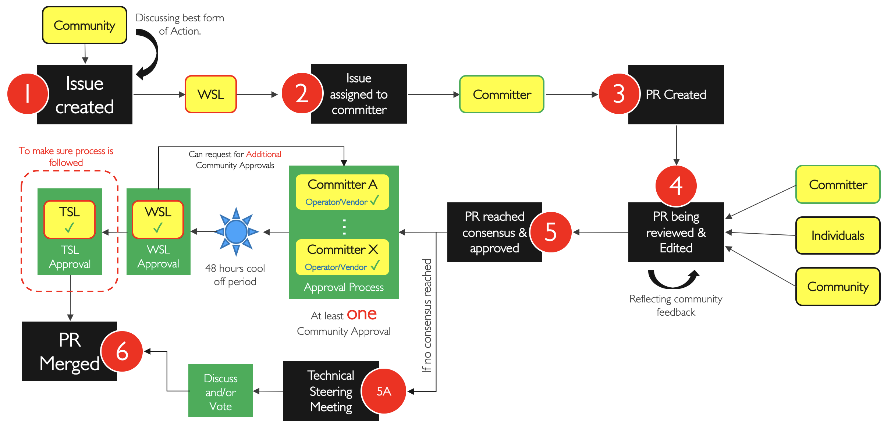

# Contribution

## Table of Contents
* [Issues & Labels](#issues)
* [Pull Requests](#prs)
* [Approval Process](#approvals)

### Issues & Labels
- Issue Types:
  - **Roadmap Item**: This issue type indicates a request for feature to be added for an upcoming release. 
    - This issue type should only be created by Technical Steering Leads.
  - **Fix needed**: This issue type indicates a request to fix a bug or to introduce an enhancement.
    - This issue type can be created by any individual.
  - **Backlog**: This issue type indicate a feature request (to be considered during technical steering meeting) for future releases.
    - This issue type can be created by any individual.
  - **Enhancement**: This issue type indicate an enhancement request
    - This issue type can be created by any individual.
- All issues must be clearly titled, described, and tagged with the right labels when created.
- Issue Labels (one or more to be selected form pre-defined set):
  - **Roadmap Item**: To indicate this issue is for a roadmap item.
  - **Fix needed**: To indicate this issue is for a fix request.
  - **Backlog**: To indicate this issue is for a backlog feature request.
  - **Workstream Name**: To indicate which project this issue targeting.
  - **Chapter Number**: To indicate which Chapter this issue targeting.
  - **General**: To indicate that this issue is not corresponding to any particular chapter/file.
  - **Major/Minor**: To indicate if the issue request a major or minor change. 
  - **Enhancement**: Suggested Enhancement.

### Pull Requests
- PRs must only be created by a committer who has an issue assigned to him/her by the respective WSL.
- PRs must only be created when there is an issue present and a decision to create a PR is made. A PR must reference the issue it is resolving into the description field.
- One person only is allowed to edit a given PR (unless given permission to other committers).
- A PR should only create/modify content within the scope of a single workstream.
- A PR should only add/change content related to the issue associated with the PR

### Approval Process

- Once a PR is created, it needs to get the following approvals before it is merged into master.
  - From at least one of committers for that workstream
    - Approvers should be distributed equally among operators and vendors.
  - From WSL (to make sure consensus is reached).
  - WSL can request additional approvals reviews.
    - Recommendation is to use 4 approvals for complex PRs.
  - 2 business days cool off period will be applied before Final approval.
  - Final Approval by TSL (to make sure process is followed)
- Only One approval is permitted per each organization for a given PR.
- The selection of which Committers to approve a PR is made by the WSL and should take those factors into consideration:
  - Committers needs to be actively discussing the PR to be selected for approval.
  - Committers needs to be active in the workstream.
- PRs will be merged automatically online by the TSL once consensus is reached and all approvals are received. 
- If WSL is the person who is creating the PR, They need to request an alternate approver, preferably a co-lead or from the committers list.

<b>Figure 1:</b> Approval Process

<!--
* [Contribution Guidelines](https://github.com/cntt-n/CNTT/wiki/Contribution-Guidelines)
* [Approval Process](https://github.com/cntt-n/CNTT/wiki/Approval-Process)
-->
