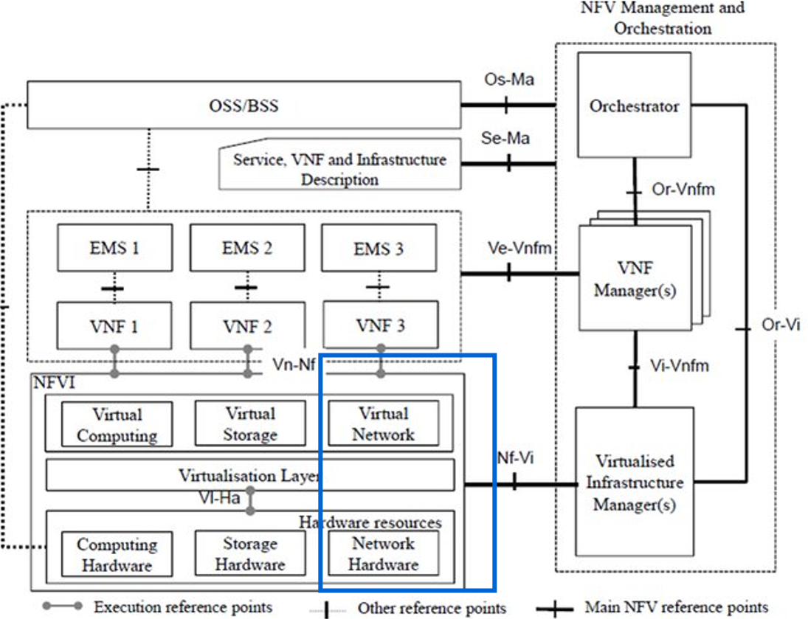
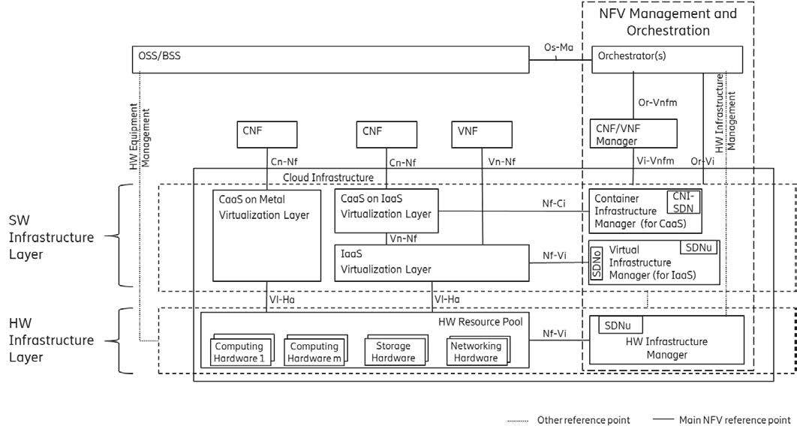
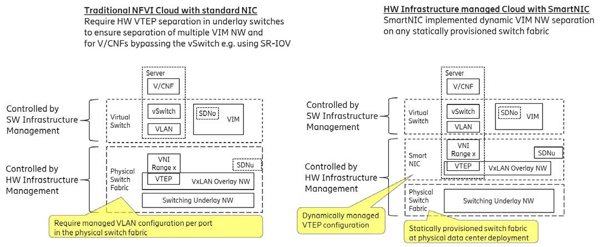
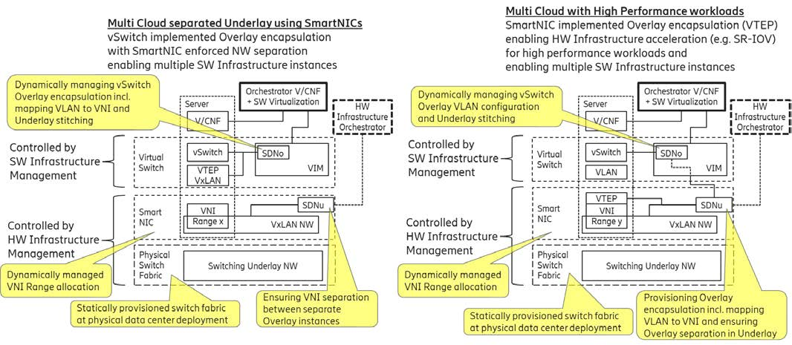
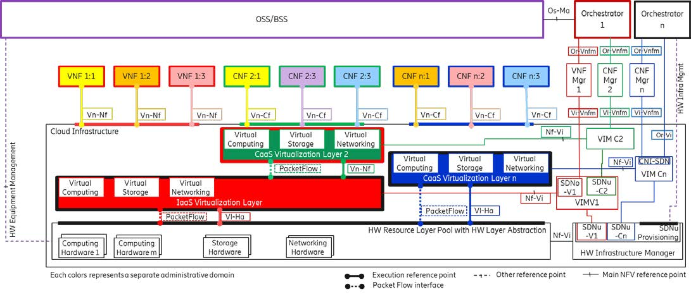

[<< Back](./README.md)
# CNTT Approach

## Table of Contents
* [Networking and Fabric Approach](#5.1)
  * [Networking Scope](#5.1.1)
  * [Networking Principles & Strategy](#5.1.2)
  * [Network Layering and Concepts](#5.1.3)

## Networking and Fabric Approach

The networking within a cloud infrastructure is an area where there is significant variability across implementations. Leaf-Spine topology for large datacenters is well established, however after physical switch interconnection topology choices there are countless decisions an Operator needs to make. Differences arise from many aspects, for example, is the solution layer-2 or layer-3; is the routing static or dynamic; what mechanism is used for encapsulation; what mechanism is used for isolation; does it support SR-IOV; does it support DPDK; does it employ SmartNICs; does it employ distributed control or a centralized control driving a programmable networking fabric; are the network switches selected and provisioned by a separate Network Operations group or by a Cloud Infrastructure Operations group; and the list continues. The multitude of permutations enable cloud infrastructure architects (Operators and Suppliers) to design (or procure) a fabric/networking solution that's optimized for their needs, whether their needs are minimal, very extensive or somewhere in between. There is a need for a strategy that affords Operators the performance, flexibility, availability, maintainability and scalability their business requires, yet doesn't require OPNFV to design, manage and test prohibitive numbers of networking solutions.
 

### Networking Scope
According to the ETSI NFV Model, Networking alongside Compute and Storage, is an integral part of the Network Function Virtualisation Infrastructure (aka Cloud Infrastructure). The general function of Networking in this context is to provide the connectivity between various virtualised and non-virtualised resources required for a delivery of a Network Service. Such connectivity may manifest itself as a virtualised network between VMs and/or Containers (e.g. overlay networks managed by SDN Controllers, and/or programmable networking fabrics) or as an integration into the Infrastructure Hardware level for offloading some of the Network Service functionality into Hardware Layer. 

Normalization of the integration reference points between different layers of the Cloud Infrastructure architecture stack is one of the main concerns of the telco industry.  In the Networking context the primary focus is directed on the packet flow and control flow interfaces between Virtualisation Layer (be it IaaS or CaaS type of virtualisation) and Networking Hardware resources, as well as on related integration into the various MANO reference points (Hardware/ Network Infrastructure Management/Control, Orchestration). 

It is a critical feature of the proposed Networking Model to ensure the ability for supporting simultaneous usage of different reference architectures by having multiple Virtualisation Layers (e.g., CaaS and IaaS) on top of a shared Hardware Infrastructure Layer. The details of this approach are provided in the section "Network Layering and Concepts" below.

#### Identified Areas of Concern
The following areas present concerns for integration of NFV-MANO and CNF/VNF implementations with networking infrastructures:

•	Need to define the separation between HW Infrastructure Management and SW Virtualisation Management without which the cardinality of having multiple CaaS and IaaS layers on top of a shared HW Infrastructure Layer cannot be expressed

•	Need of a precise description of the reference points between the SW Virtualisation Layers and the HW Infrastructure Layer denoted in the ETSI model as Vl-Ha to cover for the Packet Flows, Control/Status Interfaces and Management Interfaces between these layers

•	Need to address lack of an explicit call out for HW Abstraction layer on top of the HW resources and by that many SW Virtualisation Layers act upon the physical HW components in a non-portable way that do not allow an HW Infrastructure to compose abstracted HW resources from pools of individual HW components. Because of the lack of such definition there is no clear way to abstract and describe the technical possibilities that HW Layer networking separation, encapsulation, acceleration, etc. can be implemented either in a HW Infrastructure Managed SmartNIC on the Server units or in the shared underlay switching fabric i.e. on the physical Switching Units 

•	Need to specify the role of SDN (Software Define Network) controller(s) and relevant integration points into Infrastructure Cloud and MANO 

•	Need to enable programmable forwarding planes in the HW Layer controlled from higher layers of virtualization managers, orchestrators or Network Functions

<b> Figure 1</b>: ETSI model and Networking.

> **Editor's Note:** Other areas of concern may be identified and addressed during the later stages of work on the RM/RA contents for Networking.

#### Specific topics to be included in the Networking Scope
To address the concern areas detailed above the specific topics listed below will be covered under Networking. 

> **Editor's Note:** The list below does not pretend to be complete. It will be a subject to modifications as a result of the community discussion.

•	Network connectivity for L3 tenants, GWs, SDS, etc

•	Spine-Leaf Architecture ( 3 Tier or 5 Tier CLOS architecture )

•	Automation of the programmable newtorking fabric

•	Variety of Underlay protocols that can be used as a transport layer within the physical fabric

•	Variety of Overlay protocols

•	SDN integration with Infrastructure Management

•	SRIOV workload interworking

•	DPDK workload interworking

•	Service Function Chaining (SFC ) and how it can be achieved

•	New networking realisation technologies ( SmartNIC , FPGA ,..)

•	Inter K8s POD connectivity and CNI

•	Networking aspects of migration from IaaS to CaaS (from the VNF paradigm to the CNF paradigm)

•	Coexistence of IaaS and CaaS and protracted parallel operations

•	Version controlled catalog of APIs, and their respective spans of control, capabilities and purpose, to facilitate predictable integration with a wide selection of fabric implementations

### Networking Principles & Strategy

This section introduces some networking related principles that should be followed during the development and definition of the networking scope for Reference Model, Reference Architectures, Reference Implementations and Reference Conformance test suites.

-	**Abstraction**: A standardized layer between Virtualisation Layer domains and the Networking Hardware Layer resource pool hiding the implementation details of the Networking Hardware.
> **Note:** Abstraction may be deployed in many different ways e.g. depending on target use case requirements, workload characteristics, different algorithm implementions of pipeline stages and available platforms. This includes Network Functions running on server nodes with or without programmable hardware acceleration, or networking support functions running on programmable network switches in the network.
- **Agnosticity** : Define Network Fabric concepts and models that can carry any type of traffic in terms of:
  - Control, User and Management traffic types
  - Acceleration technologies that can support multiple types of Infrastructure deployments and Network Function workloads 
-	**Automation**: Enable full automation, from Physical Fabric installation and provisioning to automation of workloads (VNF/CNF) onboarding.
-	**Openness**: All Networking is based on open source or standardized APIs (NBI and SBI) and should enable integration of Open Source networking components such as SDN controllers.
-	**Programmability**: Should enable a programmable forwarding plane controlled from a separately deployed control plane that abstracts into standardized functions and interfaces.
-	**Scalability**: Should be scalable to handle all traffic traverse North-South and East-West enabling small to large deployments.
- **Workload diversity**: Should be capable to provide connectivity to any type of workloads, including VNF , CNF and BareMetal workloads.
-	**Telco Grade**: Should support deployments with Telco Grade characteristics requirements.
-	**Future proof**: Should support known and emerging technology trends e.g. SmartNICs, FPGAs and Programmable Switches, multi-cloud aspects (public/private/hybrid), multi-location aspects (multi-cluster, DCI, etc), Edge realted technologies, etc.
- **Dimensionability**: Should support network design in a way that the network is capable to handle the traffic in a non-blocking manner without swapping out the leaf switches.

 
### Network Layering and Concepts

Cloud and Telco networking are layered, and it is very important to keep the layering dependencies low to enable security, separation and portability in between multiple implementations.

Before we start developing a deep model we need to agree on some foundational concepts and layering that allow decoupling of implementations in between the layers. We will emphasize four concepts in this section

 - Underlay and Overlay Networking concepts
 - Hardware and Software Infrastructure Layer concepts
 - Software Defined Networking, SDNu and SDNo concepts
 - Programmable Networking Fabric concept

#### Underlay and Overlay Networking concepts

The typical NFV model divides networking into an Underlay and an Overlay Network layer. The purpose with this layering is to ensure separation of tenants' Overlay Networks from each other, whilst allowing the traffic to flow on the shared Underlay Network in between all Ethernet connected HW units.

The Overlay Networking separation is often done through encapsulation of Tenants' traffic using overlay protocols e.g. through VxLAN or EVPN over the Underlay Network e.g. based on L2 (VLAN) or L3 (IP) networks.

In some instances, the SW Virtualisation Tenants can bypass the Overlay Networking encapsulation to achieve better performance or network visibility/control. A common method to bypass the Overlay Networking encapsulation normally done by the SW Virtualisation Layer, is the VNF/CNF usage of SR-IOV that effectively take over the Physical and Virtual Functions of the NIC directly into the VNF/CNF Tenant. In these cases, the Underlay Networking must handle the separation e.g. through a Virtual Termination End Point (VTEP) that encapsulate the Overlay Network traffic.

> **Note:** Bypassing the Overlay Networking layer is a violation of the basic CNTT decoupling principles, but in some cases unavoidable with existing technologies and standards. Until suitable technologies and standards are developed, CNTT needs to have an exemption that forces the Underlay Networking to handle the bypassed Overlay Networking separation.

VTEP could be manually provisioned in the Underlay Networking, which is not a recommended practice, or be automated and controlled through a Software Defined Networking controller interfaces into the underlying networking in the HW Infrastructure Layer. 

#### Hardware and Software Infrastructure Layer concepts

The Cloud Infrastructure can be considered to be composed of two distinct layers, referred to as HW Infrastructure Layer and SW Infrastructure Layer. When there are multiple separated simultaneously deployed SW Virtualisation domains, the architecture and deployed implementations must enable each of them to be in individual independent administrative domains. The HW Infrastructure must also be enabled to be a fully separated administrative domain from all of the SW Virtualisation domains. 

For Cloud implementations of multiple well separated simultaneous SW Virtualisation domains on a shared HW Infrastructure there must be a relevant separation of the hardware resources; for example, the seperation of servers and the Underlay Networking resources through a switching fabric.

To allow multiple separated simultaneous SW Virtualization domains onto a shared switching fabric there is a need to split up the Underlay Networking resources into non overlapping addressing domains e.g. using suitable encapsulation protocols like VxLAN with their VNI Ranges that then cannot overlap but still allow the encapsulated IP addresses of each SW Virtualization domain to overlap without any risk of collisions. This separation must be done through an administrative domain that could not be compromised by any of the individual SW Virtualisation domains either by malicious or unintentional Underlay Network mapping or configuration.

These concepts are very similar to how the Hyperscaler Cloud Providers (HCP) offer Virtual Private Clouds for users of Bare Metal deployment on the HCP shared pool of servers, storage and network resources.

The separation of Hardware and Software Infrastructure Layers makes it important that CNTT Reference Architectures do not include direct management or dependencies of the physical hardware resources e.g. servers and switches inside the HW Infrastructure Layer. All automated interaction from the SW Infrastructure Layer implementations towards the HW and shared networking resources in the HW Infrastructure Layer must go through a common abstracted Reference Model interface. 

#### Software Defined Networking, SDNu and SDNo concepts

A major point with a Cloud Infrastructures is to automate as much as possible. An important tool for Networking automation is Software Defined Networking (SDN) that comes in many different shapes and can act on multiple layers of the networking. In this section we will deal with the internal networking of a data center and not how data centers interconnect with each other or  get access to the world outside of a data center.

When there are multiple simultaneous SW Virtualisation domain using one HW Infrastructure, there is a need to ensure Underlay networking separation in the HW Infrastructure Layer. This separation can be done manually through provisioning of a statically configured separation of the Underlay Networking in the HW Infrastructure Layer. A better and more agile usage of the HW Infrastructure is to offer each instance of the SW Virtualisation Layer an SDN interface to the HW Infrastructure. Since these SDN instances only deals with a well separated portion (or slice) of the Underlay Networking we call this interface SDN-Underlay (SDNu).

The HW Layer is responsible to keep the Underlay Networking well separated in between the different SW Virtualisation instances which can be done through manual provisioning methods or through a HW Layer orchestration interface. The separation responsibility is also valid in between each instance of the SDNu interface since each SW Virtualizasion instance shall not know about, be disturbed by or have any capability to reach the other instances.

An SDN-Overlay control interface (here denoted SDNo) is responsible for managing the SW Virtualisation Layer virtual switching and/or routing that manages the Overlay Network switching/routing and encapsulation, and their mapping onto the Underlay Networks.

In cases where the VNF/CNF bypasses the SW Virtualisation Layer virtual switching, as described above, the HW Infrastructure Layer must perform the encapsulation and mapping onto the Underlay Networking to ensure Underlay Networking separation. This should be a prioritized capability in the SDNu control interface since CNTT currently allow exemptions for bypassing the virtual switching (e.g. through SR-IOV). 

SDNo controllers can request Underlay Networking encapsulation and mapping to be done by signaling to an SDNu controller. There are however today no standardized way for this signaling and by that there is a missing reference point and API description in this architecture. 

Multiple instances of Container as a Service (CaaS) Virtualization Layers running on an Infrastructure as a Service (IaaS) Virtualization Layer could make use of the IaaS layer to handle the required Underlay Networking separation. In these cases, the IaaS Virtualisation Infrastructure Manager (VIM) could include a SDNu control interface enabling automation.

> **Note:** The Reference Model describes a logical separation of SDNu and SDNo interfaces to clarify the separation of administrative domains where applicable. In real deployment cases an Operator can select to deploy a single SDN controller instance that implements all needed administrative domain separations or have separate SDN controllers for each administrative domain. A common deployment scenario today is to use a single SDN controller handling both Underlay and Overlay Networking which works on the implementation level when there is only one administrative domain that owns both the HW Infrastructure and the only  SW Virtualisation Infrastructure. The nature of a shared Underlay Network that shall ensure separation and be robust is that all code in the forwarding plane and in the control plane must be under the scrutiny and life cycle management of the HW Infrastructure Layer.
One consequence of this is that the Reference Architectures must not model collapsed SDNo and SDNu controllers since they must stay unaware of other deployed implementations  running on the same HW Infrastructure.

#### Programmable Networking Fabric concept

The concept of a Programmable Networking Fabric pertains to the ability to have an effective forwarding pipeline (a.k.a. forwarding plane) that can be programmed, scaled and/or configured as a centrally controlled HW Infrastructure Layer instance without any risk of harmful disruption to the Underlay Networking that is shared by all SW Virtualization and BareMetal instances.

The forwarding plane is physically distributed by nature and must be possible to implement both in switch elements and on SmartNICs (managed outside the reach of the host SW in the SW Virtualization or Bare Metal application instance) that both can be managed from a logically centralized control plane residing in the HW Infrastructure Layer.

The logically centralised control plane is the foundation for the authoritative separation between different SW Virtualisation domains or Bare Metal Network Function applications that are regarded as untrusted both from the shared layers and each other.

Although the control plane is logically centralized, scaling and control latency concerns must allow the actual implementation of the control plane to be distributed when required.

All VNF, CNF and SW Virtualisation (applications) utilized HW-based acceleration and support functionality that is programmable in the forwarding plane must be confined to well separated, protected and defined sections or stages of any shared Underlay Networking ensuring that no other application is effected. A practical example could be a SW Virtualisation instance or VNF/CNF that controls a NIC/SmartNIC where the Underlay Networking (Switch Fabric) ensures the separation in the same way as it is done for SR-IOV cases today.

The nature of a shared Underlay Network that shall ensure separation and be robust is that all code in the forwarding plane and in the control plane must be under the scrutiny and life cycle management of the HW Infrastructure Layer.

This also imply that programmable forwarding functions in a Programmable Networking Fabric are shared resources and by that will have to get standardised interfaces over time to be useful for multi-vendor architectures such as ETSI NFV. Example of such future extensions of shared functionality implemented by a Programmable Networking Fabric could be L3 as a Service, Firewall as a Service and Load Balancing as a Service.

> **Note:** Appliance-like applications that fully own its infrastructure layers (share nothing) could manage and utilize a Programmable Networking Fabric in many ways, but that is not a Cloud implementation and falls outside the use cases for these specifications.

### Networking Reference Model

The Networking Reference Model, based on the ETSI NFV model, is depicted in **Figure 2**. The Networking Reference Model describes the Container Virtualisation support and a strict separation of the HW Infrastructure and SW Infrastructure Layers in NFVI. It includes all above concepts and enables multiple well separated simultaneous SW Virtualisation domains allowing a mix of CaaS on Metal, CaaS on IaaS and IaaS on a shared HW infrastructure. 

It is up to any deployment of  the Cloud Infrastructure to decide what Networking related objects to use, but all Reference Architectures have to be able to map into this model.

<b>Figure 2:</b> Cloud Infrastructure Networking Reference Model

### Deployment examples based on the Networking Reference Model

#### Switch Fabric and SmartNIC examples for Underlay Networking separation

The HW Infrastructure Layer can implement the Underlay Networking separation in any type of packet handling component. This may be deployed in many different ways depending on target use case requirements, workload characteristics and available platforms. Two of the most common ways is 1. within the physical Switch Fabric and 2. in a SmartNIC connected to the Server CPU being controlled over a management channel that is not reachable from the Server CPU and its host software. In either way the Underlay Networking separation is controlled by the HW Infrastructure Manager.

In both cases the Underlay Networking can be externally controlled over the SDNu interface, that must be instantiated with appropriate Underlay Networking separation for each of the SW Virtualization administrative domains.

> **Note:** The use of SmartNIC in this section is only pertaining to Underlay Networking separation of SW Virtualisation instances in separate Overlay domains in much the same way as AWS do with their Nitro SmartNIC. This is the important consideration for the Reference Model that enables multiple instances from one or several Reference Architectures to be used on a shared Underlay Network. The use of SmartNIC components from any specific SW Virtualisation instance e.g. for internal virtual switching control and acceleration must be regulated by each Reference Architecture without interfering with the authoritative Underlay separation laid out in the Reference Model.

Two exemplifications of different common HW realisations of Underlay separation in the HW Infrastructure Layer can be seen in **Figure 3**.

<b>Figure 3:</b> Underlay Networking separation examples

#### SDN Overlay and SDN Underlay layering and relationship example

Two use case examples with both SDNo and SDNu controllers depicting a normal virtual switch encapsulating SW Virtualisation Infrastructure instance and another high performance oriented SW Virtualisation Infrastructure instance (e.g. using SR-IOV) are shown in **Figure 4**. The examples show how the encapsulation and mapping could be done in the virtual switch or in a SmartNIC on top of a statically provisioned underlay switching fabric, but another example could also have been depicted with the SDNu controlling the underlay switching fabric without usage of SmartNICs.

<b>Figure 4:</b> SDN Controller relationship examples

#### IaaS and CaaS SW Virtualisation example on a shared HW Infrastructure with SDN

A Networking Reference Model deployment example is depicted in **Figure 5** to demonstrate the mapping to ETSI NFV reference points with additions of packet flows through the infrastructure layers and some other needed reference points. The example illustrates individual responsibilities of a complex organization with multiple separated administrative domains here represented with separate colors.

The example is or will be a common scenario for operators that modernise their network functions during a rather long period of migration from VNFs to Cloud Native CNFs. Today the network functions are predominantly VNFs on IaaS environments and the operators are gradually moving a selection of these into CNF on CaaS that either sit on top of the existing IaaS or directly on Bare Metal. It is expected that there will be multiple CaaS instances in most networks since it is not foreseen any generic standard of a CaaS that will be capable to handle all types of CNFs and also have a decoupled Life Cycle Management from all individual CNFs from a multi-vendor community. 

<b>Figure 5:</b> Networking Reference Model deployment example

