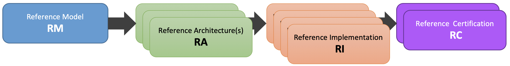
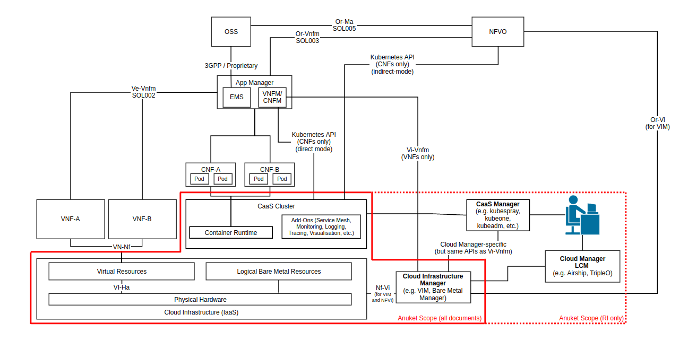
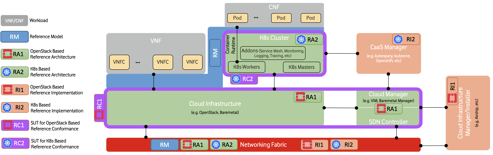
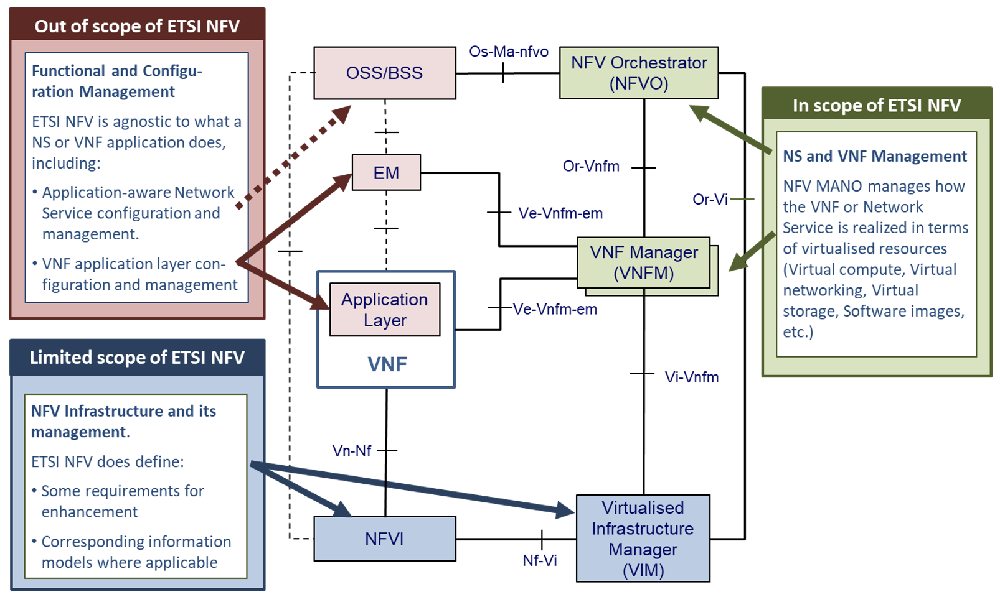
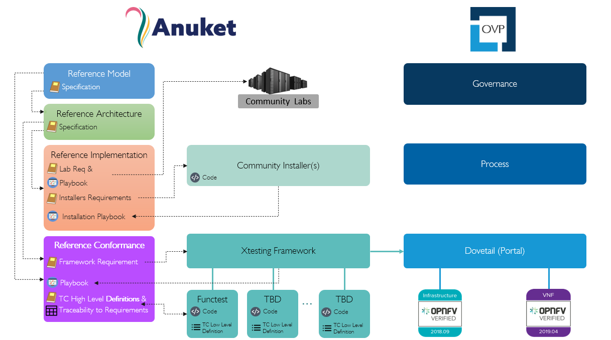

[<< Back](https://cntt-n.github.io/CNTT/)
# Anuket Project

## Table of Contents
* [Overview](#1.0)
    * [Terminology and Glossary](#1.1)
    * [Problem Statement](#1.2)
    * [Project Goals and Purpose](#1.3)
    * [Common Cloud Infrastructure Benefits](#1.4)
* [Principles](#2.0)
* [Scope](#3.0)
  * [Functional Scope](#3.1)
  * [Out of Scope Components](#3.2)
  * [Specification Types](#3.3)
  * [Relationship to other industry projects](#3.4)
 * [Abbreviations](#4.0)
* [References](#5.0)

# Overview

Initially organized early in 2019, the Cloud iNfrastructure Telco Taskforce (CNTT) was created in response to rapid changes in how networking applications are being designed, built and managed, plus a growing recognition of a perceived functional gap between the previous standard infrastructure models and the architectures needed to support Network Function Virtualisation (NFV) applications.  Organizationally, the Cloud iNfrastructure Telco Taskforce was jointly hosted by GSMA and the Linux Foundation.
In 2021, the CNTT and the Open Platform for NFV (OPNFV) projects were merged to form the Anuket project.

## Terminology and Glossary
The definition and intent of the terminology used throughout the documents is defined in the [Glossary](./glossary.md).

## Problem Statement
Based on informal conversations with many operators and developers, there is a realisation that there are significant technical, operational and business challenges to the development and deployment of VNF/CNF applications related to the lack of a common cloud infrastructure platform.  These include but are not limited to the following:

 - Higher development costs due to the need to develop Virtual Network Functions (VNF) on multiple custom platforms for each operator
 - Increased complexities due to the need to maintain multiple versions of applications to support each custom environment
 - Lack of testing and validation commonalities, leading to inefficiencies and increased time to market. While the operators will still do internal testing, but using an industry driven verification program based on a common cloud infrastructure would provide a head start.
 - Slower adoption of cloud-native applications and architectures.  A Common Telco Cloud may provide an easier path to methodologies that will drive faster cloud-native development.
 - Increased operational overhead due to the need for operators to integrate diverse and sometime conflicting cloud platform requirements.

One of major challenges holding back the more rapid and widespread adoption of VNF is that the traditional telecom ecosystem vendors, while building or designing their virtualised services (whether it be Voice over LTE (VoLTE), Evolved Packet Core (EPC), or popular customer facing enterprise services such as SD-WAN (Software Defined Wide Area Network), are making their own infrastructure assumptions and requirements, often with custom design parameters. This leaves the operators being forced to build complex integrations of various vendor/function specific silos which are incompatible with each other and might possibly have different and conflicting operating models. In addition, this makes the onboarding and conformance processes of VNFs/CNFs (coming from different vendors) hard to automate and standardise.  

To put this effort into perspective, over the past few years, the telecom industry has been going through a massive technology revolution by embracing software defined networking and cloud architecture principles, in pursuit of the goal of achieving more flexibility, agility and operational efficiency. At a high level, the main objective of NFV (Network Function Virtualisation) is the ability to use general purpose standard COTS (Commercial off the Shelf) compute, memory and storage hardware platforms to run multiple Virtualised Network Functions.  Earlier common infrastructure models built on the previous assumption that networking applications are typically built on discrete hardware, do not offer the level of flexibility and agility needed for the support of newer networking technologies such as 5G, intelligent networks and Edge computing.  By running network applications as software rather than on purpose-built hardware, as it has been done since the early 1990’s, the operators aspire to realize operational efficiencies, and capital expense savings.  These Software Defined Network (SDN) applications are increasingly being used by telecom operators to support their internal and customer facing network infrastructures.  The need for a common model across the industry to facilitate more rapid adoption is clear.

## Project Goals and Purpose

The goal of the task force is to develop a robust infrastructure model and a limited discrete set of architectures built on that model that can be validated for use across the entire member community. The community, which is made up of a cross section of global operators and supporting vendors alike, was created to support the development, deployment and management of NFV applications faster and more easily.  

All of this had led to a growing awareness of the need to develop more open models and validation mechanisms to bring the most value to telco operators as well as vendors, by agreeing on a standard set of infrastructure profiles to use for the underlying infrastructure to support VNF/CNF applications across the industry and telecom community at large. To achieve this goal, the cloud environment needs to be fully abstracted via APIs and other mechanisms to the VNFs/CNFs so that both developers of the VNF/CNF applications and the operators managing the environments can benefit from the flexibility that the disaggregation of the underlying infrastructure offers.

The next step after the Reference Model has been identified and developed is to take the general model, which is purposely designed to be able to be applied to a number of technologies, and apply it to a discrete number of concrete and ultimately deployable Reference Architecture platforms. The intention is to choose the reference architectures carefully so that there will only be a small set of architectures that meets the specific requirements for supporting NFV and Telecom specific applications. Per the principles laid out later in this document, the Reference Architectures need to meet the following criteria as much as is practical:

  - Initially should be based on widely established technology and systems used in the Telecom Industry.  This will help ensure a faster adoption rate because the operators are already familiar with the technology and might even have systems in production. Another advantage to this approach is a project faster development cycle.
  - Subsequent architectures should be based on either additional established or promising emerging technologies that are chosen by the community members.  

## Common Cloud Infrastructure Benefits

By providing a pre-defined environment with common capabilities, applications are able to be developed and deployed more rapidly.  In addition, the common infrastructure can be optimized for various workloads, such as IT (Information Technology), VNF, AI (Artificial Intelligence), and other future workload types as new technologies emerge. The benefits of this approach are:

- Configuration automation over customisation
  - By abstracting the infrastructure capabilities as much as possible, operators are able to use common infrastructure platforms across all VNF/CNF vendors.
  - Maintaining a consistent infrastructure allows for higher levels of automation due to a reduced need for customisation of the various components.
  - Overall, the intention is to reduce the total cost of ownership for operators and development costs for vendors

- Onboarding and conformance
  - By defining abstracted infrastructure capabilities, and the metrics by which they are measured, the onboarding and conformance process for both cloud infrastructure and VNFs/CNFs can be standardized, reducing development time for the VNF/CNF developers and deployment and operational management costs for the operators standing up the cloud environments.
  - Supply chain, procurement and assurance teams can then use these metrics to more accurately assess the most efficient / best value vendor for a given environment and network services requirement.

- Better utilisation
  - Properly mapping VNFs/CNFs to flavours to the underlying infrastructure, brings the potential for more efficient utilisation, than needing to create specific configurations for each type of application in the infrastructure.  

In conclusion, to serve the stated objective of building a common cloud infrastructure that is able to take advantage of true cloud models for the more rapid development and deployment of SDN NFV applications, the Anuket specifications include a reference model, a select set of architectures, a set of reference implementations, and a set of conformance suites, so that there is a more consistent model infrastructure for developers and vendors of SDN software and applications to build to.

# Anuket General Principles

Any specifications created within the Anuket project **must** conform to the following principles:

## Overall Principles

1. A top-level objective is to build a single, overarching Reference Model with the smallest number of Reference Architectures tied to it as is practical. Two principles are introduced in support of these objectives:
    - **Minimise Architecture proliferation by stipulating compatible features be contained within a single Architecture as much as possible:**
      - Features which are compatible, meaning they are not mutually exclusive and can coexist in the same cloud infrastructure instance, shall be incorporated into the same Reference Architecture. For example, IPv4 and IPv6 should be captured in the same Architecture, because they don't interfere with each other
      - Focus on the commonalities of the features over the perceived differences. Seek an approach that allows small differences to be handled at either the low-level design or implementation stage. For example, assume the use of existing common APIs over new ones.

    - **Create an additional Architecture only when incompatible elements are unavoidable:**
      - Creating additional Architectures is limited to when incompatible elements are desired by Taskforce members. For example, if one member desires KVM be used as the hypervisor, and another desires ESXi be used as the hypervisor, and no compromise or mitigation* can be negotiated, the Architecture could be forked, subject to community consensus, such that one Architecture would be KVM-based and the other would be ESXi-based.

        >*Depending on the relationships and substitutability of the component(s) in question, it may be possible to mitigate component incompatibility by creating annexes to a single Architecture, rather than creating an additional Architecture. With this approach, the infrastructure architecture designers might implement the Architecture as described in the reference document, however when there is a potential for incompatibility for particular component, they would select their preferred option from one of the relevant annexes. For example, if one member wanted to use Software-Defined storage (SDS) as CEPH, and another member wanted to use Storage Attached Network(SAN), assuming the components are equally compatible with the rest of the Architecture, there could be one annex for the CEPH implementation and one annex for the SAN implementation.

1. Cloud Infrastructure provides abstract and physical resources corresponding to:
   - Compute resources
   - Storage resources
   - Memory resources
   - Networking resources (Limited to connectivity services only)
   - Acceleration resources
1. Vendor independence of Cloud Infrastructure exposed resources .
1. Cloud Infrastructure Application Programming Interfaces (APIs) ensure Interoperability (multi-vendor, components substitution), drive simplification, and open source implementations that have an open governance model (e.g. come from Open Communities or Standards Development Organisations).
•	These APIs support, for example, cloud infrastructure resources discovery, monitoring by management entities, configuration on behalf of workloads and consumption by workloads
1. Workloads are modular and designed to utilise the minimum resources required for the service.
1. Workloads consume only the resources, capabilities and features provided by the Cloud infrastructure.
1. Workload functional capabilities independence from Cloud Infrastructure (hardware and software) accelerations.
1. Workload independence from Cloud Infrastructure (hardware and software) hardware-dependent software
   - This is in support of workload abstraction, enabling portability across the Infra and simplification of workload design
   - Use of critical features in this category are governed by technology specific policies and exceptions in the RA specifications.
1. Abstraction of specific internal hardware details above the Infrastructure Cloud Management layers unless managed through Hardware Infrastructure Manager
   - This is in support of workload abstraction, enabling portability across the Infra and simplification of workload design
   - Use of critical features in this category are governed by technology specific policies and exceptions in the RA specifications.

## Requirements Principles
The agreed upon rules and recommendations to which a compliant workload or cloud infrastructure must adhere.

* All requirements will be hosted and maintained in the RM or relevant RA
* All requirements must be assigned a requirements ID and not be embedded in narrative text.  This is to ensure that readers do not have to infer if a requirement exists and is applicable
* Requirements must have a unique ID for tracking and reference purposes
* The requirement ID should include a prefix to delineate the source project
* Requirements must state the level of compliance (ex: MUST, SHOULD, MAY) per RFC 2119[2]
* Mandatory requirements must be defined in such a way that they are unambiguously verifiable via automated testing
* Requirements should be publishable or extractable into a machine readable format such as JSON
* Requirements should include information about the impact of non-conformance and the rationale for their existence

## Architectural Principles

Following are a number of key architectural principles that apply to all Reference Architectures produced by the Anuket project:

1. **Open source preference:** To ensure, by building on technology available in open source projects, that suppliers’ and operators’ investment have a tangible pathway towards a standard and production ready Cloud Infrastructure solution portfolio.

1. **Open APIs:** To enable interoperability and component substitution, and minimize integration efforts by using openly published API definitions.

1. **Separation of concerns:** To promote lifecycle independence of different architectural layers and modules (e.g. disaggregation of software from hardware).

1. **Automated lifecycle management:** To minimize costs of the end-to-end lifecycle, maintenance downtime (target zero downtime), avoid errors and discrepancies resulting from manual processes.

1. **Automated scalability:** To minimize costs and operational impacts through automated policy-driven scaling of workloads by enabling automated horizontal scalability of workloads.

1. **Automated closed loop assurance:** To minimize operational costs and simplify Cloud Infrastructure platform operations by using automated fault resolution and performance optimization.

1. **Cloud nativeness:** To optimise the utilization of resources and enable operational efficiencies.

1. **Security compliance:** To ensure the architecture follows the industry best security practices and is at all levels compliant to relevant security regulations.

1. **Resilience and Availability:** To allow High Availability and Resilience for hosted VNFs, and to avoid Single Point of Failure.

# Scope

Within the framework of the common Telecom cloud infrastructure vision, there are four levels of documents needed to describe the components, realize the practical application of the systems and qualify the resulting cloud infrastructure. They are, as highlighted in **Figure 1**:  **Reference Model**, **Reference Architecture**, **Reference Implementation**, and **Reference Conformance**.

<b>Figure 1:</b> Documentation Scope of Anuket specifications

## Functional Scope
To meet the goals, as described above, the Anuket project is focussed on:
- Functional capabilities of the cloud infrastructure and the infrastructure management
- Functional interfaces between infrastructure and infrastructure management
- Functional interfaces between workloads and workload management

Due to the close alignment with ETSI GR NFV 002[3], those ETSI interfaces that are considered relevant (with notes where required) are included in the figure below.

<!-- The source file of this figure is available at https://wiki.anuket.io/display/HOME/RA2+Diagrams -->

<b>Figure 2:</b> Functional Scope of Anuket specifications

## Out of Scope Components
While the nature of the Anuket project might seem quite broad, the following areas are not at this time part of the scope of this effort.  
- Hardware specifications: beyond the abstracted high-level CPU, memory, network interface and storage elements.  The intention is to write the documents so they are general enough that any vendor hardware can be used in a conformant implementation without making significant changes to the model.
- Workload specifications: Other than the API interfaces when they directly need to touch the workloads themselves, the intention is to assume the workload application is a black box that the cloud infrastructure is providing resources to.  The majority of interactions for lifecycle management of the workloads will be through the cloud infrastructure whenever possible.
- Lifecycle Management of the CaaS Clusters: whilst a complete NFV-MANO solution would need to provide lifecycle management for the Kubernetes clusters it is using to deploy its CNFs, the Anuket specifications do not describe the NFVO and VNFM parts, and therefore the management of the cluster(s) is not in scope, while the VIM and the lifecycle management of containers (by Kubernetes) is in scope.
- Company specific requirements: The Anuket specifications are designed to be general enough that most operators and others in the open source communities will be able to adapt and extend them to their own non-functional requirements.

## Specification Types

- **Reference Model (RM)**: focuses on the __**Infrastructure Abstraction**__ and how services and resources are exposed to VNFs/CNFs. It needs to be written at a high enough level that as new **Reference Architectures** and **Reference Implementations** are added, the model document should require few or no changes. Additionally, the Reference Model is intended to be neutral towards VMs or Containers.
- **Reference Architecture (RA)**: Reference Architectures defines all infrastructure components and properties which have effect on the VNF/CNF run time, deployment time, and design time.  It is expected that at least one, but not more than a few Reference Architectures will be created, and they will conform to the Reference Model.  The intention is, whenever possible, to use existing elements, rather than specify entirely new architectures in support of the high-level goals specified in the **Reference Model**.
- **Reference Implementation (RI)**: Builds on the requirements and specifications developed in RM, RAs and adds details so that it can be implemented.  Each Reference Architecture is expected to be implemented by at least one Reference Implementation.
- **Reference Conformance (RC)**: Builds on the requirements and specifications developed in the other documents and adds details on how an implementation will be verified, tested and certified. Both infrastructure verification and conformance as well as VNFs/CNFs verifications and conformance will be covered.

**Figure 2** below illustrates how each type of  specifications relate to different element of a typical cloud platform stack.

<b>Figure 3:</b> Documentation Scope of Anuket specifications

Below is a diagram of the different artefacts that will need to be created to support the implementation of the abstract concepts presented in the **Reference Model**, which are then applied to create the **Reference Architecture** that will be deployed using the requirements spelled out in the **Reference Implementation**.

<b>Figure 4:</b> Description of the possible different levels of Anuket specification artefacts

## Relationship to other industry projects
The Anuket work is not done in a vacuum.  The intention from the beginning was to utilize the work from other open source and standards bodies within the industry. Some of the projects, but by no means all, that are related in some way to the Anuket efforts include:

- ETSI NFV ISG
- OpenStack
- ONAP
- CNCF
- MEF
- TM Forum
- OSM (ETSI Open Source MANO project)
- ODIM (Open Distributed Infrastructure Management)
- VMware (While not an open source project, VMware is a commonly used platform used for VNF deployments in the telecom industry)

### Relationship to ETSI-NFV

The ETSI NFV ISG is very closely related to the Anuket project, in that it is a group that is working on supporting technologies for NFV applications (**Figure 5** illustrates the scope of ETSI-NFV). To facilitate more collaboration as the project matures, the Anuket specifications' scope (**Figure 2** above) purposely references certain ETSI NFV reference points, as specified by ETSI GS NFV 002[3].

<b>Figure 5:</b> Scope ETSI NFV.

### Relationship between Anuket projects and AAP

The Anuket project is also closely aligned with the Anuket Assured Program (AAP), an open source, community-led compliance and verification program that demonstrates the readiness and availability of commercial NFV and cloud native products and services including **Vendor's Implementation (VI)** of both infrastructure and workloads. The AAP combines open source based automated compliance and verification testing for multiple parts of the stack specifications established by Anuket, ONAP, multiple SDOs such as ETSI and GSMA, and the LFN End User Advisory Group (EUAG).

We create an implementation that adheres to the Anuket **Reference Implementations** specifications. Products can undergo a conformance program based on the Anuket **Reference Conformance** specifications using the Anuket specified testing frameworks and tools. **Figure 6** below illustrates the relationship with the Anuket Assured Program in more detail; the figure is specific to OpenStack-based specifications but the set-up is going to be similar to other implementations.

<b>Figure 6:</b> Relationship between Anuket and Anuket Assured Program.

As can be seen from the above figure, roles and responsibilities are as follows:
- Anuket specifies lab requirements in the **Reference Implementation** document which will be used to define what labs can be used within the community for the purpose of installing and testing Anuket conformant cloud infrastructure implementations.
- Anuket includes a lab Playbook in its **Reference Implementation** detailing available suitable labs to run and test cloud infrastructure implementations; the playbook includes processes, access procedures and other details.
- Anuket specifies requirements in the **Reference Implementation** document for installers that can be used to install a cloud infrastructure.
- Anuket includes an installation Playbook in its **Reference Implementation** specifications detailing instructions of how to install an infrastructure using Anuket conformant installers.

An infrastructure that follows the Anuket **Reference Implementation** specifications and passes all the tests specified in the Anuket **Reference Conformance** document is referred to as an Anuket Reference Implementation.
- Anuket specifies testing framework requirements in the **Reference Conformance** document that will be used to determine a suitable testing framework and portals to be used for the purpose of running test suites and tools, and carry out badging processes.
- The Anuket **Reference Conformance** document defines high level test cases, for requirements from both the **Reference Model** and **Reference Architecture**, that are used to determine the testing projects within the community suitable to deliver these tests.
- Anuket includes a traceability matrix in its **Reference Conformance** document detailing every test case (or group of test cases) available in the community and map them to the high level test case definition and the requirements they are fulfilling.
- The Anuket **Reference Conformance** document includes a testing Playbook detailing instructions of how to run the testing framework and test cases against commercial NFV products (infrastructure and workload) to check conformance to Anuket specifications. The testing Playbook also details instructions of how to submit testing results for the **AAP** badging process.

### Relationship to CNCF

A close relationship between Anuket and CNCF is maintained around the contents development for RA-2, RI-2, and RC-2.

### Relationship to other communities

Anuket collaborates with relevant API workgroups of SDOs (such as MEF, TM Forum, 3GPP, TIP, etc) where applicable to align with their specification work and utilise their efforts.

 
# Abbreviations

Please refer to [Abbreviations](./abbreviations.md) for a full list.

# References

Please refer to [References](./references.md) for a full list.
