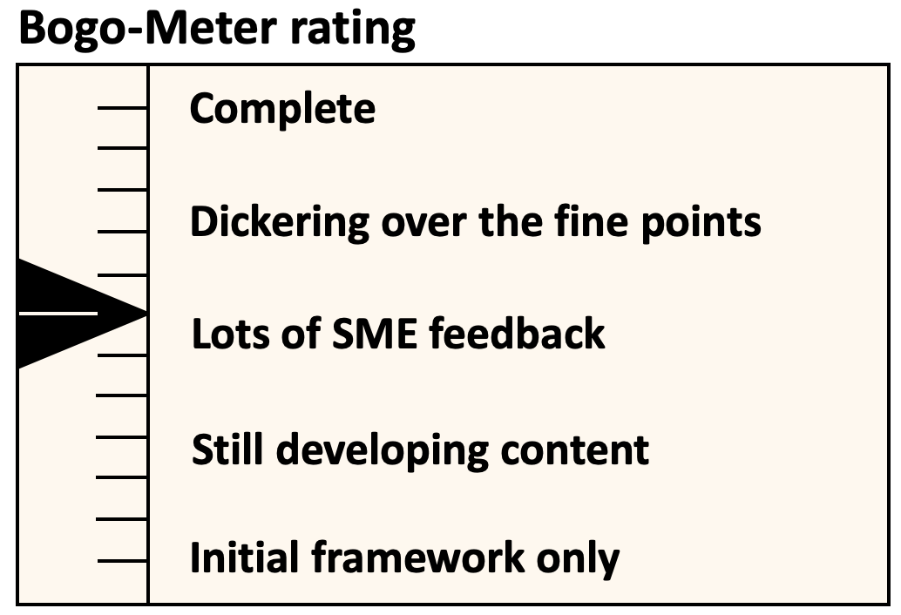

[<< Back](../../ref_model)
# Glossary

## Table of Contents
* [Terminology](#1.0)
  * [Software layers terminology](#1.1)
  * [Hardware layers terminology](#1.2)
  * [Operational and administrative terminology](#1.3)
  * [Container Related Terminology](#1.4)
  * [OpenStack Related Terminology](#1.5)
  * [Cloud Platform Abstraction Related Terminology](#1.6)
  * [Other terminology](#1.7)

# Terminology

To help guide the reader, this glossary provides an introduction to the terminology used within this document. These definitions are, with a few exceptions, based on the ETSI GS NFV 003 V1.4.1 (2018-08) definitions.  In a few cases, they have been modified to avoid deployment technology dependencies only when it seems necessary to avoid confusion.

## Software Layer Terminology

- **Cloud Infrastructure:** A generic term covering **NFVI**, **IaaS** and **CaaS** capabilities - essentially the infrastructure on which a **Workload** can be executed.
>_*Note:*_ **NFVI**, **IaaS** and **CaaS** layers can be built on top of each other. In case of CaaS some cloud infrastructure features (e.g.: HW management or multitenancy) are implemented by using an underlaying **IaaS** layer.

- **Cloud Infrastructure Profile:** The combination of the Cloud Infrastructure Software Profile and the Cloud Infrastructure Hardware Profile that defines the capabilities and configuration of the Cloud Infrastructure resources available for the workloads.

- **Cloud Infrastructure Software Configuration:** a set of settings (Key:Value) that are applied/mapped to **cloud infrastructure** SW deployment.

- **Cloud Infrastructure Software Profile:** defines the behaviour, capabilities and metrics provided by a Cloud Infrastructure Software Layer on resources available for the workloads.

- **Cloud Native Network Function (CNF):** A cloud native network function (CNF) is a cloud native application that implements network functionality. A CNF consists of one or more microservices. All layers of a CNF is developed using Cloud Native Principles including immutable infrastructure, declarative APIs, and a “repeatable deployment process”.
  >_*Note:*_ This definition is derived from the [Cloud Native Thinking for Telecommunications Whitepaper](https://github.com/cncf/telecom-user-group/blob/master/whitepaper/cloud_native_thinking_for_telecommunications.md#1.4), which also includes further detail and examples.

- **Compute flavour:** defines the sizing of the virtualised resources (compute, memory, and storage) required to run a workload.
     >_*Note:*_ used to define the configuration/capacity limit of a virtualised container.

- **Hypervisor:** a software that abstracts and isolates workloads with their own operating systems from the underlying physical resources. Also known as a virtual machine monitor (VMM).

- **Instance:** is a virtual compute resource, in a known state such as running or suspended, that can be used like a physical server.
    >_*Note:*_ Can be used to specify VM Instance or Container Instance.

- **Network Function (NF):**  functional block or application that has well-defined external interfaces and well-defined functional behaviour.
  - Within **NFV**, a **Network Function** is implemented in a form of **Virtualised NF** (VNF) or a **Cloud Native NF** (CNF).

- **Network Function Virtualisation (NFV):** The concept of separating network functions from the hardware they run on by using a virtual hardware abstraction layer.

- **Network Function Virtualisation Infrastructure (NFVI):** The totality of all hardware and software components used to build the environment in which a set of virtual applications (VAs) are deployed; also referred to as cloud infrastructure.
 >_*Note:*_ The NFVI can span across many locations, e.g. places where data centres or edge nodes are operated. The network providing connectivity between these locations is regarded to be part of the cloud infrastructure. **NFVI** and **VNF** are the top-level conceptual entities in the scope of Network Function Virtualisation. All other components are sub-entities of these two main entities.

- **Network Service (NS):** composition of **Network Function**(s) and/or **Network Service**(s), defined by its functional and behavioural specification, including the service lifecycle.

- **Software Defined Storage (SDS):** An architecture which consists of the storage software that is independent from the underlying storage hardware. The storage access software provides data request interfaces (APIs) and the SDS controller software provides storage access services and networking.

- **Virtual Application (VA):** A general term for software which can be loaded into a Virtual Machine.
  >_*Note:*_ a **VNF** is one type of VA.

- **Virtual CPU (vCPU):** Represents a portion of the host's computing resources allocated to a virtualised resource, for example, to a virtual machine or a container. One or more vCPUs can be assigned to a  virtualised resource.

- **Virtual Machine (VM):** virtualised computation environment that behaves like a physical computer/server.
  >_*Note:*_ A **VM** consists of all of the components (processor (CPU), memory, storage, interfaces/ports, etc.) of a physical computer/server. It is created using sizing information or Compute Flavour.

- **Virtual Network Function (VNF):** a software implementation of a **Network Function**, capable of running on the **Cloud Infrastructure**.
  - **VNF**s are built from one or more VNF Components (**VNFC**) and, in most cases,  the VNFC is hosted on a single VM or Container.

- **Virtual resources:**
  - **Virtual Compute resource (a.k.a. virtualisation container):** partition of a compute node that provides an isolated virtualised computation environment.
  - **Virtual Storage resource:** virtualised non-volatile storage allocated to a virtualised computation environment hosting a **VNFC**.
  - **Virtual Networking resource:** routes information among the network interfaces of a virtual compute resource and physical network interfaces, providing the necessary connectivity.

- **Workload:** an application (for example **VA**, **VNF**, or **CNF**) that provides functions for the users. In the Cloud Infrastructure, these applications run on top of compute resources such as **VMs** or **Containers**. Most relevant workload categories in context of cloud infrastructure are:
  - **Data Plane Workloads:** that perform tasks related to packet handling of the end-to-end communication between applications. These tasks are expected to be very I/O and memory read/write operations intensive.
  - **Control Plane Workloads:** that perform tasks related to any other communication between NFs that is not directly related to the end-to-end data communication between applications. For example, this category includes session management, routing or authentication.
  - **Storage Workloads:** that perform tasks related to disk storage (either SSD or HDD or other).  Examples range from non-intensive router logging to more intensive database read/write operations.

## Hardware Layer Terminology

- **Cloud Infrastructure Hardware Configuration:** a set of settings (Key:Value) that are applied/mapped to **Cloud Infrastructure** HW deployment.

- **Cloud Infrastructure Hardware Profile:** defines the behaviour, capabilities, configuration, and metrics provided by a cloud infrastructure hardware layer resources available for the workloads.
  - **Host Profile:** is another term for a **Cloud Infrastructure Hardware Profile**.

- **Hardware resources:** Compute/Storage/Network hardware resources on which the cloud infrastructure platform software, virtual machines and containers run on.

- **Physical Network Function (PNF):** Implementation of a network function via tightly coupled dedicated hardware and software system.
  >_*Note:*_ This is a physical cloud infrastructure resource with the NF software.

- **Simultaneous Multithreading:** Simultaneous multithreading (SMT) is a technique for improving the overall efficiency of superscalar CPUs with hardware multithreading. SMT permits multiple independent threads of execution on a single [Core](#Core) to better utilise the resources provided by modern processor architectures.

## Operational and Administrative Terminology

- **Cloud service user:** Natural person, or entity acting on their behalf, associated with a cloud service customer that uses cloud services.
>_*Note*_ Examples of such entities include devices and applications.

- **Compute Node:** An abstract definition of a server.
>_*Note:*_ A compute node can refer to a set of hardware and software that support the VMs or Containers running on it.

- **External Network:** External networks provide network connectivity for a cloud infrastructure tenant to resources outside of the tenant space.

- **[Fluentd](https://www.fluentd.org/):** An open source data collector for unified logging layer, which allows data collection and consumption for better use and understanding of data. **Fluentd** is a CNCF graduated project.

- **Kibana:** An open source data visualisation system.

- **Multi-tenancy:** feature where physical, virtual or service resources are allocated in such a way that multiple tenants and their computations and data are isolated from and inaccessible by each other ([ETSI](https://www.etsi.org/deliver/etsi_gs/NFV/001_099/003/01.04.01_60/gs_nfv003v010401p.pdf)).

- **Quota:** An imposed upper limit on specific types of resources, usually used to prevent excessive resource consumption by a given consumer (tenant, VM, container).

- **Resource pool:** A logical grouping of cloud infrastructure hardware and software resources. A resource pool can be based on a certain resource type (for example, compute, storage, network) or a combination of resource types. An **Cloud Infrastructure** resource can be part of none, one or more resource pools.

- **Prometheus:** An open-source monitoring and alerting system.

- **Service Assurance (SA):** collects alarm and monitoring data. Applications within SA or interfacing with SA can then use this data for fault correlation, root cause analysis, service impact analysis, SLA management, security, monitoring and analytic, etc.

- **Tenant:** One or more cloud service users sharing access to a set of physical and virtual resources ([ITU](https://www.itu.int/rec/dologin_pub.asp?lang=e&id=T-REC-Y.3500-201408-I!!PDF-E&type=items)).
>_*Note*_ Tenants represent an independently manageable logical pool of compute, storage and network resources abstracted from physical hardware.

- **Tenant (Internal) Networks:** Virtual networks that are internal to tenant instances.

## Container Related Terminology

>_*Note:*_ Relevant terms are added here from RA2. Most of these term definitions are taken from [Kubernetes glossary](https://kubernetes.io/docs/reference/glossary) but in some cases should be made independent from Kubernetes as a specific container orchestration engine.

- **CaaS Manager:**	A management plane function that manages the lifecycle (instantiation, scaling, healing, etc.) of one or more CaaS instances, including communication with VIM for master/node lifecycle management.

- **Container:**	A lightweight and portable executable image that contains software and all of its dependencies.
>_*Note:*_ OCI defines **Container** as "An environment for executing processes with configurable isolation and resource limitations. For example, namespaces, resource limits, and mounts are all part of the container environment."
A **Container** provides operating-system-level virtualisation by abstracting the “user space”. One big difference between **Containers** and **VMs** is that unlike VMs, where each **VM** is self-contained with all the operating systems components are within the **VM** package, containers "share" the host system’s kernel with other containers.

- **Container Engine:** Software components used to create, destroy, and manage containers on top of an operating system.

- **Container Image:**	Stored instance of a container that holds a set of software needed to run an application.

- **Container Runtime:** The software that is responsible for running containers.
>_*Note:*_ as explained in [OCI Glossary](https://github.com/opencontainers/runtime-spec/blob/master/glossary.md) it reads the configuration files for a
**Container** from a directory structure, uses that information to create a container, launches a process inside the container, and performs other lifecycle actions.

- **Container-as-a-Service (CaaS)**: A complete set of technologies to enable the management of containerised software, including a Kubernetes cluster, container networking, storage, routing, service mesh, etc.

- **Kubernetes Cluster:** A set of machines, called nodes and master, that run containerised applications managed by Kubernetes. A cluster has at least one worker node and at least one master.
>_*Note:*_ adapted from [Kubernetes Glossary](https://kubernetes.io/docs/reference/glossary/?all=true#term-cluster).

- **Kubernetes Control Plane:**	The container orchestration layer that exposes the API and interfaces to define, deploy, and manage the lifecycle of containers.

- **Kubernetes Master:** Master(s) manage the worker nodes and the Pods in the cluster. The master may run on a **VM** or a physical machine. Multiple masters can be used to provide a cluster with failover and high availability.

- **Kubernetes Node:**	A node is a worker machine in Kubernetes. A worker node may be a **VM** or physical machine, depending on the cluster. It has local daemons or services necessary to run Pods and is managed by the control plane.

- **Kubernetes Service:** An abstract way to expose an application running on a set of Pods as a network service.
>_*Note:*_ This definition from [Kubernetes Glossary](https://kubernetes.io/docs/reference/glossary/?all=true#term-service) uses the term "network service" differently than in ETSI NFV.

- **Pod:**	The smallest and simplest Kubernetes object. A Pod represents a set of running containers on your cluster. A Pod is typically set up to run a single primary container. It can also run optional sidecar containers that add supplementary features like logging.

## OpenStack Related Terminology

>_*Note:*_ The official [OpenStack Glossary]( https://docs.openstack.org/image-guide/common/glossary.html) is an extensive list of OpenStack-related concepts. Some additional terms used in the Reference Architecture RA-1 or used to relate RA-1 terms with terms defined elsewhere.

**Core (physical):** An independent computer processing unit that can independently execute CPU instructions and is integrated with other cores on a multiprocessor (chip, integrated circuit die). Please note that the multiprocessor chip is also referred to as a CPU that is placed in a socket of a computer motherboard.

**Flavor Capability:** The capability of the Cloud Infrastructure Profile, such as CPU Pinning, NUMA or huge pages.

**Flavor Geometry:** Flavor sizing such as number of vCPUs, RAM, disk, etc.

**Hugepages:** Physical memory is partitioned and accessed using the basic page unit (in Linux default size of 4 KB). Hugepages, typically 2 MB and 1GB size, allows large amounts of memory to be utilised with reduced overhead. In an NFV environment, huge pages are critical to support large memory pool allocation for data packet buffers. This results in fewer Translation Lookaside Buffers (TLB) lookups, which reduces the virtual to physical pages address translations. Without huge pages enabled high TLB miss rates would occur thereby degrading performance.

## Cloud Platform Abstraction Related Terminology:

- **Abstraction:** Process of removing concrete, fine-grained or lower level details or attributes or common properties in the study of systems to focus attention on topics of greater importance or general concepts. It can be the result of decoupling. ([Wikipedia:Abstraction](https://en.wikipedia.org/wiki/Abstraction_(computer_science)), [Wikipedia:Generalization](https://en.wikipedia.org/wiki/Generalization))

- **Appliance deployment model:** Application has tight coupling with underlying Platform even if the application is virtualized or containerized.

- **Application Control:** Any method or system of controlling applications (VNFs). Depending on RA and technologies used, this can be a VNF Manager or NFV Orchestrator provided as a VNF or Platform capability.

- **Cloud deployment model:** Applications are decoupled from the platform provided by Cloud operator.

- **Decomposition:** Decomposition (also known as factoring) is breaking a complex system into parts that are easier to program and maintain. ([Wikipedia:Decomposition](https://en.wikipedia.org/wiki/Decomposition_(computer_science)))

- **Decoupling, Loose Coupling:** Loosely coupled system is one in which each of its components has, or makes use of, little or no knowledge of the implementation details of other separate components. Loose coupling is the opposite of tight coupling. ([Wikipedia:Loose Coupling](https://en.wikipedia.org/wiki/Loose_coupling))

- **Encapsulation:** Restricting of direct access to some of an object's components. ([Wikipedia:Encapsulation](https://en.wikipedia.org/wiki/Encapsulation_(computer_programming)))

- **Observability:** Observability is a measure of how well internal states of a system can be inferred from knowledge of its external outputs. ([Wikipedia:Observability](https://en.wikipedia.org/wiki/Observability))

- **Resilience:** Resilience is the ability to provide and maintain an acceptable level of service in the face of various faults and challenges to normal operation. ([Wikipedia:Resilience](https://en.wikipedia.org/wiki/Resilience_(network)))

## Other Referenced Terminology

- **Carrier Grade:** Carrier grade refers to network functions and infrastructure that are characterised by all or some of the following attributes: High reliability allowing near 100% uptime, typically measured as better than “five nines”; Quality of Service (QoS) allowing prioritization of traffic; High Performance optimized for low latency/packet loss, and high bandwidth; Scalability to handle demand growth by adding virtual and/or physical resources; Security to be able to withstand natural and man-made attacks.

- **Monitoring (Capability):** Monitoring capabilities are used for the passive observation of workload-specific traffic traversing the Cloud Infrastructure. Note, as with all capabilities, Monitoring may be unavailable or intentionally disabled for security reasons in a given cloud infrastructure instance.

- **NFV Orchestrator (NFVO):** Manages the VNF lifecycle and **Cloud Infrastructure** resources (supported by the **VIM**) to ensure an optimised allocation of the necessary resources and connectivity.

- **Platform:** A cloud capabilities type in which the cloud service user can deploy, manage and run customer-created or customer-acquired applications using one or more programming languages and one or more execution environments supported by the cloud service provider ([ITU](https://www.itu.int/rec/dologin_pub.asp?lang=e&id=T-REC-Y.3500-201408-I!!PDF-E&type=items)).
>_*Note:*_ For CNTT,  this includes the physical infrastructure, Operating Systems, virtualisation/containerisation software and other orchestration, security, monitoring/logging and life-cycle management software.

- **PM / Performance Measurement / Measurement:** The procedure or set of operations having the object of determining a Measured Value or Measurement Result. In this context, PMs reflect data generated and collected within the cloud infrastructure, that reflects the performance of the infrastructure. For example, a count of frames or packets traversing an interface, memory usage information, other resource usage and availability, etc. These data may be instantaneous or accumulated, and made available (i.e. exposed) based on permissions and contexts (e.g., workload vs. infra).

- **PVP: Physical-Virtual-Physical:** PVP represents a workload test topology where a measurement is taken across two physical test points (e.g., physical NICs on a host), with traffic traversing a virtualized workload that is logically connected between the physical points. PVP is an ETSI term, defined in [ETSI GS NFV-TST 009](https://www.etsi.org/deliver/etsi_gs/NFV-TST/001_099/009/03.01.01_60/gs_NFV-TST009v030101p.pdf).

- **Virtualised Infrastructure Manager (VIM):** Responsible for controlling and managing the **Network Function Virtualisation Infrastructure** compute, storage and network resources.
