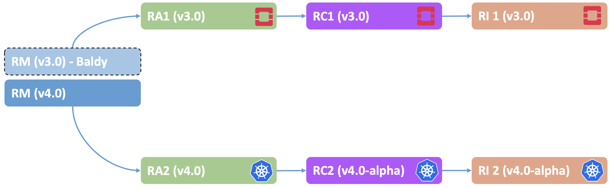

[<< Back](../)
# Baraque Release Notes

<b>Figure 1:</b> Baraque Release Structure

## Baraque Release Contents
* [Overview](#overview)
* [RM (v4.0)](#rm)
* [RA-1 (v3.0)](#ra1)
* [RC-1 (v3.0)](#rc1)
* [RI-1 (v3.0)](#ri1)
* [RA-2 (v4.0)](#ra2)
* [RC-2 (v4.0-alpha)](#rc2)
* [RI-2 (v4.0-alpha)](#ra2)

## Overview

This Release note highlights top features that will be included in Baraque release. For Full list of features in details, please refer to Baraque Release [Planning](https://wiki.lfnetworking.org/display/LN/Anuket CNTT+Baraque) page.

## Reference Model (v4.0)

| Reference # 	    | Feature 	                              | Notes 	                                        |
|-------------	    |-----------------	                      |-------	                                        |
| `baraque.rm.1` 	| Networking Resources 	                  | Support for Advanced Networking Resources & SDN	|
| `baraque.rm.2` 	| Networking & Storage Characterisation   | More Metrics for Networking and Storage         |
| `baraque.rm.3` 	| Full Container support                  | 	                                            |
| `baraque.rm.4` 	| HW Acceleration support 	              | Support Hardware Acceleration Resources 	    |
| `baraque.rm.5` 	| New Edge Profile 	                      | Support a new profile for Edge Use cases 	    |

## Reference Architecture 1 (v3.0)

| Reference # 	    | Feature 	                        | Notes                                                    |
|-------------	    |-----------------	                |-------                                                   |
| `baraque.ra1.1` 	| New OpenStack Base release 	    |                                                          |
| `baraque.ra1.2` 	| Support for SmartNic  	        | For vSwitch Offload 	                                   |
| `baraque.ra1.3` 	| Support for Hardware Acceleration | To support Hardware acceleration resources exposed by RM |

## Reference Conformance 1 (v3.0)

| Reference # 	    | Feature 	            | Notes 	                        |
|-------------	    |-----------------	    |-------	                        |
| `baraque.rc1.1` 	| General Cleanup 	    |  	                                |
| `baraque.rc1.2` 	| Traceability Matrix	| Centralised Traceability Matrix 	|

## Reference Implementation 1 (v3.0)

| Reference # 	    | Feature 	                | Notes 	                        |
|-------------	    |-----------------	        |-------	                        |
| `baraque.ri1.1` 	| Installer Requirements 	| Finalise Installer Requirements 	|
| `baraque.ri1.2` 	| Installation Cookbook 	| Finalise Installation Cookbook 	|
| `baraque.ri1.3` 	| Labs Cookbook 	        | Finalise Lab Cookbook 	        |

## Reference Architecture 2 (v4.0)

| Reference # 	    | Feature 	                | Notes 	                                 |
|-------------	    |-----------------	        |-------	                                 |
| `baraque.ra2.1` 	| Requirements 	            | Finalise Requirements 	                 |
| `baraque.ra2.2` 	| Traceability Matrix	    | Centralised Traceability Matrix	         |
| `baraque.ra2.3` 	| Architecture Specs (L3) 	| Full Architectural Specs (Component Level) |
| `baraque.ra2.4`   | Edge Usecases support 	| As Defined by Edge WS 	                 |

## Reference Conformance 2 (v4.0-alpha)

| Reference # 	    | Feature 	            | Notes 	                        |
|-------------	    |-----------------	    |-------	                        |
| `baraque.rc2.1` 	| Testing Requirements 	| Initial Content 	                |
| `baraque.rc2.2` 	| Traceability Matrix 	| Centralised Traceability Matrix 	|
| `baraque.rc2.3` 	| Testing Cookbook 	    | Initial Content 	                |

## Reference Implementation 2 (v4.0-alpha)

| Reference # 	    | Feature 	                | Notes 	        |
|-------------	    |-----------------	        |-------	        |
| `baraque.ri2.1` 	| Installer Requirements 	| Initial Content  	|
| `baraque.ri2.2` 	| Lab Requirements 	        | Initial Content 	|
| `baraque.ri2.3` 	| Installation Cookbook 	| Initial Content 	|
