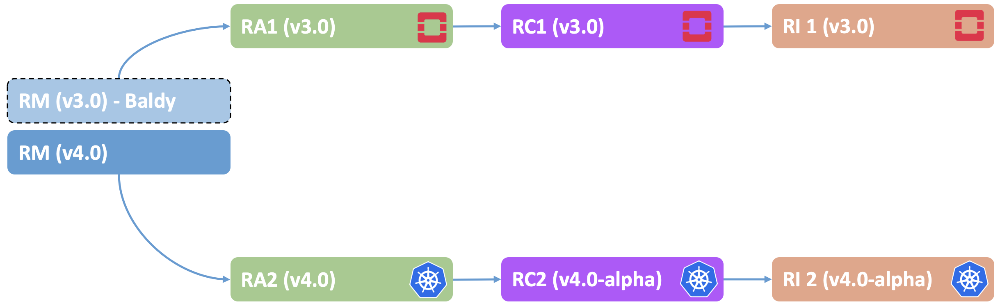

Baraque Release Notes
=====================

|Figure 1: Baraque Release Structure|

**Figure 1:** Baraque Release Structure

Baraque Release Contents
------------------------

-  `Overview <#overview>`__
-  `RM (v4.0) <#rm>`__
-  `RA-1 (v3.0) <#ra1>`__
-  `RC-1 (v3.0) <#rc1>`__
-  `RI-1 (v3.0) <#ri1>`__
-  `RA-2 (v4.0) <#ra2>`__
-  `RC-2 (v4.0-alpha) <#rc2>`__
-  `RI-2 (v4.0-alpha) <#ra2>`__

Overview
--------

This Release note highlights top features that will be included in
Baraque release. For Full list of features in details, please refer to
Baraque Release
`Planning <https://wiki.lfnetworking.org/display/LN/CNTT+Baraque>`__
page.

Reference Model (v4.0)
----------------------

+------------------------+--------------------------------+------------+
| Reference #            | Feature                        | Notes      |
+========================+================================+============+
| ``baraque.rm.1``       | Networking Resources           | Support    |
|                        |                                | for        |
|                        |                                | Advanced   |
|                        |                                | Networking |
|                        |                                | Resources  |
|                        |                                | & SDN      |
+------------------------+--------------------------------+------------+
| ``baraque.rm.2``       | Networking & Storage           | More       |
|                        | Characterisation               | Metrics    |
|                        |                                | for        |
|                        |                                | Networking |
|                        |                                | and        |
|                        |                                | Storage    |
+------------------------+--------------------------------+------------+
| ``baraque.rm.3``       | Full Container support         |            |
+------------------------+--------------------------------+------------+
| ``baraque.rm.4``       | HW Acceleration support        | Support    |
|                        |                                | Hardware   |
|                        |                                | Ac         |
|                        |                                | celeration |
|                        |                                | Resources  |
+------------------------+--------------------------------+------------+
| ``baraque.rm.5``       | New Edge Profile               | Support a  |
|                        |                                | new        |
|                        |                                | profile    |
|                        |                                | for Edge   |
|                        |                                | Use cases  |
+------------------------+--------------------------------+------------+

Reference Architecture 1 (v3.0)
-------------------------------

+------------------------+--------------------------------+------------+
| Reference #            | Feature                        | Notes      |
+========================+================================+============+
| ``baraque.ra1.1``      | New OpenStack Base release     |            |
+------------------------+--------------------------------+------------+
| ``baraque.ra1.2``      | Support for SmartNic           | For        |
|                        |                                | vSwitch    |
|                        |                                | Offload    |
+------------------------+--------------------------------+------------+
| ``baraque.ra1.3``      | Support for Hardware           | To support |
|                        | Acceleration                   | Hardware   |
|                        |                                | ac         |
|                        |                                | celeration |
|                        |                                | resources  |
|                        |                                | exposed by |
|                        |                                | RM         |
+------------------------+--------------------------------+------------+

Reference Conformance 1 (v3.0)
------------------------------

================= =================== ===============================
Reference #       Feature             Notes
================= =================== ===============================
``baraque.rc1.1`` General Cleanup     
``baraque.rc1.2`` Traceability Matrix Centralised Traceability Matrix
================= =================== ===============================

Reference Implementation 1 (v3.0)
---------------------------------

================= ====================== ===============================
Reference #       Feature                Notes
================= ====================== ===============================
``baraque.ri1.1`` Installer Requirements Finalise Installer Requirements
``baraque.ri1.2`` Installation Cookbook  Finalise Installation Cookbook
``baraque.ri1.3`` Labs Cookbook          Finalise Lab Cookbook
================= ====================== ===============================

Reference Architecture 2 (v4.0)
-------------------------------

+------------------------+--------------------------------+------------+
| Reference #            | Feature                        | Notes      |
+========================+================================+============+
| ``baraque.ra2.1``      | Requirements                   | Finalise   |
|                        |                                | Re         |
|                        |                                | quirements |
+------------------------+--------------------------------+------------+
| ``baraque.ra2.2``      | Traceability Matrix            | C          |
|                        |                                | entralised |
|                        |                                | Tr         |
|                        |                                | aceability |
|                        |                                | Matrix     |
+------------------------+--------------------------------+------------+
| ``baraque.ra2.3``      | Architecture Specs (L3)        | Full       |
|                        |                                | Arc        |
|                        |                                | hitectural |
|                        |                                | Specs      |
|                        |                                | (Component |
|                        |                                | Level)     |
+------------------------+--------------------------------+------------+
| ``baraque.ra2.4``      | Edge Usecases support          | As Defined |
|                        |                                | by Edge WS |
+------------------------+--------------------------------+------------+

Reference Conformance 2 (v4.0-alpha)
------------------------------------

================= ==================== ===============================
Reference #       Feature              Notes
================= ==================== ===============================
``baraque.rc2.1`` Testing Requirements Initial Content
``baraque.rc2.2`` Traceability Matrix  Centralised Traceability Matrix
``baraque.rc2.3`` Testing Cookbook     Initial Content
================= ==================== ===============================

Reference Implementation 2 (v4.0-alpha)
---------------------------------------

================= ====================== ===============
Reference #       Feature                Notes
================= ====================== ===============
``baraque.ri2.1`` Installer Requirements Initial Content
``baraque.ri2.2`` Lab Requirements       Initial Content
``baraque.ri2.3`` Installation Cookbook  Initial Content
================= ====================== ===============

