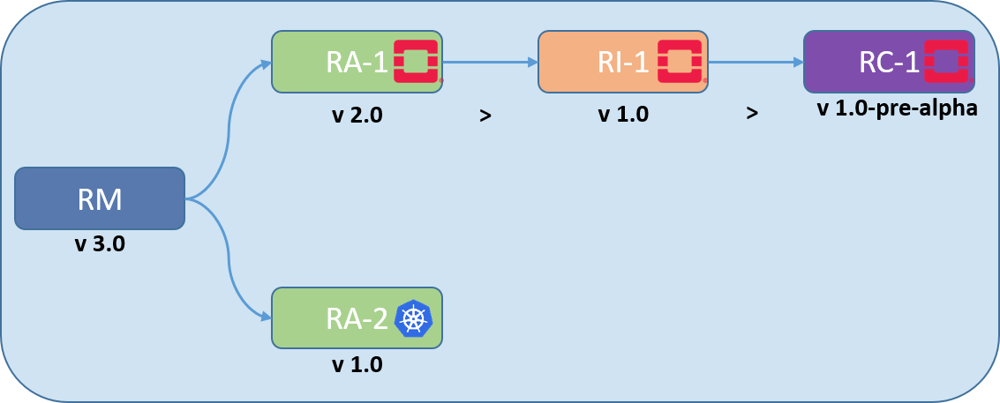
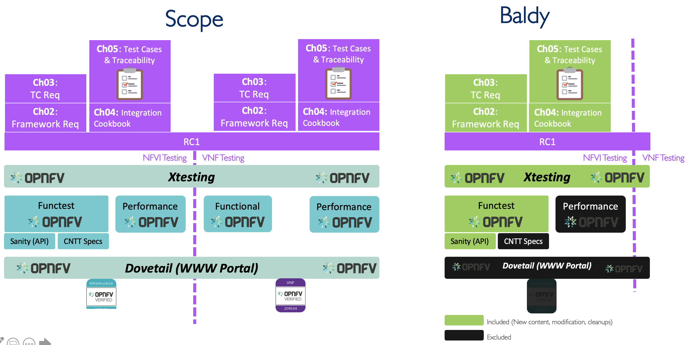
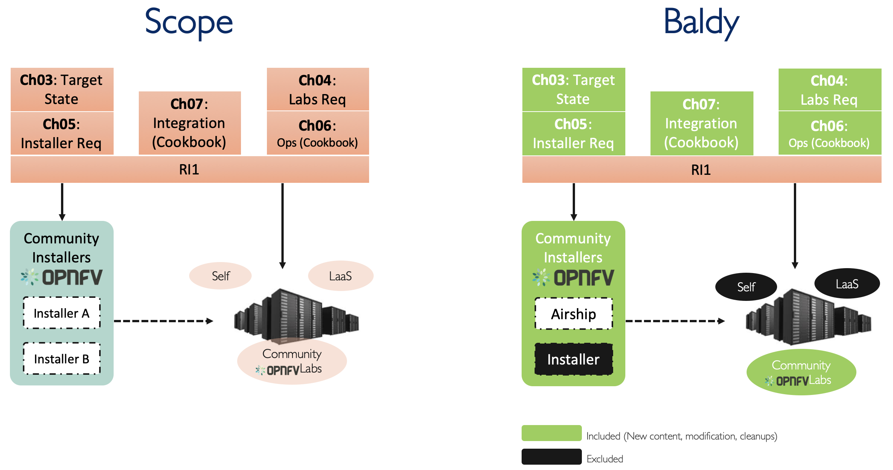

# Baldy Release Notes

 <!-- width="65%" -->

**Figure 1:** Baldy Release Organisation

## Baldy Release Contents
* [Overview](#overview)
* [RM (v3.0)](#rm)
* [RA-1 (v2.0)](#ra1)
* [RC-1 (v2.0)](#rc1)
* [RI-1 (v3.0-alpha)](#ri1)
* [RA-2 (v3.0)](#ra2)
* [RI-2 (draft)](#ri2)
* [RC-2 (draft)](#rc2)

## Overview

| Reference # 	| Feature 	| Notes 	|
|-------------	|-----------------	|-------	|
| `baldy.tech.1` 	| VNF Evolution policy and strategy 	|  	|
| `baldy.tech.2` 	| Backward/Forward Compatibility 	|  	|
| `baldy.tech.3` 	| Future Roadmap |  |

## Reference Model (v3.0)

>WSL Note: Features below should be implemented in order.

| Reference # 	| Feature 	| Notes 	|
|-------------	|-----------------	|-------	|
| `baldy.rm.1` 	| General Cleanup 	| All Chapters 	|
| `baldy.rm.2` 	| Limiting infrastructure profiles to Basic and Network Intensive (Parking Compute intensive) | Ch02, Ch04, and Ch05 |
| `baldy.rm.3` 	| Finalising Compliance, Verification and Conformance Strategy | Ch08 	|
| `baldy.rm.4*` 	| Full Container support 	| Ch04 	|
| `baldy.rm.5` 	| Complete Security Chapter | Ch07: 100% alignment with ONAP 	|
| `baldy.rm.6` 	| Virtual Networking/ Networking Fabric Modelling 	| Ch03 	|
| `baldy.rm.7` 	| Generic Installer Model 	| Ch09 	|
| `baldy.rm.8` 	| Guidelines 	| Appnedix-A 	|

*Baldy Release includes at least features up to and including `baldy.rm.4`.

## Reference Architecture 1 (v2.0)

>WSL Note: Features below should be implemented in order.

| Reference # 	| Feature 	| Notes 	|
|-------------	|-----------------	|-------	|
| `baldy.ra1.1` 	| General Cleanup 	| All Chapters 	|
| `baldy.ra1.2` 	| Clarify OpenStack version policy 	| Ch01, Ch05 	|
| `baldy.ra1.3` 	| Incorporate RM Requirements in RA-1 Requirements 	| Ch02 	|
| `baldy.ra1.4` 	| Create a proposal for an exiting Gap 	|  Ch08	|
| `baldy.ra1.5` 	| Complete High Level Architecture 	| Ch03 	|
| `baldy.ra1.6*` 	| Complete Interfaces & APIs 	|  Ch05	|
| `baldy.ra1.7` 	| Complete Components Level Architecture 	| Ch04 	|
| `baldy.ra1.8` 	| Complete Security Chapter 	|  Ch06	|
| `baldy.ra1.9` 	| Complete LCM Chapter 	|  Ch07	|

*Baldy Release includes at least features up to and including `baldy.ra1.6`.

## Reference Conformance 1 (v2.0)

 <!-- width="100%" -->

**Figure 2:** RC-1 Baldy Release plan

>WSL Note: Features below should be implemented in order.

| Reference # 	| Feature 	| Notes 	|
|-------------	|-----------------	|-------	|
| `baldy.rc1.1` 	| General Cleanup 	| All Chapters 	|
| `baldy.rc1.2` 	| Clarify Conformance Categories (NFVI & VNFs)	| Ch01 	|
| `baldy.rc1.3` 	| Complete NFVI Framework Requirements 	| Ch02 	|
| `baldy.rc1.4` 	| Categorise NFVI TC Req and Write API Testing TC 	|  Ch03	|
| `baldy.rc1.5` 	| Create NFVI Mapping & Traceability Matrix and populate it 	| Ch05 	|
| `baldy.rc1.6` 	| Restructure NFVI Cookbook and Cleanup  	| Ch04 	|
| `baldy.rc1.7` 	| NFVI Framework & Test Cases Development   | **DEV** 	|
| `baldy.rc1.8` 	| RC-1 test suites can run against RI-1   | **DEV** 	|

## Reference Implementation 1 (v3.0-alpha)

 <!-- width="100%" -->

**Figure 1:** RI-1 Baldy Release plan

| Reference # 	| Feature 	| Notes 	|
|-------------	|-----------------	|-------	|
| `baldy.ri1.1` 	| General Cleanups 	| All Chapters 	|
| `baldy.ri1.2` 	| Complete Overall Requirements 	| Ch02 	|
| `baldy.ri1.3` 	| Complete Lab Requirements 	| Ch04 	|
| `baldy.ri1.4` 	| Complete Target State & Metadata 	| Ch03 	|
| `baldy.ri1.5` 	| Complete Installer Requirements 	| Ch05 	|
| `baldy.ri1.6` 	| Complete Lab Cookbook (Ops) 	| Ch06 	|
| `baldy.ri1.6` 	| Restructure & Complete Integration Cookbook	| Ch07 	|
| `baldy.ri1.7` 	| Implement Profiles within OPNFV Installers and consume CNTT metadata 	|  **DEV**	|
| `baldy.ri1.8` 	| RI-1 passes the RC-1 test suite execution (For sanity and APIs)   | **DEV** 	|

## Reference Architecture 2 (v3.0)

>WSL Note: Features below should be implemented in order. For Baldy, At least 

| Reference # 	| Feature 	| Notes 	|
|-------------	|-----------------	|-------	|
| `baldy.ra2.1` 	| General Cleanup 	| All Chapters 	|
| `baldy.ra2.2` 	| Complete Requirements & Map to RM	| Ch02 	|
| `baldy.ra2.3` 	| Finish High Level Architecture 	| Ch03 	|
| `baldy.ra2.4*` 	| Propose solution to an existing gap 	| Ch08 	|
| `baldy.ra2.5` 	| More Details about Component Level Architecture 	| Ch04 	|
| `baldy.ra2.6` 	| More Details about Interfaces & APIs 	| Ch05 	|
| `baldy.ra2.7` 	| More Details about Security 	| Ch06 	|
| `baldy.ra2.8` 	| More Details about LCM 	| Ch07 	|
| `baldy.ra2.9` 	| More Details and proposals about Gaps 	| Ch08 	|
| `baldy.ra2.10` 	| Guidelines	| Appendix-A 	|

*Baldy Release includes at least features up to and including `baldy.ra2.4`.
