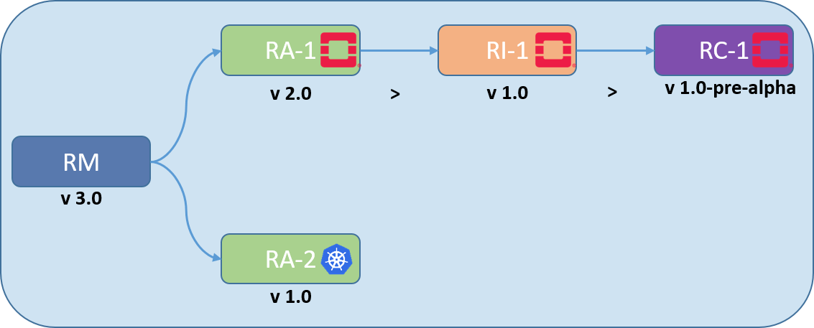

Baldy Release Notes
===================

|Figure 1: Baldy Release Organisation|

**Figure 1:** Baldy Release Organisation

Baldy Release Contents
----------------------

-  `Overview <#overview>`__
-  `RM (v3.0) <#rm>`__
-  `RA-1 (v2.0) <#ra1>`__
-  `RC-1 (v2.0) <#rc1>`__
-  `RI-1 (v3.0-alpha) <#ri1>`__
-  `RA-2 (v3.0) <#ra2>`__
-  `RI-2 (draft) <#ri2>`__
-  `RC-2 (draft) <#rc2>`__

Overview
--------

================ ================================= =====
Reference #      Feature                           Notes
================ ================================= =====
``baldy.tech.1`` VNF Evolution policy and strategy 
``baldy.tech.2`` Backward/Forward Compatibility    
``baldy.tech.3`` Future Roadmap                    
================ ================================= =====

Reference Model (v3.0)
----------------------

   WSL Note: Features below should be implemented in order.

+------------------------+--------------------------------+------------+
| Reference #            | Feature                        | Notes      |
+========================+================================+============+
| ``baldy.rm.1``         | General Cleanup                | All        |
|                        |                                | Chapters   |
+------------------------+--------------------------------+------------+
| ``baldy.rm.2``         | Limiting infrastructure        | Ch02,      |
|                        | profiles to Basic and Network  | Ch04, and  |
|                        | Intensive (Parking Compute     | Ch05       |
|                        | intensive)                     |            |
+------------------------+--------------------------------+------------+
| ``baldy.rm.3``         | Finalising Compliance,         | Ch08       |
|                        | Verification and Conformance   |            |
|                        | Strategy                       |            |
+------------------------+--------------------------------+------------+
| ``baldy.rm.4*``        | Full Container support         | Ch04       |
+------------------------+--------------------------------+------------+
| ``baldy.rm.5``         | Complete Security Chapter      | Ch07: 100% |
|                        |                                | alignment  |
|                        |                                | with ONAP  |
+------------------------+--------------------------------+------------+
| ``baldy.rm.6``         | Virtual Networking/ Networking | Ch03       |
|                        | Fabric Modelling               |            |
+------------------------+--------------------------------+------------+
| ``baldy.rm.7``         | Generic Installer Model        | Ch09       |
+------------------------+--------------------------------+------------+
| ``baldy.rm.8``         | Guidelines                     | Appnedix-A |
+------------------------+--------------------------------+------------+

\*Baldy Release includes at least features up to and including
``baldy.rm.4``.

Reference Architecture 1 (v2.0)
-------------------------------

   WSL Note: Features below should be implemented in order.

+------------------+----------------------------------+--------------+
| Reference #      | Feature                          | Notes        |
+==================+==================================+==============+
| ``baldy.ra1.1``  | General Cleanup                  | All Chapters |
+------------------+----------------------------------+--------------+
| ``baldy.ra1.2``  | Clarify OpenStack version policy | Ch01, Ch05   |
+------------------+----------------------------------+--------------+
| ``baldy.ra1.3``  | Incorporate RM Requirements in   | Ch02         |
|                  | RA-1 Requirements                |              |
+------------------+----------------------------------+--------------+
| ``baldy.ra1.4``  | Create a proposal for an exiting | Ch08         |
|                  | Gap                              |              |
+------------------+----------------------------------+--------------+
| ``baldy.ra1.5``  | Complete High Level Architecture | Ch03         |
+------------------+----------------------------------+--------------+
| ``baldy.ra1.6*`` | Complete Interfaces & APIs       | Ch05         |
+------------------+----------------------------------+--------------+
| ``baldy.ra1.7``  | Complete Components Level        | Ch04         |
|                  | Architecture                     |              |
+------------------+----------------------------------+--------------+
| ``baldy.ra1.8``  | Complete Security Chapter        | Ch06         |
+------------------+----------------------------------+--------------+
| ``baldy.ra1.9``  | Complete LCM Chapter             | Ch07         |
+------------------+----------------------------------+--------------+

\*Baldy Release includes at least features up to and including
``baldy.ra1.6``.

Reference Conformance 1 (v2.0)
------------------------------

|Figure 2: RC-1 Baldy Release plan|

**Figure 2:** RC-1 Baldy Release plan

   WSL Note: Features below should be implemented in order.

+-----------------+-----------------------------------+--------------+
| Reference #     | Feature                           | Notes        |
+=================+===================================+==============+
| ``baldy.rc1.1`` | General Cleanup                   | All Chapters |
+-----------------+-----------------------------------+--------------+
| ``baldy.rc1.2`` | Clarify Conformance Categories    | Ch01         |
|                 | (NFVI & VNFs)                     |              |
+-----------------+-----------------------------------+--------------+
| ``baldy.rc1.3`` | Complete NFVI Framework           | Ch02         |
|                 | Requirements                      |              |
+-----------------+-----------------------------------+--------------+
| ``baldy.rc1.4`` | Categorise NFVI TC Req and Write  | Ch03         |
|                 | API Testing TC                    |              |
+-----------------+-----------------------------------+--------------+
| ``baldy.rc1.5`` | Create NFVI Mapping &             | Ch05         |
|                 | Traceability Matrix and populate  |              |
|                 | it                                |              |
+-----------------+-----------------------------------+--------------+
| ``baldy.rc1.6`` | Restructure NFVI Cookbook and     | Ch04         |
|                 | Cleanup                           |              |
+-----------------+-----------------------------------+--------------+
| ``baldy.rc1.7`` | NFVI Framework & Test Cases       | **DEV**      |
|                 | Development                       |              |
+-----------------+-----------------------------------+--------------+
| ``baldy.rc1.8`` | RC-1 test suites can run against  | **DEV**      |
|                 | RI-1                              |              |
+-----------------+-----------------------------------+--------------+

Reference Implementation 1 (v3.0-alpha)
---------------------------------------

|Figure 1: RI-1 Baldy Release plan|

**Figure 1:** RI-1 Baldy Release plan

+------------------------+--------------------------------+------------+
| Reference #            | Feature                        | Notes      |
+========================+================================+============+
| ``baldy.ri1.1``        | General Cleanups               | All        |
|                        |                                | Chapters   |
+------------------------+--------------------------------+------------+
| ``baldy.ri1.2``        | Complete Overall Requirements  | Ch02       |
+------------------------+--------------------------------+------------+
| ``baldy.ri1.3``        | Complete Lab Requirements      | Ch04       |
+------------------------+--------------------------------+------------+
| ``baldy.ri1.4``        | Complete Target State &        | Ch03       |
|                        | Metadata                       |            |
+------------------------+--------------------------------+------------+
| ``baldy.ri1.5``        | Complete Installer             | Ch05       |
|                        | Requirements                   |            |
+------------------------+--------------------------------+------------+
| ``baldy.ri1.6``        | Complete Lab Cookbook (Ops)    | Ch06       |
+------------------------+--------------------------------+------------+
| ``baldy.ri1.6``        | Restructure & Complete         | Ch07       |
|                        | Integration Cookbook           |            |
+------------------------+--------------------------------+------------+
| ``baldy.ri1.7``        | Implement Profiles within      | **DEV**    |
|                        | OPNFV Installers and consume   |            |
|                        | CNTT metadata                  |            |
+------------------------+--------------------------------+------------+
| ``baldy.ri1.8``        | RI-1 passes the RC-1 test      | **DEV**    |
|                        | suite execution (For sanity    |            |
|                        | and APIs)                      |            |
+------------------------+--------------------------------+------------+

Reference Architecture 2 (v3.0)
-------------------------------

   WSL Note: Features below should be implemented in order. For Baldy,
   At least

+------------------+----------------------------------+--------------+
| Reference #      | Feature                          | Notes        |
+==================+==================================+==============+
| ``baldy.ra2.1``  | General Cleanup                  | All Chapters |
+------------------+----------------------------------+--------------+
| ``baldy.ra2.2``  | Complete Requirements & Map to   | Ch02         |
|                  | RM                               |              |
+------------------+----------------------------------+--------------+
| ``baldy.ra2.3``  | Finish High Level Architecture   | Ch03         |
+------------------+----------------------------------+--------------+
| ``baldy.ra2.4*`` | Propose solution to an existing  | Ch08         |
|                  | gap                              |              |
+------------------+----------------------------------+--------------+
| ``baldy.ra2.5``  | More Details about Component     | Ch04         |
|                  | Level Architecture               |              |
+------------------+----------------------------------+--------------+
| ``baldy.ra2.6``  | More Details about Interfaces &  | Ch05         |
|                  | APIs                             |              |
+------------------+----------------------------------+--------------+
| ``baldy.ra2.7``  | More Details about Security      | Ch06         |
+------------------+----------------------------------+--------------+
| ``baldy.ra2.8``  | More Details about LCM           | Ch07         |
+------------------+----------------------------------+--------------+
| ``baldy.ra2.9``  | More Details and proposals about | Ch08         |
|                  | Gaps                             |              |
+------------------+----------------------------------+--------------+
| ``baldy.ra2.10`` | Guidelines                       | Appendix-A   |
+------------------+----------------------------------+--------------+

\*Baldy Release includes at least features up to and including
``baldy.ra2.4``.

.. |Figure 2: RC-1 Baldy Release plan| image:: ../figures/rc1_baldy.png
.. |Figure 1: RI-1 Baldy Release plan| image:: ../figures/ri1_baldy.png
