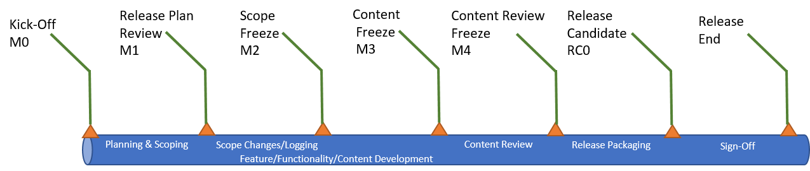
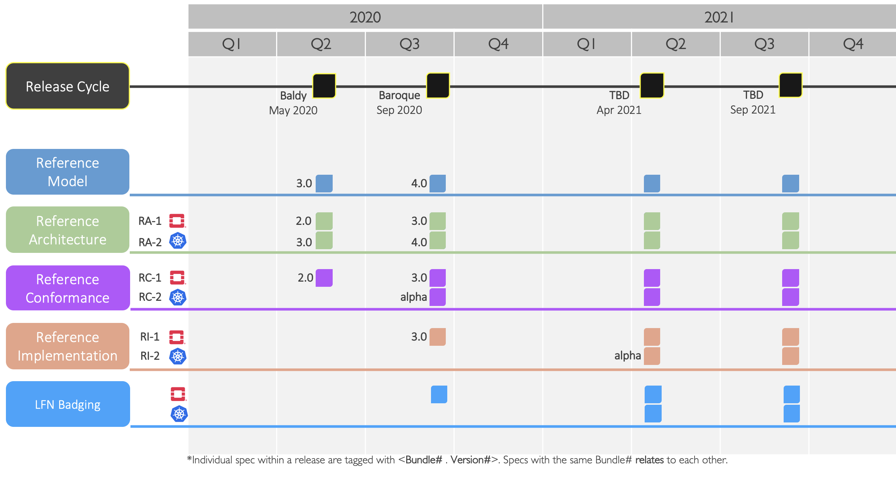
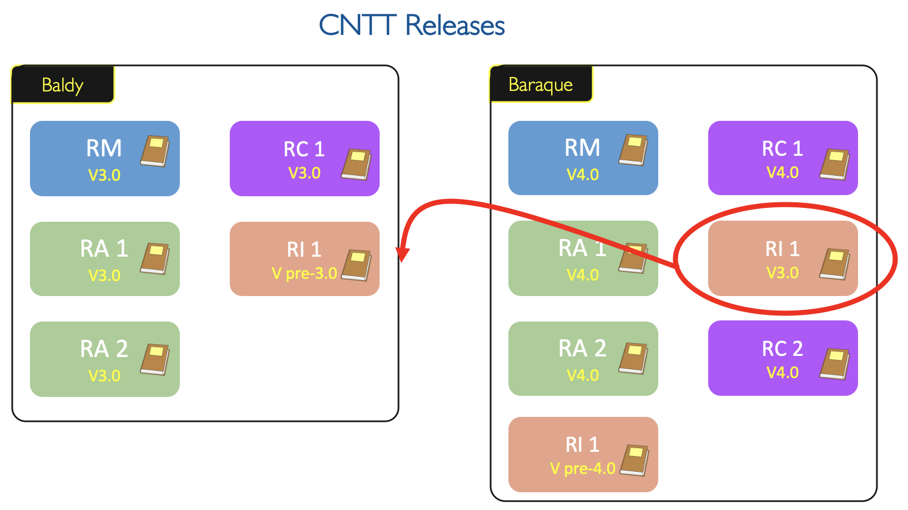

# Roadmap

## Overview

* The activities of the Anuket Project community are articulated around [Projects](#project) (sub-projects of Anuket Project sometimes also referred to as Workstreams (WS)), [Milestones](#2.3) and [Releases](#release).
* The Anuket Project is embracing simultaneous delivery model, meaning that all contributing projects have to follow the cadence and intermediate milestones.
* Each Anuket Project release is the only delivery vehicle and is common for all projects.
* The Anuket Project current release plan is available [here](https://wiki.anuket.io/display/HOME/Releases).

 <!-- width="100%" -->

**Figure 1:** Milestones

**Definitions**

A project (aka WS) is:

* Long term endeavour setup to deliver features across multiple releases as shown in [Releases Home](https://wiki.anuket.io/display/HOME/Releases+Home)
* Led by leads/co-leads, contributors and committers with expertise in the relevant areas
* Scripted and documented in repositories
  
A Release is:

* Short term endeavour setup to deliver a specific features/functionalities as shown [here](https://wiki.anuket.io/display/HOME/Releases).
* An agreed common framework (template, criteria, best practice) for all projects
* An unique release planning calendar with pre-defined milestones for each project
* A vehicle to coordinate multiple projects and multiple type of projects (reference model and architecture, documentation, integration, packaging, deployment)

A Bundle is: A set of related specifications that are built to complement each other, specifically (RM -> RA -> RC -> RI).

A Version:

* Each document within a release has a number attached to it that consists of **Bundle.Version**:
  * **Bundle**: specifies the bundle number of which the the document belongs to.
  * **Version**: specifies the sequential version of each document (improvement or enhancements).
* Any Change in RM that will impact RAs and consequently RC and RI will triggers a new Bundle number.

## Roadmap

### High Level Roadmap

 <!-- width="100%" -->

**Figure 2:** The Anuket Project Technical Specification Roadmap

### Detailed Roadmap

Please refer to individual [release plans](https://wiki.anuket.io/display/HOME/Releases) and features for detailed roadmap.

### Detailed Milestones

| Review | Milestone | Description | Activities | Comments |
|--------|-----------|--------------|------------|---------|
| Kick-Off | M0 | The goal of the release Kick-Off is to open the innovation platform for the intent to participate in the Anuket Project release. Release Kick-Off review takes place for each releases. | Name the Release and create appropriate labels in GitHub. ||
| Planning & Scoping | | The goal of the Release Planning & Scoping is to capture the initial set of features and functionality that should be part of the release along with prioritisation. | Identity a list of features and functionality including from the backlog will be developed and documented as part of the current release. N.B. Feature/functionality, errors etc. are logged in GitHub as Issues. Identify what is in or out of scope for the release. Escalate any issues to the TSC. | |
| Release Plan Review | M1 | The goal of the Release Planning review is to ensure the plan is complete, sufficient, and aligned with release milestones. All people resources are identified, documented and committed. | After the review cut-off date any major features & functionalities changes will be added to the backlog unless it is approved by the TSC to be added into the current scope of release. Bug fixes or any minor changes identified during the development will be allowed. For any other content changes to be approved by TSC.||
| Scope Changes/Logging | |  Feature/Functionality changes to be part of current Release |Feature/Functionality changes (in Github) for the current scope of release. Project leads ensure feature/functionality are correctly labelled, mapped to the corresponding project and milestone, etc. | |
| Scope Freeze | M2 | The goal of the Scope Freeze is to mark the end of adding new features/functionalites in the Release. | All the project leads authorise the issues are correctly labelled, mapped to the corresponding project and milestone, etc. Features/Functionalities changes (except for bugs fixes) identified post-freeze will be added to the Backlog. Exceptions to the above need TSC approval. | |
| Feature/Functionality/Content Development | | The goal is to ensure that changes to features and functionalities are captured and all content necessary for the In-Scope features & functionalities will be developed as part of the release scope. |Update Feature/Functionality as we evolve. Develop / Update the contents for the release in-scope listed features & functionalities | |
| Content Freeze | M3 | The goal of the Content Freeze is to mark the end of the features documented and provided the resolution for all impacting defects. After Content Freeze, there will be no new features/functionalities are allowed into the current release. Only the critical fixes are allowed. | All the project leads review the document and ensure all the planned features are documented and fixes are available before end of the Content Freeze. Uncompleted features/functionality will be added to the Backlog. After discussed and approved by the TSC. | |
| Content Review | | The goal is to carefully review and validate the contents and check for errors in the document. | Validate content is within Release Scope and is technically correct. Check document for grammatical errors, extraneous items, etc. Close all In-Scope & reviewed projects/issues and move all others to Backlog after discussed and approved by the TSC. | |
| Content Review Freeze | M4 | The goal is to perform the final proof reading of the document before it is released. This is the release content completion milestone. | All Projects are closed or else are marked Backlog. Discuss with TSC for any exceptional approval. | |
| Release Packaging | | The goal is to package the precise and reviewed document versions into a new release branch. | Create new Release Branch after content review ends. | |
| Release Candidate | RC0 | The goal of the Release Candidate is to ensure the documentations are properly aligned, fully reviewed in the new release branch. | Prioritise the required fixes and address them. If there are any critical fixes required then the fixes will be provided and it will be tagged with minor release. (Eg. Baldy 4.0.1) | |
| Release End | | The goal of the Release Sign-Off review is to ensure all the projects are successfully passed all the review. All the committed deliverables are available and passed the quality criteria. | | |

**Table 1:** Detailed Milestones

## Dependencies between various Workstreams

The various workstreams in the Anuket Project are:

* Reference Model (RM)
* Reference Architecture (RA)
* Reference Implementation (RI) 
* Reference Conformance (RC)

The workstream dependency relationship in simple terms, [Reference Conformance](../ref_cert) verifies and tests the [Reference Implementation](../ref_impl) which follows the requirements and architecture defined in the [Reference Architectures](../ref_arch) and Reference Architecture describes the high level system components and its interactions by adhering to the requirements and expectations set by the [Reference Model](../ref_model) which sets the standards for infrastructure abstraction, compliance and verification. 

For the standard release stabilisation, On each release, All documents that are related to each other will have the same **main** version number as shown in the Figure 3.

There are two different tracks in the Anuket Project:

* Virtualised workloads, deployed on OpenStack
* Cloud Native workloads, deployed on Kubernetes

Each track follows the industry driven standards in the Reference Model as depicted in the below diagram.

 <!-- width="100%" -->

**Figure 3:** Anuket Project WS Dependencies

## Dependencies with Industry Communities

The Anuket Project is collaboratively working with other standard bodies and open source communities such as: 

* CNCF
* ETSI ISG NFV
* ETSI ISG MEC
* MEF
* ONAP
* OpenInfra OpenStack
* Telecom Infra Project (TIP)
* XGVELA
