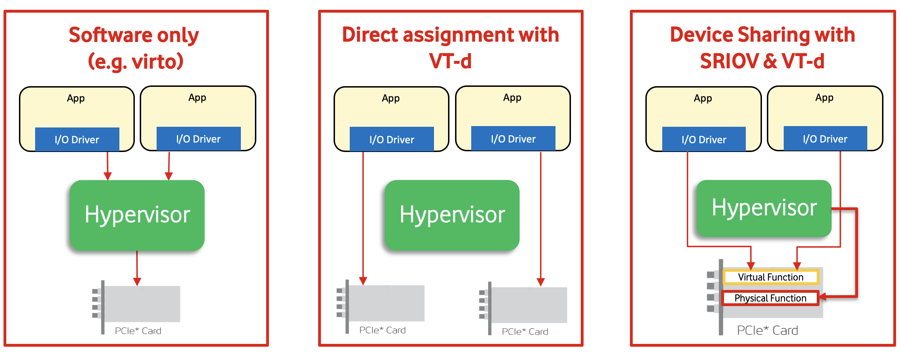
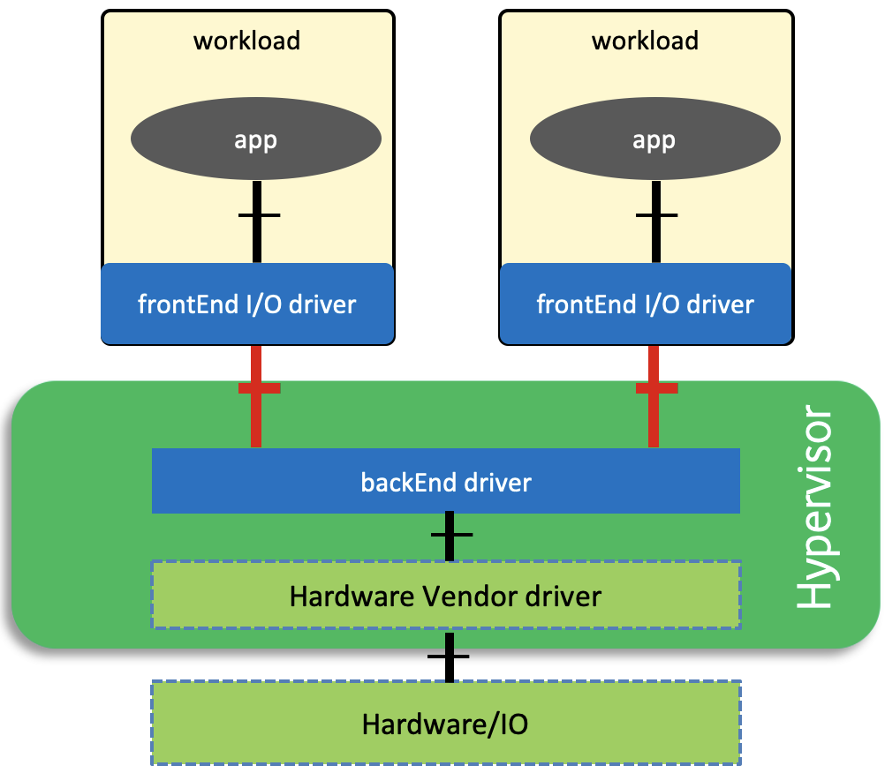
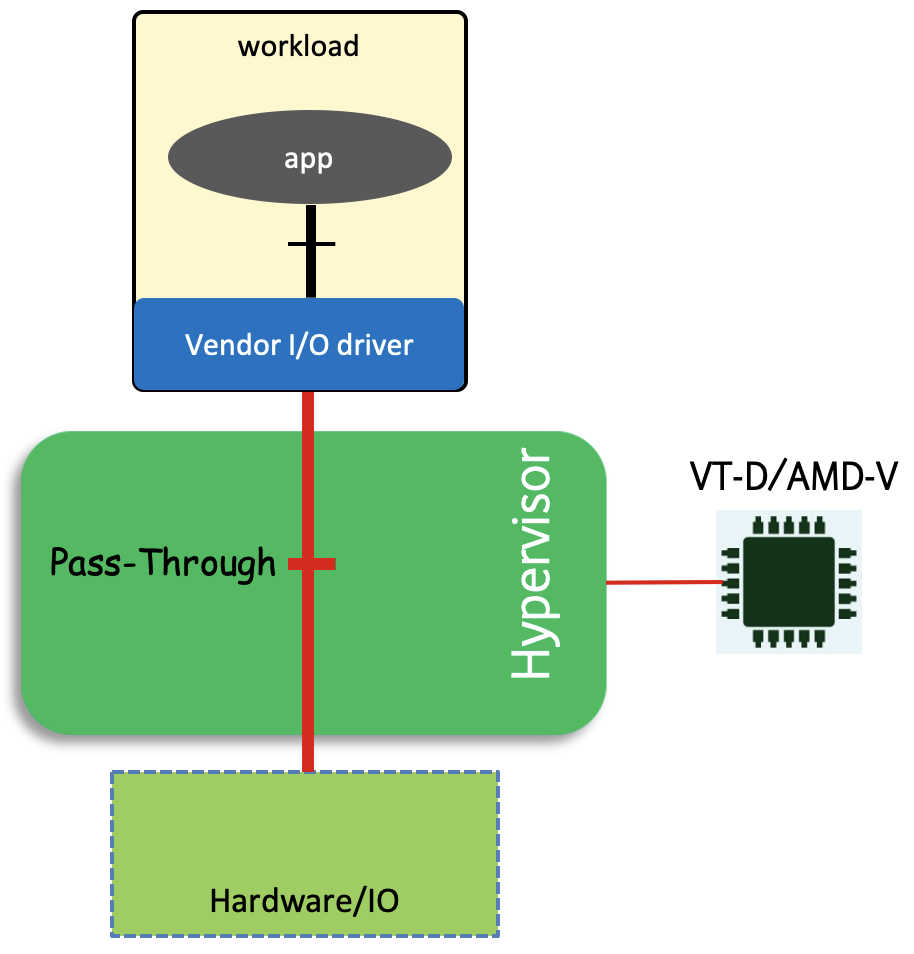
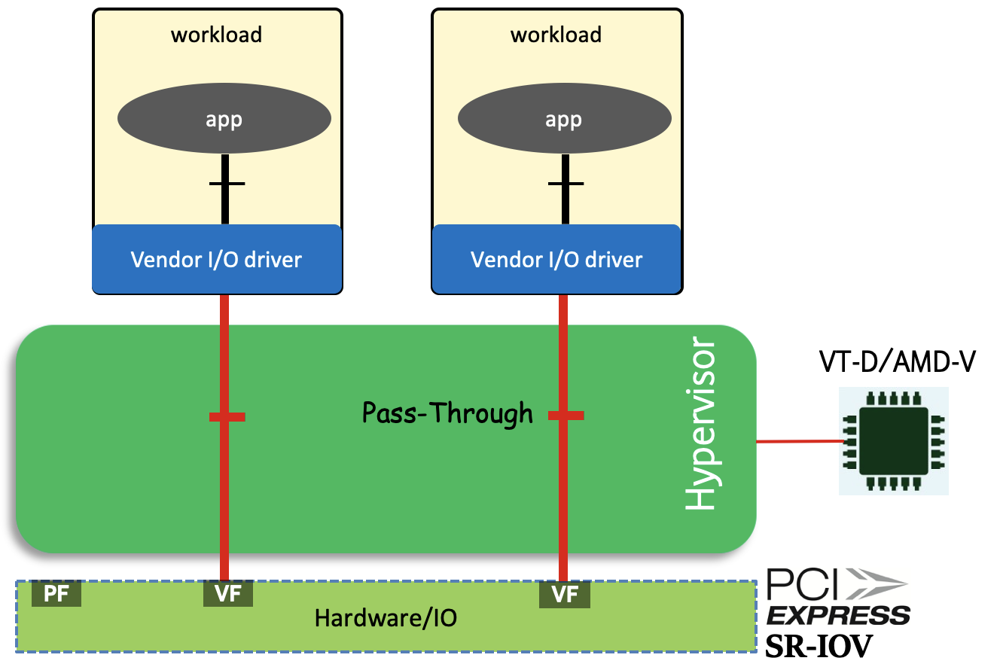
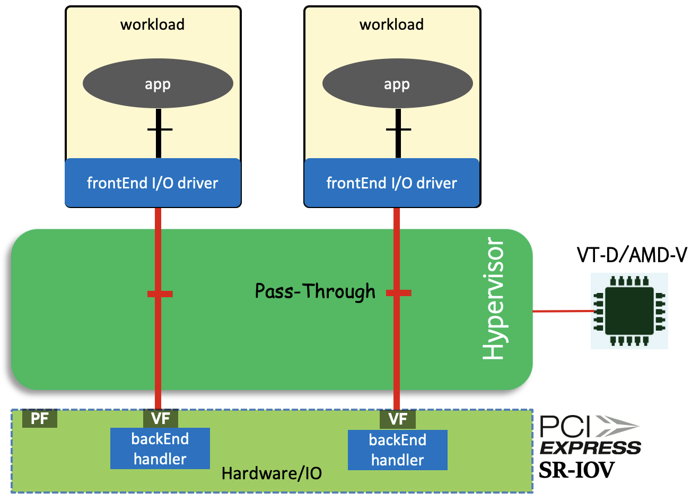

[<< Back](https://cntt-n.github.io/CNTT/)
# Anuket Project Relevant Technologies

## Table of Contents
* [IO Virtualisation](#IO-Virtualisation)
* [SmartNICs](#SmartNICs)
* [Acceleration Cards](#Acceleration-Cards)
* [FPGA](#FPGA)
* [GPUs/NPUs](#GPUsNPUs)
* [EPA/NFD](#EPANFD)

## IO Virtualisation

There are different ways of which IO devices (such as NICs) are presented to workloads for consumption by those workloads. Here is a list of current methods of existing IO Virtualisation:

- Para-Virtualisation method (software only).
- Direct Assignment via h/w assisted PCI-Passthrough (IOMMU).
- Device Sharing with SR-IOV & h/w assisted PCI-Passthrough (IOMMU).
- Para-Virtualisation method with Hardware support.

**Figure 1** below shows some of the relevant IO Virtualisation techniques.

<b>Figure 1:</b> Relevant IO Virtualisation Techniques

### Para-virtualisation method (software only)

This is the preferred method of IO virtualisation as it provides flexibility and full abstraction of workloads from the underlying infrastructure. It usually relies on standard IO interfaces that are implemented in software.
For Networking, there are two common networking interfaces used: virtio-net for KVM/QEMU and VMXNET for VMware.

Using a standard interface for IO means that workload doesn't need to run any proprietary software drivers for specific hardware vendors and the implementation of that workload is completely agnostic of the hardware used.

**Figure 2** below shows the typical components of a para-virtualised interface: 
- frontEnd driver: The frontEnd driver is an off-the-shelf driver that runs on the workload.
- backEnd driver: runs on the Hypervisor and is responsible of bridging standard communications coming from applications to a hardware specific ones. 

This nature of this disaggregation is what gives the para-virtualised interfaces the flexibility that makes them favourable in a virtualised environment.

The downside of para-virtualisation interfaces is the involvement of the hypervisor which may introduce latency and jitter that can impact the performance.

<b>Figure 2:</b> Para-Virtualszed interface components (software only).

### Direct assignment with IOMMU.

Direct Assignment is supported in x86 architectures through an IOMMU (Input/Ouput Memory Management Unit), which provides the ability for a PCIe device to autonomously (i.e. without hypervisor intervention) perform DMA transfers directly into guest memory as shown in **Figure 3**.

Once an IO device is directly assigned to a workload, that workload will then have an exclusive access to that device and no other entities (including the hypervisor) can access it.

This method provides better performance than the para-virtualised one as no hypervisor is involved but provides less flexibility and less portability.

Having an IO device directly assigned to a workload means that the workload needs to run vendor specific drivers and libraries to be able to access that device which makes the workload less portable and dependent on a specific hardware type from a specific vendor which is not aligned with the overall strategy and goals of the Anuket Project and hence this method of IO Virtualisation must not be used unless explicitly allowed as an exception as part of the transitional plan adopted by the Anuket Project.

<b>Figure 3:</b> Direct Assignment with Virtual Technology.

### Device Sharing with SR-IOV & IOMMU.

This method partitions a hardware device into multiple regions (known as VFs), and uses Direct Assignment to provide workloads exclusive access to one or more of those regions (VFs), thereby bypassing the hypervisor and simultaneously allowing multiple workloads to share the same device.

For this method to be possible, the IO device need to support Single Root Input Output Virtualisation (SR-IOV) which allows it to present itself as multiple devices, known as Physical Functions, PFs, and Virtual Functions, VFs as presented in **Figure 4**.

Each of those Virtual Functions can then be independently assigned exclusively to a workload (with the appropriate hardware support of an IOMMU).

Similar to the previous method ("Direct Assignment"), this method provides better performance than para-virtualisation, but lacks the flexibility and the portability sought and therefore must also not be used unless explicitly allowed as an exception as part of the transitional plan adopted by the Anuket Project.

<b>Figure 4:</b> Device Sharing with SR-IOV & Direct Assignment.

### Para-Virtualisation method (Hardware support)

This method basically is a mixture between the software only para-virtualisation method and the direct assignment method (including the device sharing method) where the frontEnd driver which is running on the workload is a standard off the shelf driver and the backEnd driver is implemented straight in hardware logic (bypassing the hypervisor with hardware support from an IOMMU and SR-IOV) as shown in **Figure 5**.

Unlike the software only para-virtualised interfaces, this method provides better performance as it by-passes the hypervisor and unlike Direct Assignment methods, this method doesn’t require proprietary drivers to run in the workload and hence this method makes workloads portable.

However, this method doesn’t provide the same level of flexibility as the software only para-virtualisation method as migrating workloads from one host to another is more challenging due to the hardware presence and the state it holds for the workloads using it and therefore should also not be used unless explicitly allowed as an exception as part of the transitional plan adopted by the Anuket Project.

<b>Figure 5:</b> Para-Virtualisation method (with hardware support).

## SmartNICs

## Acceleration Cards

## FPGAs

## GPUs/NPUs

## EPA/NFD

