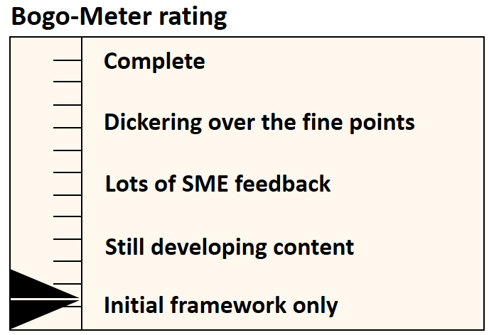

[<< Back](../)

# 1. Introduction

## Table of Contents
* [1.1 Introduction](#1.1)
* [1.2 Heading](#1.2)
* [1.3 Heading](#1.3)

## 1.1 Introduction

The founding members of Common NFVI Telco Taskforce were AT&T, Vodafone, Verizon, Deutsche Telecom, Orange, and China Mobile. The proposed Common NFVi Telco Taskforce (CNTT) structure was undertaken by a few of the founding member companies to address our ability to scale, garner momentum, and plan for the future of CNTT as outlined in our 3rd Technical Workshop in Antwerp, Belgium in September 2019. 

At the time of publication, the intent of this proposed structure was to provide opportunities for new community members to self-nominate into leadership roles as well as establish several parallel work streams to achieve scale and other goals outlined in Antwerp. We agree that the proposed CNTT structure lacked the supporting detail that some individuals rightfully pointed out in response to the structure. 

This document includes all comments to date, as of October 11, 2019 @ 1900 UTC, plus a summary response for the following categories: 
* Organizational Structure and Works Streams
* Governance, Technical, Work Stream Nomination and Selection
* Voting and Approval, and 
* Relationship to GSMA and LFN

This response was developed by the current Governance and Technical Steering Committee leads from AT&T, Orange, Telstra, Verizon and Vodafone - along with proposed next steps.

## 1.2 Heading

## 1.3 Heading
