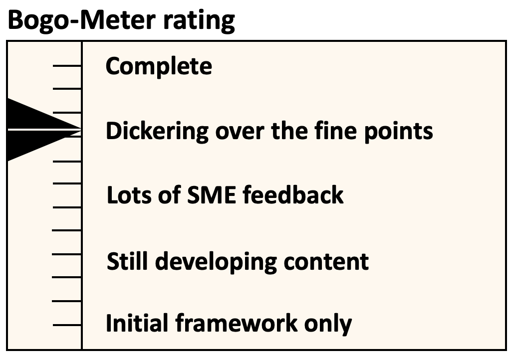

[<< Back](../)

# 1. Introduction

## Table of Contents
* [1.1 Who We Are](#1.1)
* [1.2 Document Purpose](#1.2)
* [1.3 Operational Scope](#1.3)

## 1.1 Who We Are

The founding members of the Cloud iNfrastructure Telco Task Force (Anuket CNTT) were AT&T, Vodafone, Verizon, Deutsche Telekom, Orange, and China Mobile. Soon thereafter, additional telco operator and vendor partner participants began to join the Task Force. Anuket CNTT reached its first major milestone when it gained sponsorship and support of the GSMA and Linux Foundation Networking in Summer 2019. As of June 2020, there were over thirty operators and partners (VNF suppliers, third-party integrators, hw/sw suppliers) in its member commmunity and these numbers continue to grow. Together the Anuket CNTT community is leading the industry in creating a common infrastructure reference platform in the form of reference model and reference architecture definitions to better support Network Function Virtualization (NFV) applications for the Telecom industry as a whole. The working group is collaborating with OPNFV and other open source communities to operationalize and support reference implementations and reference certification platforms. 

In order to establish governing guidelines and procedures by which the Anuket CNTT technical community may operate, the development of this document was undertaken by a Anuket CNTT workstream group and developed under the guidance of the Anuket CNTT Governance Steering Committee. 

## 1.2 Document Purpose

The goal of this document is to assist Anuket CNTT to continue to scale, gain momentum, and plan for the future of Anuket CNTT-- outlined at the September 2019 3rd Technical Workshop held in Antwerp, Belgium. The purpose of this document is to define and detail basic Anuket CNTT community operations and important structures. It provides a reference of the organisation and related work streams, processes, and procedures around which the Anuket CNTT Community is managed; including operational scope, structure, and responsibilities of all groups and individuals associated with Anuket CNTT.  

This document is intended for use by Anuket CNTT's new and existing contributors, participants, associated organisations, and, as an open-source community following the GSMA and LFN Anti-Trust Policies and Creative Commons Licensing, the public at-large.

This document does not define any technical specifications, definitions, requirements, architectures, testing, certifications, or lab platforms. 

## 1.3 Operational Scope

To support the technical mission and goals (link to docs here?), the scope of Anuket CNTT community operations are defined in this document as follows:
 
* Onboarding (Ch. 2)

The Anuket CNTT Onboarding process ensures new members are informed of their obligations, confirms terms of agreement, and provides practical support to get them onboard as fully contributing members of the community.    

* Organizational Structure and Works Streams (Ch. 3)

This area includes the structure of governance and technical co-leadership and support, all participanting work streams and resources, the scope and the methods to manage the creation of deliverables by those work streams. 

* Nomination and Selection (Ch. 4)

Covers the processes for nominating and selecting candidates to be leads and co-leads for governance and technical workstreams, the timeframes of their service, responsibilities, and obiligations.

* Consensus-Based Decision Making (Ch. 5)

The approaches and processes Anuket CNTT contributors shall use to ensure fair representation for key decisions and release approvals. This includes mechanisms on how to manage dissension. 

* Relationship to LFN Projects and GSMA (Ch. 6)

Provides operational guidance for how Anuket CNTT operational structures shall interoperate with GSMA and LFN.

