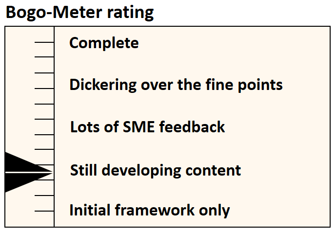

[<< Back](../)

# 1. Introduction

## Table of Contents
* [1.1 Who We Are](#1.1)
* [1.2 Document Purpose](#1.2)
* [1.3 Operational Scope](#1.3)

## 1.1 WHo We Are

The founding members of the Common NFVI Telco Task Force (CNTT) were AT&T, Vodafone, Verizon, Deutsche Telecom, Orange, and China Mobile. Soon thereafter, additional participants began to steadily joined the Task Force. It reached its first major milestone of gaining the sponsorship and support of GSMA and The Linux Foundation- Networking in Summer 2019, and it continues to grow steadily. CNTT now has over thirty network operators and vendor partners (VNF suppliers, third-party integrators, hw/sw suppliers) in its member commmunity and are leading the industry in creating a common Network Function Virtualization Infrastructure in the form of reference model and architecture definitions, as well as reference implementations and certifications. 

The CNTT organizational processes and procedures provided in this document were undertaken by a CNTT working group and developed under the guidnce of the CNTT Governance Steering Committee to address CNTT's ability to scale, garner momentum, and plan for the future of CNTT--as outlined in our 3rd Technical Workshop in Antwerp, Belgium, in September 2019. 

## 1.2 Document Purpose

The purpose of this document is to provide definition of basic CNTT operational structure, processes, procedures, and other supporting details. This document defines the operational scope, structure, and responsibilities of all groups and individuals associated with CNTT. It provides a reference overview of the organizational structure and related work streams and provides processes and procedures around which the CNTT Community will be managed.

This document is intended for use by CNTT Task Force new and existing contributors, participants, other associated organizations, and, as an open-source community following the GSMA and LFN Anti-Trust Policies and Creative Commons Licensing, the public at-large.

This document is not intended to be used to define any the technical specifications, definitions, requirements, testing, certifications, or lab platforms developed by the CNTT Community members. 

## 1.3 Operational Scope
 
* Onboarding (w/brief desc)
* Organizational Structure and Works Streams (w/brief desc)
* Nomination and Selection (w/brief desc)
* Consensus-Based Decision Making (w/brief desc)
* Relationship to LFN Projects and GSMA (w/brief desc)

