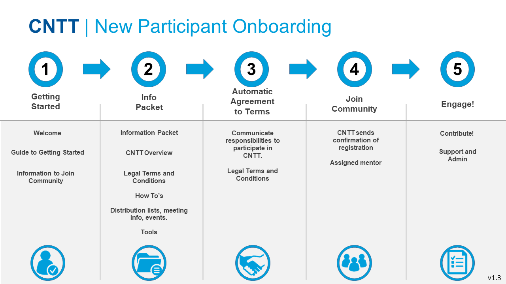

[<< Back](../)

# 2. Onboarding

## Table of Contents
* [2.1 Introduction](#2.1)
* [2.2 Request Membership](#2.2)
* [2.3 Prerequisites](#2.3)
* [2.4 Beginning Engagement](#2.4)
* [2.5 Member Administration](#2.4)

## 2.1 Introduction

As an open-source community organization, CNTT has developed the following process to ensure delivery on CNTT objectives. This process has several goals. First, inform new members of the resources available upon joining the community. Second, communicate the organizational and legal structures upon which the community operates. Help new members become fully engage & contributing effectively to the work streams.

## 2.2 Request Membership

[Welcome Message Here]

- **Guide To Getting Started**

  - **How do I start the process of joining?** Onboarding starts as soon as you submit a request to join CNTT via email to xxxx@xxxxx.com.
  
  - **How long will it take to onboard?** The onboarding process will take approximately X hours of your time initially.
  
  - **What will I learn about during onboarding process?** You’ll get an overview of the CNTT mission and goals, community organizational structures and processes, as well as technology development status and roadmaps. Additionally, you’ll be made aware of participant responsibilities and legal obligations. Finally, you’ll be provided with support and logistical information you’ll need to join the community.

  - **What help will I get throughout the onboarding process?** Once you submit a request to join the Task Force, during the onboarding process members are supported by the CNTT onboarding team members: (resource contact info/emails here) indicated in your “Getting Started” email. Onboarding members are welcomed to reach out for assistance any time during the onboarding process.
  
  - **What happens once I get onboarded?** Once you have reviewed the CNTT onboarding information and have agreed to the perquisite terms and agreements associated with participating and contributing to the Task Force, and you have completed onboarding and now it will be your opportunity to join desired work streams. For an initial period after onboarding, you will be assigned a volunteer mentor from the Task Force to help you get up to speed and contributing quickly.
  
  - **Diagram**

 

## 2.3 Prerequisites

## 2.4 Beginning Engagement

## 2.5 Member Administration
