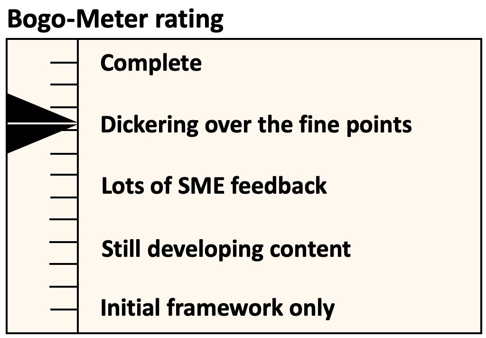
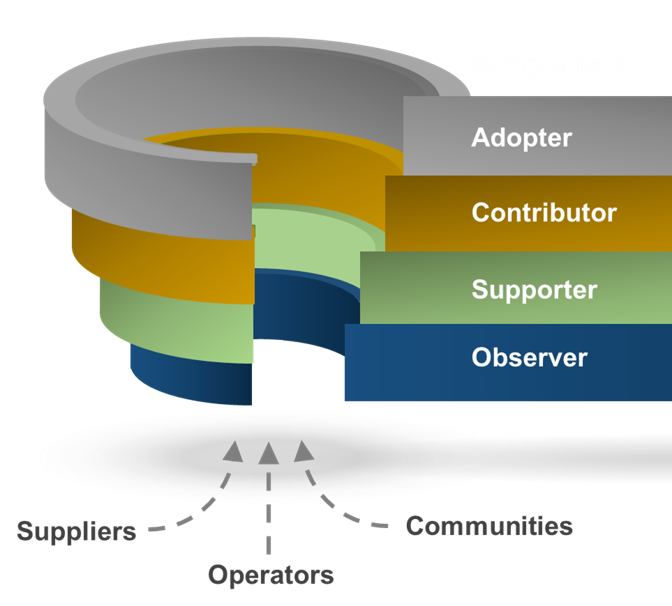

[<< Back](../)

# 2. Onboarding

## Table of Contents
* [2.1 Introduction](#2.1)
* [2.2 Request Participation](#2.2)
* [2.3 Prerequisites](#2.3)
* [2.4 Engagement](#2.4)
* [2.5 New Participant Checklist](#2.5)

## 2.1 Introduction

As an open-source community organization, Anuket CNTT has developed the following process to ensure delivery on the Anuket CNTT objectives. This process has several goals. First, to inform new participants about the background and overview of this open-source initiative. Second, to communicate the organizational and legal structures under which the community operates. And third, to help new participants to quickly become fully engaged in the Anuket CNTT work and to be contributing effectively to the work streams they are interested in.

## 2.2 Request Onboarding Info Packet

[Sample Welcome Message Here] 
Welcome to the Anuket CNTT group –

It is wonderful that you, [Company and person] have decided to join in the effort to make building the infrastructure to support Telecom workloads more robust and standardized. We believe that these efforts will benefit not only the operators, but also the vendors, and ultimately all our customers as well, by hopefully making it easier and simpler to incorporate new technology into our systems.

To get you started, I encourage you to go to our Getting Started page to download a packet of information on how to get engaged at the working level with Anuket CNTT.  We also have materials in the Wiki and Github repositories, so I hope that all this doesn’t overwhelm you.  We are excited that you have decided to become engaged with our community and look forward to your active participation.  

In addition to the many on-line work streams and workstream related on-line meetings, we also have periodic face to face workshops, which we find are invaluable for speeding the delivery of Anuket CNTT’s desired outcomes. More details on upcoming events can be found on the Anuket CNTT wiki. 

Feel free to reach out at any time, I am sure we will be more than happy to answer any questions you might have. Welcome again and looking forward to working with you.

- **Guide To Getting Started**

  - **How do I start the process of becoming a participant?** Onboarding starts as soon as you submit a request to join Anuket CNTT via email to cntt-gov@lists.opnfv.org. You will receive additional information such as links to the Anuket CNTT Getting Started wiki and additional onboarding materials.
  
  - **How long will it take to onboard?** The onboarding process will initially take approximately one hour.
  
  - **What will I learn during the onboarding process?** There will be an overview of the Anuket CNTT mission and goals, community organisational structures and processes, as well as an introduction to the technology development status and roadmaps. Additionally, participant responsibilities and legal obligations with be covered. Finally, you will be introduced to the support and logistical information needed to participate fully in the Anuket CNTT community.

  - **What help will I get during the onboarding process?** Once you submit a request to participate in the Task Force, new members are supported by the Anuket CNTT onboarding team listed in your “Getting Started” email. Any time during the onboarding process, participants are welcome to reach out for any additional assistance.
  
  - **What happens once I get onboarded?** Once you have reviewed the Anuket CNTT onboarding information and agree to the prerequisite terms and agreements associated with participating and contributing to the Task Force, then you have the opportunity to join any of the work streams that you are interested in. For an initial period after onboarding, you will be assigned a volunteer mentor from the Task Force to help you get up to speed quickly.
  
  - **Diagram - Onboarding Process**

<b>Figure 2-1:</b> Onboarding Process

## 2.3 Prerequisites

Anuket CNTT has no formal membership, and nothing to sign. Participation is open to anyone, whether you are an employee of an LFN member company, supporter, or observer. By participating, you do automatically accept the individual anti-trust policies of LFN and GSMA, the joint Terms of Reference of LFN and GSMA the LFN Code of Conduct, as well as the LFN Trademark policy. 

- **LFN Anti-Trust Policy** 
  - https://r.lfnetworking.org/Antitrust%20Slide.pdf

- **GSMA Anti-Trust Policy** 
  - https://raw.githubusercontent.com/cntt-n/Anuket CNTT/master/Anti-Trust_Notice_GSMA_20190911.png

- **Anuket CNTT Terms of Reference (ToR) LFN | GSMA** 
  - https://wiki.lfnetworking.org/display/LN/Terms+of+Reference?src=contextnavpagetreemode

  - Note: If you work for someone other than yourself (self-employed), then you must ensure that your employer also agrees to the ToR before participating.

- **Code of Conduct LFN** 
  - https://lfprojects.org/policies/code-of-conduct/

- **Trademark Policy** 
  - https://lfprojects.org/policies/trademark-policy/

## 2.4 Community Engagement

In order to deliver on Anuket CNTT objectives, community participants are expected to be fully engaged and contribute to the work streams. Engagement includes support, contributions, adoption of artifacts, issue ownership and resolution. 

- **Participating in Anuket CNTT**

  - **Diagram - Levels of Engagement**

<b>Figure 2-2:</b> Levels of Engagement

## 2.5 New Participant Checklist

- Recommended checklist participants should complete to join the Anuket CNTT community. Links to assist in this process can be found in the Anuket CNTT Information Packet.
  - Review the Anuket CNTT Information Packet
  - Review all legal policies, terms, and conditions
  - Signup for an LFN ID
  - Signup for a GitHub ID
  - Signup for workstream participation
  - Schedule attending workstream(s), Governance Steering, and or Technology Steering meeting(s)
  - Start engaging!
