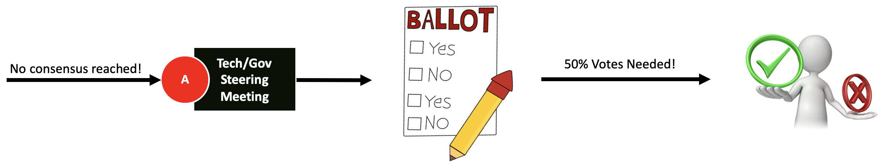

[<< Back](../)

# 5. Concensus-based Decision Making

## Table of Contents
* [5.1 Introduction](#5.1)
* [5.2 Voting representatives](#5.2)
* [5.3 Voting Process](#5.3)

## 5.1 Introduction

Consensus decision making  model has been adopted by Anuket, as community buy in from all member organisations is essential for the success of the Anuket workgroup. 

In situations where consensus cannot be reached, reasonable efforts shall be made to identify and address the core root causes of the disagreements. If, in spite of these efforts, an agreement cannot be reached, the voting process, described below in Section 5.3, shall be used to resolve the issue.

## 5.2 Voting representatives

Each Anuket member organisation shall nominate a single voting representative. A list of voting representatives shall be maintained within Anuket1.

Being on the voting representative list **doesn't** mean the right to vote. The following criteria2, 3 shall be used to identify eligible voting representatives prior to a voting event. To be eligible, the voting representative’s organization must have had people from their organization (or directly associated with them2) collectively satisfy the conditions below:

1. to have physically attended or materially participated in at least **one** F2F or virtual workshop in the 6 months period prior to the voting event;
1. to have attended at least **five** Anuket meetings in the 3 months period prior to the voting event;
1. to have had at least **two** Issues on GitHub assigned to them that resulted in the issues being resolved in the 3 months period prior to the voting event;
1. to have created at least **two** Pull Requests on GitHub in the 3 months period prior to the voting event.
    - Pull Requests created must contain meaningful commits (not minor).
1. to have created at least **two** reviews on Pull Requests on GitHub in the 3 months period prior to the voting event where a review on a PR is either an approval, a request for change, or a comment.

1)https://github.com/cntt-n/Anuket/wiki/Voting-Representatives

2)Prior to the comencement of the vote for a given issue, the criteria will be checked and the voting representative list will be updated.

3) Individuals who don't represent an organisation will not have voting rights.

## 5.3 Voting Process
 
 In scenarios where consensus cannot be reached, a voting event will be triggered by Technical/Governance Steering Leads (depending on whether the event corresponds to a technical or governance matter). 

 When a voting event is triggered, an online voting mechanism will be used and the following process will be followed:
 
 - The time and deadline before which the voting representatives are required to cast their vote will be determined by the leads themselves.
 - The question will be created by the leads, preferably with a simple, clear choice between two options (**A|B**)).
 - The vote result will be announced by the leads after the voting deadline.
 - More than **50%** of the valid votes are needed for a decision to be made (Between **A | B**).

<b>Figure 5-1:</b> Voting Process

