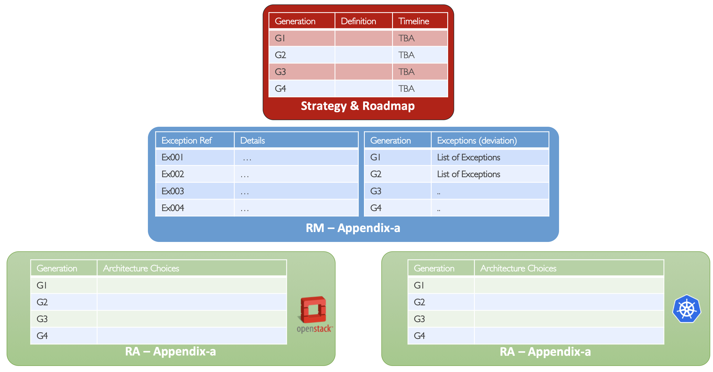
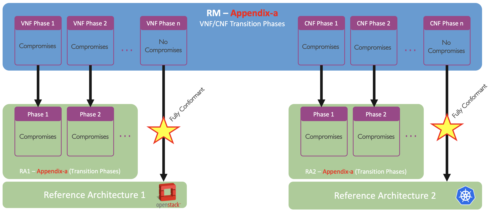

[<< Back](../)

# 8. Recruiting, Engagement, & Adoption

## Table of Contents
* [8.1 Overview](#8.1)
* [8.2 Recruiting](#8.2)
* [8.3 Engagement](#8.3)
* [8.4 Adoption](#8.4)
  * [8.4.1 Adoption Strategy](#8.4.1)
  * [8.4.2 VNF Evolution Generations](#8.4.2)
  * [8.4.3 CNF Evolution Generations](#8.4.3)
* [8.5 Roadmap](#8.5)
  * [8.5.1 CNTT Roadmap](#8.5.1)
  * [8.5.2 VNF Adoption Roadmap](#8.5.2)
  * [8.5.3 CNF Adoption Roadmap](#8.5.3)
  * [8.5.4 Infrastructure Adoption Roadmap](#8.5.4)

## 8.1 Overview

## 8.2 Recruiting

## 8.3 Engagement

## 8.4 Adoption

### 8.4.1 Adoption Strategy

It is vitally important for CNTT to have working NFVI solutions from NFVI vendors and mature VNFs/CNFs designs from application vendors that is compliant to CNTT specifications. It is also understood that, in some areas, the industry might not have solutions that are fully aligned with CNTT requirements. Therefore, an evolution or transitional strategy, comprised of one or more compromises/Exceptions and/or transitions is required to address technology that does not presently conform to CNTT mandates, and hence requires explicit direction to prescribe how the situation will be treated in the present, as well as in the future. 

This strategy will inform application designers how RC and ultimately OVP will react when encountering such technologies during the qualification process, including flagging warnings and potentially errors which could prevent issuance of an OVP badge.

The Adoption Strategy has the following elements (as shown in **Figure 3** below):
- **VNF/CNF Evolution Generations**: Defines the evolution metric from Non-Conformant to Fully Conformant.
- **Exceptions/Compromises List**: Those are explicitly defined by CNTT for each Generation. 
- **Dates (Time Points)**: The dates of which the current evolution generation is expected to finish (moving to the next generation)

<b>Figure 3:</b> Transitional Plans Elements within CNTT

As Technology evolves and the infrastructure evolves with it, Less and less of exceptions/compromises will be needed and hence the Generation of VNFs/CNFs is expected to evolve with it until VNFs/CNFs are completely compliant to CNTT as shown in **Figure 4** below. 

<b>Figure 4:</b> Transitional Plans and evolution Generations within CNTT

### 8.4.2 VNF Evolution Generations

**Non-Conformant**: Big deviation from CNTT direction.

**Gen1** (Consistent): Going to the right direction but still lots of work to do.

**Gen2** (Compliant): Using current-state technology exceptions and may also have permitted technology version exceptions.

**Gen3** (Conformant): Using current-state technology exceptions but not permitted technology version exceptions.

**Gen4** (Fully Conformant): No exceptions at all.

### 8.4.3 CNF Evolution Generations

**Non-Conformant**: Big deviation from CNTT direction.

**Gen1** (Consistent): Going to the right direction but still lots of work to do.

**Gen2** (Compliant): Using current-state technology exceptions and may also have permitted technology version exceptions.

**Gen3** (Conformant): Using current-state technology exceptions but not permitted technology version exceptions.

**Gen4** (Fully Conformant): No exceptions at all.

### 8.5 Roadmap

#### 8.5.1 CNTT Roadmap

#### 8.5.2 VNF Adoption Roadmap

| Generation | Details | Date | Notes |
|------------|----------------|------------|-------|
| Gen1 | As per Technical Specification |  |  |
| Gen2 | As per Technical Specification |  |  |
| Gen3 | As per Technical Specification |  |  |
| Gen4 | As per Technical Specification |  |  |

#### 8.5.3 CNF Adoption Roadmap

| Generation | Details | Date | Notes |
|------------|----------------|------------|-------|
| Gen1 | As per Technical Specification |  |  |
| Gen2 | As per Technical Specification |  |  |
| Gen3 | As per Technical Specification |  |  |
| Gen4 | As per Technical Specification |  |  |

#### 8.5.4 Infrastructure Adoption Roadmap

To be figured out.