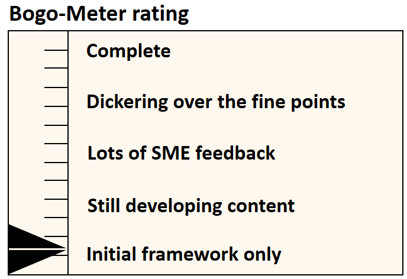

[<< Back](../)

# 8. Recruiting & Engagement

## Table of Contents
* [8.1 Introduction](#8.1)
* [8.2 Recruiting](#8.2)
* [8.3 Engagement](#8.3)
  * [8.3.1 Contribution Metrics](#8.3)

## 8.1 Introduction

## 8.2 Recruiting

## 8.3 Engagement

## 8.3.1 Contribution Metrics

| Metric Category | Metric Ref | Definition                                      | Per Individual or Company |
|-----------------|------------|-------------------------------------------------|---------------------------|
| A (Functest)    | A.1        | Number of Lines added & Number of Lines Removed | Individual                |
|                 | A.2        | Number of Lines Reviews Submitted.              | Individual                |
|                 | A.3        | .. (Others)                                     | Individual                |
| B (Airship )    | B.1        | Number of Lines added & Number of Lines Removed | Individual                |
|                 | B.2        | Number of Lines Reviews Submitted.              | Individual                |
|                 | B.3        | .. (Others)                                     | Individual                |
| C (CIRV)        | C.1        | Number of Lines added & Number of Lines Removed | Individual                |
|                 | C.2        | Number of Lines Reviews Submitted.              | Individual                |
|                 | C.3        | .. (Others)                                     | Individual                |
| D (Releng)      | D.1        | Number of Lines added & Number of Lines Removed | Individual                |
|                 | D.2        | Number of Lines Reviews Submitted.              | Individual                |
|                 | D.3        | .. (Others)                                     | Individual                |
| E (Spec)        | E.1        | Number of Lines added & Number of Lines Removed | Both                      |
|                 | E.2        | Number of PRs Created.                          | Both                      |
|                 | E.3        | Number of Reviews Created                       | Both                      |
|                 | E.4        | Number of Comments Made                         | Both                      |

