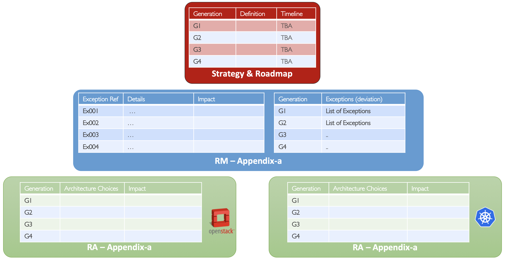

[<< Back](../)

# 9. Adoption

## Table of Contents
* [8.1 Overview](#8.1)
* [8.2 Transitional Plan](#8.2)
  * [8.2.1 Rationale](#8.2.1)
  * [8.2.2 VNF Evolution Generations](#8.2.2)
  * [8.2.3 CNF Evolution Generations](#8.2.3)
  * [8.2.4 Policies](#8.2.4)
* [8.3 Adoption Strategy](#8.3)
* [8.4 Adoption Roadmap](#8.4)
  * [8.4.1 CNTT Roadmap](#8.4.1)
  * [8.4.2 VNF Adoption Roadmap](#8.4.2)
  * [8.4.3 CNF Adoption Roadmap](#8.4.3)
  * [8.4.4 Infrastructure Adoption Roadmap](#8.4.4)
  * [8.4.5 Operator's Adoption Roadmap](#8.4.5)

## 8.1 Overview

## 8.2 Transitional Plan

### 8.2.1 Rationale

It is vitally important for CNTT to have working NFVI solutions from NFVI vendors and mature VNFs/CNFs designs from application vendors that is compliant to CNTT specifications. It is also understood that, in some areas, the industry might not have solutions that are fully aligned with CNTT requirements. Therefore, an evolution or transitional strategy, comprised of one or more exceptions and/or transitions is required to address technology that does not presently conform to CNTT mandates, and hence requires explicit direction to prescribe how the situation will be treated in the present, as well as in the future. 

This transition plan will inform application designers how RC and ultimately OVP will react when encountering such technologies during the qualification process, including flagging warnings and potentially errors which could prevent issuance of an OVP badge.

The transitional plan has the following elements (as shown in **Figure 3** below):
- **VNF/CNF Evolution Generations**: Defines the evolution metric from Non-Conformant to Fully Conformant.
- **Exceptions List**: Those are explicitly defined by CNTT for each Generation. 
- **Dates (Time Points)**: The dates of which the current evolution generation is expected to finish (moving to the next generation)

<b>Figure 3:</b> Transitional Plans Elements within CNTT

As Technology evolves and the infrastructure evolves with it, less and less of exceptions will be needed and hence the Generation of VNFs/CNFs is expected to evolve with it until VNFs/CNFs are completely compliant to CNTT as shown in **Figure 4** below. 

<b>Figure 4:</b> Transitional Plans and evolution Generations within CNTT

### 8.2.2 VNF Evolution Generations

**Non-Conformant**: Big deviation from CNTT direction.

**Gen1** (Consistent): Going to the right direction but still lots of work to do.

**Gen2** (Compliant): Using current-state technology exceptions and may also have permitted technology version exceptions.

**Gen3** (Conformant): Using current-state technology exceptions but not permitted technology version exceptions.

**Gen4** (Fully Conformant): No exceptions at all.

### 8.2.3 CNF Evolution Generations

**Non-Conformant**: Big deviation from CNTT direction.

**Gen1** (Consistent): Going to the right direction but still lots of work to do.

**Gen2** (Compliant): Using current-state technology exceptions and may also have permitted technology version exceptions.

**Gen3** (Conformant): Using current-state technology exceptions but not permitted technology version exceptions.

**Gen4** (Fully Conformant): No exceptions at all.

### 8.2.4 Polices

- At any present Time Point (TP) which is within the date range of a given generation, VNFs/CNFs taking advantage of an exception **that is allowed** for that generation will PASS OVP qualification but with a clear **WARNING** indicating the functionality/feature will be deprecated in future generations.
- At any present Time Point (TP) which is within the date range of a given generation, VNFs/CNFs taking advantage of an exception **that is NOT allowed** for that generation will FAIL OVP qualification and get an **ERROR** indicating the functionality is prohibited.
- It is up to **each operator** to introduce a policy to weather to allow VNFs/CNFs with an outdated Generation to be on-boarded into their network or not.
- VNF/CNF Generation support by MANO is **out of scope** of CNTT.
  - VNF/CNF Generations are temporary phases and should be managed solely by receiving operators based on their internal policies.

## 8.3 Adoption Strategy
- Adoption strategy for operators.

### 8.4 Roadmap

#### 8.4.1 CNTT Roadmap

#### 8.4.2 VNF Adoption Roadmap

| Generation | Details | Date | Notes |
|------------|----------------|------------|-------|
| Gen1 | As per Technical Specification |  |  |
| Gen2 | As per Technical Specification |  |  |
| Gen3 | As per Technical Specification |  |  |
| Gen4 | As per Technical Specification |  |  |

#### 8.4.3 CNF Adoption Roadmap

| Generation | Details | Date | Notes |
|------------|----------------|------------|-------|
| Gen1 | As per Technical Specification |  |  |
| Gen2 | As per Technical Specification |  |  |
| Gen3 | As per Technical Specification |  |  |
| Gen4 | As per Technical Specification |  |  |

#### 8.4.4 Infrastructure Adoption Roadmap

To be figured out.

#### 8.4.5 Operators Adoption Roadmap

To be figured out.
