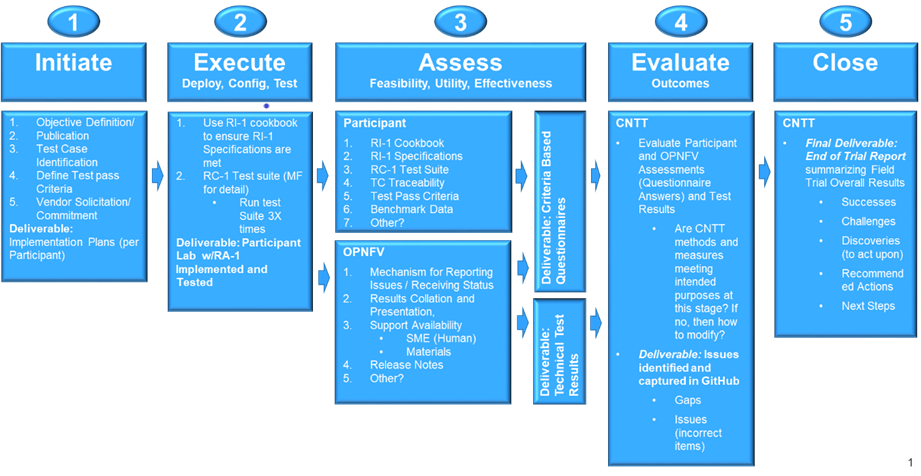

# 9. Adoption

## Table of Contents
* [9.1 Introduction](#9.1)
* [9.2 Transition Plan](#9.2)
  * [9.2.1 Conformance Levels](#9.2.1)
  * [9.2.2 Exception Types](#9.2.2)
  * [9.2.3 Transition Framework](#9.2.3)
* [9.3 Adoption Strategy](#9.3)
  * [9.3.1 Expectations from Operators](#9.3.1)
  * [9.3.2 Expectations from Vendors](#9.3.2)
  * [9.3.3 Expectations from Industry](#9.3.3)
* [9.4 Adoption Roadmaps](#9.4)
* [9.5 CNTT Field Trial Approach] (#9.5) 

## 9.1 Introduction

It is vitally important for CNTT to have working solution from infrastructure vendors and mature VNFs/CNFs designs from application vendors that is compliant to CNTT specifications. It is also understood that, in some areas, the industry might not have solutions that are fully aligned with CNTT requirements. 

Therefore, a transition plan, an adoption strategy, and adoption Roadmap is needed to be agreed on within the CNTT community. This document explains those elements in details. 

## 9.2 Transition Plan

A Transition plan comprised of one or more exceptions and/or transitions is required to address technology that does not presently conform to CNTT mandates, and hence requires explicit direction to prescribe how the situation will be treated in the present, as well as in the future.

The transition plan described here will inform application designers how RC and ultimately industry certification programs will react when encountering exceptions during the qualification process, including flagging warnings and potentially errors which could prevent issuance of a certification badge.

### 9.2.1 Conformance Levels

- **Fully Conformant**: VNFs/CNFs or NFVI are written and designed to be fully conformant to CNTT specification with no use of any of the allowed Exceptions.
- **Conformant with Exceptions**: VNFs/CNFs or NFVI are written and designed to be conformant to CNTT with one or more of the allowed Exceptions used.

### 9.2.2 Exception Types

- **Technology Exceptions** : Using specific technologies that are considered non conformant to CNTT principles (such as PCIe Direct Assignment, exposure of hardware features to VNFs/CNFs).
- **Version Exceptions**: Using Versions of  Software components, , APIs, or Hardware that are different from the one specified in the specification.

### 9.2.3 Transition Framework

#### VNF/CNF Transition Plan Framework 

Exceptions will be clearly recorded in the appropriate specification Appendix which will act as a guidance to VNFs/CNFs vendors of what Exceptions will be allowed in each CNTT release. **Figure 1** below demonstrate the concept.

- As technology matures, fewer and fewer Exceptions will be allowed in CNTT releases.
- For each CNTT Release, VNF/CNF can be either:
  - **Fully Conformant**: No Exception used.
  - **Conformant with Exception**: One or More of the allowed Exceptions in RM has been used.  

<b>Figure 1:</b> Transition Plan for VNFs/CNFs within CNTT

#### NFVI Transition Plan Framework 

Exceptions will be clearly recorded in Reference Architectures' Appendices which will act as a guidance to NFVI vendors of what Exceptions will be allowed in each CNTT release. **Figure 2** below demonstrate the concept.

- As technology matures, fewer and fewer Exceptions will be allowed in CNTT releases.
- For each CNTT Release, VNF/CNF can be either:
  - **Fully Conformant**: Support the Target Reference Architecture without any exceptions. There should be a technology choice in RA to support RM Exceptions (However, none of the Exceptions allowed in RA has been used).
  - **Conformant with Exceptions**: One or more of the allowed exceptions in RA are used.

<b>Figure 2:</b> Transition Plan for NFVI solutions within CNTT

## 9.3 Adoption Strategy

### 9.3.1 Expectations from Operators

### 9.3.2 Expectations from Vendors

### 9.3.3 Expectations from Industry

## 9.4 Adoption Roadmap

## 9.5 CNTT Field Trial Approach

### 9.5.1 Background

The Common NVFI Telco Taskforce (CNTT) is building a set of infrastructure standards to be implemented within telcos to improve cost effectiveness and speed of delivery of Virtual Network Functions. As part of the standards development, the organization has built a Reference Model (RM) on which Reference Implementation (RI) and Reference Conformance (RC) standards have been defined.  For CNTT to ensure value add to Telco industry operators, suppliers, and end user customers, it is running field tests to validate the feasibility, utility, and effectiveness of its methods (RI/RC standards).

### 9.5.2 Purpose of this Document Section

The purpose of this document is to define the goals/outcomes, expectations, and roles necessary to support the CNTT release trials. The document will define/discuss the following:

*	Purpose of field trials
*	Goals/desired outcomes of the field trials
*	Success indicators 
*	Intentions and expectations
*	Action plan
*	Resource requirements
*	Metrics definition

### 9.5.3 Field Trial Purpose

In the truest form, adoption of a standard is an indication of it’s success within an industry. Standards developed must be interactively tested in multiple environments or “trialed” to ensure they are practicable, functional, and operative. Without running trials to validate the CNTT approach, standards may not provide intended value across a sufficient spectrum of participating entities to be widely adopted. 

#### 9.5.3.1 Intents

1)	This is a partnership approach to validate CNTT community is adopting a consistent approach
2)	Validate RI-1 specifications and RC-1 test suite, not VNFs or NFVI’s in the trial

#### 9.5.3.2 Key Expectations and Assumptions

1)	Expectation is through healthy feedback from suppliers, CNTT will exit the trial with either validation of RI-1 and RC-1 or a set of actions to close gaps.
2)	Expectation: Post trial and gap closure, the community will define a badging process that is mutually beneficial to operators and suppliers. 
3)	Assumption: Performance testing is not in field trial

### 9.5.4 Overview: Stages of Field Trial

The following diagram the key components and flow of activities, actions, and deliverables to be undertaken during the trial. Details of each component are provided in this document.

<b>Figure 3:</b> Field Trial Approach

#### Success Indicators

1) Agreement secured on the use of trials results data, including:
a.	Detail level of data required to validate
b.	Acceptable data values indicating valid results
c.	Detail level of data that will be published

2) RI-1 Labs are successfully stood up in all target environments
a.	Vendor (3rd party)
b.	Community (OPNFV)
c.	LaaS (e.g. UNH)

3) Engaged NVFI vendors successfully configure their infrastructure per RI-1 and run the RC-1 test suite and are able to provide expert feedback

4) Engaged VNF vendors are able to validate that they can instantiate and run rudimentary validation of VNF functionality on more than one conformant NVFI

### 9.5.5 Initiation 

#### 9.5.5.1 Objectives of RI-1/RC-1 Trials

The following list defines the desired outcomes/goals for the RI-1/RC-1 trails:

1)	Verified/Validated RI-1 and RC-1 standards and methods (latest release)
 * RI-1 Cookbook 
 * RI-1 Specifications
 * RC-1 Test Suite 
 * TC Traceability
 * Test Pass Criteria
 * Benchmark Data
 * Other?
2)	Feedback from trial participants (suppliers/operators) in CNTT (Need to ID type of feedback)
3)	Defined solutions to issues and gaps found in RI-1 and RC-1
4)	Make enhancements to future releases accordingly.

#### 9.5.5.2 Publication and Dissemination of Information

CNTT will work very closely with field trial partners (NFVI vendors, VNF vendors, or system integrators) and agree on labs that will be used for the trial. CNTT will take all necessary measures to protect the intellectual property rights (IP rights) for all partners involved in those trials. All Reports and findings will be vetted carefully and only published after being approved by all parties concerned. No test results or records will be kept in any public records.

For information that is acceptable for publishing, the development activities, test cases, project plans, and results of field trials will be captured, tracked and managed. The targeted repositories for this information are:

*	CNTT GitHub
  **	GitHub Code
  **	GitHub Projects
  **	GitHub Issues
*	OPNFV 
  **	(Where?)

#### 9.5.5.3 Test Case Identification

Specific test cases consistent with the defined objectives and outcomes will be documented (where?). The test cases will be designed to validate/verify the standards and methods identified in the objectives section of this document. Community members will collaboratively develop/approve the test cases. 

#### 9.5.5.4 Develop Test Pass Criteria/Acceptable Use of Results Data

Community members will define the measurement criteria that will denote pass vs fail for each test case. To support operators and suppliers consistent with the charter of the organization an Agreement Secured on the use of trials results data, including:

*	Detail level of data required to validate
* Acceptable data values indicating valid results
* Detail level of data that will be published

#### 9.5.5.5Vendor Solicitation/Commitment

NFVI and VNF vendor members will be solicited for participation in the trials. The Vendors will be required to commit fully to the trials process and be expected to establish labs as necessary. Additional discussion is need to define what results data and at what level is acceptable to be shared.

#### 9.5.5.6 Deliverable

The Initiate Field Trial Stage will deliver execution and assessment Plans (per Participant), including: 

* A high-level check list of the tasks each participant will need to complete shall be provided.  
* The plan will contain all the key milestones and activities the participants will expected to perform. 

### 9.5.6" Execution 

The Execute Stage is where the participants implement the field trials tasks and then assess the outcomes.  It is anticipated that CNTT will assemble the Trials team to fully develop the action plan including resource assignments materials requirements and timelines. Activities include the deployment and configuration of RI-1 and execution of the RC-1 test cases. The Vendors community members that commit to the trials will build/setup/prep labs for the trials per the instructions:

1.	Trial Prep
2.	Use RI-1 cookbook to ensure RI-1 Specifications are met 
3.	RC-1 Test suite (MF for detail)
   a.	Run test Suite 3X times (Iterations
   b.	For each iteration/test case:   
      *	Vendor RC-1 test results are documented. Vendor provide feedback to CNTT
      * OPNVF RC-1 test results are documented. OPNFV provides feedback to CNTT
      *	Community shall review Issues/Gaps during the evaluate stage
       **	Acceptance of Issues/Gaps – modification of RI/RC approval
       **	Non-Acceptance of Issues/Gaps – Documentation of condition
4.	RC-1 Changes implement in Lab(s) 

#### 9.5.6.1 Resources and Roles

CNTT will staff the plan by soliciting volunteers from the participants. The list below is suggested list of roles to be staffed:

*	Overall Project Lead
*	Overall CNTT decision making leads 
*	Vendor lead from each supplier
*	SME(s) for RC1 supporting suppliers
*	SME(s) for RI1 supporting suppliers
*	OPNVF lead for RI1/RC1
*	Other support roles such as Governance, technical writers, etc.

The participants that volunteer for the roles will be expected to provide the appropriate level of time to support the trials initiative.

#### 9.5.6.2 Deliverables

The deliverables of the execute stage will be Implemented Participant RA-1 Labs which have been tested. An agreed upon data set of the outcomes will be provided to CNTT.

### 9.5.7 Assessment

The Assess stage shall utilize data collected during the execute stage. Participants will assess their experience using the methods used by CNTT accordingly to quantitatively and or qualitatively measure:

Required 
1.	RI-1 Cookbook 
2.	RI-1 Specifications
3.	RC-1 Test Suite 
4.	TC Traceability
5.	Test Pass Criteria
6.	Benchmark Data
7.	Other?

Optional (Pre-Launch Trials only)
8.	VNF Instantiation
   1.	Smoke test the level of verification and validation
   2.	Non-functional
   3.	Stand up with only key operations working

OPNFV will also assess their experience of the methods used by CNTT to assess the following operational areas:
1.	Mechanism for Reporting Issues / Receiving Status
2.	Results Collation and Presentation, 
3.	Support Availability
   *	SME (Human)
   *	Materials 
4.	Release Notes
5.	Other?

#### 9.5.7.1 Measuring Outcomes

Trial outcomes shall be organized based on the following:

1)	Categorization
   a.	Method (see list in Initiation)
   b.	Aspect: Functional and non-functional aspects (the ‘what’)
   c.	Execution Stage (the ‘when’)
      i.	Deploy
     ii.	Config
    iii.	Testing
     iv.	Decommission (removal from infrastructure)
   d.	Criteria 
      i.	Feasibility
         1.	How easily or conveniently is something executed.
     ii.	Utility
         1.	How useful or beneficial to the intent.
    iii.	Effectiveness 
         1.	How successful in producing the desired result.
   e. Examples
     i.	RI-1 Specification: Feasibility
         1.	Is the RI-1 spec consistent with its intended purpose?
         2.	Does it provide sufficient details?
         3.	Are there recommendations to modify and or enhance?
         4.	Other?
    ii.	RI-1 Cookbook: Utility and Effectiveness during RI-1 deployment
         1.	Were the right competencies identified to deploy?
         2.	Were there major issues that arose (that would be of interest to all)?
         3.	Other?
   iii.	RI-1 Cookbook: Utility and Effectiveness after deployment and configuration completed
         1.	Any unintended or anticipated outcomes or side effects of the implementation?
         2.	Did implementation result in acceptable results (need to define 'acceptable results')
         3.	Were the resources used to implement consistent with those identified up front?
         4.	Time, cost, people, materials?
         5.	Other?
2)	Data Capture
   a.	Qualitative information captured via Questionnaire
      i.	Participant and OPNFV feedback and gap identification shall be captured via Questionnaires provided to them during the Assessment stage of the Field Trial
   b.	Quantitative information shall be captured by test systems and collated by Participant and or OPNFV. Such as,
      i.	Results from 3 RC-1 Test cycles
     ii.	Other

#### 9.5.7.1 Deliverables

*	Completed Questionnaires (Participant and OPNFV)
   **	Participants and OPNFV shall be asked to provide answers to a criteria based questionnaire.
    ** Insert link to table of participant questions here 
    ** Insert link table of OPNFV questions here 
*	Technical Test Report (OPNFV)
   ** OPNFV shall compile/provide a detailed Technical Test Results report to be shared with appropriate parties.

### 9.5.8 Evaluation

Proving the ‘right’ value to the operator and vendor community is ultimately what will ensure adoption of CNTT standards. These field trials are intended to verify and validate the standards methods developed by CNTT so that adjustments can be made to ensure the ‘right’ value is being delivered. 

CNTT shall track and manage the assessment feedback provided through the Questionnaire and in the Technical Test Results report, as provided by the Participants and OPNFV teams. Then it shall analyze all Assessments and Test Results to evaluate:
   1)	Whether CNTT methods and measures are meeting intended purposes?
      a.	If a method or measure is not meeting its intended purpose, it shall be identified as a gap or an issue for resolution.
   2)	What adjustments or adaptations shall be made to CNTT’s methods?

Reports, Tools, and repositories shall be identified and managed to capture all assessment questionnaires, and technical testing artifacts.

#### 9.5.8.1 Deliverables

*	Issues and Gaps (CNTT)
  **	All identified gaps and issues shall be captured in the CNTT GitHub repository.
   

### 9.5.9 Close

To close out the Field Trial, CNTT shall summarize its evaluation of the Field Trial and actions to be taken to address any adaption needed.

#### 9.5.9.1 Final Deliverable - End-of-Trial Report

Upon completion of field trials, CNTT shall develop an End of Trial Report which summarizes the overall conclusions based on the evaluation, to include:
   *	Successes
    ** What went activities well generally or specifically? How did it compare to the past or alternative results?   
   * Challenges
    ** What didn’t go well overall? What impact could these challenges have to adoption?
   *	Discoveries
    **	What are key discoveries/strategic learnings about any CNTT approaches or methods? Other?
   *	Decisions and Recommendations
     ** Identification of key decisions made and list of what corrective actions shall be taken? What to enhance, maintain, or discontinue?
   *	Next Steps
    ** Indication of proposed steps and activities to be undertaken by the community
