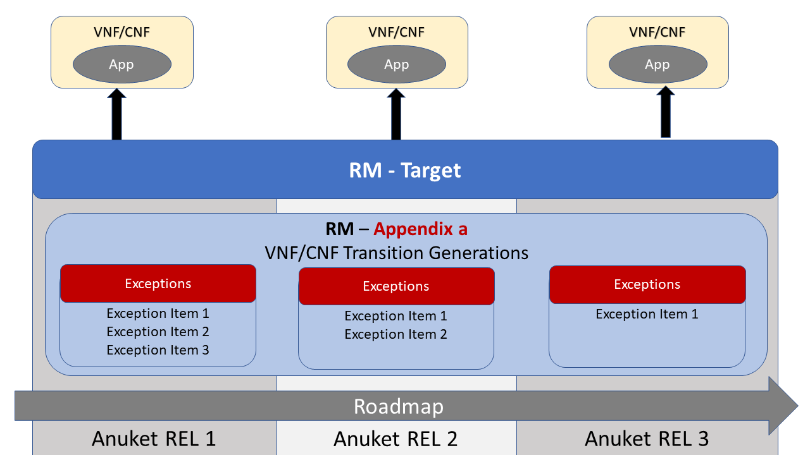
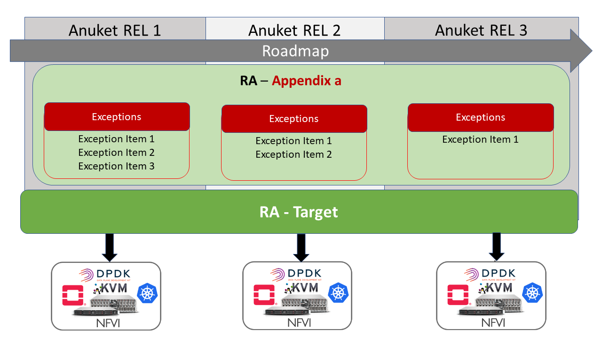

# 9. Adoption

## Table of Contents
* [9.1 Introduction](#9.1)
* [9.2 Transition Plan](#9.2)
  * [9.2.1 Conformance Levels](#9.2.1)
  * [9.2.2 Exception Types](#9.2.2)
  * [9.2.3 Transition Framework](#9.2.3)
* [9.3 Adoption Strategy](#9.3)
  * [9.3.1 Expectations from Operators](#9.3.1)
  * [9.3.2 Expectations from Vendors](#9.3.2)
  * [9.3.3 Expectations from Industry](#9.3.3)
* [9.4 Adoption Roadmaps](#9.4)

## 9.1 Introduction

It is vitally important for CNTT to have working solution from infrastructure vendors and mature VNFs/CNFs designs from application vendors that is compliant to CNTT specifications. It is also understood that, in some areas, the industry might not have solutions that are fully aligned with CNTT requirements. 

Therefore, a transition plan, an adoption strategy, and adoption Roadmap is needed to be agreed on within the CNTT community. This document explains those elements in details. 

## 9.2 Transition Plan

A Transition plan comprised of one or more exceptions and/or transitions is required to address technology that does not presently conform to CNTT mandates, and hence requires explicit direction to prescribe how the situation will be treated in the present, as well as in the future.

The transition plan described here will inform application designers how RC and ultimately industry certification programs will react when encountering exceptions during the qualification process, including flagging warnings and potentially errors which could prevent issuance of a certification badge.

### 9.2.1 Conformance Levels

- **Fully Conformant**: VNFs/CNFs or NFVI are written and designed to be fully conformant to CNTT specification with no use of any of the allowed Exceptions.
- **Conformant with Exceptions**: VNFs/CNFs or NFVI are written and designed to be conformant to CNTT with one or more of the allowed Exceptions used.

### 9.2.2 Exception Types

- **Technology Exceptions** : Using specific technologies that are considered non conformant to CNTT principles (such as PCIe Direct Assignment, exposure of hardware features to VNFs/CNFs).
- **Version Exceptions**: Using Versions of  Software components, , APIs, or Hardware that are different from the one specified in the specification.

### 9.2.3 Transition Framework

#### VNF/CNF Transition Plan Framework 

Exceptions will be clearly recorded in the appropriate specification Appendix which will act as a guidance to VNFs/CNFs vendors of what Exceptions will be allowed in each CNTT release. **Figure 1** below demonstrate the concept.

- As technology matures, fewer and fewer Exceptions will be allowed in CNTT releases.
- For each CNTT Release, VNF/CNF can be either:
  - **Fully Conformant**: No Exception used.
  - **Conformant with Exception**: One or More of the allowed Exceptions in RM has been used.  

<b>Figure 1:</b> Transition Plan for VNFs/CNFs within CNTT

#### NFVI Transition Plan Framework 

Exceptions will be clearly recorded in Reference Architectures' Appendices which will act as a guidance to NFVI vendors of what Exceptions will be allowed in each CNTT release. **Figure 2** below demonstrate the concept.

- As technology matures, fewer and fewer Exceptions will be allowed in CNTT releases.
- For each CNTT Release, VNF/CNF can be either:
  - **Fully Conformant**: Support the Target Reference Architecture without any exceptions. There should be a technology choice in RA to support RM Exceptions (However, none of the Exceptions allowed in RA has been used).
  - **Conformant with Exceptions**: One or more of the allowed exceptions in RA are used.

<b>Figure 2:</b> Transition Plan for NFVI solutions within CNTT

## 9.3 Adoption Strategy

### 9.3.1 Expectations from Operators

### 9.3.2 Expectations from Vendors

### 9.3.3 Expectations from Industry

## 9.4 Adoption Roadmap

## 9.5 CNTT Field Trial Approach

### Background

The Common NVFI Telco Taskforce (CNTT) is building a set of infrastructure standards to be implemented within telcos to improve cost effectiveness and speed of delivery of Virtual Network Functions. As part of the standards development, the organization has built a Reference Model (RM) on which Reference Implementation (RI) and Reference Conformance (RC) standards have been defined.  For CNTT to ensure value add to Telco industry operators, suppliers, and end user customers, it is running field tests to validate the feasibility, utility, and effectiveness of its methods (RI/RC standards).

### Purpose of this Document Section

The purpose of this document is to define the goals/outcomes, expectations, and roles necessary to support the CNTT release trials. The document will define/discuss the following:

•	Purpose of field trials
•	Goals/desired outcomes of the field trials
•	Success indicators 
•	Intentions and expectations
•	Action plan
•	Resource requirements
•	Metrics definition

### Field Trial Purpose

In the truest form, adoption of a standard is an indication of it’s success within an industry. Standards developed must be interactively tested in multiple environments or “trialed” to ensure they are practicable, functional, and operative. Without running trials to validate the CNTT approach, standards may not provide intended value across a sufficient spectrum of participating entities to be widely adopted. 

#### Intents

1)	This is a partnership approach to validate CNTT community is adopting a consistent approach
2)	Validate RI-1 specifications and RC-1 test suite, not VNFs or NFVI’s in the trial

a name="9.5.2.2"></a>
#### Key Expectations and Assumptions

1)	Expectation is through healthy feedback from suppliers, CNTT will exit the trial with either validation of RI-1 and RC-1 or a set of actions to close gaps.
2)	Expectation: Post trial and gap closure, the community will define a badging process that is mutually beneficial to operators and suppliers. 
3)	Assumption: Performance testing is not in field trial

### Overview: Stages of Field Trial

The following diagram the key components and flow of activities, actions, and deliverables to be undertaken during the trial. Details of each component are provided in this document.

<b>Figure 1:</b> Field Trial Approach

