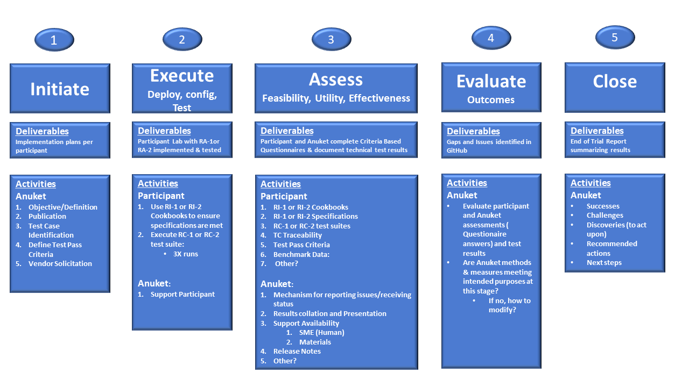

.. _gov-ch9-adoption:

Adoption
========

Introduction
------------

It is vitally important for the success of the Anuket reference specifications mission to have as many working Anuket compliant solutions, including infrastructure and VNF/CNF designs from the vendor community as possible. Obviously, there will be solutions that will not be able to be fully aligned with Anuket reference specifications requirements, however, the intention is to make the Anuket reference architectures and implementations map to the real world so to make compliance attractive to the broader community. Therefore, a transition plan, an adoption strategy, and adoption roadmap needs to be agreed on within the Anuket community. The intention of this document is to detail the strategy for broader adoption in the larger telecom ecosystem.

Background
~~~~~~~~~~

Anuket is developing a set of cloud infrastructure specifications to be implemented within telcos to improve the cost effectiveness and speed of deployment of cloud network functions. As part of the specifications development, the organization has built a Reference Model (RM) on which Reference Implementation (RI) and Reference Conformance (RC) standards have been defined. For Anuket to ensure value add to Telco industry operators, suppliers, and end user customers, it is running field tests to validate the feasibility, utility, and effectiveness of its methods (RI/RC standards).

Field Trial Purpose
~~~~~~~~~~~~~~~~~~~

In the truest form, adoption of a specification is an indication of it’s success within an industry. Specifications developed must be interactively tested in multiple environments or “trialed” to ensure they are practicable, functional, and operative. Without running trials to validate the Anuket reference specifications approach, specifications may not provide intended value across a sufficient spectrum of participating entities to be widely adopted. The intentions of these field trials is as follows:

1. Demostrate the partnership approach to validate Anuket community is adopting a consistent approach
2. Validate the RI1 specifications and RC1 test suite, not VNFs or NFVI’s
3. Validate the RI2 specifications and RC2 test suite, not CNFs or CaaS’s

Purpose of this Document Section
~~~~~~~~~~~~~~~~~~~~~~~~~~~~~~~~

The purpose of this document is to define the goals/outcomes, expectations, and roles necessary to support the Anuket release trials. The document will define/discuss the following:

-  Purpose of field trials
-  Goals/desired outcomes of the field trials
-  Success indicators
-  Intentions and expectations
-  Action plan
-  Resource requirements
-  Metrics definition

Adoption Strategy
-----------------

Expectations from Operators
~~~~~~~~~~~~~~~~~~~~~~~~~~~

Expectations from Vendors
~~~~~~~~~~~~~~~~~~~~~~~~~

Expectations from Industry
~~~~~~~~~~~~~~~~~~~~~~~~~~

Adoption Roadmap
----------------

Transition Plan
---------------

A Transition plan is needed to address technology components that do not presently conform to Anuket reference specification principles, and hence require explicit direction on how the situation will be treated in the present, as well as plans for the future. The plans might be that the component will be added to the Anuket reference specification corpus in a future release, or remain outside of the main body, depending on the nature of the given technology or system. For example, a technology might be propriatary to a specific vendor, yet has become a de facto standard would not be part of the reference, but might be referred to due to its wildspread adoption by the industry.

The transition plan described here informs application designers on how the Reference Conformance, and ultimately the industry certification programs will manage and document exceptions encountered during the badging process. The actions taken might include flagging warnings and potential errors caused by the variance from the Anuket conformance levels, which could prevent issuance of a certification badge.

Conformance Levels
~~~~~~~~~~~~~~~~~~

-  **Fully Conformant**: VNFs/CNFs or Cloud Infrastructure designed and developed to be fully conformant to Anuket reference specifications with no use of any of the allowed Exceptions.
-  **Conformant with Exceptions**: VNFs/CNFs or Cloud Infrastructure written and designed to be conformant to Anuket reference specifications with one or more of the allowed Exceptions used.

Exception Types
~~~~~~~~~~~~~~~

-  **Technology Exceptions** : The use of specific technologies that are considered non conformant to Anuket reference specification principles (such as PCIe Direct Assignment, exposure of hardware features to VNFs/CNFs).
-  **Version Exceptions**: Using versions of Software components, APIs, or Hardware that are different from the specifications.

Transition Framework
~~~~~~~~~~~~~~~~~~~~

Transition Plan Framework
^^^^^^^^^^^^^^^^^^^^^^^^^

Exceptions will be clearly recorded in a given Reference Architecture's Appendix. That document provides guidance to NFVI vendors of what Exceptions will be allowed in each Anuket release. **Figure 1** below demonstrates the concept.

-  It is expected that over time, as technology matures, there will be a decreasing numbers of Exceptions allowed in Anuket releases.

-  For each Anuket Release, the Cloud Infrastructure can be either Fully Conformant or Conformant with Exceptions.

   -  **Fully Conformant**: Supports the Target Reference Architecture without any exceptions. There should be a technology choice in RA to support RM Exceptions (However, none of the Exceptions allowed in RA has been used).
   -  **Conformant with Exceptions**: One or more of the allowed exceptions in RA are used.

.. image:: ../figures/nfvi_transition.png
   :alt: "Figure 1: Transition Plan for cloud infrastructure solutions within Anuket reference specifications"

**Figure 1:** Transition Plan for cloud infrastructure solutions within Anuket reference specifications

VNF/CNF Transition Plan Framework
^^^^^^^^^^^^^^^^^^^^^^^^^^^^^^^^^

Exceptions will be clearly recorded in the appropriate specification Appendix which will service as guidance to VNF/CNF application vendors of what Exceptions will be allowed in each Anuket release. **Figure 2** below demonstrates the concept.

-  It is expected that over time, as technology matures, there will be a decreasing numbers of Exceptions allowed in Anbuket releases.

-  For each Anuket Release, VNF/CNF can be either:

   -  **Fully Conformant**: No Exception used.
   -  **Conformant with Exception**: One or More of the allowed Exceptions in the Reference Model have been used.

.. image:: ../figures/vnf_cnf_transition.png
   :alt: "Figure 2: Transition Plan for VNFs/CNFs within Anuket reference specifications"

**Figure 2:** Transition Plan for VNFs/CNFs within Anuket reference specifications

Anuket Field Trial/ Approach
----------------------------

This portion of Chapter 9 is segmented into two subsections. Section 9.5.1 provides a summary and overview of the trials activities specifically targeted to potential trials participants. Section 9.5.2 addresses the overall CNTT approach to field trials as a method of ensuring consistency between releases.

Summary/Field Trials Participants Overview
~~~~~~~~~~~~~~~~~~~~~~~~~~~~~~~~~~~~~~~~~~

Reference Implementation (RI1) and Reference Conformance (RC1) requirements are defined by the Reference Architecture (RA1). To ensure that Telecom industry operators, suppliers, and end user customers will derive benefit for the effort, Anbuket is running field tests to validate the feasibility, utility, and effectiveness of its requirements and methods (RI1/RC1).

Field Trials Intentions
^^^^^^^^^^^^^^^^^^^^^^^

The field trials are viewed as a partnership of Anuket with participants to validate that the community is adopting a consistent approach. This is not a VI badging exercise. The trials will validate the RI1 and the RC1 test suite requirements and methods themselves, not VNFs or VI systems under test.

Expectations and Assumptions of Field Trials
^^^^^^^^^^^^^^^^^^^^^^^^^^^^^^^^^^^^^^^^^^^^

Anuket expects to exit the trials with either validation of RI1 and RC1 or a set of actions to review and possibly modify the RI1 or RC1 to address any gaps identified. By taking advantage of the community continuous improvement process, the lessons learned in the field trials will be applied to the badging processes to refine/define the criteria with the intention of making the badges meaningful and mutually beneficial to operators and suppliers. Performance testing is not included in the field trials.

Pre-trials activities
^^^^^^^^^^^^^^^^^^^^^

Prior to the comencement of any field trials, the Anuket community will define an operational plan, secure resources, and provide all designated contact information required to support trial participants. As the results of the trails may produce data and information that could be considered sensitive by participants, Anuket will establish standard data set requirements and secure collection methods to ensure participant privacy protection.

Expectations of Trials Participants
^^^^^^^^^^^^^^^^^^^^^^^^^^^^^^^^^^^

Trials participants will be expected to commit to establishing an RA1 compliant NFVI ot RA2 comp;iant CaaS, in whatever manner best suited to the participant. The first step is for the participant to secure appropriate environment space from pre-existing space, newly built space or securing LaaS. The environment can exist in any mix of participant owned, private or community hardware infrastructure.

Second, the participant will build/setup/configure the environment space using their preferred method. This can include the use of a cookbook, automated install, and/or build from RA1/RI1 or RA2/RC2 requirements and specifications. CNTT :doc:`RI1 Chapter 3 <ref_impl_cntt-ri:chapters/chapter03>` and :doc:`RI2 Chapter 3 <ref_impl_cntt-ri2:chapters/chapter03>` documentations provide the matching RI requirements for the build.

Expectation 2: Execute the RC1 or RC2 Test suites
^^^^^^^^^^^^^^^^^^^^^^^^^^^^^^^^^^^^^^^^^^^^^^^^^

Anuket will provide the participants with the community :doc:`ref_cert_RC1:index` or :doc:`ref_cert_RC2:index` test suites. The participants will execute test cases per instructions and record the quantitative results.

Test case suite should be executed successfully at least three (3) times, because this number represents the recommended number of test suite runs to eliminate false positives in results. A triage process will be used to determine and manage root cause analysis of any failures encountered. If the failures are determined to be issues with the participant’s VI, Anuket will convey the issues to the RI work stream and make available SMEs to assist the participant in resolving the issues. When failures are deemed to be caused by an issue or gap in the RA/RI/RC, the community will work to determine the resolution, and modify the RA/RI/RC accordingly.

Once the test case suite execution is successful for 3 consecutive iterations, the participant will provide the data of all iterations (both successful and unsuccessful) to Anuket based on participant privacy expectations (See Expectation #4)

Expectation #3: The Qualitative Survey
^^^^^^^^^^^^^^^^^^^^^^^^^^^^^^^^^^^^^^

At the conclusion of the Test Case iterations, the participant will be asked to complete a qualitative survey of their experience. This survey will be used to measure the feasibility, utility, and effectiveness of the RI1 specifications, installation/configuration methods and RC-1 Test case efficacy. The survey will be in an Agile User Story format. The Table below provides an example of the survey questions:

**Table 1:** Survey/Questionnaire example

Expectation 4: Providing Trials Results
^^^^^^^^^^^^^^^^^^^^^^^^^^^^^^^^^^^^^^^

As a community, Anuket is concerned with the privacy of participant data. Anuket abides by the `LFN anti-trust policies <https://www.linuxfoundation.org/antitrust-policy/>`__ and the `LFN Privacy Policy <https://www.linuxfoundation.org/privacy/>`__. As discussed in the Pre-trials activity section of the document, data generated by the trials will be secured to protect participant privacy. Additionally, should participants have concerns regarding the data they generate from the trials, Anuket will either work with the participant to eliminate their concerns, honor instructions from the participant on limitations to the data use, or agree to exclude that participant’s data from the analysis.

Conclusion: Final Deliverable - End-of-Trial Report
^^^^^^^^^^^^^^^^^^^^^^^^^^^^^^^^^^^^^^^^^^^^^^^^^^^

Upon completion of field trials, Anuket write an End of Trial Report which summarizes the overall conclusions based on the evaluation. The report will include:

1. Successes: What activities went well both generally and specifically? How did it compare to past or alternative results?
2. Challenges: What did not go well overall? What impact could these challenges have on future community adoption?
3. Discoveries: What are key discoveries/strategic learnings about any of the Anuket approaches or methods? Other?
4. Decisions and Recommendations: Identification of the key decisions made and list of what corrective actions shall be taken. What shoud be changed, enhanced, maintained, or discontinued?
5. Next Steps: Indication of proposed steps and activities to be undertaken by the community to further the objectives of the Anuket work group.

Anuket Field Trials Approach
~~~~~~~~~~~~~~~~~~~~~~~~~~~~

Key Expectations and Assumptions
^^^^^^^^^^^^^^^^^^^^^^^^^^^^^^^^

1. Expectation: Through healthy feedback from suppliers, Anuket will exit the trial with either validation of RI1, RI2, RC1 and RC2 or a set of actions to close gaps.
2. Expectation: Post trial and gap closure, the community will define a badging process that is mutually beneficial to operators and suppliers.
3. Assumption: Performance testing is not in field trial.

Overview: Stages of Field Trial
~~~~~~~~~~~~~~~~~~~~~~~~~~~~~~~

The following diagram the key components and flow of activities, actions, and deliverables to be undertaken during the trial. Details of each component are provided in this document.

**Figure 3:** Field Trial Approach

Success Indicators
^^^^^^^^^^^^^^^^^^

1. Agreement secured on the use of trials results data, including:

   1. Level of data detail required to validate the results
   2. Acceptable data values indicating valid results
   3. Level of data detail that will be published

2. Vendor Implementation (VI) Labs are successfully deployed in all target environments

   -  Vendor (NFVI, VNF, VIM, 3rd Party)
   -  Community (Anuket)
   -  LaaS (e.g. UNH)

3. Engaged vendors successfully configure their VI and run the RC-1 test suite and are able to provide expert feedback

4. Engaged vendors are able to validate that they can instantiate and run rudimentary validation of VNF functionality on more than one conformant cloud infrastructure (NFVI)

Initiation
~~~~~~~~~~

Objectives of RI1/RC1 Trials
^^^^^^^^^^^^^^^^^^^^^^^^^^^^

The object is to quantitively and qualitatively assess and evaluate the following CNTT requirements, methods, and support processes:

-  RI1 Specifications
-  VI1 implementation support methods ( i.e. cookbooks, installation manuals, how to guides etc.)
-  RC1 Test Suite
-  TC Traceability
-  Test Pass Criteria
-  Benchmark Data
-  Other criteria to be determined at commencment or during the execution of the trial

Overall, feedback from the trials and issues and gaps found shall be used to enhance and improve the CNTT approach. Enhancements to future releases will/shall be identified accordingly.

Trial Participant Interaction with the Community
^^^^^^^^^^^^^^^^^^^^^^^^^^^^^^^^^^^^^^^^^^^^^^^^

The focus of the field trials is on the test suites and Anuket methods, not on the systems under test. A process is being developed to identify issues and gaps and managing how they are reported.

Anuket will work very closely with field trial partners (NFVI vendors, VNF vendors, or system integrators) and agree on labs that will be used for the trial. Anuket will take all necessary measures to protect the intellectual property rights (IP rights) for all partners involved in those trials. All Reports and findings will be vetted carefully and only published after being approved by all parties concerned. No test results or records will be kept in any public records without the consent of the participants.

The targeted repositories for this information are:

Anuket GitHub

-  GitHub Code
-  GitHub Projects
-  GitHub Issues

Test Case Identification
^^^^^^^^^^^^^^^^^^^^^^^^

Specific test cases for the field trials will be documented and provided to the participants based upon the CNTT RI1 and RC1 work streams requirements. The technical testing methods, procedures and documentation shall be provided by these work streams.

Vendor Solicitation/Commitment
^^^^^^^^^^^^^^^^^^^^^^^^^^^^^^

Vendor members will be solicited for participation in the trials. The vendors will be required to commit fully to the assessment and evaluation processes. As previously mentioned, additional discussion is needed to define what results data and at what level of detail is acceptable to be shared.

RI1/RC1 Trial Deliverable
^^^^^^^^^^^^^^^^^^^^^^^^^

The Initiate Field Trial Stage will deliver execution and assessment plans including:

-  A high-level check list of the tasks each participant will need to complete shall be provided.
-  The plan will contain all the key milestones and activities the participants will expected to perform.

Execution Stage
~~~~~~~~~~~~~~~

Objectives of the Execute Stage
^^^^^^^^^^^^^^^^^^^^^^^^^^^^^^^

The objective of Execute Stage is participants implementing field trials tasks and record/assess outcomes Anuket will assemble the Trials team to fully develop the action plan including resource assignments, materials requirements, and timelines.

Activities include the deployment and configuration of VI and execution of the RC1 test cases. Vendor community members that commit to the trials will build/setup/prep labs for the trials per the instructions:

1. Secure appropriate environment space (pre-existing, new build, LaaS)
2. VI per published RI1 Specifications
3. RC1 Test suite will be provided to the participants
4. Trial Participants ensure a complete understanding of the test suite actions and expected outcomes.

Running the Field Trial
^^^^^^^^^^^^^^^^^^^^^^^

The field trial will run the Test Suite for 3 Iterations. For each iteration:

-  Vendor RC1 test results are documented. Vendor provide feedback to Anuket
-  Anuket RC1 test results are documented feadback is recorded.

The Community shall review Issues/Gaps during the evaluate stage and do one of the following:

-  Accept the Issue/Gap, and accordingly modify the RI/RC
-  Not-Accept the Issue/Gap and document the condition of non-conformance while maintaining the privacy of participants

Resources and Roles
^^^^^^^^^^^^^^^^^^^

Anuket will staff the plan by soliciting volunteers from the participants. The list below is suggested list of roles to be staffed:

-  Overall Field Trial Lead
-  Technical Field Trial Steering Lead
-  Vendor lead from each supplier
-  SME(s) for RC1 supporting suppliers
-  SME(s) for RI1 supporting suppliers
-  OPNVF lead for RI1/RC1
-  Other support roles such as Governance, technical writers, etc.

The participants that volunteer for the roles will be expected to provide the appropriate amount of time to support the trials initiative.

Execution Stage Deliverables
^^^^^^^^^^^^^^^^^^^^^^^^^^^^

The deliverables of the execute stage will be:

-  Implemented Participant RA1 Labs which have been tested.
-  RC1 Test cases are run.

Assessment
~~~~~~~~~~

The Assess stage shall utilize data collected during the execute stage. Participants will assess their experience using the methods used by Anuket accordingly to quantitatively and or qualitatively measure:

Required Assessments
^^^^^^^^^^^^^^^^^^^^

-  VI Implementation methods and procedures (cookbook, etc)
-  RI1 Specifications
-  RC1 Test Suite
-  TC Traceability
-  Test Pass Criteria
-  Benchmark Data
-  Other?

Optional (Pre-Launch Trials only)
^^^^^^^^^^^^^^^^^^^^^^^^^^^^^^^^^

Instantiation
'''''''''''''

-  Smoke test the level of verification and validation
-  Non-functional
-  Stand up with only key operations working

Anuket will also assess their experience of the methods used by the reference specifications to assess the following operational areas:

1. Mechanism for Reporting Issues / Receiving Status

2. Results Collation and Presentation,

3. Support Availability

   -  SME (Human)
   -  Materials

4. Release Notes

5. Other?

Measuring Outcomes
^^^^^^^^^^^^^^^^^^

Qualitative Outcomes
^^^^^^^^^^^^^^^^^^^^

Participants and project teams will be provided a questionnaire based upon a set of User stories related to the field trail. Questionnaire responses will be used in the Evaluate phase.

Quantitative Outcomes
^^^^^^^^^^^^^^^^^^^^^

Technical outcomes i.e. technical test results will be collected and managed by RI1/RC1 work streams based upon participants privacy preferences.

Deliverables:
-  Feedback is provided from the participants on their outcomes to Anuket.
-  Completed Questionnaire and test case results (Participant)

Evaluation Stage
~~~~~~~~~~~~~~~~

Proving the ‘right’ value to the operator and vendor community is ultimately what will ensure adoption of Anuket requirements. These field trials are intended to verify and validate the requirements and methods developed by Anuket so that adjustments can be made to ensure the intended value is being delivered.

Anuket shall evaluate all feedback and test results to understand whether Anuket methods and measures are meeting intended objectives. If a method or measure is not meeting its intended purpose, it shall be identified as a gap or an issue for resolution. Determinations if and when adjustments or adaptations are needed shall be made to by the Anuket community.

All identified gaps and issues shall be captured in the `Anuket reference specifications GitHub repository <https://github.com/cntt-n/CNTT>`__. Decisions and determinations will be captured and logged accordingly.

Closeout Stage
~~~~~~~~~~~~~~

To close out the Field Trial, Anuket shall summarize its evaluation of the Field Trial and actions to be taken to address any adaption needed.

Final Deliverable - End-of-Trial Report
^^^^^^^^^^^^^^^^^^^^^^^^^^^^^^^^^^^^^^^

Upon completion of field trials, Anuket shall develop an End of Trial Report which summarizes the overall conclusions based on the evaluation, to include:

-  Successes - What went activities well both generally or specifically? How did it compare to the past or alternative results?
-  Challenges - What didn’t go well overall? What impact could these challenges have to adoption?
-  Discoveries - What are key discoveries/strategic learnings about any Anuket approaches or methods? Other?
-  Decisions and Recommendations - Identification of key decisions made and list of what corrective actions shall be taken. What to enhance, maintain, or discontinue?
-  Next Steps - Indication of proposed steps and activities to be undertaken by the community

