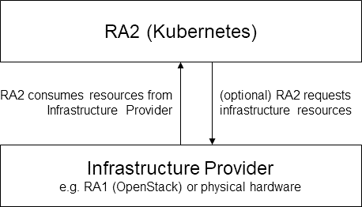

[<< Back](https://cntt-n.github.io/CNTT/)

# CNTT Reference Architectures

## Available Reference Architectures
* [Openstack Based](openstack)
* [Kubernetes Based](kubernetes)

<!--

## Principles
Reference Architectures specification conform with the principles defined in [here](../tech#2.0).

## Reference Architectures Relationships and Scope

<b>Figure 1:</b> Relationships between and scope of the CNTT Reference Architectures

RA1 is focussing on an OpenStack Reference Architecture that will support VM-based VNFs only (i.e. no containerised workloads), whilst delivering the NFVI and VIM requirements as outlined in the Reference Model.

The scope of RA2 will be to enable support for containerised and VM-based workloads (i.e. VMs managed by Kubernetes). A thorough gap analysis will need performing to understand the level to which Kubernetes might support traditional VNFs (i.e. to what level can Kubernetes conform to the VIM specification from ETSI NFV v3, or the Vi-Vnfm interface, for example).

RA2 is delivering a Kubernetes Reference Architecture that will be standalone, meaning that a Reference Implementation for RA2 can be established solely on the content and requirements present in the RA2 documentation.

Kubernetes can be executed on top of different types of underlying infrastrucutre. Examples of those underlying infrastructures are:
- Infrastructure as a Service based on virtual machines such as OpenStack in general or a Reference Implementation of RA1
- Physical servers. (This is often referred to as "baremetal Kubernetes")

Kubernetes expects certain capabilities or resources provided by the underlying infrastructure. Examples for resources or capabilities of the underlying infrastructure consumed by Kubernetes are, but are not limited to:
- storage (ephemeral/persistent)
- connectivity
- compute

RA2 contains concrete provisions on the type of infrastructure resources consumed by Kubernetes.

If the underlying infrastructure provides a dynamic way to allocate resources, Kubernetes can integrate directly with the underlying infrastructure and use it as a infrastructure resource provider. Kubernetes uses a plugin-based mechanism for integration with any type of infrastructure resource providers. Most prominently Kubernetes Cloud Provider collect various integrations towards a particular infrastructure platform e.g. to create volumes or additional worker nodes. The Kubernetes cluster api harmonizes some of the k8s cluster management related integrations with different infrastructure platforms under a common API. With the Container Network Interface (CNI) and the Container Storage Interface (CSI) specifications Kubernetes also provides additional means to integrate with the underlying infrastructure. (Note: the use of CNIs or CSIs does not imply the use of specific platform resources.)

Figure 2 depicts the relationship between RA2 and an arbitrary underlying infrastructure.

<b>Figure 2:</b> RA2 relation to underlying infrastructure

-->