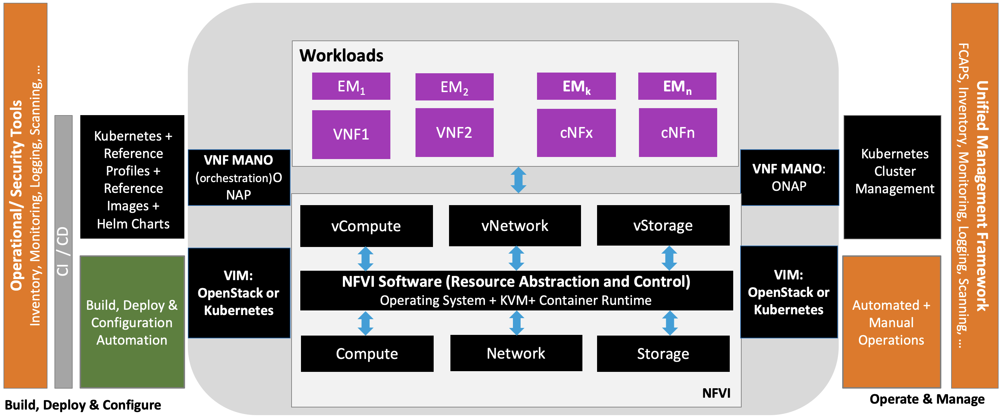
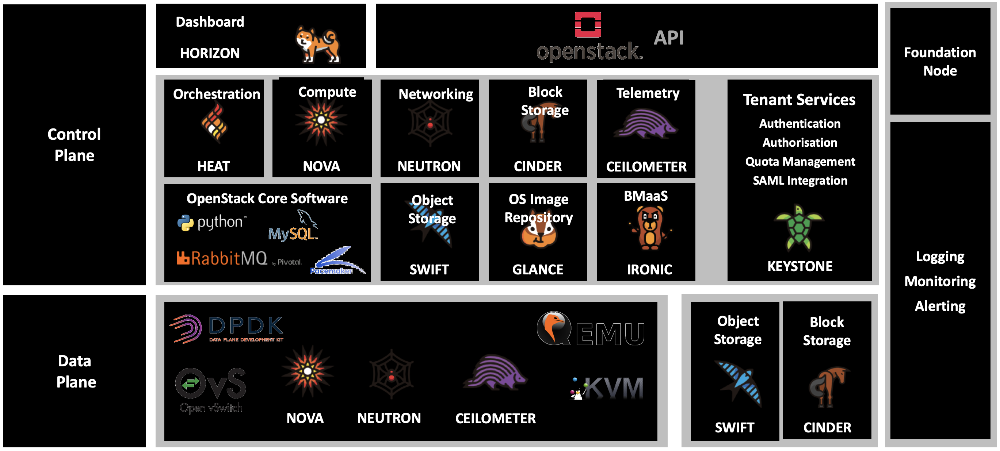

[<< Back](https://cntt-n.github.io/CNTT/)

## Table of Contents

- **Chapter 1 (Overview)**: Role of NFVi and current state/trends (JB – Intro)
  - Introduction

<b>Figure 1-1:</b> E2E

  - Reference Architecture traceability to the CNTT
  - Reference Model : explain how the two are related
  - Principles
  - Scope

- **Chapter 2 (Architecture Requirements)**
  - **Foundation (includes Management Plane)**
    - Bare-Metal provisoning.
    - Enabler services: NAT, DHCP, DNS, IDS/IPS and Load Balancing
  - **Control Plane** 
    - (e.g. needs the ability to do…xyz for this 
    - control plane provides the API endpoints, GUI and internal services for the cloud.
    - All control plane components must be configured to be highly available (HA) and deployed across multiple physical nodes.
    - API endpoints and supporting services need to handle failures of an underlying component.
    - Control plane much suppport Logging, monitoring and alerting to manage the cloud.
    Control plane must be Telemetry enabled to provide insight into utilisation and usage reporting

  - **Data Plane**
    - Must allow for tenant networking within a single server and across servers.
    - Must support Service function chaining.
    - Must provide high throuput and low latency.
      - dependong on the targeted profile.
    - Must support Netowrk Acceleration (in-line and Look-Aside)
    - Must support Application specefic Acceleration (exposed to VNFs).

  - **Networking**
    - Must allow for East/West tenant traffic within the cloud (via tunnelled encapsulation overlay - VXLAN or Geneve)
    - Must allow for management traffic of the cloud
    - Must allow folr management traffic of the servers i.e. IPMI
    - Must allow for external access to the API and GUI
    - Must allow for tenant external access from other systems or users e.g. Internet/DC networks
    - Must allow for storage access network and replication
    - Must support VXLAN/Geneve over L3
    - Must support Distributed Virtual Routing (DVR) to allow compute nodes to route traffic efficiently.

- **Chapter 3 (Architectural Components)**

  - High Level Diagram for E2E:. 

<b>Figure 1-2:</b> High Level Ref Architecture

  - More detailed Diagram (for NFVI and VIM):

<b>Figure 1-3:</b> Focused NFVI VIM Reference Architecture

  - Virtual Components (trace to Ref Model)
    - Technology choices to satisfy these requirements
    - Rationale/Explain why, how, of choices
  - Physical components (trace to Ref Model)
    - Technology choices to satisfy these requirements
    - Rationale/Explain why, how, of choices
  - VIM (Aspects, Impacts) 
    - Technology choices to satisfy these requirements
    - Rationale/Explain why, how, of choices
  - Components List Diagram:

<b>Figure 1-4:</b> Components List

- **Chapter 4 (NFVI Interactions with VIM and MANO)**: in here we  should define our standards (JB – aligns w/Ch 7 of model)

- **Chapter 5 (Leveraging NFVI for VNFs)**: 
  - Optimize: how to use this specific to this NFVI architecture to optimize VFNs behavior (e.g. performance, scalability, elasticity, resilience, etc.)
  - Define how VNFs shall behave

- **Chapter 6 (Design, Build, Deployment, and Operate Guidelines)**
  - Security
  - Automation
  - Lifecycle Management
  - (How points downstream to Reference Implementation)

