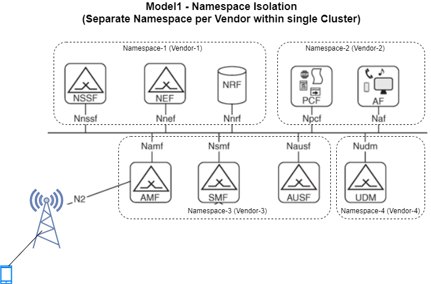

Appendix A - Guidance For workload isolation (Multitenancy) with Kubernetes for application vendors
===================================================================================================

Overview of Appendix A
----------------------

Problem statement: A single Kubernetes Cluster does not provide hard multitenancy\* by design. Within a Cluster,
Kubernetes Namespace is a mechanism to provide Soft isolation multitenancy.
A Kubernetes Namespace does provide isolation by means of role based access control (RBAC), Resource Isolation and
Network Policy, however they are still within the same trust domain and a potential breach of Cluster Admin Role could
lead to the Blast Radius across the entire Cluster and all its Kubernetes Namespaces.
So there is a need to define various use cases or ways to build Multitenancy Deployment Models and define the Best
Practices to secure each Model.
Kubernetes Namespace is a logical representation of namespace(boundary for resources) within the Kubernetes Cluster.
This is different from the :cite:t:`wikipedia-linux-namespaces` which are defined at the operating system kernel level.

   Network Service

   Cluster Isolation

Use cases:

1. Two CNFs which are in the same trust domain (e.g.: they are from the same vendor) are running in a container
   infrastructure
2. Two CNFs which are in different trust domains (e.g.: they are from different vendors) are running in a container
   infrastructure

Solution Areas
--------------

The scope is to identify the solution area which is needed to secure the CNF workloads. Securing the platform might
happen as part of it but not directly the focus or objective here.

1. Isolation of Platform and Tenant Deployment based on the Solution Model
2. Separate CICD, Manifest and Image Repository for Platform and Tenants
3. Isolation of Networking per tenant
4. Securing the CNF Workload Network Traffic using Network Policy and Service Mesh
5. RBAC rules and secrets Management for each tenant
6. Separate Isolated view of Logging, Monitoring, Alerting and Tracing per tenant

Multitenancy Models
-------------------

Solution Models :

1. **Soft Multitenancy**: Separate Kubernetes Namespace per tenant within a Single Kubernetes Cluster. The same
   Kubernetes Cluster and its control plane are being shared between multiple tenants.
2. **Hard Multitenancy**: Separate Kubernetes Cluster per tenant.
   The Kubernetes Clusters can be created using Baremetal Nodes or Virtual Machines, either on Private or Public Cloud.
   The workloads do not share the same resources and Clusters are isolated.

Soft Multitenancy with Kubernetes Namespaces per tenant
~~~~~~~~~~~~~~~~~~~~~~~~~~~~~~~~~~~~~~~~~~~~~~~~~~~~~~~

Soft multitenancy with Namespaces per tenant can be implemented, resulting in a multi-tenant cluster - where multiple
trusted workloads share a cluster and its control plane.
This is mainly recommended to reduce management overhead when the tenants belong to the same trust domain, and have the
same Cluster configuration requirements (incl. release, add-ons, etc.).

The tenants will share the cluster control plane and API, including all add-ons, extensions, CNIs, CSIs, and any Custom
Resources and Controllers.

To manage access control, the Kubernetes RBAC must be configured with rules to allow specific tenants to access only
the objects within their own Namespace, using a ``Role`` Object to group the resources within a namespace, and a
``RoleBinding`` Object to assign it to a user or a group of users within a Namespace.

In order to prevent (or allow) network traffic between Pods belonging to different Namespaces, ``NetworkPolicy`` must
be created as well.

Resource quotas enable the cluster administrator to allocate CPU and Memory to each Namespace, limiting the amount of
resources the objects belonging to that Namespace can consume. This may be configured in order to ensure that all
tenants use no more than the resources they are assigned.

By default, the Kubernetes scheduler will run pods belonging to any namespace on any cluster node. If it is required
that pods from different tenants are run on different hosts, then affinity rules should be created by using the
desired Node Labels on the Pod definition. Alternatively, Node taints can be used to reserve certain nodes for a
predefined tenant.

Hard Multitenancy with dedicated Kubernetes clusters per tenant
~~~~~~~~~~~~~~~~~~~~~~~~~~~~~~~~~~~~~~~~~~~~~~~~~~~~~~~~~~~~~~~

When tenants do not belong to the same trust domain, or the requirements on the cluster setup and configuration are
irreconciliable, Hard Multitenancy must be implemented by creating multiple Kubernetes clusters for each tenant or
group of compatible tenants.

All the default design decision for Kubernetes clusters apply in this case, and no special segregation or capacity
management is required to be setup within the clusters.

From an operational perspective, the increased computational and operational overhead and the Cluster LCM (incl.
Cluster provisioning automation) are the most impactful aspects.

