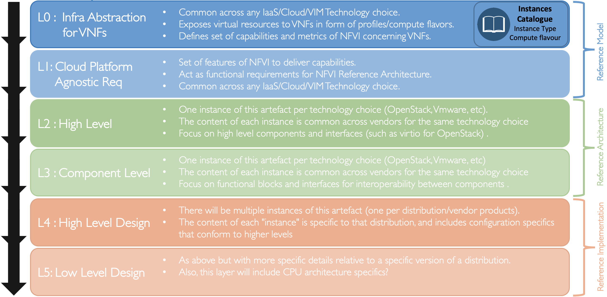

[<< Back](../../kubernetes)

# 1. Overview

## Table of Contents
* [1.1 Introduction.](#1.1)
* [1.2 Terminology](#1.2)
* [1.3 Principles](#1.3)
  * [1.3.1 Cloud Native.](#1.3.1)
* [1.4 Scope](#1.4)
* [1.5 Vision](#1.5)
* [1.6 Approach](#1.6)
* [1.7 Roadmap](#1.7)

## 1.1 Introduction

Kubernetes is a "portable, extensible, open-source platform for managing containerized workloads and services, that facilitates both declarative configuration and automation. It has a large, rapidly growing ecosystem. Kubernetes services, support, and tools are widely available." [[kubernetes.io](https://kubernetes.io/docs/concepts/overview/what-is-kubernetes/)]

This Reference Architecture for Kubernetes will describe the high level system components and their interactions, taking the goals and requirements of the [Reference Model](../../../ref_model/chapters/chapter01.md) and mapping them to real-world Kubernetes (and related) components. This document needs to be sufficiently detailed and robust such that it can be used to guide the production deployment of Kubernetes within an operator, whilst being flexible enough to evolve with and remain aligned with the wider Kubernetes ecosystem outside of Telco.

To assist with this goal, we could create an "RA2 [Razor](https://en.wikipedia.org/wiki/Philosophical_razor)" along the lines of "if something is useful for non-Telco workloads, we should not include it only for Telco workloads". For example (thanks to @fzdarsky in #383) lets say we start with a vanilla Kubernetes (say, v1.16) feature set in the Reference Architecture, and we provide clear evidence that a functional requirement cannot be met by that system (say, multi-NIC support), we only then add the least invasive, Kubernetes-community aligned extension (say, Multus) to fill this gap. If there are still gaps that cannot be filled by Kubernetes community technologies or extensions then we need to concisely document the requirement and take it to the relevant project maintainers.

The Kubernetes Reference Architecture will also be used in conjunction with a Kubernetes Reference Implementation. The Kubernetes Reference Implementation would then also be used to test and validate the supportability and compatibility with Kubernetes-based Network Function workloads of interest to the CNTT community. It is expected the Kubernetes Reference Architecture and Reference Implementation will be developed in parallel to OVP Phase 2, which is looking to build upon the work already in place with OpenStack to expand into the verification and certification of Kubernetes-based workloads.

### 1.2 Terminology

Generic terms can be found in the (CNTT Reference Model Terminology)[https://github.com/cntt-n/CNTT/blob/master/doc/ref_model/chapters/glossary.md#1.1]

Any terms specific to Kubernetes can be found in the table below.

|Term|Definition|Reference|
|---|---|---|
|Container Image|Stored instance of a container that holds a set of software needed to run an application.|[Link](https://kubernetes.io/docs/reference/glossary/?fundamental=true#term-image)|
|Container|A lightweight and portable executable image that contains software and all of its dependencies.|[Link](https://kubernetes.io/docs/reference/glossary/?fundamental=true#term-container)|
|Pod|The smallest and simplest Kubernetes object. A Pod represents a set of running containers on your cluster. A Pod is typically set up to run a single primary container. It can also run optional sidecar containers that add supplementary features like logging.|[Link](https://kubernetes.io/docs/reference/glossary/?fundamental=true#term-pod)|
|Kubernetes Cluster|A set of machines, called nodes, that run containerised applications managed by Kubernetes. A cluster has at least one worker node and at least one master node.|[Link](https://kubernetes.io/docs/reference/glossary/?fundamental=true#term-cluster)|
|Kubernetes Master|The master node(s) manages the worker nodes and the pods in the cluster. Multiple master nodes are used to provide a cluster with failover and high availability.|[Link](https://kubernetes.io/docs/reference/glossary/?fundamental=true#term-cluster)|
|Kubernetes Control Plane|The container orchestration layer that exposes the API and interfaces to define, deploy, and manage the lifecycle of containers.|[Link](https://kubernetes.io/docs/reference/glossary/?fundamental=true#term-control-plane)|
|Kubernetes Node|A node is a worker machine in Kubernetes. A worker node may be a VM or physical machine, depending on the cluster. It has local daemons or services necessary to run Pods and is managed by the control plane.|[Link](https://kubernetes.io/docs/reference/glossary/?fundamental=true#term-node)|
|CaaS|Container-as-a-Service. A complete set of technologies to enable the management of containerised software, including a Kubernetes cluster, container networking, storage, routing, service mesh, etc.|-|
|CaaS Manager|A management plane function that manages the lifecycle (instantiation, scaling, healing, etc.) of one or more CaaS instances, including communication with VIM for master/node lifecycle management. CaaS Manager could be considered the "undercloud" where the CaaS is the "overcloud".|-|
|CNF|A Cloud Native Virtual Network Function - or CNF for short - is an implementation of a Virtual Network Function (as defined by ETSI GS NFV 003 V1.4.1 (2018-08) that adheres to the CNCF Cloud Native Definition.|[CNCF TUG White Paper](https://docs.google.com/document/d/1-zqxz5bdCLTuOEvi2ybADR3PcmzbBhNt6YkNnvx-KoA/edit#heading=h.5x0d5h95i329)|
|Service|An abstract way to expose an application running on a set of Pods as a network service.|[Link](https://kubernetes.io/docs/reference/glossary/?fundamental=true#term-service)|

## 1.3 Principles

Kubernetes Reference Architecture must obey to the following set of principles:
- [CNTT Reference Model Principles](../../../ref_model/chapters/chapter01.md#1.3)
- [CNTT Reference Architecture Principles](../../#principles)

>Any Kubernetes specific principles needs to be added here.

### 1.3.1 Cloud Native Principles

According to CNCF TOC (Technical Oversight Committee), following is the definition of Cloud Native:
>CNCF Cloud Native Definition v1.0
>Approved by TOC: 2018-06-11

>“Cloud native technologies empower organizations to build and run **scalable** applications in modern, **dynamic environments** such as public, private, and hybrid clouds. Containers, **service meshes**, **microservices**, **immutable infrastructure**, and **declarative APIs** exemplify this approach.

>These techniques enable **loosely coupled** systems that are **resilient**, **manageable**, and **observable**. Combined with **robust automation**, they allow engineers to make high-impact changes frequently and predictably with minimal toil.

>The Cloud Native Computing Foundation seeks to drive adoption of this paradigm by fostering and sustaining an ecosystem of open source, vendor-neutral projects. We democratize state-of-the-art patterns to make these innovations accessible for everyone”

The definition above is very application centric and look at cloud native from the application point of view, in here, we will try and relate those definitions to the infrastructure on which cloud native applications run. For the purposes of this document, a Cloud Native Network Function (CNF) is a type of cloud native application.

- **scalable**:
- **dynamic environments**:
- **service meshes**:
- **microservices**:
- **immutable infrastructure**:
- **declarative APIs**:
- **loosely coupled**:
- **resilient**:
- **manageable**:
- **observable**:
- **robust automation**:

> The CNCF TUG is also working on a set of Cloud Native Principles at more detail than the existing CNCF definition: https://docs.google.com/document/d/1RHx4mnJ4ELKphIK5ktXZ53XcbCpwObkgcvju5wI3jg4/edit.  Many of the principles above are taken from this document.

## 1.4 Scope

The high level scope of the CNTT Reference Architectures can be seen in Figure 1-1 below.

<b>Figure 1-1:</b> Description of the possible different levels of CNTT artefacts

The scope of this particular Reference Architecture can be described as follows (the capabilities themselves will be listed and described in subsequent chapters), also shown in Figure 1-2:
- Kubernetes capabilities required to conform to the Reference Model requirements
- Support for CNFs that consist wholly of containers
- Support for CNFs that consist partly of containers and partly of VMs, both of which will be orchestrated by Kubernetes

For the avoidance of doubt, the following is considered to be **out of scope**:
- **Kubernetes cluster lifecycle management**: reason being, it is not considered to be "visible" to a CNF and so should not be included.
- **Kubernetes-based Application / VNF Management**: similar to VNFM, this is an application layer capability that is out of scope of CNTT. This includes Kubernetes-based Application Package Management, such as Helm, as this is a client application and set of libraries that would be part of a modern/cloud native VNFM, not part of the infrastructure itself.

<b>Figure 1-1:</b> Kubernetes Reference Architecture scope

## 1.5 Approach

The approach taken in this Reference Architecture is to start simple (i.e. with a basic Kubernetes architecture), and then add detail and additional features/extensions as is required to meet the requirements of the Reference Model.

For example, whilst the management of VMs through Kubernetes is included, we will likely start with the "native" control of containers and add VMs at a later date - to be decided and documented in the Roadmap section below.

In addition, we will start with a description of interfaces and capabilities (the "what") before at a later date providing guidance on "how" those elements are deployed (which will be documented in full detail in the Reference Implementation). In addition, an [Appendix](./appendix-a.md) will be created with the purpose of describing the transition from VNF to CNF and the potential pitfalls and complexities that may need consideration. This appendix may in turn lead to gaps that need filling in one or more Reference Architectures.

## 1.6 Roadmap

As Kubernetes evolves over time it will add new technologies and capabilities and so the CNTT Reference Architecture will need to evolve with it. The final release cadence for the Reference Model changes and feature updates is still under discussion but the cadence of the Kubernetes Reference Architecture should at least follow the release cadence for Kubernetes, which is every three months and at least the support cadence, which is nine months (latest release, plus two previous releases).

> A populated roadmap view will be added here after the January 2020 release.
