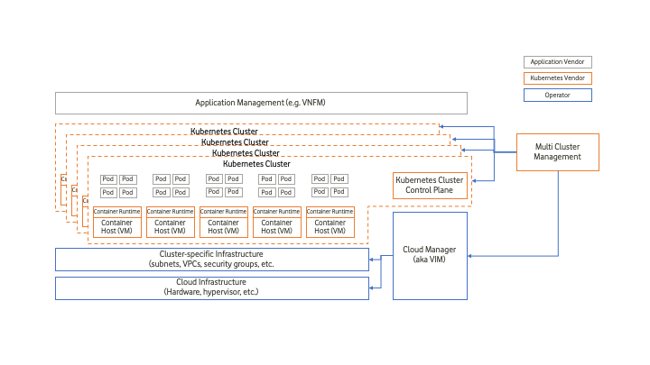

[<< Back](../../kubernetes)

# 1. Overview

## Table of Contents
* [1.1 Introduction.](#1.1)
* [1.2 Terminology](#1.2)
* [1.3 Principles](#1.3)
  * [1.3.1 Cloud Native.](#1.3.1)
* [1.4 Scope](#1.4)
* [1.5 Vision](#1.5)
* [1.6 Approach](#1.6)
* [1.7 Roadmap](#1.7)

## 1.1 Introduction

> to be written

### 1.2 Terminology

|Term|Definition|Reference|
|---|---|---|
|Container Image|A container image is a lightweight, standalone, executable package of software that includes everything needed to run an application: code, runtime, system tools, system libraries and settings.|[Link](https://www.docker.com/resources/what-container)|
|Container|A running instantiation of a container image.|-|
|Pod|A Pod (as in a pod of whales or pea pod) is a group of one or more containers (such as Docker containers), with shared storage/network, and a specification for how to run the containers. A Pod’s contents are always co-located and co-scheduled, and run in a shared context.|[Link](https://kubernetes.io/docs/concepts/workloads/pods/pod/)|
|Cluster|A cluster consists of at least one cluster master and multiple worker machines called nodes. These master and node machines run the Kubernetes cluster orchestration system.|[Link](https://cloud.google.com/kubernetes-engine/docs/concepts/cluster-architecture)|
|Master|The cluster master runs the Kubernetes control plane processes, including the Kubernetes API server, scheduler, and core resource controllers.|[Link](https://cloud.google.com/kubernetes-engine/docs/concepts/cluster-architecture)|
|Node|Nodes are the worker machines (physical or virtual) that run your containerised applications and other workloads. Each node is managed from the master, which receives updates on each node's self-reported status. A node runs the services necessary to support the Docker containers that make up your cluster's workloads. These include the Docker runtime and the Kubernetes node agent (kubelet) which communicates with the master and is responsible for starting and running Docker containers scheduled on that node.|[Link](https://cloud.google.com/kubernetes-engine/docs/concepts/cluster-architecture)|
|PaaS|The capability provided to the consumer is to deploy onto the cloud infrastructure consumer-created or acquired applications created using programming languages, libraries, services, and tools supported by the provider. The consumer does not manage or control the underlying cloud infrastructure including network, servers, operating systems, or storage, but has control over the deployed applications and possibly configuration settings for the application-hosting environment.|[NIST SP 800-145, The NIST Definition of Cloud Computing](https://nvlpubs.nist.gov/nistpubs/Legacy/SP/nistspecialpublication800-145.pdf)|
|CaaS|Container-as-a-Service, a foundational application PaaS capability, in this case delivered as a Kubernetes cluster and other technologies such as CNI, Ingress, Service Mesh, LMA, etc. CaaS sits above VIM/NFVI and performs some application LCM based on instructions received from VNFM.|[Foundational PaaS Definition](http://www.theenterprisearchitect.eu/blog/categorize-compare-cloud-vendors/#row5column3)|
|CaaS Manager|A management plane function that manages the lifecycle (instantiation, scaling, healing, etc.) of one or more Kubernetes clusters, including communication with VIM for master/node lifecycle management.|-|
|CNF|A Cloud Native Virtual Network Function - or CNF for short - is an implementation of a Virtual Network Function (as defined by ETSI GS NFV 003 V1.4.1 (2018-08) that adheres to the CNCF Cloud Native Definition.|CNCF TUG (link tbc)|
|Service|A Service in Kubernetes is an abstraction which defines a logical set of Pods and a policy by which to access them. Services enable a loose coupling between dependent Pods.|[Link](https://kubernetes.io/docs/tutorials/kubernetes-basics/expose/expose-intro/)|
|Service Mesh|A service mesh is a dedicated infrastructure layer for handling service-to-service communication. It’s responsible for the reliable delivery of requests through the complex topology of services that comprise a modern, cloud native application. In practice, the service mesh is typically implemented as an array of lightweight network proxies that are deployed alongside application code, without the application needing to be aware.|[Link](https://buoyant.io/2017/04/25/whats-a-service-mesh-and-why-do-i-need-one/)|

## 1.3 Principles

Kubernetes Reference Architecture must obey to the following set of principles:
- [CNTT Reference Model Principles](../../../ref_model/chapters/chapter01.md#1.3)
- [CNTT Reference Architecture Principles](../../#principles)

>Any Kubernetes specific principles needs to be added here.

### 1.3.1 Cloud Native Principles

According to CNCF TOC (Technical Oversight Committee), following is the definition of Cloud Native:
>CNCF Cloud Native Definition v1.0
>Approved by TOC: 2018-06-11

>“Cloud native technologies empower organizations to build and run **scalable** applications in modern, **dynamic environments** such as public, private, and hybrid clouds. Containers, **service meshes**, **microservices**, **immutable infrastructure**, and **declarative APIs** exemplify this approach.

>These techniques enable **loosely coupled** systems that are **resilient**, **manageable**, and **observable**. Combined with **robust automation**, they allow engineers to make high-impact changes frequently and predictably with minimal toil.

>The Cloud Native Computing Foundation seeks to drive adoption of this paradigm by fostering and sustaining an ecosystem of open source, vendor-neutral projects. We democratize state-of-the-art patterns to make these innovations accessible for everyone”

The definition above is very application centric and look at cloud native from the application point of view, in here, we will try and relate those definitions to the platforms of which cloud native applications run on top of.

- **scalable**:
- **dynamic environments**:
- **service meshes**:
- **microservices**:
- **immutable infrastructure**:
- **declarative APIs**:
- **loosely coupled**:
- **resilient**:
- **manageable**:
- **observable**:
- **robust automation**:

## 1.4 Scope

> to be written

## 1.5 Vision

## 1.6 Approach

## 1.7 Roadmap

## General thoughts

Kubernetes itself is a “system for automating deployment, scaling, and management of containerized applications” and therefore Kubernetes place within our architecture should be closely linked to the application lifecycle (this is especially important when considering bare-metal containerisation). However, it is very important to point out that Kubernetes Platforms also consist of other open source projects, or add-ons, such as:
- CNI-compliant network plugins
- CSI-compliant storage plugins
- CRI-compliant container runtimes
- service mesh options
- service discovery options
- monitoring and logging options
- etc.

Figure 1-1 below shows how Kubernetes, CaaS, and the CaaS Manager might fit within the current ETSI architecture.  In terms of this Reference Architecture, we should focus on the requirements of the new interfaces and the capabilities within the CaaS Manager and the Kubernetes clusters.

<b>Figure 1-1:</b> Kubernetes Architecture for NFV

### A note on virtualised and containerised workloads
It is highly likely that a single VNFM will be managing applications (or components) that are virtualised (i.e. running in VMs) and applications (or components) that are containerised (i.e. running in containers), at the same time.  There are different approaches to achieving this:
1. Application manager (EMS, VNFM) uses both IaaS (VIM) API and Kubernetes API - the former for VM based workloads, the latter for containerised workloads.
2. Application manager (EMS, VNFM) uses just the Kubernetes API for both VM-based and container-based workloads, with the Kubernetes PaaS managing the lifecycle of VMs using on of the following methods:
    a) Kubernetes interacts with IaaS/VIM API (Cluster API model)
    b) Kubernetes is the IaaS/VIM and interacts direct with the hypervisor (Kubevirt model)

### A note on bare metal containerisation
As described above, Kubernetes is an application manager and therefore the lifecycle of Kubernetes clusters should closely match the lifecyle of the application or applications being deployed into Kubernetes. It therefore goes that the engineering teams defining the lifecycle of their applications will also define the lifecycle of the clusters they use for those applications. In an operator this might be a network engineering team, for example.

This has the following considerations when it comes to bare metal:
- With virtualised infrastructure, the underlying hypervisor hosts are or can be shared amongst a large number of tenants (i.e. application teams); much of the financial benefit of NFV was due to this concept
- If the above lifecycle is used then the following things need careful thought:
    - Size of bare metal nodes
    - Infrastructure management API, network overlay, etc.

Regarding the size of the nodes, this is about trying not to reduce the benefits we gained with NFV in the first place. For example, if three hypervisor hosts have 60CPUs and 1.5TB RAM between them, sharing those resources between a large number of applications (lets say 50) is made efficient by the use of virtualisation. For bare metal containerisation, that same number of applications would need a much larger number of bare metal hosts, with each host being a much smaller unit.

Regarding the network overlay, this is about having a service with capabilities that are provided by the VIM for virtualised environments, but for bare metal. So the ability to provision bare metal to a particular tenant, ensure the networking to each node is correctly provisioned (so, for bare metal this may mean calling out to an external SDN controller, as opposed to using an SDN controller provided by the VIM), and so on.
