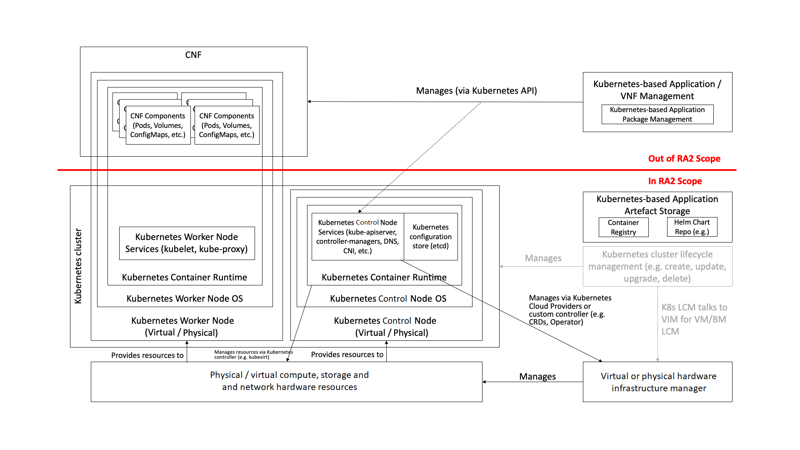

Overview
========

Introduction
------------

The objective of this Reference Architecture (RA) is to develop a usable Kubernetes-based platform for the Telco
industry. The RA will be based on the standard Kubernetes platform wherever possible. This Reference Architecture
for Kubernetes will describe the high-level system components and their interactions, taking the goals and requirements
from the Cloud Infrastructure Reference Model :cite:p:`refmodel` (RM) and mapping them to Kubernetes (and related)
components. This document needs to be sufficiently detailed and robust such that it can be used to guide the production
deployment of Kubernetes within an operator, whilst being flexible enough to evolve with and remain aligned with the
wider Kubernetes ecosystem outside of Telco.

To set this in context, it makes sense to start with the high-level definition and understanding of Kubernetes.
Kubernetes :cite:p:`kubernetes` is a "portable, extensible, open-source platform for managing containerised
workloads and services, that facilitates both declarative configuration and automation. It has a large, rapidly growing
ecosystem. Kubernetes services, support, and tools are widely available" :cite:p:`whatiskubernetes`.
Kubernetes is developed as an
open source project in the `kubernetes` :cite:p:`k8srepo` repository of GitHub.

To assist with the goal of creating a reference architecture that will support Telco workloads, but at the same time
leverage the work that already has been completed in the Kubernetes community, RA2 will take an
"RA2 Razor" approach to build the foundation. This can be
explained along the lines of "if something is useful for non-Telco workloads, we will not include it only for Telco
workloads". For example, start the Reference Architecture from a vanilla Kubernetes (say, v1.16) feature set, then
provide clear evidence that a functional requirement cannot be met by that system (say, multi-NIC support), only then
the RA would add the least invasive, Kubernetes-community aligned extension (say, Multus) to fill the gap. If there are
still gaps that cannot be filled by standard Kubernetes community technologies or extensions then the RA will concisely
document the requirement in the
:ref:`chapters/chapter07:introduction to gaps, innovation, and development` chapter of this
document and approach the relevant project maintainers with a request to add this functionality into the feature set.

The Kubernetes Reference Architecture will be used to determine a Kubernetes Reference Implementation. The Kubernetes
Reference Implementation would then also be used to test and validate the supportability and compatibility with
Kubernetes-based Network Function workloads, and lifecycle management of Kubernetes clusters, of interest to the Anuket
community. The intention is to expand as much of the existing test frameworks to be used for the verification and
conformance testing of Kubernetes-based workloads, and Kubernetes cluster lifecycle management.

Required component versions
---------------------------

========== ===================
Component  Required version(s)
========== ===================
Kubernetes 1.26
========== ===================

Principles
----------

Architectural principles
~~~~~~~~~~~~~~~~~~~~~~~~

This Reference Architecture conforms with the Anuket principles:

1. **Open-source preference:** for building Cloud Infrastructure
   solutions, components and tools, using open-source technology.
2. **Open APIs:** to enable interoperability, component
   substitution, and minimise integration efforts.
3. **Separation of concerns:** to promote lifecycle independence of
   different architectural layers and modules (e.g., disaggregation of
   software from hardware).
4. **Automated lifecycle management:** to minimise the
   end-to-end lifecycle costs, maintenance downtime (target zero
   downtime), and errors resulting from manual processes.
5. **Automated scalability:** of workloads to minimise costs and
   operational impacts.
6. **Automated closed loop assurance:** for fault resolution,
   simplification, and cost reduction of cloud operations.
7. **Cloud nativeness:** to optimise the utilisation of resources
   and enable operational efficiencies.
8. **Security compliance:** to ensure the architecture follows
   the industry best security practices and is at all levels compliant
   to relevant security regulations.
9. **Resilience and Availability:** to withstand
   Single Point of Failure.

Cloud Native Principles
~~~~~~~~~~~~~~~~~~~~~~~

For the purposes of this document, the CNCF TOC's (Technical Oversight Committee) definition of Cloud Native applies:

   CNCF Cloud Native Definition v1.0
   Approved by TOC: 2018-06-11

   “Cloud native technologies empower organizations to build and run **scalable** applications in modern,
   **dynamic environments** such as public, private, and hybrid clouds. Containers, **service meshes**,
   **microservices**, **immutable infrastructure**, and **declarative APIs** exemplify this approach.

   These techniques enable **loosely coupled** systems that are **resilient**, **manageable**, and **observable**.
   Combined with **robust automation**, they allow engineers to make **high-impact changes frequently and predictably**
   with minimal toil.

   The Cloud Native Computing Foundation seeks to drive adoption of this paradigm by fostering and sustaining an
   ecosystem of open source, vendor-neutral projects. We democratize state-of-the-art patterns to make these innovations
   accessible for everyone.”

The CNCF TUG (Telecom User Group), formed in June 2019, published a set of Cloud Native Principles suited to the
requirements of the Telecom community :cite:p:`cloudnativeprinciples`.
There are many similarities with the CNCF principles, briefly that infrastructure needs to be:

-  **scalable**
-  **dynamic environments**
-  **service meshes**
-  **microservices**
-  **immutable infrastructure**
-  **declarative APIs**
-  **loosely coupled**
-  **resilient**
-  **manageable**
-  **observable**
-  **robust automation**
-  **high-impact changes frequently and predictably**

Exceptions
~~~~~~~~~~

Anuket specifications define certain policies and general principles and strive to
.. add general principles from common
coalesce the industry towards conformant Cloud Infrastructure technologies and configurations. With the currently
available technology options, incompatibilities, performance, and operator constraints (including costs), these
policies and principles may not always be achievable and, thus, require an exception process. These policies
describe how to handle non-conforming technologies.
.. add policies:anuket project policies for managing non-conforming technologies from common
In general, non-conformance with policies is handled through a set of exceptions.
.. add gov/chapters/chapter09:exception types

The following sub-sections list the exceptions to the principles of Anuket specifications and shall be updated whenever
technology choices, versions and requirements change. The Exceptions have an associated period of validity and this
period shall include time for transitioning.

Technology Exceptions
^^^^^^^^^^^^^^^^^^^^^

The list of Technology Exceptions will be updated or removed when alternative technologies, aligned with the principles
of Anuket specifications, develop and mature.

.. list-table:: Technology Exceptions
   :widths: 10 10 20 5 50 5
   :header-rows: 1

   * - Ref
     - Name
     - Description
     - Valid Until
     - Rationale
     - Implication
   * - ra2.exc.tec.001
     - SR-IOV
     - This exception allows workloads to use SR-IOV over PCI-PassThrough technology.
     - TBD
     - Emulation of virtual devices for each virtual machine creates an I/O
       bottleneck resulting in poor performance and limits the number of virtual
       machines a physical server can support. SR-IOV implements virtual devices
       in hardware, and by avoiding the use of a switch, near maximal performance
       can be achieved. For containerisation the downsides of creating dependencies
       on hardware is reduced as Kubernetes nodes are either physical, or if virtual
       have no need to "live migrate" as a VNF VM might.
     -

.. Requirements Exceptions
.. ^^^^^^^^^^^^^^^^^^^^^^^

.. The Requirements Exceptions lists the Reference Model (RM) requirements and/or Reference Architecture (RA) requirements
.. that will be either waived or be only partially implemented in this version of the RA. The exception list will be
.. updated to allow for a period of transitioning as and when requirements change.

.. .. list-table:: Requirements Exceptions
..    :widths: 10 10 20 5 50 5
..    :header-rows: 1

..    * - Ref
..      - Name
..      - Description
..      - Valid Until
..      - Rationale
..      - Implication
..    * - ra1.exc.req.001
..      - Req.
..      - xxxx
..      - xxxxxxx
..      -
..      -

Scope
-----

The scope of this particular Reference Architecture can be described as follows (the capabilities themselves will be
listed and described in subsequent chapters):

-  Kubernetes platform capabilities required to conform to the Reference Model requirements
-  Support for CNFs that consist wholly of containers
-  Support for CNFs that consist partly of containers and partly of VMs, both of which will be orchestrated by
   Kubernetes
-  **Kubernetes Cluster lifecycle management**: including Cluster creation/upgrade/scaling/deletion, and node
   customisation due to workload requirements.

The following items are considered **out of scope**:

-  **Kubernetes-based Application / CNF Management**: this is an application layer capability that is
   out of scope of Anuket.

   Kubernetes Reference Architecture scope

Approach
--------

The approach taken in this Reference Architecture is to start with a basic Kubernetes architecture, based on the
community distribution, and then add detail and additional features/extensions as is required to meet the requirements
of the Reference Model and the functional and non-functional requirements of common cloud native network functions.

This document starts with a description of interfaces and capabilities requirements (the "what") before providing
guidance on "how" those elements are deployed, through specifications. The details of how the elements will be used
together are documented in full detail in the Reference Implementation.

Terminology
-----------

**Abstraction:** Process of removing concrete, fine-grained or
lower-level details or attributes or common properties in the study of
systems to focus attention on topics of greater importance or general
concepts. It can be the result of decoupling.

**Anuket:** A LFN open-source project developing open reference
infrastructure models, architectures, tools, and programs.

**CaaS:** Containers as a Service - A Platform suitable to host and run Containerised workloads, such as Kubernetes.
Instances of CaaS Platforms are known as **CaaS Clusters**.

**CaaS Manager:** A management plane function that manages the lifecycle (instantiation, scaling, healing, etc.) of one
or more CaaS instances, including communication with VIM for master/node lifecycle management.

**Cloud Infrastructure:** A generic term covering **NFVI**, **IaaS** and
**CaaS** capabilities - essentially the infrastructure on which a
**Workload** can be executed.
**NFVI**, **IaaS** and **CaaS** layers can be built on top of each
other. In case of CaaS some cloud infrastructure features (e.g.: HW
management or multitenancy) are implemented by using an underlying
**IaaS** layer.

**Cloud Infrastructure Hardware Profile:** Defines the behaviour,
capabilities, configuration, and metrics provided by a cloud
infrastructure hardware layer resources available for the workloads.

**Cloud Infrastructure Profile:** The combination of the Cloud
Infrastructure Software Profile and the Cloud Infrastructure Hardware
Profile that defines the capabilities and configuration of the Cloud
Infrastructure resources available for the workloads.

**Cloud Infrastructure Software Profile:** Defines the behaviour,
capabilities and metrics provided by a Cloud Infrastructure Software
Layer on resources available for the workloads.

**Cloud Native Network Function (CNF):** A cloud native network function
(CNF) is a cloud native application that implements network
functionality. A CNF consists of one or more microservices. All layers
of a CNF are developed using Cloud Native Principles including immutable
infrastructure, declarative APIs, and a “repeatable deployment process”.
This definition is derived from the Cloud Native Thinking for
Telecommunications Whitepaper, which also includes further detail
and examples.

**Compute Node:** An abstract definition of a server.
A compute node can refer to a set of hardware and software that
support the VMs or Containers running on it.

**Container:** A lightweight and portable executable image that contains
software and all its dependencies.
OCI defines **Container** as "An environment for executing
processes with configurable isolation and resource limitations. For
example, namespaces, resource limits, and mounts are all part of the
container environment." A **Container** provides operating-system-level
virtualisation by abstracting the “user space”. One big difference
between **Containers** and **VMs** is that unlike VMs, where each **VM**
is self-contained with all the operating systems components are within
the **VM** package, containers "share" the host system’s kernel with
other containers.

**Container Engine:** Software components used to create, destroy, and manage containers on top of an operating system.

**Container Image:** Stored instance of a container that holds a set of
software needed to run an application.

**Container Runtime:** The software that is responsible for running containers.
It reads the configuration files for a **Container** from a directory structure, uses that information to create a
container, launches a process inside the container, and performs other lifecycle actions.

**Core (physical):** An independent computer processing unit that can
independently execute CPU instructions and is integrated with other
cores on a multiprocessor (chip, integrated circuit die). Please note
that the multiprocessor chip is also referred to as a CPU that is placed
in a socket of a computer motherboard.

**CPU Type:** A classification of CPUs by features needed for the
execution of computer programs; for example, instruction sets, cache
size, number of cores.

**Decoupling, Loose Coupling:** Loosely coupled system is one in which
each of its components has, or makes use of, little or no knowledge of
the implementation details of other separate components. Loose coupling
is the opposite of tight coupling

**Encapsulation:** Restriction of direct access to some of an object's
components.

**External Network:** External networks provide network connectivity for
a cloud infrastructure tenant to resources outside of the tenant space.

**Fluentd:** An open-source data collector for unified
logging layer, which allows data collection and consumption for better
use and understanding of data. **Fluentd** is a CNCF graduated project.

**Functest:** An open-source project part of Anuket LFN project.
It addresses functional testing with a collection of state-of-the-art
virtual infrastructure test suites, including automatic VNF testing.

**Hardware resources:** Compute, storage and network hardware resources on
which the cloud infrastructure platform software, virtual machines and
containers run on.

**Host Profile:** Is another term for a Cloud Infrastructure Hardware
Profile.

**Huge pages:** Physical memory is partitioned and accessed using the
basic page unit (in Linux default size of 4 KB). Huge pages, typically 2MB
and 1GB size, allows large amounts of memory to be utilised with
reduced overhead. In an NFV environment, huge pages are critical to
support large memory pool allocation for data packet buffers. This
results in fewer Translation Lookaside Buffers (TLB) lookups, which
reduces the virtual to physical pages’ address translations. Without
huge pages enabled high TLB miss rates would occur thereby degrading
performance.

**Hypervisor:** A software that abstracts and isolates workloads with
their own operating systems from the underlying physical resources. Also
known as a virtual machine monitor (VMM).

**Instance:** Is a virtual compute resource, in a known state such as
running or suspended, that can be used like a physical server.
It can be used to specify VM Instance or Container Instance.

**Kibana:** An open-source data visualisation system.

**Kubernetes:** An open-source system for automating deployment, scaling,
and management of containerised applications.

**Kubernetes Cluster:** A set of machines, called nodes (either *workers* or *control plane*), that run containerised
applications managed by Kubernetes.

**Kubernetes Control Plane:** The container orchestration layer that exposes the API and interfaces to define, deploy,
and manage the lifecycle of containers.

**Kubernetes Node:** A node is a worker machine in Kubernetes. A worker node may be a **VM** or physical host,
depending on the cluster. It has local daemons or services necessary to run Pods and is managed by the control plane.

**Kubernetes Service:** An abstract way to expose an application running on a set of Pods as a Kubernetes network service.

**Monitoring (Capability):** Monitoring capabilities are used for the
passive observation of workload-specific traffic traversing the Cloud
Infrastructure. Note, as with all capabilities, Monitoring may be
unavailable or intentionally disabled for security reasons in a given
cloud infrastructure instance.

**Multi-tenancy:** Feature where physical, virtual or service resources
are allocated in such a way that multiple tenants and their computations
and data are isolated from and inaccessible by each other.

**Network Function (NF):** Functional block or application that has
well-defined external interfaces and well-defined functional behaviour.
Within **NFV**, a **Network Function** is implemented in a form of
**Virtualised NF** (VNF) or a **Cloud Native NF** (CNF).

**NFV Orchestrator (NFVO):** Manages the VNF lifecycle and **Cloud
Infrastructure** resources (supported by the **VIM**) to ensure an
optimised allocation of the necessary resources and connectivity.

**Network Function Virtualisation (NFV):** The concept of separating
network functions from the hardware they run on by using a virtual
hardware abstraction layer.

**Network Function Virtualisation Infrastructure (NFVI):** The totality
of all hardware and software components used to build the environment in
which a set of virtual applications (VAs) are deployed; also referred to
as cloud infrastructure.
The NFVI can span across many locations, e.g., places where data
centres or edge nodes are operated. The network providing connectivity
between these locations is regarded to be part of the cloud
infrastructure. **NFVI** and **VNF** are the top-level conceptual
entities in the scope of Network Function Virtualisation. All other
components are sub-entities of these two main entities.

**Network Service (NS):** Composition of **Network Function**\ (s)
and/or **Network Service**\ (s), defined by its functional and
behavioural specification, including the service lifecycle.

**Open Network Automation Platform (ONAP):** An LFN project developing a
comprehensive platform for orchestration, management, and automation
of network and edge computing services for network operators,
cloud providers, and enterprises.

**ONAP OpenLab:** ONAP community lab.

**Open Platform for NFV (OPNFV):** A collaborative project under
the Linux Foundation. OPNFV is now part of the LFN Anuket project.
It aims to implement, test, and deploy tools for conformance and
performance of NFV infrastructure.

**OPNFV Verification Program (OVP):** An open-source,
community-led compliance and verification program aiming to demonstrate
the readiness and availability of commercial NFV products and services
using OPNFV and ONAP components.

**Platform:** A cloud capabilities type in which the cloud service user
can deploy, manage and run customer-created or customer-acquired
applications using one or more programming languages and one or more
execution environments supported by the cloud service provider. Adapted
from ITU-T Y.3500.
This includes the physical infrastructure, Operating Systems,
virtualisation/containerisation software and other orchestration,
security, monitoring/logging and life-cycle management software.

**Pod:** The smallest and simplest Kubernetes object. A Pod represents a set of running containers on a cluster.
A Pod is typically set up to run a single primary container. It can also run optional sidecar containers that add
supplementary features like logging.

**Prometheus:** An open-source monitoring and alerting system.

**Quota:** An imposed upper limit on specific types of resources,
usually used to prevent excessive resource consumption by a given
consumer (tenant, VM, container).

**Resource pool:** A logical grouping of cloud infrastructure hardware
and software resources. A resource pool can be based on a certain
resource type (for example, compute, storage and network) or a
combination of resource types. A **Cloud Infrastructure** resource can
be part of none, one or more resource pools.

**Simultaneous Multithreading (SMT):** Simultaneous multithreading (SMT)
is a technique for improving the overall efficiency of superscalar CPUs
with hardware multithreading. SMT permits multiple independent threads
of execution on a single core to better utilise the resources provided
by modern processor architectures.

**Tenant:** Cloud service users sharing access to a set of physical and
virtual resources, ITU-T Y.3500.
Tenants represent an independently manageable logical pool of
compute, storage and network resources abstracted from physical
hardware.

**Tenant Instance:** Refers to an Instance owned by or dedicated for
use by a single **Tenant**.

**Tenant (Internal) Networks:** Virtual networks that are internal to
**Tenant Instances**.

**User**: Natural person, or entity acting on their behalf, associated
with a cloud service customer that uses cloud services.
Examples of such entities include devices and applications.

**Virtual CPU (vCPU):** Represents a portion of the host's computing
resources allocated to a virtualised resource, for example, to a virtual
machine or a container. One or more vCPUs can be assigned to a
virtualised resource.

**Virtualised Infrastructure Manager (VIM):** Responsible for
controlling and managing the Network Function Virtualisation
Infrastructure (NFVI) compute, storage and network resources.

**Virtual Machine (VM):** Virtualised computation environment that
behaves like a physical computer/server.
A **VM** consists of all of the components (processor (CPU),
memory, storage, interfaces/ports, etc.) of a physical computer/server.
It is created using sizing information or Compute Flavour.

**Virtualised Network Function (VNF):** A software implementation of a
Network Function, capable of running on the Cloud Infrastructure.
**VNFs** are built from one or more VNF Components (VNFC) and, in most
cases, the VNFC is hosted on a single VM or Container.

**Workload:** An application (for example **VNF**, or **CNF**) that
performs certain task(s) for the users. In the Cloud Infrastructure,
these applications run on top of compute resources such as **VMs** or
**Containers**.

Abbreviations
-------------

.. list-table::
   :widths: 20 60
   :header-rows: 1

   * - Abbreviation/Acronym
     - Definition
   * - API
     - Application Programming Interface
   * - BGP VPN
     - Border gateway Protocol Virtual Private network
   * - CaaS
     - Containers as a Service
   * - CI/CD
     - Continuous Integration/Continuous Deployment
   * - CNF
     - Containerised Network Function
   * - CNTT
     - Cloud iNfrastructure Telco Task Force
   * - CPU
     - Central Processing Unit
   * - DNS
     - Domain Name System
   * - DPDK
     - Data Plane Development Kit
   * - DHCP
     - Dynamic Host Configuration Protocol
   * - ECMP
     - Equal Cost Multi-Path routing
   * - ETSI
     - European Telecommunications Standards Institute
   * - FPGA
     - Field Programmable Gate Array
   * - MB/GB/TB
     - MegaByte/GigaByte/TeraByte
   * - GPU
     - Graphics Processing Unit
   * - GRE
     - Generic Routing Encapsulation
   * - GSM
     - Global System for Mobile Communications (originally Groupe Spécial Mobile)
   * - GSMA
     - GSM Association
   * - GSLB
     - Global Service Load Balancer
   * - GUI
     - Graphical User Interface
   * - HA
     - High Availability
   * - HDD
     - Hard Disk Drive
   * - HTTP
     - Hypertext Transfer Protocol
   * - HW
     - Hardware
   * - IaaC (also IaC)
     - Infrastructure as a Code
   * - IaaS
     - Infrastructure as a Service
   * - ICMP
     - Internet Control Message Protocol
   * - IMS
     - IP Multimedia Sub System
   * - IO
     - Input/Output
   * - IOPS
     - Input/Output per Second
   * - IPMI
     - Intelligent Platform Management Interface
   * - KVM
     - Kernel-based Virtual Machine
   * - LCM
     - Life Cycle Management
   * - LDAP
     - Lightweight Directory Access Protocol
   * - LFN
     - Linux Foundation Networking
   * - LMA
     - Logging, Monitoring and Analytics
   * - LVM
     - Logical Volume Management
   * - MANO
     - Management And Orchestration
   * - MLAG
     - Multi-chassis Link Aggregation Group
   * - NAT
     - Network Address Translation
   * - NFS
     - Network File System
   * - NFV
     - Network Function Virtualisation
   * - NFVI
     - Network Function Virtualisation Infrastructure
   * - NIC
     - Network Interface Card
   * - NPU
     - Numeric Processing Unit
   * - NTP
     - Network Time Protocol
   * - NUMA
     - Non-Uniform Memory Access
   * - OAI
     - Open Air Interface
   * - OS
     - Operating System
   * - OSTK
     - OpenStack
   * - OPNFV
     - Open Platform for NFV
   * - OVS
     - Open vSwitch
   * - OWASP
     - Open Web Application Security Project
   * - PCIe
     - Peripheral Component Interconnect Express
   * - PCI-PT
     - PCIe Passthrough
   * - PXE
     - Preboot Execution Environment
   * - QoS
     - Quality of Service
   * - RA
     - Reference Architecture
   * - RA-2
     - Reference Architecture 2 (i.e., Reference Architecture for Kubernetes-based Cloud Infrastructure)
   * - RBAC
     - Role-based Access Control
   * - RBD
     - RADOS Block Device
   * - REST
     - Representational state transfer
   * - RI
     - Reference Implementation
   * - RM
     - Reference Model
   * - SAST
     - Static Application Security Testing
   * - SDN
     - Software Defined Networking
   * - SFC
     - Service Function Chaining
   * - SG
     - Security Group
   * - SLA
     - Service Level Agreement
   * - SMP
     - Symmetric Multiprocessing
   * - SMT
     - Simultaneous Multithreading
   * - SNAT
     - Source Network Address Translation
   * - SNMP
     - Simple Network Management Protocol
   * - SR-IOV
     - Single Root Input Output Virtualisation
   * - SSD
     - Solid State Drive
   * - SSL
     - Secure Sockets Layer
   * - SUT
     - System Under Test
   * - TCP
     - Transmission Control Protocol
   * - TLS
     - Transport Layer Security
   * - ToR
     - Top of Rack
   * - TPM
     - Trusted Platform Module
   * - UDP
     - User Data Protocol
   * - VIM
     - Virtualised Infrastructure Manager
   * - VLAN
     - Virtual LAN
   * - VM
     - Virtual Machine
   * - VNF
     - Virtual Network Function
   * - VRRP
     - Virtual Router Redundancy Protocol
   * - VTEP
     - VXLAN Tunnel End Point
   * - VXLAN
     - Virtual Extensible LAN
   * - WAN
     - Wide Area Network
   * - ZTA
     - Zero Trust Architecture

Conventions
-----------

The key words "**MUST**", "**MUST NOT**", "required", "**SHALL**",
**SHALL NOT**", "**SHOULD**", "**SHOULD NOT**", "recommended", "**MAY**", and
"**OPTIONAL**" in this document are to be interpreted as described in
RFC 2119 :cite:p:`rfc2119`.

References
----------

.. bibliography::
   :cited:
