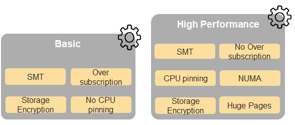
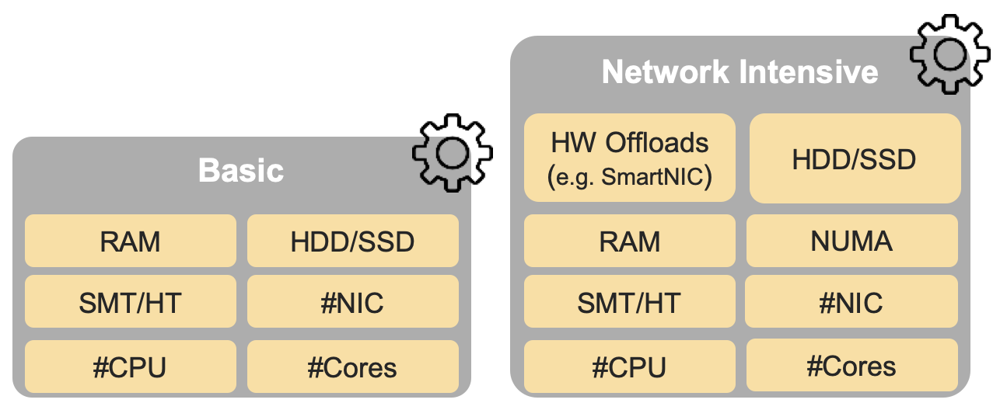
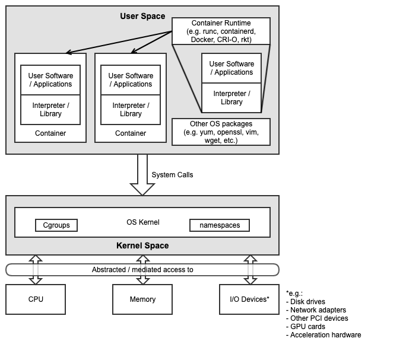
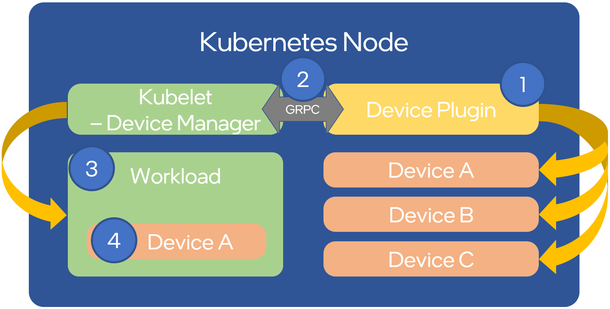
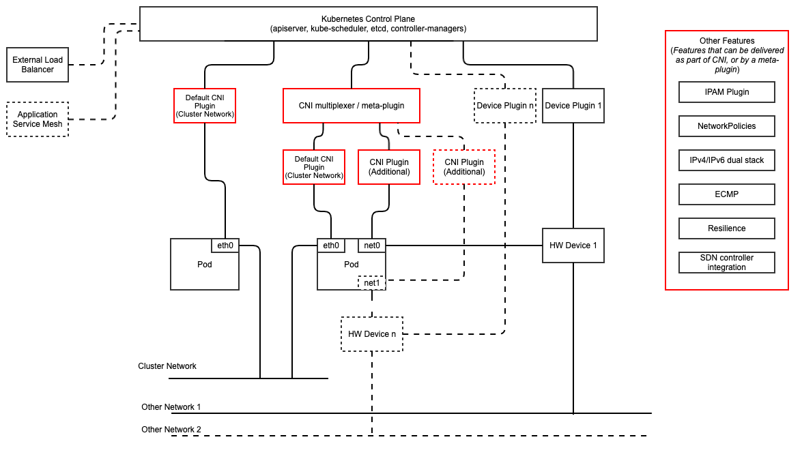
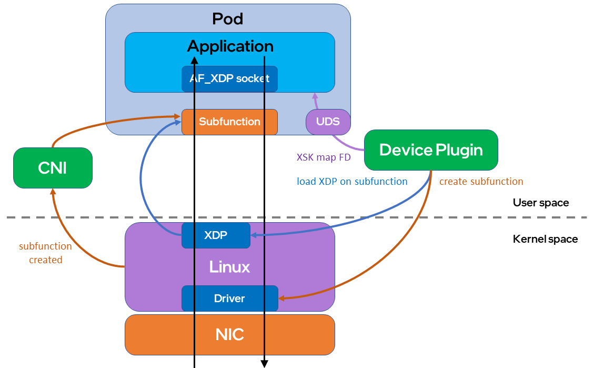

High Level Architecture
=======================

Introduction to High Level Architecture
---------------------------------------

The Anuket Reference Architecture (RA2) for Kubernetes based cloud infrastructure is intended to be an industry
standard-independent Kubernetes reference architecture that is not tied to any specific offering or distribution.
No vendor-specific enhancements are required to achieve conformance with the Anuket specifications.
Conformance to these specifications can be achieved by using upstream components or features that are developed by the
open source community, and conformance is ensured by successfully running the RC2 conformance testing suite.

By using the Reference Architecture (RA2) for Kubernetes based cloud infrastructure specifications, operators can
deploy infrastructure that will run any VNF or CNF that has successfully run on an RA2-conformant infrastructure. The
purpose of this chapter is to outline all the components required to provide Telco-grade Kubernetes in a consistent and
reliable way. The specification of how to setup these components is detailed in the
:ref:`chapters/chapter04:component level architecture` chapter.

Kubernetes is already a well-documented and widely deployed open source project of the Cloud Native
Computing Foundation (CNCF). For information related to standard Kubernetes features and capabilities, refer to
the standard Kubernetes documentation that can be found on the
Kubernetes docs page :cite:p:`kubernetes`.
The following chapters describe the specific features required by the Anuket Reference Architecture, and how they are
expected to be implemented.

While this reference architecture provides options for modular components, such as service mesh, the focus of the
Reference Architecture is on the abstracted interfaces and features that are required for Telco workload management and
execution.

Chapter 4 of the Reference Model (RM) :cite:p:`refmodel` describes the hardware and software profiles
that reflect the capabilities and features that the types of Cloud Infrastructure provide to the workloads.
The figure below depicts a high-level view of the software features that apply to each instance profile (basic and
high-performance).

..
   The original location of this figure was ../../../ref_model/figures/RM-ch05-sw-profile.png but it had to be copied to
   the local folder during the GSMA transformation work.

   (from RM): NFVI software profiles

In addition, the Figure (`NFVI hardware profiles and host associated capabilities` shown below)
depicts the hardware profile features that apply to each instance profile.

..
   The original location of this figure was ../../../ref_model/figures/RM_chap5_fig_5_4_HW_profile.png but it had to be
   copied to the local folder during the GSMA transformation work.

   (from RM): NFVI hardware profiles and host associated capabilities

The features and capabilities described in the software and hardware profiles are considered throughout this RA, with
the requirements traceability to the RM requirements formally documented in the
:ref:`chapters/chapter02:architecture requirements` of this RA.

Infrastructure Services
-----------------------

Container Compute Services
~~~~~~~~~~~~~~~~~~~~~~~~~~

The primary interface between the physical/virtual infrastructure and any container-relevant components is the
Kubernetes Node Operating System. This is the OS within which the container runtime exists, and within which the
containers run, and therefore, the OS whose kernel is shared by the referenced containers. This is shown in
the figure `Kubernetes Node Operating System` below.

   Kubernetes Node Operating System

The Kubernetes Node OS (as with any OS) consists of two main components:

-  Kernel space
-  User space

The kernel is the core of the Operating System, controlling all hardware resources and managing the interaction with
software components. Kernel features include key containerisation capabilities, such as control groups (cgroups) and
namespaces, used and managed by the container runtime to provide isolation between the user space processes. The Kernel
provides an API to applications running in the user space (which usually has its own southbound interface provided
by an interpreter or libraries). This isolation also includes the container itself, as well as any processes running
within it.
The security of the Kubernetes Node OS and its relationship to the containers and the applications running within the
containers, is essential to the overall security posture of the entire system. The platform must be appropriately
secured to ensure that the processes running in one container cannot escalate their privileges on the node or otherwise
affect processes running in an adjacent container. An example of this concept, together with further details, can be
found in :ref:`chapters/chapter06:api and feature testing requirements`.

It is important to note that the container runtime itself is also a set of processes that run in user space, and
therefore also interact with the kernel via system calls. Many diagrams show containers as running on top of the
runtime, or inside the runtime. More accurately, the containers themselves are simply processes running within an OS.
The container runtime is simply another set of processes that are used to manage these containers (pull, run, delete,
and so on) and the kernel features required to provide the isolation mechanisms (cgroups, namespaces, filesystems, and
so on) between the containers.

Container Runtime Services
^^^^^^^^^^^^^^^^^^^^^^^^^^

The Container Runtime is a component that runs within a Kubernetes Node Operating System (OS). It manages the
underlying OS functionality, (such as cgroups and namespaces in Linux), in order to provide a isolated context within
which container images can be executed. It also makes use of the infrastructure resources, such as compute, storage,
networking and other I/O devices, abstracted by the Node node OS, based on API instructions from the kubelet.

There are a number of different container runtimes. The simplest form of runtimes, the low-level container runtimes,
only manage the operating system capabilities, such as cgroups and namespaces, and then run commands from within those
cgroups and namespaces. An example of this type of runtime is runc, which underpins many of the higher-level runtimes
and is considered a reference implementation of the Open Container Initiative (OCI) runtime spec. :cite:p:`ociruntime`
This specification includes details on how an implementation (that
is, an actual container runtime such as runc) must, for example, configure resource shares and limits (such as CPU,
Memory, IOPS) for the containers that Kubernetes (via the kubelet) schedules on that node. This is important to ensure
that the features and capabilities described in the Reference Model :cite:p:`refmodel` are supported
by this RA and delivered by any downstream Reference Implementations (RIs) to the instance types defined in the RM.

Where low-level runtimes are used for the execution of a container within an operating system, the more complex and
complete high-level container runtimes are used for the general management of container images - moving them to where
they need to be executed, unpacking them, and then passing them to the low-level runtime, which then executes the
container. These high-level runtimes also include a comprehensive API that other applications, such as Kubernetes, can
use to interact and manage the containers. An example of this type of runtime is containerd, which provides the
features described above, and depends on runc for execution.

For Kubernetes, the important interface to consider for container management is the Kubernetes Container Runtime
Interface (CRI).
This is an interface specification for any container runtime to integrate with the control plane (kubelet) of a
Kubernetes Node. The CRI allows to decouple the kubelet from the runtime that is running in the node OS, allowing to
swap container runtime as long as it is compliant with CRI. Examples CRI-compliant runtimes include containerd
and cri-o, which are built specifically to work with Kubernetes.

To fulfill ``inf.vir.01``, the architecture should support a container runtime which provides the isolation of the
Operating System kernels.

.. The architecture must support a way to isolate the compute resources of the infrastructure itself from the compute
.. resources of the workloads.

The basic semantics of Kubernetes, and the information found in the manifests, define the built-in Kubernetes objects
and their desired state. The main objects built into Kubernetes include:

.. list-table:: Kubernetes built-in objects
   :widths: 20 80
   :header-rows: 1

   * - Pod and workloads
     - Description
   * - Pod :cite:p:`k8s-docs-pod`
     - A pod is a collection of containers that can run on a node. This resource is created by clients
       and scheduled onto nodes.
   * - ReplicaSet :cite:p:`k8s-docs-replicaset`
     - A ReplicaSet ensures that a specified number of pod replicas are running at any given time.
   * - Deployment :cite:p:`k8s-docs-deployment`
     - A deployment enables declarative updates for pods and ReplicaSets.
   * - DaemonSet :cite:p:`k8s-docs-daemonset`
     - A DaemonSet ensures that the correct nodes run a copy of a pod.
   * - Job :cite:p:`k8s-docs-job`
     - A job represents a task. It creates one or more pods and ensures that the
       specified number of successful completions is completed.
   * - CronJob :cite:p:`k8s-docs-cronjob`
     - A CronJob manages time-based jobs, namely, once or repeatedly at specified times.
   * - StatefulSet :cite:p:`k8s-docs-statefulset`
     - A StatefulSet represents a set of pods with consistent identities. Identities are defined as network and storage.

CPU Management Policies
^^^^^^^^^^^^^^^^^^^^^^^

CPU management has policies to determine placement preferences to use for workloads that are sensitive to cache
affinity or latency. Therefore, these workloads must not be throttled by the kubelet and their processes must not be
scheduled across the CPU cores by the OS scheduler. Additionally, some workloads are sensitive to differences between
the physical cores and the SMT, while others (such as DPDK-based workloads) are designed to run on isolated CPUs
(such as on Linux with a cpuset-based selection of CPUs and isolcpus kernel parameters specifying cores isolated
from the general SMP balancing and scheduler algorithms).

The Kubernetes CPU Manager :cite:p:`k8s-docs-cpumanager` works
with the Topology Manager. Special care needs to be taken of:

-  Supporting isolated CPUs: Using kubelet Reserved CPUs
   and Linux isolcpus allows configuration where only isolcpus are allocatable to pods. Scheduling pods to such nodes
   can be influenced with taints, tolerations and node affinity.
-  Differentiating between physical cores and SMT: When requesting even number of CPU cores for pods, scheduling
   can be influenced with taints, tolerations, and node affinity.

Management of Memory and Huge Pages Resources
^^^^^^^^^^^^^^^^^^^^^^^^^^^^^^^^^^^^^^^^^^^^^

The Reference Model requires the support of huge pages in ``i.cap.018`` which is supported by the upstream Kubernetes
:cite:p:`k8s-docs-hugepages`.

For the correct mapping of huge pages to scheduled pods, both need to have huge pages enabled in the operating
system (configured in kernel and mounted with the correct permissions), as well as kubelet configuration. Multiple
sizes of huge pages can be enabled, such as 2 MiB and 1 GiB.

For some applications, huge pages should be allocated to account for consideration of the underlying hardware
topology. The Memory Manager :cite:p:`k8s-docs-memorymanager` allows
the feature guaranteed memory and huge pages allocation for pods in the Guaranteed QoS class. The Memory Manager
feeds the Topology Manager with hints for the most suitable NUMA affinity.

Hardware Topology Management
^^^^^^^^^^^^^^^^^^^^^^^^^^^^

NUMA nodes are defined as server system architecture divisions of CPU sockets.
Scheduling pods across NUMA boundaries can result in lower performance and higher latencies. This could be an
issue for applications that require optimizations of CPU isolation, memory, and device locality.

Kubernetes supports Topology policy per node :cite:p:`k8s-docs-topologymanager`.
The Topology Manager receives topology information from Hint Providers which identify NUMA nodes and preferred
scheduling. In the case of the pod with a Guaranteed QoS class having integer CPU requests, the static CPU Manager
policy returns topology hints relating to the exclusive CPU. The Device Manager provides hints for the requested
device.

If memory or huge pages are not considered by the Topology Manager, it can be done by the operating system
providing best-effort local page allocation for containers, as long as there is sufficient free local memory on
the node, or with a Control Groups (cgroups) cpuset subsystem that can isolate memory to a single NUMA node.

Node Feature Discovery
^^^^^^^^^^^^^^^^^^^^^^

Node Feature Discovery :cite:p:`k8s-nfd`
(NFD) can run on every node as a daemon or as a job. NFD detects the hardware and software capabilities of each
node and then advertises those capabilities as node labels. Those node labels can be used in scheduling pods by
using the Node Selector or Node Affinity for pods that require such capabilities.

Device Plugin Framework
^^^^^^^^^^^^^^^^^^^^^^^

Device Plugin Framework :cite:p:`k8s-docs-deviceplugin`
advertises device hardware resources to kubelet, with which vendors can implement plugins for devices that may require
vendor-specific activation and lifecycle management, and securely maps these devices to the containers.

The figure Device Plugin Operation below shows in four steps how device plugins operate on a Kubernetes node:

-  1: During setup, the cluster administrator (more in :ref:`chapters/chapter03:operator pattern`)
   knows or discovers (as per :ref:`chapters/chapter03:node feature discovery`) what kind of devices are present on
   the different nodes, selects which devices to enable, and deploys the associated device plugins.
-  2: The plugin reports the devices it found on the node to the Kubelet device manager and starts its gRPC server
   to monitor the devices.
-  3: The user submits a pod specification (workload manifest file) requesting a certain type of device.
-  4: The scheduler determines a suitable node based on device availability and the local kubelet assigns a specific
   device to the pod's containers.

   Device Plugin Operation

An example of an often used device plugin is the
SR-IOV Network Device Plugin  :cite:p:`k8s-sriov-network-device-plugin`. The SR-IOV
Network Device Plugin discovers and advertises SR-IOV Virtual Functions (VFs) available on a Kubernetes node, and is
used to map VFs to scheduled pods. To use it, an SR-IOV CNI is required. A CNI multiplexer plugin (such as
Multus CNI :cite:p:`github-multus`) is also required to provision additional secondary
network interfaces for VFs (beyond the primary network interface). During pod creation, the SR-IOV CNI allocates an
SR-IOV VF to a pod’s network namespace using the VF information given by the meta plugin, and on pod deletion releases
the VF from the pod.

Hardware Acceleration
^^^^^^^^^^^^^^^^^^^^^

Hardware Acceleration Abstraction in RM :cite:p:`refmodel`
describes types of hardware acceleration (CPU instructions, Fixed function accelerators, Firmware-programmable
adapters, SmartNICs and SmartSwitches), and usage for Infrastructure Level Acceleration and Application Level
Acceleration.

Scheduling pods that require, or prefer to run on, nodes with hardware accelerators depend on the type of accelerator
used:

-  CPU instruction sets can be found with Node Feature Discovery
-  Fixed-function accelerators, Firmware-programmable network adapters, and SmartNICs can be found and mapped to pods
   by using Device Plugin.

Scheduling Pods with Non-resilient Applications
^^^^^^^^^^^^^^^^^^^^^^^^^^^^^^^^^^^^^^^^^^^^^^^

Non-resilient applications are sensitive to platform impairments on Compute-like pausing CPU cycles (for example,
because of the OS scheduler) or Networking-like packet drops, reordering, or latencies. Such applications need to be
carefully scheduled on nodes and preferably still decoupled from the infrastructure details of those nodes.

.. list-table:: Categories of applications, requirements for scheduling pods and Kubernetes features
   :widths: 10 20 20 25 25
   :header-rows: 1

   * - No.
     - Intensive on
     - Not intensive on
     - Using hardware acceleration
     - Requirements for optimised pod scheduling
   * - 1
     - Compute
     - Networking (dataplane)
     - No
     - CPU Manager
   * - 2
     - Compute
     - Networking (dataplane)
     - CPU instructions
     - CPU Manager, NFD
   * - 3
     - Compute
     - Networking (dataplane)
     - Fixed-function acceleration, Firmware-programmable network adapters, or SmartNICs
     - CPU Manager, Device Plugin
   * - 4
     - Networking (dataplane)
     -
     - No, or Fixed function acceleration, Firmware- programmable network adapters or SmartNICs
     - Huge pages (for DPDK-based applications); CPU Manager with configuration for isolcpus and SMT; Multiple
       interfaces; NUMA topology; Device Plugin
   * - 5
     - Networking (dataplane)
     -
     - CPU instructions
     - Huge pages (for DPDK-based applications); CPU Manager with configuration for isolcpus and SMT; Multiple
       interfaces; NUMA topology; Device Plugin; NFD

Virtual Machine-based Clusters
^^^^^^^^^^^^^^^^^^^^^^^^^^^^^^

Kubernetes clusters can implement worker nodes with "bare metal" servers (running Container Runtime on Linux host
Operating Systems) or with virtual machines (VMs, running on a hypervisor).

When running in VMs, the following list of configurations shows what is needed for non-resilient applications:

-  CPU Manager managing vCPUs that the hypervisor provides to the VMs.
-  Huge pages enabled in the hypervisor, mapped to the VM, enabled in the guest OS, and mapped to the pod.
-  Hardware Topology Management with NUMA enabled in the hypervisor, mapped into the VM, enabled in the guest OS, if
   needed, and mapped into the pod.
-  If Node Feature Discovery and Device Plugin Framework are required, the required CPU instructions must be enabled in
   the VM virtual hardware. The required devices must be virtualised in the hypervisor or passed through to the Node VM,
   and mapped into the pods.

Container Networking Services
~~~~~~~~~~~~~~~~~~~~~~~~~~~~~

Kubernetes considers networking as a key component, with a number of distinct solutions. By default,
Kubernetes networking is considered to be an “extension” to the core functionality, and is managed through
the use of Network Plugins :cite:p:`k8s-docs-network-plugins`,
which can be categorised based on the topology of the networks they manage, and the integration with the
switching (such as vlan vs tunnels) and routing (such as virtual vs physical gateways) infrastructure
outside the Cluster:

-  **Layer 2 underlay** plugins provide east/west ethernet connectivity between the
   pods, and north/south connectivity between the pods and the external networks by
   using the network underlay (such as VLANs on DC switches). When using the underlay
   for layer 2 segments, configuration is required on the DC network for every network.
-  **Layer 2 overlay** plugins provide east/west pod-to-pod connectivity by creating overlay
   tunnels (for example, VXLAN/GENEVE tunnels) between the nodes, without requiring the
   creation of per-application layer 2 segments on the underlay. North-south connectivity
   cannot be provided.
-  **Layer 3** plugins create a virtual router (for example, BPF, iptables, and kubeproxy) in
   each node and can route traffic between multiple layer 2 overlays via these nodes*.
   North-south traffic is managed by peering (with BGP, for example) virtual routers on the
   nodes with the DC network underlay, allowing each pod or service IP to be announced
   independently.

However, for more complex requirements, such as providing connectivity through acceleration hardware, there are three
approaches that can be taken. The Comparison of example Kubernetes networking solutions table below shows some of the
differences between the networking solutions that consist of these options. It is important to note that different
networking solutions require different descriptors from the Kubernetes workloads (specifically, the deployment
artefacts, such as YAML files, and so on). Therefore, the networking solution should be agreed between the CNF
vendors and the CNF operators. To allow easy integration of CNFs and the platforms, it is recommended to use either
the plain CNI API resources or the API resources defined in the v1.2 of the Kubernetes Network Custom Resource
Definition De-facto Standard :cite:p:`k8s-multi-net-spec`.

- The Default CNI Plugin through the use of a deployment-specific configuration (such as Tungsten Fabric
  :cite:p:`tungstenfabric`
- A **multiplexer/meta-plugin** that integrates with the Kubernetes control plane via a Container Network Interface
  (CNI) and allows for the use of multiple CNI plugins, in order to provide this specific connectivity that the
  default Network Plugin may not be able to provide (such as Multus).

.. _Comparison of example Kubernetes networking solutions:
.. list-table:: Comparison of example Kubernetes networking solutions
   :widths: 33 33 33
   :header-rows: 1

   * - Requirement
     - Networking Solution with Multus
     - Networking Solution with Tungsten Fabric
   * - Additional network connections provider
     - Multiplexer/meta- plugin
     - Federated networking manager
   * - The overlay network encapsulation protocol needs to enable ECMP in the underlay (infra.net.cfg.002)
     - Supported via the additional CNI plugin
     - Supported
   * - NAT (infra.net.cfg.003)
     - Supported via the additional CNI plugin
     - Supported
   * - Network Policies (Security Groups) (infra.net.cfg.004)
     - Supported via a CNI Network Plugin that supports Network Policies
     - Supported via a CNI Network Plugin that supports Network Policies
   * - Traffic patterns symmetry (infra.net.cfg.006)
     - Depends on the CNI plugin that is being used
     - Depends on the CNI plugin that is being used
   * - Centrally administrated and configured (inf.ntw.03)
     - Supported via the Kubernetes API Server
     - Supported via the Kubernetes API Server
   * - Dual stack IPv4 and IPv6 for Kubernetes workloads (inf.ntw.04)
     - Supported via the additional CNI plugin
     - Supported
   * - Integrating SDN controllers (inf.ntw.05)
     - Supported via the additional CNI plugin
     - TF is an SDN controller
   * - More than one networking solution (inf.ntw.06)
     - Supported
     - Supported
   * - Choose whether or not to deploy more than one networking solution (inf.ntw.07)
     - Supported
     - Supported
   * - Kubernetes network model (inf.ntw.08)
     - Supported via the additional CNI plugin
     - Supported
   * - Do not interfere with or cause interference to any interface or network it does not own (inf.ntw.09)
     - Supported
     - Supported
   * - Cluster-wide coordination of IP address assignment (inf.ntw.10)
     - Supported via IPAM CNI plugin
     - Supported

For hardware resources that are needed by the Kubernetes applications, Device
Plugins :cite:p:`k8s-docs-deviceplugin`
can be used to manage those resources and advertise them to the kubelet for use by the Kubernetes
applications. This allows resources such as “GPUs, high-performance NICs, FPGAs, InfiniBand adapters,
and other similar computing resources that may require vendor-specific initialization and setup” to be
managed and consumed via standard interfaces.

The figure `Kubernetes Networking Architecture` below shows the main building blocks of a Kubernetes networking solution:

-  **Kubernetes Control Plane**: this is the core of a Kubernetes Cluster: the apiserver, the etcd cluster,
   the kube-scheduler, and the various controller-managers. The control plane (in particular the apiserver)
   provides a centralised point by which the networking solution is managed using a centralised management API.

-  **Default CNI Plugin (Cluster Network)**: this is the default Cluster network plugin that has been deployed
   within the Cluster to provide IP addresses to the pods.

   .. note::

      Support for IPv6 requires not only changes in the Kubernetes control plane, but also the use of a CNI
      Plugin that supports dual-stack networking.

-  **CNI multiplexer/meta-plugin**: as described above, this is an optional component
   that integrates with the Kubernetes control plane via CNI, but allows for the
   use of multiple CNI plugins and the provision of multiple network connections for
   each Pod, as shown by the use of additional CNI Plugin and ``net0`` connection in
   the Pod. Note that the different network characteristics of the interfaces might
   require different networking technologies, which would potentially require
   different CNI plugins. Also note that this is only required for the High Performance
   profile. An example CNI implementation that meets these requirements is the
   Multus :cite:p:`github-multus`.

-  **CNI Plugin (Additional)**: this is a CNI plugin that is used to provide
   additional networking needs to Pods that are not provided by the default CNI plugin.
   This can include connectivity to underlay networks via accelerated hardware devices.

-  **Device Plugin**: this is a Kubernetes extension that allows for the management
   and advertisement of vendor hardware devices. In particular, devices such as
   FPGA, SR-IOV NICs, SmartNICs, etc. can be made available to Pods by using Device Plugins.
   Note that alignment of these devices, CPU topology and huge pages will need the use
   of the Topology Manager :cite:p:`k8s-docs-topologymanager`.

-  **External / Application Load Balancing**: As Kubernetes Ingress, Egress and
   Services have no support for all the protocols needed in telecommunication
   environments (Diameter, SIP, LDAP, etc) and their capacity is limited, the
   architecture includes the use of alternative load balancers, including external
   or ones built into the application. Management of external load balancers must
   be implemented via Kubernetes API objects.

-  **Other Features**: these additional features that are required by the
   networking solution as a whole, may be delivered by the **"Default CNI Plugin"**,
   or the **"CNI multiplexer/meta-plugin"** if it is deployed. For example:

   -  The integration of SDN solutions required by ``inf.ntw.05`` is enabled
      via CNI integration.
   -  IP Address Management (**IPAM**) of the various networks can be provided
      by one or more IPAM plugins, which can be part of a CNI plugin, or some other
      component (i.e. external SDN solution) - it is key that there are no overlapping
      IP addresses within a Cluster, and if multiple IPAM solutions are used that
      they are coordinated (as required by ``inf.ntw.10``).

-  **Service Mesh**: The well known service meshes are "application service meshes"
   that address and interact with the application layer 7 protocols (eg.: HTTP)
   only. Therefore, their support is not required, as these service meshes are outside
   the scope of the infrastructure layer of this architecture.

   Kubernetes Networking Architecture

..
   <!--The above diagram is maintained here:
   https://wiki.lfnetworking.org/display/LN/CNTT+RA2+-+Kubernetes+-+Diagrams+-+Networking-->

There are a number of different methods involved in managing, configuring and consuming networking resources in
Kubernetes, including:

-  The Default Cluster Network can be installed and managed by config files,
   Kubernetes API Server (e.g., Custom Resource Definitions) or a combination of the
   two.
-  Additional networking management plane (e.g., CNI multiplexer/meta-plugin or
   federated networking manager) can be installed and managed by config files,
   Kubernetes API Server (e.g. Custom Resource Definitions) or a combination of the
   two.
-  The connecting of Pods to the Default Cluster Network is handled by the Default
   CNI Plugin (Cluster Network).
-  The connecting of Pods to the additional networks is handled by the additional
   networking management plane through the Kubernetes API (e.g., Custom Resource
   Definitions, Device Plugin API).
-  Configuration of these additional network connections to Pods (i.e., provision of
   an IP address to a Pod) can either be managed through the Kubernetes API (e.g.
   Custom Resource Definitions) or an external management plane (e.g., dynamic
   address assignment from a VPN server).

There are several types of low latency and high throughput networks required by telco workloads: for example signalling
traffic workloads and user plane traffic workloads.
Networks used for signalling traffic are more demanding than what a standard overlay network can handle, but still do
not need the use of user space networking. Due to the nature of the signalling protocols used, these type of
networks require NAT-less communication documented in ``infra.net.cfg.003`` and will need to be served by a CNI plugin
with IPVLAN or MACVLAN support. On the other hand, the low latency, high throughput networks used for handling the user
plane traffic require the capability to use an accelerated user space networking technology.

   Note: An infrastructure can provide the possibility to use SR-IOV with DPDK as
   an additional feature and still be conformant with Anuket.

..
   Editors note: The possibility to SR-IOV for DPDK is under discussion.

   Refer to software and hardware profile features at
   :ref:`ref_model:chapters/chapter05:cloud infrastructure software profiles features and requirements`.

AF_XDP Architecture
^^^^^^^^^^^^^^^^^^^

AF_XDP (Address Family for eXpress Data Path) is an address family optimized for high-performance packet processing
applications, described in Reference Model Chapter 3 section Address Family For XDP (AF_XDP) :cite:p:`refmodel`.

The :cite:p:`afxdp-device-plugin` running with higher privileges, is loading the eBPF program. The AF_XDP Device
Plugin provides the netdev name which the AF_XDP CNI moves into the pod namespace. That way the AF_XDP Socket file
descriptor is provided (via UNIX domain socket) to the application container after the pod has started.  The CNI
provides support to set appropriate ethtool filters, and does not rename the netdev which remains in the UP state.

Such applications can have pods with multiple network interfaces of which one is AF_XDP, and on that interface run user
space libraries for AF_XDP from project :cite:p:`cndp`, or directly receive and send raw packets over AF_XDP. DPDK
applications can use the :cite:p:`afxdp-pmd`.

Kubernetes Networking Semantics
~~~~~~~~~~~~~~~~~~~~~~~~~~~~~~~

Support for advanced network configuration management does not exist in core Kubernetes. Kubernetes is missing
the advanced networking configuration component of Infrastructure as a Service (IaaS). For example, there is no
network configuration API and there is no way to create L2 networks and instantiate network services such as
L3aaS and LBaaS, and then connect them all together.

Kubernetes networking can be divided into two parts: built-in network functionality, available through the pod’s
mandatory primary interface, and network functionality, available through the pod’s optional secondary interfaces.

Built-in Kubernetes Network Functionality
^^^^^^^^^^^^^^^^^^^^^^^^^^^^^^^^^^^^^^^^^

Vanilla Kubernetes only allows for one network, the *cluster* network, and one network attachment for each pod.
All pods and containers have a primary interface, which is created by Kubernetes during pod creation and attached
to the cluster network. All communication to and from the pod is done through this interface. To only allow for one
interface in a pod removes the need for traditional networking tools such as *VRFs* and additional routes and routing
tables inside the pod network namespace.

The basic semantics of Kubernetes, and the information found in the manifests, defines the connectivity rules and
behavior without any references to IP addresses. This has many advantages: it makes it easy to create portable,
scalable software services and network policies for them that are not location-aware and therefore can be executed
more or less anywhere.

.. list-table:: Kubernetes networking built-in objects
   :widths: 20 80
   :header-rows: 1

   * - Network objects
     - Description
   * - Ingress :cite:p:`k8s-docs-ingress`
     - Ingress is a collection of rules that allow inbound connections to reach the endpoints defined by a backend.
       An Ingress can be configured to give services URLs that are reachable externally, load balance traffic, terminate
       SSL, offer name-based virtual hosting, and so on.
   * - Service :cite:p:`k8s-docs-service`
     - A service is a named abstraction of an application that runs on a set of pods. The application consists of a
       local port (for example, 3306) on which the proxy listens, and a selector that determines which pods answer
       requests sent through the proxy.
   * - EndpointSlices :cite:p:`k8s-docs-endpointslices`
     - Endpoints and Endpointslices are a collection of objects that contain the IP addresses, (IPv4 and IPv6) of the
       pods that represent a service.
   * - Network Policies :cite:p:`k8s-docs-networkpolicies`
     - A Network Policy defines which network traffic is allowed to ingress and egress from a set of pods.

There is no need to explicitly define internal load balancers, server pools, service monitors, firewalls, and so on.
The Kubernetes semantics and the relationship between the different objects defined in the object manifests contains
all the necessary information.

Example: The manifests for the my-service service and the deployment with the four load balanced pods of the *my-app*
type.

Service:

::

   apiVersion: v1
   kind: Service
   metadata:
           name: my-service
           spec:
                   selector:
                           app: my-app
                   ports:
                           - protocol: TCP
                                   port: 123

Deployment:

::

   apiVersion: apps/v1
   kind: Deployment
   metadata: name: my-app-deployment
   spec:
           selector:
                   matchLabels:
                           app: my-app
                           replicas: 4
                           template:
                                   metadata:
                                           labels:
                                                   app: my-app
                           spec:
                                   containers:
                                           - name: my-app
                                             image: my-app-1.2.3
                                             ports:
                                             - containerPort: 123

This is all that is required to deploy four pods or containers that are fronted by a service that performs load
balancing. The *Deployment* ensures that there are always four pods of the *my-app* type available. The *Deployment*
is responsible for the full lifecycle management of the pods. This includes in-service updates and upgrades.

However, when implementing network service functions, such as VNFs/CNFs, that operate on multiple networks and require
advanced networking configurations, additional capabilities are required.

Multiple Networks and Advanced Configurations
^^^^^^^^^^^^^^^^^^^^^^^^^^^^^^^^^^^^^^^^^^^^^

Kubernetes currently does not in itself support multiple networks, multiple-pod network attachments, or advanced
network configurations. These are supported by using a
Container Network Interface :cite:p:`cni` multiplexer such as
Multus :cite:p:`github-multus`.
A considerable effort is being invested to add better network support to Kubernetes. All such activities are
coordinated through the kubernetes
Network Special Interest Group :cite:p:`sig-network` and its sub-groups.
One such group, the Network Plumbing Working Group :cite:p:`k8s-npwg` has
produced the
Kubernetes Network Custom Resource Definition De-facto Standard :cite:p:`k8s-multi-net-spec`.
This document describes how secondary networks can be defined and attached to pods.

This de-facto standard defines, among other things, the following concepts:

.. list-table:: Kubernetes multiple network concepts
   :widths: 40 60
   :header-rows: 1

   * - Definition
     - Description
   * - Kubernetes Cluster-Wide default network
     - This is a network to which all pods are attached according to the current behavior and requirements of
       Kubernetes. This is done by attaching the eth0 interface to the pod namespace.
   * - Network Attachment
     - Network Attachment is a means of allowing a pod to communicate directly with a given logical or physical network.
       Typically (but not necessarily), each attachment takes the form of a kernel network interface placed into the
       pod’s network namespace. Each attachment may result in zero or multiple IP addresses being assigned to the pod.
   * - NetworkAttachmentDefinition object
     - The NetworkAttachmentDefinition object defines the resource object that describes how to attach a pod to a
       logical or physical network. The annotation name is “k8s.v1.cni.cncf.io/networks”.
   * - Network Attachment Selection Annotation
     - Network Attachment Selection Annotation selects one or more networks to which a pod must be attached.

Example: Define three network attachments and attach the three networks to a pod.

Green network

::

   apiVersion: "k8s.cni.cncf.io/v1"
   kind: NetworkAttachmentDefinition
   metadata:
     name:green-network
   spec:
     config: '{
       "cniVersion": "0.3.0",
       "type": "plugin-A",
       "vlan": "1234"
     }'

Blue network

::

   apiVersion: "k8s.cni.cncf.io/v1"
   kind: NetworkAttachmentDefinition
   metadata:
     name:blue-network
   spec:
     config: '{
       "cniVersion": "0.3.0",
       "type": "plugin-A",
       "vlan": "3456"
     }'

Red network

::

   apiVersion: "k8s.cni.cncf.io/v1"
   kind: NetworkAttachmentDefinition
   metadata:
     name:red-network
   spec:
     config: '{
       "cniVersion": "0.3.0",
       "type": "plugin-B",
       "knid": "123456789"
     }'

Pod my-pod

::

   kind: Pod
   metadata:
     name: my-pod
     namespace: my-namespace
     annotations:
       k8s.v1.cni.cncf.io/networks: blue-network, green-network, red-network

This is enough to support basic network configuration management. It is possible to map L2 networks from an external
network infrastructure into a Kubernetes system and attach pods to these networks. Support for IPv4 and IPv6 address
management is, however, limited. The address must be assigned by the CNI plugin as part of the pod creation process.

Container Storage Services
~~~~~~~~~~~~~~~~~~~~~~~~~~

Kubernetes supports the Container Storage Interface (CSI) as the stable solution for storage plugins (in-tree volume
plugins are moved out of the Kubernetes repository).

Running containers require ephemeral storage on which to run themselves (that is, storage on which the unpacked
container image is stored and from which it is executed). This ephemeral storage lives and dies with the container and
is a directory on the worker node on which the container is running.

.. note::
   This means that the ephemeral storage is mounted locally in the worker node filesystem. The filesystem can be
   physically external to the worker node (for example, iSCSI, NFS, and FC), but the container still references it as part
   of the local filesystem.

Additional storage could also be attached to a container through the use of Kubernetes Volumes. This can be storage
from the worker node filesystem (through hostPaths, although this is not recommended), or it can be external storage
that is accessed through the use of a Volume Plugin. Volume Plugins allow the use of a storage protocol (such as iSCSI
and NFS) or a management API (such as Cinder and EBS) for attaching and mounting the storage into a pod. This additional
storage that is attached to a container using a Kubernetes Volume does not live and die with the container, but instead
follows the lifecycle of the pod of which the container is a part. This means the Volume persists across container
restarts, as long as the pod itself is still running. However, it does not necessarily persist when a pod is destroyed.
Therefore, it cannot be considered suitable for any scenario requiring persistent data. The lifecycle of the actual data
depends on the Volume Plugin used and sometimes also the configuration of the Volume Plugin.

For those scenarios where data persistence is required, Persistent Volumes (PVs) are used in Kubernetes. PVs are
resources in a Kubernetes Cluster that are consumed by Persistent Volume Claims (PVCs) and have a lifecycle that is
independent of any pod that uses a PV. A pod uses a PVC as the volume in the pod spec. A PVC is a request for
persistent storage (a PV) by a pod. By default, PVs and PVCs are manually created and deleted.

Kubernetes also provides Storage Classes. Storage Classes are created by Cluster administrators and maps to storage
attributes such as quality-of-service, encryption, data resilience, and so on. Storage Classes also enable the dynamic
provisioning of Persistent Volumes (as opposed to the default manual creation). This can be beneficial for organizations
where the administration of storage is performed separately from the administration of Kubernetes-based workloads.

Kubernetes does not place any restrictions on the storage that can be consumed by a workload, in terms of the
requirements that are defined in the RM sections Storage Configurations (hardware) and Virtual Storage (software). The
only difference is that Kubernetes does not have a native object storage offering. Addressing this capability gap
directly is outside of the scope of this RA.

Kubernetes Application package manager
~~~~~~~~~~~~~~~~~~~~~~~~~~~~~~~~~~~~~~

To manage the lifecycle (for example, install and configure, upgrade, and uninstall) of complex applications consisting
of several pods and other Kubernetes objects, the Reference Architecture mandates the use of a specific Kubernetes
Application package manager. The package manager must be able to manage the lifecycle of an application and provide a
framework to customize a set of parameters for its deployment. The requirement for the clusters is to expose a
Kubernetes API for the package managers to use in the lifecycle management of the applications they manage. This must
comply with the CNCF CNF conformance test. As it is not recommended to use a Kubernetes Application package manager with
a server side component installed in the Kubernetes Cluster (for example, Tiller), Helm v3 :cite:p:`helm-docs`
is the chosen Kubernetes Application package manager.

Custom Resources
~~~~~~~~~~~~~~~~

Custom resources :cite:p:`k8s-docs-cr` are
extensions of the Kubernetes API that represent customizations of the Kubernetes installation. Core Kubernetes functions
are also built using custom resources. This makes Kubernetes more modular. Two ways to add custom resources are the
following:

-  Custom Resource Definitions :cite:p:`k8s-docs-crd`
   (CRDs): Defining a CRD object creates new custom resource with a name and schema that are easy to use.
-  API Server Aggregation :cite:p:`k8s-docs-apisa`:
   This is an
   additional API that, in a flexible way, extends Kubernetes beyond the core Kubernetes API.

Operator Pattern
^^^^^^^^^^^^^^^^

A custom controller
:cite:p:`k8s-docs-cc`
is a control loop that watches a custom resource for changes and tries to keep the current state of the resource
in sync with the desired state.

The Operator pattern :cite:p:`k8s-docs-operator` combines custom resources and
custom controllers. Operators are software extensions to Kubernetes that capture operational knowledge and automate
usage of custom resources to manage applications, their components, and cloud infrastructure. Operators can have
different capability levels. According to the OperatorHub.io :cite:p:`operatorhub` repository, an operator can
have the following different capability levels:

-  Basic install: Automated application provisioning and configuration management.
-  Seamless upgrades: Patch and minor version upgrades are supported.
-  Full lifecycle: Application lifecycle and storage lifecycle (backup and failure recovery).
-  Deep insights: Metrics, alerts, log processing, and workload analysis.
-  Auto pilot: Horizontal/vertical scaling, automated configuration tuning, abnormality detection, and scheduling
   tuning.

CaaS Manager - Cluster Lifecycle Management
-------------------------------------------

   .. note::
      *detailed requirements and the component specification of cluster LCM are out of scope for this release.*

To provision multiple Kubernetes Clusters, which is a common scenario where workloads and network functions require
dedicated, single-tenant clusters, the Reference Architecture provides support for a **CaaS Manager**, a component
responsible for the lifecycle management of multiple Kubernetes clusters. This component is responsible for delivering
an end-to-end lifecycle management (creation and installation, scaling, updating, deleting, and so on, of entire
clusters), visibility and control of CaaS clusters, together with verification of security and compliance of Kubernetes
clusters across multiple data centers and clouds. Specifically, the scope of the CaaS Manager comprises the following:

-  Infrastructure (Kubernetes Clusters) provisioning. This comprises either of the following:

   -  LCM of control/worker VM nodes - via IaaS API.
   -  Bare metal provisioning for physical nodes.

-  Control plane installation (that is, Kubernetes control plane components on the nodes).

-  Node node OS customization (for example, Kernel customization).

-  Management of Cluster add-ons (for example, CNIs, CSIs, and Service Meshes).

The CaaS Manager maintains a catalog of **cluster templates**. These templates are used to create clusters specific to
the requirements of workloads, the underlying virtualization provider, and/or the specific server hardware to be used
for the cluster.

The CaaS manager works by integrating with an underlying virtualization provider for VM-based clusters, or with bare
metal management APIs for physical clusters, to create cluster nodes and provide other capabilities, such as node
scaling (for example, provisioning a new node and attaching it to a cluster).

A CaaS Manager leverages the closed-loop desired state configuration management concept that Kubernetes itself enables.
This means that the CaaS Manager takes the desired state of a CaaS cluster as input and the controller must be able to
maintain that desired state through a series of closed loops.
