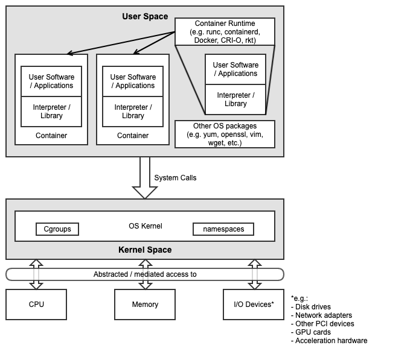

[<< Back](../../openstack)

# 4. Component Level Architecture

## Table of Contents
* [4.1 Introduction](#4.1)
* [4.2 Host OS](#4.2)
* [4.3 Kubernetes](#4.3)
* [4.4 Container runtimes](#4.4)
* [4.5 CNI plugins](#4.5)
* [4.6 Storage components](#4.6)
* [4.7 Service meshes](#4.7)
* [4.8 Container package managers](#4.8)
* [4.9 Supplementary components](#4.9)

## 4.1 Introduction

This chapter will describe in detail the Kubernetes Reference Architecture in terms of the functional capabilities and how they relate to the Reference Model requirements, i.e. how the infrastructure profiles are delivered and described.

Figure 4-1 below shows the architectural components that are described in the subsequent sections of this chapter.

<b>Figure 4-1:</b> Kubernetes Reference Architecture

## 4.2 Host OS

The primary interface between the Physical / Virtual Infrastructure and any container-relevant components is the Host Operating System.  This is the OS within which the container runtime exists, and within which the containers run (and therefore, the OS whose kernel is shared by said containers).  This is shown in Figure 4-1 below.

<b>Figure 4-1:</b> Kubernetes Host Operating System

The Host OS (as with any OS) consists of two main layers:
- Kernel space
- User space

The Kernel is the tightly controlled space that provides an API via system calls to applications running in the user space (which usually have their own southbound interface in an interpreter or libraries).  Key containerisation capabilities such as Control Groups (cgroups) and namespaces are kernel features, and are used and managed by the container runtime in order to provide isolation between the user space processes (of which the container itself is one, and the processes running within the container are also).  The Host OS is key therefore to the overall security posture and must be appropriately secured to ensure processes running in one container cannot escalate their privileges, for example (covered further in [chapter 6](./chapter06.md)).

A key thing to note is that the container runtime itself is also a set of processes that run in user space, and interact with the kernel via system calls as well.  Many diagrams will show containers as running on top of the runtime, or inside the runtime.  More accurately, the containers themselves are simply some processes running within an OS, and the container runtime is another set of processes that are used to manage those containers (pull, run, delete, etc.) and the kernel features required to provide the isolation (cgroups, namespaces, filesystems, etc.).

In order for a Host OS to be compliant with this Reference Architecture it must meet the following requirements:
- A deb/rpm compatible distribution of Linux (this must be used for the master nodes, and can be used for worker nodes)
- Windows Server 2019 (this can be used for worker nodes, but be aware of the [limitations](https://kubernetes.io/docs/setup/production-environment/windows/intro-windows-in-kubernetes/#limitations))
- Master node services (e.g. kube-apiserver) and worker node services (e.g. consumer workloads) must be kept separate - i.e. there must be at least one master node, and at least one worker node

## 4.3 Kubernetes

> This chapter should discuss:
> * The version of version range of Kubernetes and the mandatory components needed for Kubernetes (e.g.: etcd, cadvisor)
> * Which optional features are used and which optional API-s are available
> * Which [alfa or beta features](https://kubernetes.io/docs/reference/command-line-tools-reference/feature-gates/) are used

## 4.4 Container runtimes

In order to be compliant with this architecture, the chosen runtime must be compliant with the [Kubernetes Container Runtime Interface (CRI)](https://kubernetes.io/blog/2016/12/container-runtime-interface-cri-in-kubernetes/).

If privileged containers are required (not recommended) then a container runtime that provides additional security isolation is required.  This could be via the use of lightweight virtual machines (e.g. Kata) or alternative sandbox methods (e.g. gVisor).

## 4.5 CNI plugins

> This chapter should describe which CNI plugins are part of the Rerefence Architecture.

## 4.5 Storage components

> This chapter should describe the components used to provide storage services by the reference architecture.

## 4.7 Service meshes

> This chapter should describe which service meshes are part of the Reference Architecture. For the shake of simplcity this chapter should discuss both the "normal" service meshes and Network Service Mesh.

## 4.8 Kubernetes Application package manager

The reference architecture must support the usage of a Kubernetes Application package manager using the Kubernetes API-s, like [Helm v3](https://v3.helm.sh/).

## 4.9 Supplementary components (okay, this is a bad heading, but I do not have any better)

> This chapter should list all the supplementary components needed to provide the services defined in Chapter 3.2 (e.g: Prometheus)
