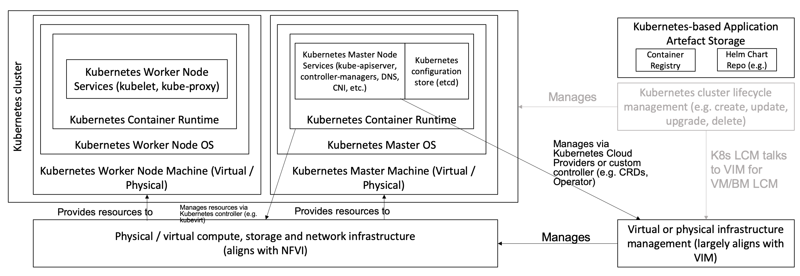

Component Level Architecture
============================

Introduction to Component Level Architecture
--------------------------------------------

This section describes in detail the Reference Architecture (RA2) for Kubernetes-based cloud infrastructure in terms
of the functional capabilities and how they relate to the Reference Model (RM)
requirements, that is, how the infrastructure profiles are determined, documented,
and delivered.

The specifications defined in this section will be detailed with unique
identifiers, which will follow the pattern: ``ra2.<section>.<index>``, for example,
``ra2.ch.001`` for the first requirement in the Kubernetes Node section. These
specifications will then be used as requirements input for the Reference Implementation based on RA2 specifications
(RI2) and any vendor or community implementations.

The Kubernetes Reference Architecture figure below shows the architectural components that are described in the
subsequent sections of this chapter.

   Kubernetes Reference Architecture

Kubernetes Node
---------------

This section describes the configuration that will be applied to the physical or
virtual machine and an installed Operating System. For a Kubernetes Node
to be conformant with the Reference Architecture, it must be implemented according to
the following specifications:

.. list-table:: Node Specifications
   :widths: 10 10 40 20 20
   :header-rows: 1

   * - Ref
     - Specification
     - Details
     - Requirement Trace
     - Reference Implementation Trace
   * - ra2.ch.001
     - Huge pages
     - For the platform to qualify as a high-performance profile, it must be possible to enable Huge pages
       (2048KiB and 1048576KiB) within the Kubernetes Node OS, exposing schedulable resources hugepages-2Mi and
       hugepages-1Gi.
     - infra.com.cfg.004 :cite:t:`refmodel` Chapter 5, section Virtual Compute
     - :cite:t:`anuket-ri2` Chapter 3, section Introduction
   * - ra2.ch.002
     - SR-IOV capable NICs
     - For the platform to qualify as a high-performance profile, the physical machines on which the Kubernetes
       Nodes run must be equipped with NICs that are SR-IOV-capable.
     - e.cap.013 :cite:t:`refmodel` Chapter 4, section Exposed Performance Optimisation Capabilities
     - :cite:t:`anuket-ri2` Chapter 3, section Infrastructure Requirements
   * - ra2.ch.003
     - SR-IOV Virtual Functions
     - For the platform to qualify as a high-performance profile, SR-IOV virtual functions (VFs) must be
       configured within the Kubernetes Node OS, as the SR-IOV Device Plugin does not manage the creation of these VFs.
     - e.cap.013 :cite:t:`refmodel` Chapter 4, section Exposed Performance Optimisation Capabilities
     - :cite:t:`anuket-ri2` Chapter 4, section Installation on Bare Metal Infratructure
   * - ra2.ch.004
     - CPU Simultaneous Multi-Threading (SMT)
     - SMT must be enabled in the BIOS on the physical machine on which the Kubernetes Node runs.
     - infra.hw.cpu.cfg.004 :cite:t:`refmodel` Chapter 5, section Compute Resources
     - :cite:t:`anuket-ri2` Chapter 3, section Infrastructure Requirements
   * - ra2.ch.005
     - CPU Allocation Ratio - VMs
     - For Kubernetes nodes running as Virtual Machines, the CPU allocation ratio between the vCPU and the physical CPU
       core must be 1:1.
     -
     -
   * - ra2.ch.006
     - CPU Allocation Ratio - Pods
     - To ensure the CPU allocation ratio between the vCPU and the physical CPU core is 1:1, the sum of the CPU requests
       and limits by the containers in the Pod specifications must remain less than the allocatable quantity of CPU
       resources (that is, requests.cpu < allocatable.cpu and limits.cpu < allocatable.cpu).
     - infra.com.cfg.001 :cite:t:`refmodel` Chapter 5, section Virtual Compute Profiles
     - :cite:t:`anuket-ri2` Chapter 3, section Infrastructure Requirements
   * - ra2.ch.007
     - IPv6DualStack
     - To support IPv4/IPv6 dual-stack networking, the Kubernetes Node OS must support and be allocated routable IPv4
       and IPv6 addresses.
     -
     -
   * - ra2.ch.008
     - Physical CPU Quantity
     - The physical machines on which the Kubernetes nodes run must be equipped with at least two (2) physical sockets,
       each with at least 20 CPU cores.
     - infra.hw.cpu.cfg.001 and infra.hw.cpu.cfg.002 from :cite:t:`refmodel` Chapter 8, section Telco Edge Cloud:
       Infrastructure Profiles
     - :cite:t:`anuket-ri2` Chapter 3, section Infrastructure Requirements
   * - ra2.ch.009
     - Physical Storage
     - The physical machines on which the Kubernetes nodes run should be equipped with solid-state drives (SSDs).
     - infra.hw.stg.ssd.cfg.002 from :cite:t:`refmodel` Chapter 5, section Storage Configurations
     - :cite:t:`anuket-ri2` Chapter 3, section Infrastructure Requirements
   * - ra2.ch.010
     - Local Filesystem Storage Quantity
     - The Kubernetes nodes must be equipped with local filesystem capacity of at least 320 GB for unpacking and
       executing containers.

       .. note::

        Extra filesystem storage should be provisioned to cater for any overheads required by the Operating
        System and any required OS processes, such as the container runtime, Kubernetes agents, and so on.

     - e.cap.003 from :cite:t:`refmodel` Chapter 4, section Exposed Resource Capabilities
     - :cite:t:`anuket-ri2` Chapter 3, section Infrastructure Requirements
   * - ra2.ch.011
     - Virtual Node CPU Quantity
     - If using VMs, the Kubernetes nodes must be equipped with at least 16 vCPUs.

       .. note::

        Extra CPU capacity should be provisioned to cater for any overheads required by the Operating System and any
        required OS processes, such as the container runtime, Kubernetes agents, and so on.

     - - e.cap.001 from :cite:t:`refmodel` Chapter 4, section Exposed Resource Capabilities
     -
   * - ra2.ch.012
     - Kubernetes Node RAM Quantity
     - The Kubernetes nodes must be equipped with at least 32 GB of RAM.

       .. note::

        Extra RAM capacity should be provisioned to cater for any overheads required by the Operating System and any
        required OS processes, such as the container runtime, Kubernetes agents, and so on.

     - e.cap.002 from :cite:t:`refmodel` Chapter 4, section Exposed Resource Capabilities
     - :cite:t:`anuket-ri2` Chapter 3, section Infrastructure Requirements
   * - ra2.ch.013
     - Physical NIC Quantity
     - The physical machines on which the Kubernetes nodes run must be equipped with at least four (4) Network Interface
       Card (NIC) ports.
     - infra.hw.nic.cfg.001 from :cite:t:`refmodel` Chapter 5, section NIC configurations
     - :cite:t:`anuket-ri2` Chapter 3, section Infrastructure Requirements
   * - ra2.ch.014
     - Physical NIC Speed - Basic Profile
     - The speed of the NIC ports housed in the physical machines on which the Kubernetes Nodes run for workloads
       matching the Basic Profile must be at least 10 Gbps.
     - infra.hw.nic.cfg.001 from :cite:t:`refmodel` Chapter 5, section NIC configurations
     - :cite:t:`anuket-ri2` Chapter 3, section Infrastructure Requirements
   * - ra2.ch.015
     - Physical NIC Speed - High Performance Profile
     - The speed of the NIC ports housed in the physical machines on which the Kubernetes nodes run for workloads
       matching the high-performance profile must be at least 25 Gbps.
     - infra.hw.nic.cfg.001 from :cite:t:`refmodel` Chapter 5, section NIC configurations
     - :cite:t:`anuket-ri2` Chapter 3, section Infrastructure Requirements
   * - ra2.ch.016
     - Physical PCIe slots
     - The physical machines on which the Kubernetes nodes run must be equipped with at least eight (8) Gen3.0 PCIe
       slots, each with at least eight (8) lanes.
     -
     -
   * - ra2.ch.017
     - Immutable infrastructure
     - Whether physical or virtual machines are used, the Kubernetes node must not be changed after it is instantiated.
       New changes to the Kubernetes node must be implemented as new node instances. This covers any changes from the
       BIOS, through the Operating System, to running processes and all associated configurations.
     - gen.cnt.02 from :cite:t:`anuket-ra1` Chapter 2, section General Recommendations
     - :cite:t:`anuket-ri2` Chapter 4, section Installation on Bare Metal Infratructure
   * - ra2.ch.018
     - NFD
     - :cite:t:`k8s-nfd-sig` must be used to advertise the detailed software and hardware capabilities of each node in
       the Kubernetes Cluster.
     - tbd
     - :cite:t:`anuket-ri2` Chapter 4, section Installation on Bare Metal Infratructure

Node Operating System
---------------------

For a Host OS to be compliant with this Reference Architecture, it must meet the following requirements:

.. list-table:: Operating System requirements
   :widths: 10 10 40 20 20
   :header-rows: 1

   * - Ref
     - Specification
     - Details
     - Requirement Trace
     - Reference Implementation Trace
   * - ra2.os.001
     - Linux Distribution
     - A deb-/rpm-compatible distribution of Linux. It must be used for the control plane nodes. It can also be used for
       worker nodes.
     - tbd
     - tbd
   * - ra2.os.002
     - Linux kernel version
     - A version of the Linux kernel that is compatible with container runtimes and kubeadm - this has been chosen as
       the baseline because kubeadm is focused on installing and managing the lifecycle of Kubernetes and nothing else,
       hence it is easily integrated into higher-level and more complete tooling for the full lifecycle management of
       the infrastructure, cluster add-ons, and so on.
     - tbd
     - tbd
   * - ra2.os.003
     - Windows server
     - The Windows server can be used for worker nodes, but beware of the limitations.
     - tbd
     - tbd
   * - ra2.os.004
     - Disposable OS
     - In order to support gen.cnt.02 in :ref:`chapters/chapter02:kubernetes architecture requirements` (immutable
       infrastructure), the Host OS must be disposable, meaning the configuration of the Host OS (and associated
       infrastructure such as VM or bare metal server) must be consistent - e.g. the system software and configuration
       of that software must be identical apart from those areas of configuration that must be different such as IP
       addresses and hostnames.
     - tbd
     - tbd
   * - ra2.os.005
     - Automated deployment
     - This approach to configuration management supports lcm.gen.01 (automated deployments).
     - tbd
     - tbd

Table 4.3 lists the kernel versions that comply with this Reference Architecture specification.

.. list-table:: Operating System versions
   :widths: 20 20 20
   :header-rows: 1

   * - OS Family
     - Kernel Version(s)
     - Notes
   * - Linux
     - 4.x
     - The overlay filesystem snapshotter, used by default by containerd, uses features that were finalized in the 4.x
       kernel series.
   * - Windows
     - 1809 (10.0.17763)
     - For worker nodes only.

Kubernetes
----------

For the Kubernetes components to be conformant with the Reference Architecture they must be implemented according to the
following specifications:

.. list-table:: Kubernetes Specifications
   :widths: 10 10 40 20 20
   :header-rows: 1

   * - Ref
     - Specification
     - Details
     - Requirement Trace
     - Reference Implementation Trace
   * - ra2.k8s.001
     - Kubernetes conformance
     - The Kubernetes distribution, product, or installer used in the implementation must be listed in the
       :cite:t:`k8s-distributions` and marked (X) as conformant for the Kubernetes version defined in
       :ref:`chapters/chapter01:required component versions`.
     - gen.cnt.03 in :ref:`chapters/chapter02:kubernetes architecture requirements`
     - :cite:t:`anuket-ri2` Chapter 4, section Installation on Bare Metal Infratructure
   * - ra2.k8s.002
     - Highly available etcd
     - An implementation must consist of either three, five or seven nodes running the etcd service (can be colocated
       on the control plane nodes, or can run on separate nodes, but not on worker nodes).
     - gen.rsl.02 in :ref:`chapters/chapter02:kubernetes architecture requirements`,
       gen.avl.01 in :ref:`chapters/chapter02:kubernetes architecture requirements`
     - :cite:t:`anuket-ri2` Chapter 4, section Installation on Bare Metal Infratructure
   * - ra2.k8s.003
     - Highly available control plane
     - An implementation must consist of at least one control plane node per availability zone or fault domain to
       ensure the high availability and resilience of the Kubernetes control plane services.
     -
     -
   * - ra2.k8s.012
     - Control plane services
     - A control plane node must run at least the following Kubernetes control plane services: kube-apiserver,
       kube-scheduler and kube-controller-manager.
     - gen.rsl.02 in :ref:`chapters/chapter02:kubernetes architecture requirements`,
       gen.avl.01 in :ref:`chapters/chapter02:kubernetes architecture requirements`
     - :cite:t:`anuket-ri2` Chapter 4, section Installation on Bare Metal Infratructure
   * - ra2.k8s.004
     - Highly available worker nodes
     - An implementation must consist of at least one worker node per availability zone or fault domain to ensure the
       high availability and resilience of workloads managed by Kubernetes
     - en.rsl.01 in :ref:`chapters/chapter02:kubernetes architecture requirements`,
       gen.avl.01 in :ref:`chapters/chapter02:kubernetes architecture requirements`,
       kcm.gen.02 in :ref:`chapters/chapter02:kubernetes architecture requirements`,
       inf.com.02 in :ref:`chapters/chapter02:Infrastructure Recommendations`
     -
   * - ra2.k8s.005
     - Kubernetes API Version
     - In alignment with the :cite:t:`k8s-version-skew-policy`, an implementation must use a Kubernetes version as per
       the subcomponent versions table in :ref:`chapters/chapter01:required component versions`.
     -
     -
   * - ra2.k8s.006
     - NUMA support
     - When hosting workloads matching the high-performance profile, the TopologyManager and CPUManager feature gates
       must be enabled and configured in the kubelet.
       --feature-gates="..., TopologyManager=true,CPUManager=true" --topology-manager-policy=single-numa-node
       --cpu-manager-policy=static

       .. note::

          The TopologyManager feature is enabled by default in Kubernetes v1.18 and later, and the CPUManager feature
          is enabled by default in Kubernetes v1.10 and later.

     - e.cap.007 in :ref:`chapters/chapter02:cloud infrastructure software profile capabilities`,
       infra.com.cfg.002 in :ref:`ref_model:chapters/chapter05:Virtual Compute Profiles`, e.cap.013 :cite:t:`refmodel`
       Chapter 8, section Exposed Performance Optimisation Capabilities
     -
   * - ra2.k8s.007
     - DevicePlugins feature gate
     - When hosting workloads matching the high-performance profile, the DevicePlugins feature gate must be enabled.
       --feature-gates="...,DevicePlugins=true,..."

       .. note::

        The DevicePlugins feature is enabled by default in Kubernetes v1.10 or later.

     - Various, e.g. e.cap.013 in :cite:t:`refmodel` Chapter 8, section Exposed Performance Optimisation Capabilities
     - :cite:t:`anuket-ri2` Chapter 4, section Installation on Bare Metal Infratructure
   * - ra2.k8s.008
     - System resource reservations
     - To avoid resource starvation issues on the nodes, the implementation of the architecture must reserve compute
       resources for system daemons and Kubernetes system daemons such as kubelet, container runtime, and so on. Use the
       following kubelet flags: --reserved-cpus=[a-z], using two of a-z to reserve 2 SMT threads.
     - i.cap.014 in :ref:`chapters/chapter02:cloud infrastructure software profile capabilities`
     -
   * - ra2.k8s.009
     - CPU pinning
     - When hosting workloads matching the high-performance profile, in order to support CPU pinning, the kubelet must
       be started with the --cpu-manager-policy=static option.

       .. note::

        Only containers in Guaranteed pods - where CPU resource requests and limits are identical - and configured
        with positive-integer CPU requests will take advantage of this. All other pods will run on CPUs in the remaining
        shared pool.

     - infra.com.cfg.003 in :cite:t:`refmodel` Chapter 5, section
     -
   * - ra2.k8s.010
     - IPv6DualStack
     - To support IPv6 and IPv4, the IPv6DualStack feature gate must be enabled on various components (requires
       Kubernetes v1.16 or later). kube-apiserver: --feature-gates="IPv6DualStack=true". kube-controller-manager:
       --feature-gates="IPv6DualStack=true" --cluster-cidr=<IPv4 CIDR>,<IPv6 CIDR>
       --service-cluster-ip-range=<IPv4 CIDR>, <IPv6 CIDR> --node-cidr-mask-size-ipv4 ¦
       --node-cidr-mask-size-ipv6 defaults to /24 for IPv4 and /64 for IPv6. kubelet:
       --feature-gates="IPv6DualStack=true". kube-proxy: --cluster-cidr=<IPv4 CIDR>, <IPv6 CIDR>
       --feature-gates="IPv6DualStack=true"

       .. note::

        The IPv6DualStack feature is enabled by default in Kubernetes v1.21 or later.

     - inf.ntw.04 in :ref:`chapters/chapter02:kubernetes architecture requirements`
     -
   * - ra2.k8s.011
     - Anuket profile labels
     - To clearly identify which worker nodes are compliant with the different profiles defined by Anuket, the worker
       nodes must be labeled according to the following pattern: an `anuket.io/profile/basic` label must be set to
       true on the worker node if it can fulfill the requirements of the basic profile and an
       `anuket.io/profile/network-intensive` label must be set to true on the worker node if it can fulfill the
       requirements of the high-performance profile. The requirements for both profiles can be found in
       :ref:`chapters/chapter02:architecture requirements`.
     -
     -
   * - ra2.k8s.012
     - Kubernetes APIs
     - Kubernetes :cite:t:`k8s-alpha-api` are recommended only for testing, therefore all Alpha APIs must be disabled,
       except for those required by RA2 Ch4 Specifications currently NFD).
     -
     -
   * - ra2.k8s.013
     - Kubernetes APIs
     - Backward compatibility of all supported GA APIs of Kubernetes must be supported.
     -
     -
   * - ra2.k8s.014
     - Security groups
     - Kubernetes must support the NetworkPolicy feature.
     -
     -
   * - ra2.k8s.015
     - Publishing Services (ServiceTypes)
     - Kubernetes must support LoadBalancer Service (ServiceTypes) :cite:p:`k8s-services-publishing`.
     -
     -
   * - ra2.k8s.016
     - Publishing Services (ServiceTypes)
     - Kubernetes must support Ingress :cite:p:`k8s-service-ingress`.
     -
     -
   * - ra2.k8s.017
     - Publishing Services (ServiceTypes)
     - Kubernetes should support NodePort Service (ServiceTypes) :cite:p:`k8s-services-publishing`.
     - inf.ntw.17 in :ref:`chapters/chapter02:kubernetes architecture requirements`
     -
   * - ra2.k8s.018
     - Publishing Services (ServiceTypes)
     - Kubernetes should support ExternalName Service (ServiceTypes) :cite:p:`k8s-services-publishing`.
     -
     -
   * - ra2.k8s.019
     - Kubernetes APIs
     - Kubernetes Beta APIs must be disabled, except for existing APIs as of Kubernetes 1.24 and only when a stable GA
       of the same version doesn't exist, or for APIs listed in RA2 Ch6 list of Mandatory API Groups.
     - int.api.04 in :ref:`chapters/chapter02:kubernetes architecture requirements`
     -

Container runtimes
------------------

.. list-table:: Container runtime specifications
   :widths: 10 10 40 20 20
   :header-rows: 1

   * - Ref
     - Specification
     - Details
     - Requirement Trace
     - Reference Implementation Trace
   * - ra2.crt.001
     - Conformance with the Open Container Initiative (OCI) 1.0 runtime specification
     - The container runtime must be implemented as per the OCI 1.0 :cite:p:`github-oci-specification` specification.
     - gen.ost.01 in :ref:`chapters/chapter02:kubernetes architecture requirements`
     - :cite:t:`anuket-ri2` Chapter 4, section Installation on Bare Metal Infratructure
   * - ra2.crt.002
     - Kubernetes Container Runtime Interface (CRI)
     - The Kubernetes container runtime must be implemented as per the Kubernetes Container Runtime Interface (CRI)
       :cite:p:`k8s-blog-cri`
     - gen.ost.01 in :ref:`chapters/chapter02:kubernetes architecture requirements`
     - :cite:t:`anuket-ri2` Chapter 4, section Installation on Bare Metal Infratructure

Networking solutions
--------------------

For the networking solutions to be conformant with the Reference Architecture, they must be implemented according to
the following specifications:

.. list-table:: Networking Solution Specifications
   :widths: 10 10 40 20 20
   :header-rows: 1

   * - Ref
     - Specification
     - Details
     - Requirement Trace
     - Reference Implementation Trace
   * - ra2.ntw.001
     - Centralized network administration
     - The networking solution deployed within the implementation must be administered through the Kubernetes API using
       native Kubernetes API resources and objects, or Custom Resources.
     - inf.ntw.03 in :ref:`chapters/chapter02:kubernetes architecture requirements`
     - :cite:t:`anuket-ri2` Chapter 4, section Installation on Bare Metal Infratructure
   * - ra2.ntw.002
     - Default Pod Network - CNI
     - The networking solution deployed within the implementation must use a CNI-conformant Network Plugin for the
       Default Pod Network, as the alternative (kubenet) does not support cross-node networking or Network Policies.
     - gen.ost.01 in :ref:`chapters/chapter02:kubernetes architecture requirements`,
       inf.ntw.08 in :ref:`chapters/chapter02:kubernetes architecture requirements`
     - :cite:t:`anuket-ri2` Chapter 4, section Installation on Bare Metal Infratructure
   * - ra2.ntw.003
     - Multiple connection points
     - The networking solution deployed within the implementation must support the capability to connect at least 5
       connection points to each Pod, which are additional to the default connection point managed by the default Pod
       network CNI plugin.
     - e.cap.004 in :ref:`chapters/chapter02:cloud infrastructure software profile capabilities`
     - :cite:t:`anuket-ri2` Chapter 4, section Installation on Bare Metal Infratructure
   * - ra2.ntw.004
     - Multiple connection points presentation
     - The networking solution deployed within the implementation must ensure that all additional non-default connection
       points are requested by Pods using standard Kubernetes resource scheduling mechanisms, such as annotations, or
       container resource requests and limits.
     - inf.ntw.03 in :ref:`chapters/chapter02:kubernetes architecture requirements`
     - :cite:t:`anuket-ri2` Chapter 4, section Installation on Bare Metal Infratructure
   * - ra2.ntw.005
     - Multiplexer/meta-plugin
     - The networking solution deployed within the implementation may use a multiplexer/meta-plugin.
     - inf.ntw.06 in :ref:`chapters/chapter02:kubernetes architecture requirements`,
       inf.ntw.07 in :ref:`chapters/chapter02:kubernetes architecture requirements`
     - :cite:t:`anuket-ri2` Chapter 4, section Installation on Bare Metal Infratructure
   * - ra2.ntw.006
     - Multiplexer/meta-plugin CNI conformance
     - If used, the selected multiplexer/meta-plugin must integrate with the Kubernetes control plane via CNI.
     - gen.ost.01 in :ref:`chapters/chapter02:kubernetes architecture requirements`
     - :cite:t:`anuket-ri2` Chapter 4, section Installation on Bare Metal Infratructure
   * - ra2.ntw.007
     - Multiplexer/meta-plugin CNI Plugins
     - If used, the selected multiplexer/meta-plugin must support the use of multiple CNI-conformant Network Plugins.
     - gen.ost.01 in :ref:`chapters/chapter02:kubernetes architecture requirements`,
       inf.ntw.06 :ref:`chapters/chapter02:kubernetes architecture requirements`
     - :cite:t:`anuket-ri2` Chapter 4, section Installation on Bare Metal Infratructure
   * - ra2.ntw.008
     - SR-IOV device plugin for high performance
     - When hosting workloads that match the high-performance profile and require SR-IOV acceleration, a Device Plugin
       for SR-IOV must be used to configure the SR-IOV devices and advertise them to the kubelet.
     - e.cap.013 in :cite:t:`refmodel` Chapter 4, section Exposed Performance Optimisation Capabilities`
     - :cite:t:`anuket-ri2` Chapter 4, section Installation on Bare Metal Infratructure
   * - ra2.ntw.009
     - Multiple connection points with multiplexer / meta-plugin
     - When a multiplexer/meta-plugin is used, the additional non-default connection points must be managed by a
       CNI-conformant Network Plugin.
     - gen.ost.01 in :ref:`chapters/chapter02:kubernetes architecture requirements`
     - :cite:t:`anuket-ri2` Chapter 4, section Installation on Bare Metal Infratructure
   * - ra2.ntw.010
     - User plane networking
     - When hosting workloads that match the high-performance profile, CNI network plugins that support the use of DPDK,
       VPP, and/or SR-IOV must be deployed as part of the networking solution.
     - infra.net.acc.cfg.001 in :cite:t:`refmodel`, Chapter 5, section Virtual Networking Profiles
     - :cite:t:`anuket-ri2` Chapter 4, section Installation on Bare Metal Infratructure
   * - ra2.ntw.011
     - NATless connectivity
     - When hosting workloads that require source and destination IP addresses to be preserved in the traffic headers,
       a NATless CNI plugin that exposes the pod IP directly to the external networks (e.g. Calico, MACVLAN or IPVLAN
       CNI plugins) must be used.
     - inf.ntw.14 in :ref:`chapters/chapter02:kubernetes architecture requirements`
     -
   * - ra2.ntw.012
     - Device Plugins
     - When hosting workloads matching the High Performance profile that require the use of FPGA, SR-IOV or other
       Acceleration Hardware, a Device Plugin for that FPGA or Acceleration Hardware must be used.
     - e.cap.016 and e.cap.013 in :cite:t:`refmodel`, Chapter 4, section Exposed Performance Optimisation Capabilities`
     - :cite:t:`anuket-ri2` Chapter 4, section Installation on Bare Metal Infratructure
   * - ra2.ntw.013
     - Dual-stack CNI
     - The networking solution deployed within the implementation must use a CNI-conformant network plugin that is able
       to support dual-stack IPv4/IPv6 networking.
     - inf.ntw.04 in :ref:`chapters/chapter02:kubernetes architecture requirements`
     -
   * - ra2.ntw.014
     - Security groups
     - The networking solution deployed within the implementation must support network policies.
     - infra.net.cfg.004 :cite:t:`refmodel` Chapter 5, section Virtual Networking Profiles
     -
   * - ra2.ntw.015
     - IPAM plugin for multiplexer
     - When a multiplexer/meta-plugin is used, a CNI-conformant IPAM network plugin must be installed to allocate IP
       addresses for secondary network interfaces across all nodes of the cluster.
     - inf.ntw.10 in :ref:`chapters/chapter02:kubernetes architecture requirements`
     -
   * - ra2.ntw.016
     - Kubernetes Network Custom Resource Definition De-Facto Standard-compliant multiplexer/meta-plugin
     - When a multiplexer/meta-plugin is used, the multiplexer/meta-plugin must implement version 1.2 of the
       :cite:t:`multi-net-spec`.
     - gen.ost.01 in :ref:`chapters/chapter02:kubernetes architecture requirements`
     - :cite:t:`anuket-ri2` Chapter 4, section Installation on Bare Metal Infratructure

Storage components
------------------

For the storage solutions to be conformant with the Reference
Architecture they must be implemented according to the following specifications:

.. list-table:: Storage solution specifications
   :widths: 10 10 40 20 20
   :header-rows: 1

   * - Ref
     - Specification
     - Details
     - Requirement Trace
     - Reference Implementation Trace
   * - ra2.stg.001
     - Ephemeral storage
     - An implementation must support ephemeral storage, for the unpacked container images to be stored and executed
       from, as a directory in the filesystem on the worker node on which the container is running. See the
       `Container runtimes <#container-runtimes>`__ section above for more information on how this meets the requirement
       for ephemeral storage for containers.
     -
     -
   * - ra2.stg.002
     - Kubernetes Volumes
     - An implementation may attach additional storage to containers using Kubernetes Volumes.
     -
     -
   * - ra2.stg.003
     - Kubernetes Volumes
     - An implementation may use Volume Plugins (see ra2.stg.005 below) to allow the use of a storage protocol (such as
       iSCSI and NFS) or management APIs (such as Cinder and EBS) for the attaching and mounting of storage into a Pod.
     -
     -
   * - ra2.stg.004
     - Persistent Volumes
     - An implementation may support Kubernetes Persistent Volumes (PV) to provide persistent storage for Pods.
       Persistent Volumes exist independent of the lifecycle of containers and/or pods.
     - inf.stg.01 in :ref:`chapters/chapter02:kubernetes architecture requirements`
     -
   * - ra2.stg.005
     - Storage Volume Types
     - An implementation must support the following Volume types: emptyDir, ConfigMap, Secret, and
       PersistentVolumeClaim. Other Volume plugins may be supported to allow for the use of a range of backend storage
       systems.
     -
     -
   * - ra2.stg.006
     - Container Storage Interface (CSI)
     - An implementation may support the Container Storage Interface (CSI), an Out-of-tree plugin. To support CSI, the
       feature gates CSIDriverRegistry and CSINodeInfo must be enabled. The implementation must use a CSI driver
       (full list of CSI drivers :cite:p:`k8s-csi-drivers`). An implementation may support ephemeral storage through a
       CSI-compatible volume plugin. In this case, the CSIInlineVolume feature gate must be enabled. An implementation
       may support Persistent Volumes through a CSI-compatible volume plugin. In this case, the CSIPersistentVolume
       feature gate must be enabled.
     -
     -
   * - ra2.stg.007
     - Storage Classes
     - An implementation should use Kubernetes Storage Classes to support automation and the separation of concerns
       between providers of a service and consumers of the service.
     -
     -

.. note::

    This Reference Architecture does not include any specifications for object
    storage, as this is neither a native Kubernetes object, nor something that is
    required by CSI drivers. Object storage is an application-level requirement
    that would ordinarily be provided by a highly scalable service offering, rather
    than being something an individual Kubernetes cluster could offer.

..

   Todo: specifications/commentary to support inf.stg.04 (SDS) and inf.stg.05 (high performance and
   horizontally scalable storage). Also sec.gen.06 (storage resource isolation), sec.gen.10 (CIS - if
   applicable) and sec.zon.03 (data encryption at rest).

Service meshes
--------------

Application service meshes are not in the scope of the architecture. The service mesh is a dedicated infrastructure
layer for handling service-to-service communication. It is recommended to secure service-to-service communications
within a cluster and to reduce the attack surface. The benefits of the service mesh framework are described in
:ref:`chapters/chapter05:use transport layer security and service mesh`. In addition to securing communications, the
use of a service mesh extends Kubernetes capabilities regarding observability and reliability.

Network service mesh specifications are handled in `Networking solutions <#networking-solutions>`__.

Kubernetes Application package managers
---------------------------------------

For the application package managers to be conformant with the Reference
Architecture, they must be implemented according to the following specifications:

.. list-table:: Kubernetes Application Package Managers Specifications
   :widths: 10 10 40 20 20
   :header-rows: 1

   * - Ref
     - Specification
     - Details
     - Requirement Trace
     - Reference Implementation Trace
   * - ra2.pkg.001
     - API-based package management
     - A package manager must use the Kubernetes APIs to manage application artifacts. Cluster-side components such as
       Tiller must not be required.
     - int.api.02 in :ref:`chapters/chapter02:kubernetes architecture requirements`
     -
   * - ra2.pkg.002
     - Helm version 3
     - All workloads must be packaged using Helm (version 3) charts.
     -
     -

Helm version 3 has been chosen as the Application packaging mechanism to ensure compliance with the
ONAP ASD NF descriptor specification :cite:p:`onap-asd-spec` and ETSI SOL-001 rel. 4 MCIOP specification
:cite:p:`etsi-nfv-sol001`.

Kubernetes workloads
--------------------

For the Kubernetes workloads to be conformant with the Reference
Architecture, they must be implemented according to the following specifications:

.. list-table:: Kubernetes Workload specifications
   :widths: 10 20 50 10 10
   :header-rows: 1

   * - Ref
     - Specification
     - Details
     - Requirement Trace
     - Reference Implementation Trace
   * - ra2.app.006
     - Consumption of additional, non-default connection points
     - Any additional non-default connection points must be requested through the use of workload annotations
       or resource requests and limits within the container spec passed to the Kubernetes API Server.
     - int.api.01 in :ref:`chapters/chapter02:kubernetes architecture requirements`
     - N/A
   * - ra2.app.007
     - Host Volumes
     - Workloads must not use hostPath volumes :cite:p:`k8s-doc-volumes-hostpath`, as Pods with identical
       configuration (such as those created from a PodTemplate) may behave differently on different nodes due to
       different files on the nodes.
     - kcm.gen.02 in :ref:`chapters/chapter02:kubernetes architecture requirements`
     - N/A
   * - ra2.app.008
     - Infrastructure dependency
     - Workloads must not rely on the availability of the control plane nodes for the successful execution of their
       functionality (that is, loss of the control plane nodes may affect non-functional behaviours, such as healing and
       scaling. However, components that are already running will continue to do so without issue).
     - TBD
     - N/A
   * - ra2.app.009
     - Device plugins
     - Workload descriptors must use the resources advertised by the device plugins to indicate their need for an FPGA,
       SR-IOV, or other acceleration device.
     - TBD
     - N/A
   * - ra2.app.010
     - Node Feature Discovery (NFD)
     - If the workload requires special hardware or software features from the worker node, these requirements must be
       described in the workload descriptors using the labels advertised by :cite:t:`k8s-nfd-sig`.
     - TBD
     - N/A
   * - ra2.app.011
     - Published helm chart
     - Helm charts of the CNF must be published in a helm registry and must not be used from local copies.
     - :cite:t:`cnf-testsuite-helm_chart_published`
     - N/A
   * - ra2.app.012
     - Valid Helm chart
     - Helm charts of the CNF must be valid and should pass the helm lint validation.
     - :cite:t:`cnf-testsuite-helm_chart_valid`
     - N/A
   * - ra2.app.013
     - Rolling update
     - Rolling updates of the CNF must be possible using Kubernetes deployments.
     - :cite:t:`cnf-testsuite-rolling_update`
     - N/A
   * - ra2.app.014
     - Rolling downgrade
     - Rolling downgrades of the CNF must be possible using Kubernetes deployments.
     - :cite:t:`cnf-testsuite-rolling_downgrade`
     - N/A
   * - ra2.app.015
     - CNI compatibility
     - The CNF must use CNI compatible networking plugins.
     - :cite:t:`cnf-testsuite-cni_compatibility`
     - N/A
   * - ra2.app.016
     - Kubernetes API stability
     - The CNF must not use any Kubernetes alpha APIs, except for those required by the specifications in this chapter
       (for example, NFD).
     - :cite:t:`cnf-testsuite-cni_compatibility`
     - N/A
   * - ra2.app.017
     - CNF resiliency (node drain)
     - The CNF must not lose data. It must continue to run and its readiness probe outcome must be Success, even in the
       event of a node drain and consequent rescheduling.
     - :cite:t:`cnf-testsuite-node_drain`
     - N/A
   * - ra2.app.018
     - CNF resiliency (network latency)
     - The CNF must not lose data. It must continue to run and its readiness probe outcome must be Success, even if
       network latency of up to 2000 ms occurs.
     - :cite:t:`cnf-testsuite-pod_network_latency`
     - N/A
   * - ra2.app.019
     - CNF resiliency (pod delete)
     - The CNF must not lose data. It must continue to run and its readiness probe outcome must be Success, even if a
       pod delete occurs.
     - :cite:t:`cnf-testsuite-disk_fill`
     - N/A
   * - ra2.app.020
     - CNF resiliency (pod memory hog)
     - The CNF must not lose data. It must continue to run and its readiness probe outcome must be Success, even if a
       pod memory hog occurs.
     - :cite:t:`cnf-testsuite-pod_memory_hog`
     - N/A
   * - ra2.app.021
     - CNF resiliency (pod I/O stress)
     - The CNF must not lose data. It must continue to run and its readiness probe outcome must be Success, even if pod
       I/O stress occurs.
     - :cite:t:`cnf-testsuite-pod_io_stress`
     - N/A
   * - ra2.app.022
     - CNF resiliency (pod network corruption)
     - The CNF must not lose data. It must continue to run and its readiness probe outcome must be Success, even if pod
       network corruption occurs.
     - :cite:t:`cnf-testsuite-pod_network_corruption`
     - N/A
   * - ra2.app.023
     - CNF resiliency (pod network duplication)
     - The CNF must not lose data. It must continue to run and its readiness probe outcome must be Success, even if a
       pod network duplication occurs.
     - :cite:t:`cnf-testsuite-pod_network_duplication`
     - N/A
   * - ra2.app.024
     - CNF resiliency (pod DNS error)
     - The CNF must not lose data. It must continue to run and its readiness probe outcome must be Success, even if a
       pod DNS error occurs.
     -
     - N/A
   * - ra2.app.025
     - CNF local storage
     - The CNF must not use local storage.
     - :cite:t:`cnf-testsuite-no_local_volume_configuration`
     - N/A
   * - ra2.app.026
     - Liveness probe
     - All Pods of the CNF must have livenessProbe defined.
     - :cite:t:`cnf-testsuite-liveness`
     - N/A
   * - ra2.app.027
     - Readiness probe
     - All Pods of the CNF must have readinessProbe defined.
     - :cite:t:`cnf-testsuite-readiness`
     - N/A
   * - ra2.app.028
     - No access to container daemon sockets
     - The CNF must not have any of the container daemon sockets (for example, /var/run/docker.sock, /var/run/containerd.sock
       or /var/run/crio.sock) mounted.
     -
     - N/A
   * - ra2.app.029
     - No automatic service account mapping
     - Non-specified service accounts must not be automatically mapped. To prevent this, the
       automountServiceAccountToken: false flag must be set in all Pods of the CNF.
     - :cite:t:`cnf-testsuite-service_account_mapping`
     - N/A
   * - ra2.app.030
     - No host network access
     - Host network must not be attached to any of the Pods of the CNF. The hostNetwork attribute of the Pod
       specifications must be False, or it should not be specified.
     - :cite:t:`cnf-testsuite-host_network`
     - N/A
   * - ra2.app.031
     - Host process namespace separation
     - The Pods of the CNF must not share the host process ID namespace or the host IPC namespace. The Pod manifests
       must not have the hostPID or the hostIPC attribute set to true.
     - :cite:t:`cnf-testsuite-host_pid_ipc_privileges`
     - N/A
   * - ra2.app.032
     - Resource limits
     - All containers and namespaces of the CNF must have defined resource limits for at least the CPU and memory
       resources.
     - :cite:t:`cnf-testsuite-resource_policies`
     - N/A
   * - ra2.app.033
     - Read only filesystem
     - All the containers of the CNF must have a read-only filesystem. The readOnlyRootFilesystem attribute of the Pods
       in their securityContext should be set to true.
     - :cite:t:`cnf-testsuite-immutable_file_systems`
     - N/A
   * - ra2.app.034
     - Container image tags
     - All the referred container images in the Pod manifests must be referred by a version tag pointing to a concrete
       version of the image. The latest tag must not be used.
     - :cite:t:`k8s-containers-images`
     - N/A
   * - ra2.app.035
     - No hardcoded IP addresses
     - The CNF must not have any hardcoded IP addresses in its Pod specifications.
     - :cite:t:`cnf-testsuite-hardcoded_ip_addresses_in_k8s_runtime_configuration`
     - N/A
   * - ra2.app.036
     - No node ports
     - The service declarations of the CNF must not contain a nodePort definition.
     - :cite:p:`k8s-service`
     - N/A
   * - ra2.app.037
     - Immutable config maps
     - ConfigMaps used by the CNF must be immutable.
     - :cite:p:`k8s-configmap-immutable`
     - N/A
   * - ra2.app.038
     - Horizontal scaling
     - If the CNF supports scaling, increasing and decreasing its capacity must be implemented using horizontal scaling.
       If horizontal scaling is supported, automatic scaling must be possible using Kubernetes Horizontal Pod Autoscale
       (HPA)
       :cite:p:`k8s-hpa` feature.
     - TBD
     - N/A
   * - ra2.app.039
     - CNF image size
     - The different container images of the CNF should not be bigger than 5GB.
     - :cite:t:`cnf-testsuite-reasonable_image_size`
     - N/A
   * - ra2.app.040
     - CNF startup time
     - The startup time of the Pods of a CNF should not exceed 60 seconds, where the startup time is the time between
       the starting of the Pod and the readiness probe outcome registering Success.
     - :cite:t:`cnf-testsuite-reasonable_startup_time`
     - N/A
   * - ra2.app.041
     - No privileged mode
     - Pods of the CNF must not run in privileged mode.
     - :cite:t:`cnf-testsuite-privileged_containers`
     - N/A
   * - ra2.app.042
     - No root user
     - Pods of the CNF must not run as a root user.
     - :cite:t:`cnf-testsuite-non_root_user`
     - N/A
   * - ra2.app.043
     - No privilege escalation
     - None of the containers of the CNF should allow privilege escalation.
     - :cite:t:`cnf-testsuite-privilege_escalation`
     - N/A
   * - ra2.app.044
     - Non-root user
     - All the Pods of the CNF must be able to execute with a non-root user having a non-root group. Both the
       runAsUser and the runAsGroup attributes must be set to a value greater than 999.
     - :cite:t:`cnf-testsuite-non_root_containers`
     - N/A
   * - ra2.app.045
     - Labels
     - The Pods of the CNF should define at least the following labels: app.kubernetes.io/name,
       app.kubernetes.io/version and app.kubernetes.io/part-of
     - :cite:t:`k8s-recommended-labels`
     - N/A
   * - ra2.app.046
     - Log output
     - The Pods of the CNF must direct their logs to sdout or stderr. This enables the treatment of the logs as event
       steams.
     - :cite:t:`12-factor-app-logs`
     - N/A
   * - ra2.app.047
     - Host ports
     - The Pods of the CNF should not use the host ports. Using the host ports ties the CNF to a specific node, thereby
       making the CNF less portable and scalable.
     - :cite:t:`cnf-testsuite-hostport_not_used`
     - N/A
   * - ra2.app.048
     - SELinux options
     - If SELinux is used in the Pods of the CNF, the options used to escalate privileges should not be allowed. The
       options spec.securityContext.seLinuxOptions.type, spec.containers[*].securityContext.seLinuxOptions.type,
       spec.initContainers[*].securityContext.seLinuxOptions, and
       spec.ephemeralContainers[*].securityContext.seLinuxOptions.type must either be unset altogether or set to one of
       the following allowed values container_t, container_init_t, or container_kvm_t.
     -
     - N/A

Additional required components
------------------------------

   This chapter should list any additional components needed to provide the services defined in the chapter
   :ref:`chapters/chapter03:infrastructure services` (for example, Prometheus).
