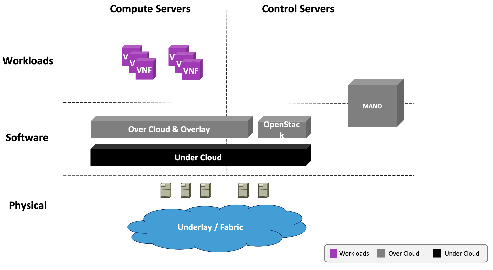
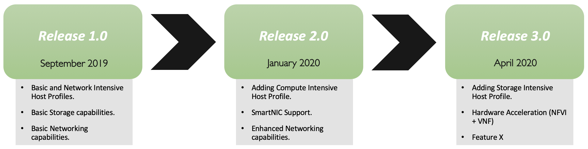

[<< Back](../../openstack)

# 1. Overview

## Table of Contents
* [1.1 Introduction.](#1.1)
  * [1.1.1 Vision](#1.1.1)
* [1.2 Use Cases](#1.2)
* [1.3 Terminology.](#1.3)
* [1.4 Principles](#1.4)
* [1.5 Scope.](#1.5)
* [1.6 Roadmap](#1.6)

## 1.1 Introduction
This is just the first of a limited set of Reference Architectures that will be developed using the Reference Model principles.  OpenStack was chosen first based on the criteria laid out in the [Reference Model](../../../ref_model/chapters/chapter01.md). OpenStack has the advantages of being a mature and widely accepted Open Source technology; a strong ecosystem of vendors that support it, the OpenStack Foundation for managing the community, and, most importantly, it is widely deployed by the global operator community for both internal infrastructure and external facing products and services.  This means that the operators have existing staff with the right skill sets to support an NFVI deployment into development, test and production. Another reason to chose OpenStack is that it has a large active community of vendors and operators, which means that any code or component changes needed to support the Common Telecon NFVI requirements can be managed through the existing project communities processes to add and validate the required features through well established mechanisms.

## 1.1.1. Vision
The ultimate goal is the OpenStack and subsequent Reference Architectures will be used as a platform to test and validate supprtability and compatibility with NFV workloads of interest to the Common Telecom NFVI community.  Initially the OpenStack Reference Architecture would be deployed in the OPNFV lab environment and used for testing and validating compatible with NFVs through the OVP umbrella.   The Reference Architecture document needs to be specified in sufficient detail that the model can ultimiately be robust enough so that operators will deploy it as part of a production infrastructure. To achieve this goal, this Reference Architecture document would be used in conjunction with the Reference Deployment document.  

## 1.2 Use Cases
Several NFV use cases are documented in OpenStack. For more examples and details refer to the OpenStack docs found at the following link: https://docs.openstack.org/arch-design/use-cases.html  Examples include:

  - **Overlay networks**: The overlay functionality design includes OpenStack Networking in Open vSwitch GRE tunnel mode. In this case, the layer-3 external routers pair with VRRP, and switches pair with an implementation of MLAG to ensure that you do not lose connectivity with the upstream routing infrastructure.

  - **Performance tuning**: Network level tuning for this workload is minimal. Quality of Service (QoS) applies to these workloads for a middle ground Class Selector depending on existing policies. It is higher than a best effort queue but lower than an Expedited Forwarding or Assured Forwarding queue. Since this type of application generates larger packets with longer-lived connections, you can optimize bandwidth utilization for long duration TCP. Normal bandwidth planning applies here with regards to benchmarking a session’s usage multiplied by the expected number of concurrent sessions with overhead.

  - **Network functions**: Network functions is a broad category but encompasses workloads that support the rest of a system’s network. These workloads tend to consist of large amounts of small packets that are very short lived, such as DNS queries or SNMP traps. These messages need to arrive quickly and do not deal with packet loss as there can be a very large volume of them. There are a few extra considerations to take into account for this type of workload and this can change a configuration all the way to the hypervisor level. For an application that generates 10 TCP sessions per user with an average bandwidth of 512 kilobytes per second per flow and expected user count of ten thousand concurrent users, the expected bandwidth plan is approximately 4.88 gigabits per second. The supporting network for this type of configuration needs to have a low latency and evenly distributed availability. This workload benefits from having services local to the consumers of the service. Use a multi-site approach as well as deploying many copies of the application to handle load as close as possible to consumers. Since these applications function independently, they do not warrant running overlays to interconnect tenant networks. Overlays also have the drawback of performing poorly with rapid flow setup and may incur too much overhead with large quantities of small packets and therefore we do not recommend them. QoS is desirable for some workloads to ensure delivery. DNS has a major impact on the load times of other services and needs to be reliable and provide rapid responses. Configure rules in upstream devices to apply a higher Class Selector to DNS to ensure faster delivery or a better spot in queuing algorithms.

## 1.3 Terminology
Unless specific OpenStack terms are used, the terminology can be found [CNTT Reference Model Terminology](../../../ref_model/chapters/glossary.md#1.1).  

Add add any OpenStack specific terms here.

<!-- 

<b>Figure 1-1:</b> E2E
 -->

## 1.4 Principles

Open Stack Reference Architecture must obey to the following set of principles:
- [CNTT Reference Model Principles](../../../ref_model/chapters/chapter01.md#1.3)
- [CNTT Reference Architecture Principles](../../#principles)

>Any Open Stack specific principles needs to be added here.

## 1.5 Scope

<b>Figure 1-1:</b> Description of the possible different levels of CNTT artefacts.

## 1.6 Roadmap
As OpenStack evolves over time it will add new technologies and make modifications to the components in the ecosystem, the Common Telecom NFVI Reference Architecture will obviously need to evolve with it.  The final release cadence for the Reference Model changes and feature updates is still under discussion, but the Common Telecom NFVI cadence should at the very least mirror the OpenStack six month release cadence, and the three year support cadence.  OpenStack has a strong ecosystem of vendors that support older versions back at least six years. Given the typically long time frames that telecom infrastructures must be supported, the intention is for these documents to have similiarly long support lifespans.

<b>Figure 1-2:</b> Roadmap of CNTT Reference Architecture.

