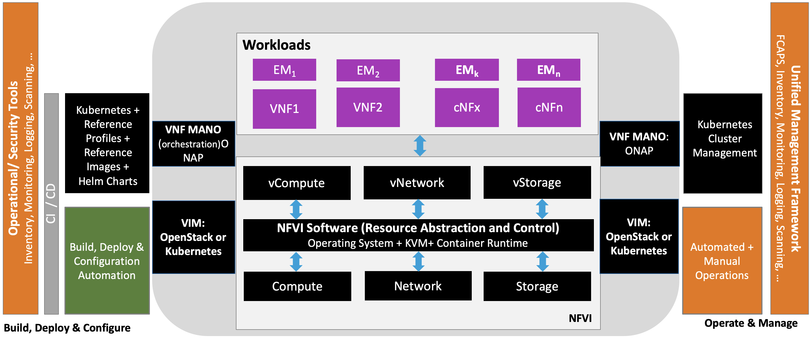
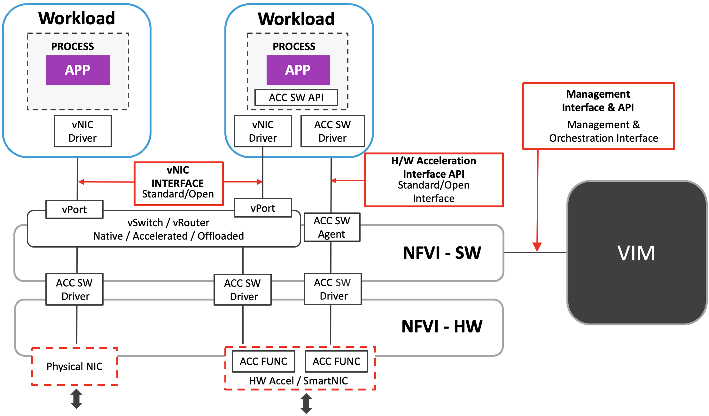
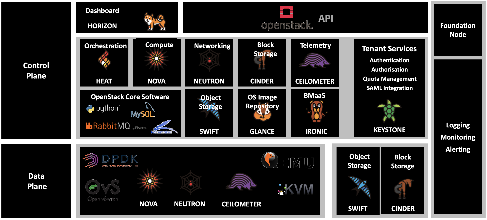

[<< Back](../../openstack)

# 3. High Level Architecture

## Table of Contents
* [3.1 Introduction.](#3.1)
* [3.2 High Level Components.](#3.2)
* [3.3 Interfaces.](#3.3)

## 3.1 Introduction.

## 3.2 High Level Components.

L2: Level 2 Artefacts

## 3.3 Interfaces.
- virtio
- accel interfaces?

<!--

 

<b>Figure 1-2:</b> High Level E2E Architecture

## 3.2 NFVI Centric Architecture

<b>Figure 1-3:</b> NFVI Centric Architecture (Connectivity Example)

## 3.3 Virtual Components (trace to Ref Model)

### 3.3.1 Technology choices to satisfy these requirements

### 3.3.2 Rationale/Explain why, how, of choices

## 3.4 Physical Components (trace to Ref Model)

### 3.4.1 Technology choices to satisfy these requirements

### 3.4.2 Rationale/Explain why, how, of choices

## 3.5 VIM Components (trace to Ref Model)

### 3.5.1 Technology choices to satisfy these requirements

### 3.5.2 Rationale/Explain why, how, of choices
  

### 3.5.3 VIM Components List

<b>Figure 1-4:</b> VIM Components

-->