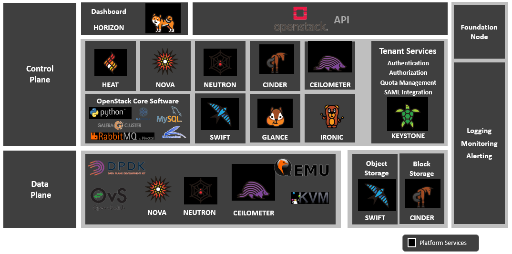

[<< Back](../../openstack)

# 3. NFVI Software Layer High Level Architecture

## Table of Contents
* [3.1 Introduction.](#3.1)
* [3.2 OpenStack: Core Services for IaaS Cloud.](#3.2)
* [3.3 Kubernetes Services.](#3.3)
* [3.4 Virtualisation Services.](#3.4)
* [3.5 Interfaces.](#3.5)

## 3.1 Introduction.

In Chapter 3 of the Reference Model, an abstract Network Function Virtualisation Infrastructure (NFVI) model was introduced. This model consisted of the physical and virtual infrastructure services and the NFVI Software Layer. This Chapter and Chapter 4 explore specific technologies for the NFVI Software Layer consisting of (i) orchestrators OpenStack and Kubernetes, and (ii) KVM/libvirt as the Hypervisor software for Virtual Machines (VM). The architectural details of the various components of NFVI Software Layer will be explored in Chapter 4 while this chapter will only introduce the core service components, their role in the execution and control environment software stacks, and in ensuring that the Architectural Principles of resiliency, availability and scalability are met. Chapter 2.3 of this document listed a set of specific requirements for the NFVI including the NFVI Software Layer that need to be satisfied by the NFVI Software Layer Architecture. 

OpenStack and Kubernetes continue to evolve including the introduction of new services and modifications to existing services.  But there exist a set of core services necessary for implementing the IaaS cloud with performance, resiliency, availability and scalability properties. To ensure these properties, the containerization of the core OpenStack services is strongly recommended. The functional capabilities and the operation of the OpenStack services is not affected whether they are hosted on virtual machines or containers. The manner of deployment, configuration, scalability, availability and resiliency of the OpenStack services is impacted by the nature of their deployment on virtual machines or containers.

## 3.2 OpenStack: Core Services for IaaS Cloud.

 

<b>Figure 3-1:</b> OpenStack Core Services for IaaS Cloud.

Figure 3-1 shows the core OpenStack services, virtualisation services (QEMU, KVM) and the underlying platform services (MySQL, python, Galera-Cluster, etc.). The services are shown as control plane and data plane services.  Control Plane services are required to operate the IaaS cloud while the Data Plane services are required to run tenant workloads. Table 3-1 describes the core OpenStack services. The OpenStack services are stateless making them horizontally scalable; where needed, the state is stored in external (to the service) database.  The services, except for the Horizon dashboard, support both APIs and CLIs (including through service specific clients); the services consist of an API server component, for example nova-api.

<b>Table 3-1:</b> Table 3.1.	Core OpenStack Service High Level Descriptions.

| ** Service ** |** OpenStack Service Name ** | ** Description ** | 
| ------------|---------------|-----------------------| 
| Dashboard | Horizon | A web-based self-service portal, for tenant users and cloud administrators, that utilizes other OpenStack services to deploy, configure and manage infrastructure resources (physical/virtual). | 
| Compute service|Nova|Manages the lifecycle of virtual servers from commissioning to decommissioning of instances.   | 
| Networking service|Neutron|Handles the life cycle of a virtual networking infrastructure (overlay networking). Neutron has an extensible architecture that enables integration with other, including vendor proprietary, networking technologies such as SDN controllers. | 
| Object Storage service|Swift|Stores and retrieves arbitrary unstructured data objects on multiple distributed drives to ensure resiliency and high availability. | 
| Block Storage service|Cinder|Highly available, fault-tolerant block storage service for providing external storage volumes to virtual resources. The pluggable driver architecture allows the utilization of different vendor’s block storage devices. | 
| Identity service|Keystone|Performs authentication and authorization of user credentials and authenticates auth tokens (issued to authorized users) that are passed in service requests.  It supports OpenStack services discovery (including their API endpoints). |
| Image service|Glance|Allows storage, retrieval and discovery of assets used with other OpenStack services, including virtual machine disk images of Operating Systems and workloads, and their metadata definitions.  |
| Telemetry service|Ceilometer|Collects data from OpenStack core service components. Performs data normalisation and transformation for used in alarming, resource tracking and billing. |
| Orchestration service|Heat|Orchestrates multiple composite cloud applications using the application’s heat templates that describe the resources and the relationships between these resources needed by the application. Heat utilizes the template information and OpenStack service APIs to orchestrate the creation of the application’s infrastructure stack.  |
| Bare Metal Service|Ironic|Provisions and manages physical machines using PXE and IPMI.  Ironic receives requests from Nova. The extensible architecture of Ironic supports vendor-specific plugins. | 

A more extensive documentation on OpenStack and services is available at docs.openstack.org.

## 3.3 Kubernetes Services.

Kubernetes is an opensource framework for the life cycle management of containers that host services and applications. Kubernetes, among other things, enables container deployment, failover and auto-scaling thus ensuring, for containerized OpenStack services a self-healing, resilient, highly available and scalable environment. 
A kubernetes cluster consists of at least one master node and one or more worker nodes. The containerized workloads run on a cluster. The kubernetes components on the master nodes provide the kubernetes cluster’s control services while those deployed on the worker nodes maintain the runtime environment.

The service components are their functionality is documented in https://kubernetes.io/docs. 

## 3.4 Virtualisation Services.

OpenStack Compute (Nova) supports a number of hypervisors including KVM is the most commonly used open source hypervisor with OpenStack cloud. KVM (QEMU/KVM) is integrated with OpenStack Nova compute service using libvirt.

### 3.4.1. KVM

### 3.4.2. Libvirt (libvirt.org)
To enable virtual machine management, libvirt, a library, allows for the management of a number of virtualization platforms including QEMU/KVM, XEN, Hyper-V, Vmware ESX; it also supports Linux containers (LXC). 

### 3.4.2. virtio – IO virtualization drivers
Virtio is an abstraction of the IO deices including network devices (NIC cards), block devices (disk drives) and PCI emulation. Virtio supports the guest OS to hypervisor communication. Virtio is incorporated in the KVM hypervisor. 

## 3.5 Interfaces.

### 3.5.1. OpenStack Interfaces
This section illustrates some of the Interfaces provided by OpenStack; the exhaustive list of APIs is available at <a href="https://docs.openstack.org/api-ref/">OpenStack Docs</a>. and CNTT standard is to use the latest version v3. OpenStack REST APIs are simple to interact with using either of two options. Clients can either call the APIs directly using the HTTP or REST library, or they can use one of the many programming language specific cloud libraries. 

APIs

| ** OpenStack Service ** | ** Link for API list ** | ** API Baseline Version ** |
| -------------------|-------------------|-------------------|
| Identity: Keystone| <a href=”https://docs.openstack.org/api-ref/identity/v3/index.html“>https://docs.openstack.org/api-ref/identity/v3/index.html</a>|Version 3.10 |
| Compute: Nova| <a href=”https://docs.openstack.org/api-ref/compute/“>https://docs.openstack.org/api-ref/compute/</a>|Version 2.1 |
| Networking: Neutron| <a href=”https://docs.openstack.org/api-ref/network/“>https://docs.openstack.org/api-ref/network/</a>|Version 2.0 |
| Imaging: Glance| <a href=”https://docs.openstack.org/api-ref/image/v2/index.html#images“>https://docs.openstack.org/api-ref/image/v2/index.html#images</a>|Version 2.0 |
| Block Storage: Cinder| <a href=”https://docs.openstack.org/api-ref/block-storage/v3/index.html#api-versions“>https://docs.openstack.org/api-ref/block-storage/v3/index.html#api-versions/a>|Version 3.0 |
| Object Storage: Swift| <a href=”https://docs.openstack.org/api-ref/object-store/“>https://docs.openstack.org/api-ref/object-store/</a>|Version 1.0 |
| Orchestration: Heat|<a href=”https://docs.openstack.org/api-ref/orchestration/v1/index.html#api-versions“>https://docs.openstack.org/api-ref/orchestration/v1/index.html#api-versions</a>|Version 1.0 |
| Bare Metal: Ironic|<a href=”https://docs.openstack.org/api-ref/baremetal/“>https://docs.openstack.org/api-ref/baremetal/</a>| Version 1.0 |
| Acceleration: Cyborg| <a href=”https://docs.openstack.org/api-ref/accelerator/v1/index.html“>https://docs.openstack.org/api-ref/accelerator/v1/index.html</a>|Version 1.0 |

CLIs

| ** OpenStack Service ** | ** Link to Client ** | ** Client Baseline Version ** |
|--------------|------------------------|----------------------|
| Identity: Keystone|<a href=”https://docs.openstack.org/python-keystoneclient/latest/using-api-v3.html“>https://docs.openstack.org/python-keystoneclient/latest/using-api-v3.html</a>|Version 3.10 |
| Compute: Nova|<a href=”https://docs.openstack.org/python-novaclient/latest/cli/index.html“>https://docs.openstack.org/python-novaclient/latest/cli/index.html</a>|Version 2.1 |
| Networking: Neutron|<a href=”https://docs.openstack.org/python-neutronclient/latest/cli/index.html“>https://docs.openstack.org/python-neutronclient/latest/cli/index.html</a>|Version 2.0 |
| Imaging: Glance|<a href=”https://docs.openstack.org/python-glanceclient/latest/“> https://docs.openstack.org/python-glanceclient/latest/</a>|Version 2.0 |
| Block Storage: Cinder|<a href=”https://docs.openstack.org/python-cinderclient/latest/“> https://docs.openstack.org/python-cinderclient/latest/</a>|Version 3.0 |
| Object Storage: Swift|<a href=”https://docs.openstack.org/python-swiftclient/latest/“> href=”https://docs.openstack.org/python-swiftclient/latest/</a>|Version 1.0 |
| Orchestration: Heat|<a href=”https://docs.openstack.org/python-heatclient/latest/“> https://docs.openstack.org/python-heatclient/latest/</a>|Version 1.0 |
| Bare Metal: Ironic|<a href=”https://docs.openstack.org/python-ironicclient/latest/cli/index.html“>https://docs.openstack.org/python-ironicclient/latest/cli/index.html</a>|Version 1.25 |
| Acceleration: Cyborg|<a href=”https://docs.openstack.org/python-cyborgclient/latest/”> https://docs.openstack.org/python-cyborgclient/latest/</a>|Version 1.0 |
| OpenStack Client (python)|<a href=”https://docs.openstack.org/python-openstackclient/pike/index.html“>https://docs.openstack.org/python-openstackclient/pike/index.html</a>|Version 3.2.1 |

### 3.5.2. Kubernetes Interfaces
The Kubernetes APIs are available at <a href="https://kubernetes.io/docs/concepts/overview/kubernetes-api/">Kubernetes Docs</a>. 

### 3.5.3. KVM Interfaces
The KVM APIs are documented in Section 4 of the document <a href="https://www.kernel.org/doc/Documentation/virtual/kvm/api.txt">KVM Docs</a>. 

### 3.5.4. Libvirt Interfaces
The Libvirt APIs are documented in <a href="https://libvirt.org/html/index.html"><Libvirt Docs>".

<!--

 

<b>Figure 1-2:</b> High Level E2E Architecture

## 3.2 NFVI Centric Architecture

<b>Figure 1-3:</b> NFVI Centric Architecture (Connectivity Example)

## 3.3 Virtual Components (trace to Ref Model)

### 3.3.1 Technology choices to satisfy these requirements

### 3.3.2 Rationale/Explain why, how, of choices

## 3.4 Physical Components (trace to Ref Model)

### 3.4.1 Technology choices to satisfy these requirements

### 3.4.2 Rationale/Explain why, how, of choices

## 3.5 VIM Components (trace to Ref Model)

### 3.5.1 Technology choices to satisfy these requirements

### 3.5.2 Rationale/Explain why, how, of choices
  

### 3.5.3 VIM Components List

<b>Figure 1-4:</b> VIM Components

-->
