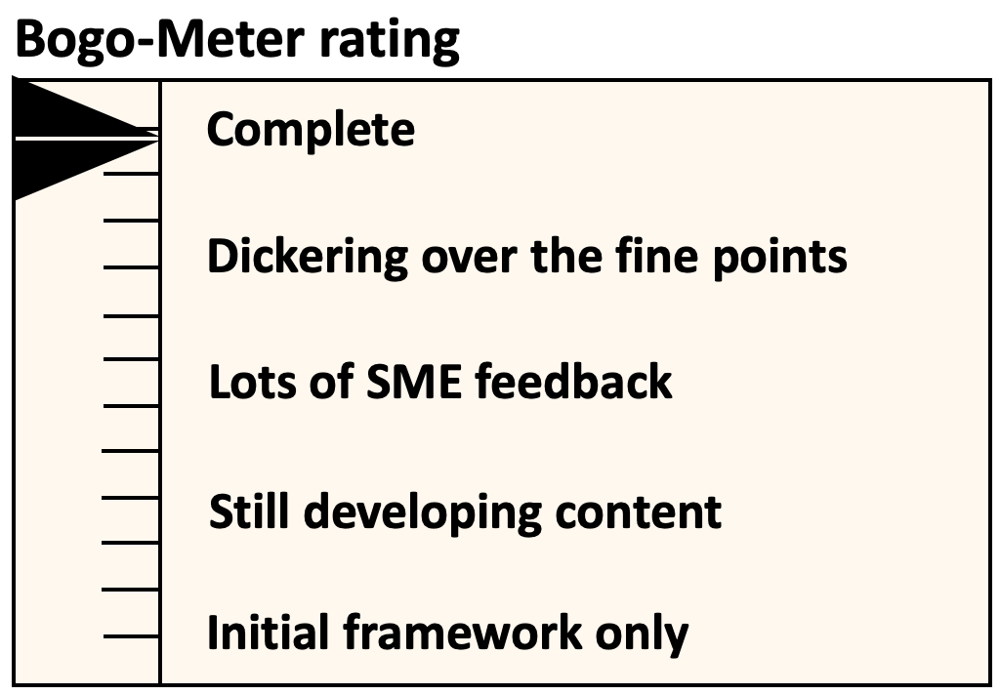
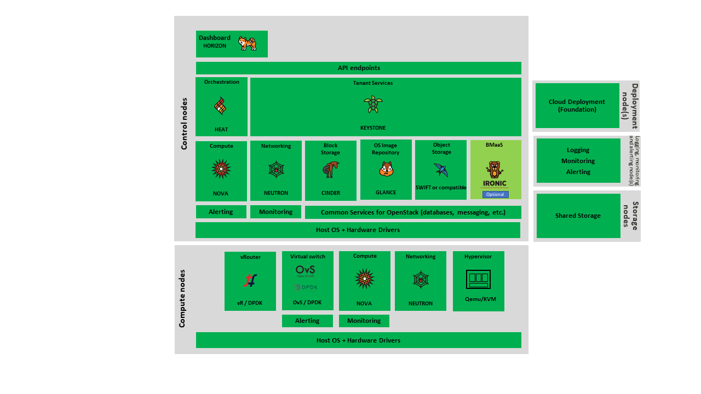
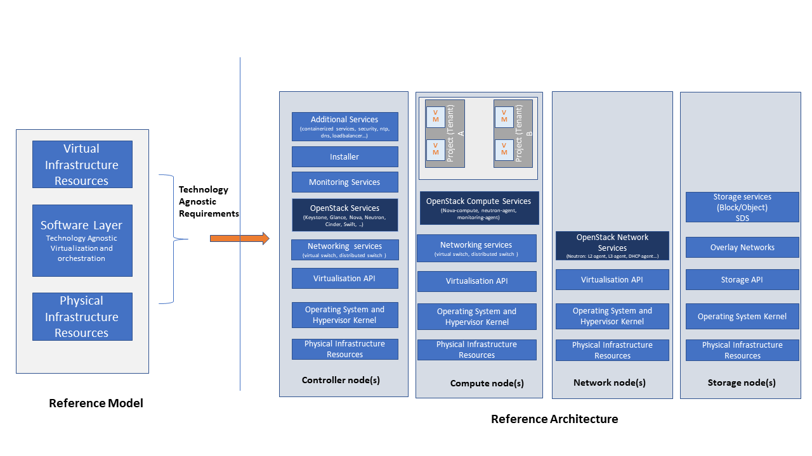
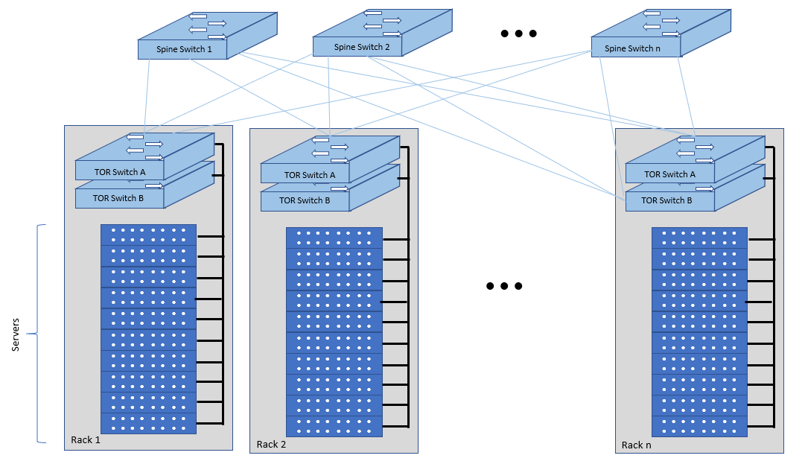

[<< Back](../../openstack)

# 3. Cloud Infrastructure Architecture - OpenStack

## Table of Contents
* [3.1 Introduction](#3.1)
* [3.2 Consumable Infrastructure Resources and Services](#3.2)
  * [3.2.1. Multi-Tenancy (execution environment)](#3.2.1)
  * [3.2.2. Virtual Compute (vCPU and vRAM)](#3.2.2)
  * [3.2.3. Virtual Storage](#3.2.3)
  * [3.2.4. Virtual Networking Neutron standalone](#3.2.4)
  * [3.2.5. Virtual Networking – 3rd party SDN solution](#3.2.5)
  * [3.2.6. Acceleration](#3.2.6)
* [3.3. Virtualised Infrastructure Manager (VIM)](#3.3)
  * [3.3.1. VIM Core services](#3.3.1)
  * [3.3.2. Tenant Isolation](#3.3.2)
  * [3.3.3. Cloud partitioning: Host Aggregates and Availability Zones](#3.3.3)
  * [3.3.4. Flavor management](#3.3.4)
* [3.4. Underlying Resources](#3.4)
  * [3.4.1. Virtualisation](#3.4.1)
  * [3.4.2. Physical Infrastructure](#3.4.2)
* [3.5. Cloud Topology](#3.5)
  * [3.5.1. Topology Overview](#3.5.1)
  * [3.5.2. Topology Detail](#3.5.2)

## 3.1 Introduction

This Reference Architecture (RA-1) aims to provide an OpenStack distribution agnostic reference architecture that includes the Network Function Virtualisation Infrastructure (NFVI) and Virtual Infrastructure Manager (VIM). The different OpenStack distributions, without the not up-streamed vendor specific enhancements, are assumed to be Anuket conformant. This Reference Architecture allows operators to provide a common OpenStack-based architecture for any Anuket compliant VNF to be deployed and operated as expected.  The purpose of this chapter is to outline all the components required to provide the Cloud Infrastructure (NFVI and the VIM) in a consistent and reliable way.

[OpenStack](http://docs.openstack.org) is already very well documented and, hence, this document will describe the specific OpenStack services and features, Cloud Infrastructure features and how we expect them to be implemented.

This reference architecture provides optionality in terms of pluggable components such as SDN, hardware acceleration and support tools.

The Cloud Infrastructure layer includes the physical infrastructure which is then offered as virtual resources via a hypervisor.
The VIM is the OpenStack OpenInfra Foundation Train release.

This chapter is organised as follows:
*	Consumable Infrastructure Resources and Services: these are infrastructure services and resources being exposed northbound for consumption
    - Multi-tenancy with quotas
      -	Virtual compute: vCPU / vRAM
      -	Virtual storage: Ephemeral, Persistent and Image
      -	Virtual networking – neutron standalone: network plugin, virtual switch, accelerator features
      -	Virtual networking – 3rd party SDN solution
      -	Additional network services: Firewall, DC Gateway
* Cloud Infrastructure Management Software (VIM): is how we manage the Consumable Infrastructure Resources and Services
    - VIM Core services (keystone, cinder, nova, neutron etc.)
    - Tenant Separation
    - Host aggregates providing resource pooling
    - Flavor* management
*	Underlying Resources: are what provides the resources that allow the Consumable Infrastructure Resources and Services to be created and managed by the Cloud Infrastructure Management Software (VIM).
    - Virtualisation
    - Physical infrastructure
      -	Compute
      -	Network: Spine/Leaf; East/West and North/South traffic
      -	Storage

> * Please note "flavours" is used in the Reference Model and shall continue to be used in the context of specifying the geometry of the virtual resources. The term "flavor" is used in this document in the OpenStack context including when specifying configurations; the OpenStack term flavor includes the profile configuration information as "extra specs".

## 3.2. Consumable Infrastructure Resources and Services
This section will describe the different services that are exposed for the VNF consumption within the execution zone:
-	Tenants: to provide isolated environments
-	Virtual Compute: to provide computing resources
-	Virtual Storage: to provide storage capacity and performance
-	Virtual networking: to provide connectivity within the Cloud Infrastructure and with external networks

### 3.2.1. Multi-Tenancy (execution environment)
The multi tenancy service permits hosting of several VNF projects with the assurance of isolated environments for each project. Tenants or confusingly “Projects” in OpenStack are isolated environments that enable workloads to be logically separated from each other with:
-	differentiated set of associated users
-	role-based access of two levels – admin or member (see [RBAC security section](./chapter06.md#6314-rbac)).
-	quota system to provide maximum resources that can be consumed.

This RA does not intend to restrict how workloads are distributed across tenants.   

### 3.2.2. Virtual Compute (vCPU and vRAM)
The virtual compute resources (vCPU and vRAM) used by the VNFs behave like their physical counterparts.  A physical core is an actual processor and can support multiple vCPUs through Simultaneous Multithreading (SMT) and CPU overbooking. With no overbooking and SMT of 2 (2 threads per core), each core can support 2 vCPUs. With the same SMT of 2 and overbooking factor of 4, each core can support 8 vCPUs. The performance of a vCPU can be affected by various configurations such as CPU pinning, NUMA alignment, and SMT.

The configuration of the virtual resources will depend on the software and hardware profiles and the flavour (resource sizing) needed to host VNF components. Profiles are defined in the [Reference Model chapter 2.5](../../../ref_model/chapters/chapter02.md).

### 3.2.3. Virtual Storage
The three storage services offered by Cloud Infrastructure are:
-	Persistent storage
-	Ephemeral storage
-	Image storage

Two types of persistent data storage are supported in OpenStack:
-	Block storage
-	Object storage

The OpenStack services, Cinder for block storage and Swift for Object Storage, are discussed below in Section 3.3 “Cloud Infrastructure Management Software (VIM)”.

Ephemeral data is typically stored on the compute host’s local disks, except in environments that support live instance migration between compute hosts. In the latter case, the ephemeral data would need to be stored in a storage system shared between the compute hosts such as on persistent block or object storage.

Images are stored using the OpenStack Glance service discussed below in Section 3.3 “Cloud Infrastructure Management Software (VIM)”.  

The [OpenStack Storage Table](https://docs.openstack.org/arch-design/design-storage/design-storage-concepts.html#table-openstack-storage) explains the differences between the storage types and typical use cases. The [OpenStack compatible storage backend drivers](https://docs.openstack.org/cinder/latest/reference/support-matrix.html) table lists the capabilities that each of these drivers support.

### 3.2.4. Virtual Networking Neutron standalone
Neutron is an OpenStack project that provides "network connectivity as a service" between interface devices (e.g., vNICs) managed by other OpenStack services (e.g., Nova). Neutron allows users to create networks, subnets, ports, routers etc. Neutron also facilitates traffic isolation between different subnets - within as well as across project(s) by using different type drivers/mechanism drivers that use VLANs, VxLANs, GRE (Generic Routing Encapsulation) tunnels etc. For Neutron API consumer, this is abstracted and provided by Neutron. Multiple network segments are supported by Neutron via ML2 plugins to simultaneously utilise variety of layer 2 networking technologies like VLAN, VxLAN, GRE etc. Neutron also allows to create routers to connect layer 2 networks via "neutron-l3-agent". In addition, floating IP support is also provided that allows a project VM to be accessed using a public IP.

### 3.2.5. Virtual Networking – 3rd party SDN solution
SDN (Software Defined Networking) controllers separate control and data (user) plane functions where the control plane programmatically configures and controls all network data path elements via open APIs. Open Networking Forum (ONF) defines SDN as “Software-Defined Networking (SDN) is an emerging architecture that is dynamic, manageable, cost-effective, and adaptable, making it ideal for the high-bandwidth, dynamic nature of today's applications. This architecture decouples the network control and forwarding functions enabling the network control to become directly programmable and the underlying infrastructure to be abstracted for applications and network services."

The key messages of the SDN definition are:
-	Decoupling of control and forwarding functions into control plane and data plane
-	Networking capabilities that can be instantiated, deployed, configured and managed like software. Network control is programmable and supports dynamic, manageable and adaptable networking.
-	Support for both overlay and underlay networking

OpenStack Neutron supports open APIs and a pluggable backend where different plugins can be incorporated in the neutron-server.

Plugins for various SDN controllers include either the standard ML-2 plugin or specific monolithic plugins.
Neutron supports both core plugins that deal with L2 connectivity and IP address management, and service plugins that support services such as L3 routing, Load Balancers, Firewalls, etc.

Below we will explore an example of an SDN controller from LFN projects, that can be integrated with a Neutron plugin, to help overcome a number of shortcomings of the vanilla Neutron and provide many needed features that can be consumed by VNF/CNF.

#### 3.2.5.1. Tungsten Fabric (SDN Controller)
[Tungsten Fabric](https://tungsten.io/), an open source SDN in Linux Foundation Networking, offers neutron networking through ML2 based plugin, additionally it supports advanced networking features beyond basic neutron networking via monolithic plugin. It also supports the same advanced networking features via CNI plugin in Kubernetes. Hence, it works as a multi-stack SDN to support VMs, containers, and baremetal workloads. It provides separation of control plane functions and data plane functions with its two components:

- Tungsten Fabric Controller– a set of software services that maintains a model of networks and network policies, typically running on several servers for high availability
- Tungsten Fabric vRouter– installed in each host that runs workloads (virtual machines or containers), the vRouter performs packet forwarding and enforces network and security policies

It is based on proven, standards-based networking technologies but repurposed to work with virtualised workloads and cloud automation in data centres that can range from large scale enterprise data centres to much smaller telco DC (aka POPs) . It provides many enhanced features over the native networking implementations of orchestrators, including:
- Highly scalable, multi-tenant networking
- Multi-tenant IP address management
- DHCP, ARP proxies to avoid flooding into networks
- Efficient edge replication for broadcast and multicast traffic
- Local, per-tenant DNS resolution
- Distributed firewall with access control lists
- Application-based security policies
- Distributed load balancing across hosts
- Network address translation (1:1 floating IPs and distributed SNAT)
- Service chaining with virtual network functions
- Dual stack IPv4 and IPv6
- BGP peering with gateway routers
- BGP as a Service (BGPaaS) for distribution of routes between privately managed customer networks and service provider networks

Based on the network layering concepts introduced in the [Reference Model Section 3.5](../../../ref_model/chapters/chapter03.md#35-network), the Tungsten Fabric Controller performs functions of both the SDN underlay (SDNu) and overlay (SDNo) controllers.

The SDN controller exposes a NB API that can be consumed by ETSI MANO for VNF/CNF onboarding, network service onboarding and dynamic service function chaining.

### 3.2.6. Acceleration
Acceleration deals with both hardware and software accelerations. Hardware acceleration is the use of specialised hardware to perform some function faster than is possible by executing the same function on a general-purpose CPU or on a traditional networking (or other I/O) device (e.g. NIC, switch, storage controller, etc.). The hardware accelerator covers the options for ASICs, SmartNIC, FPGAs, GPU etc. to offload the main CPU, and to accelerate workload performance. Cloud Infrastructure should manage the accelerators by plugins and provide the acceleration capabilities to VNFs.

With the acceleration abstraction layer defined, hardware accelerators as well as software accelerators can be abstracted as a set of acceleration functions (or acceleration capabilities) which exposes a common API to either the VNF or the host.

## 3.3. Virtualised Infrastructure Manager (VIM)
The Cloud Infrastructure Management Software (VIM) provides the services for the management of Consumable Resources/Services.

### 3.3.1. VIM Core services
OpenStack is a complex, multi-project framework, and so we will initially focus on the core services required to provide Infrastructure-as-a-Service (IaaS) as this is generally all that is required for Cloud Infrastructure/VIM use cases. Other components are optional and provide functionality above and beyond Cloud Infrastructure/VIM requirements.

The architecture consists of the core services shown in the Figure 3-1; Ironic is an optional OpenStack service needed only for bare-metal containers. The rest of this document will address the specific Anuket conformant implementation requirements and recommendations for the core services.

<b>Figure 3-1:</b> OpenStack Core Services

We will refer to the functions above as falling into the following categories to avoid any confusion with other terminology that may be used:
-	Foundation node
-	Control nodes
-	Compute nodes
-	Other supporting service nodes e.g. network, shared storage, logging, monitoring and alerting.

Each deployment of OpenStack should be a unique cloud with its own API endpoint.  Sharing underlying cloud resources across OpenStack clouds is not recommended.

#### 3.3.1.1. OpenStack Services Topology
OpenStack software services are distributed over 2 planes:
-	Control Plane that hosts all Control and Management services
-	Data Plane (a.k.a. User plane) that provides physical and virtual resources (compute, storage and networking) for the actual virtual workloads to run.

The architecture based on OpenStack technology relies on different types of nodes associated with specific roles:
-	Controller node types with control and management services, which include VIM functionalities
-	Compute node types running workloads
-	Network node types offering L3 connectivity
-	Storage node types offering external attached storage (block, object, flat files)

The data plane consists of the compute nodes. It is typical to consider the other node types to be part of the control plane. Figure 3-2 depicts the 4 types of nodes constitutive of the Infrastructure: control, compute, network and storage nodes.

<b>Figure 3-2:</b> OpenStack Services Topology

Deployments can be structured using the distribution of services amongst the 4 node types as depicted in Figure 3-2, but depending on workloads requirements, OpenStack services can also be hosted on the same nodes. For instance, services related to Controller, network and storage roles can be hosted on controller nodes.

#### 3.3.1.2. Foundation Services

To build and lifecycle manage an OpenStack cloud, it is typically necessary to deploy a server or virtual machine as a deployment node or foundation node.

This function must be able to manage the bare-metal provisioning of the hardware resources but since this does not affect cloud execution it can be detached from the OpenStack cloud and an operator can select their own tooling as they wish.
Functional requirements of this node include:
-	Build the cloud (control, compute, storage, network hardware resources)
-	Patch management / upgrades / change management
-	Grow / Shrink resources

#### 3.3.1.3 Cloud Controller Services
The following OpenStack components are deployed on the Infrastructure. Some of them will be only deployed on control hosts and some of them will be deployed within both control and compute hosts. The Table also maps the OpenStack core services to the Reference Model (RM) Virtual Infrastructure Manager [Reference Model Chapter 3.2.2 Virtual Infrastructure Manager](../../../ref_model/chapters/chapter03.md#322").

| RM Management Software| Service| Description| Required / Optional| Deployed on Controller Nodes| Deployed on Compute Nodes |
|-----------------------|-------------|----------------------|----------------|-----------|---------|
| Identity Management (Additional Management Functions) + Catalogue| Keystone| the authentication service| Required| X |  |
| Storage Resources Manager| Glance| the image management service| Required| X |  |
| Storage Resources Manager | Cinder| the block storage management service| Required| X |  |
| Storage Resources Manager| Swift| the Object storage management service| Required| X |   |
| Network Resources Manager| Neutron| the network management service| Required| X | X |
| Compute Resources Inventory | Placement | resource provider inventory service | Required | X |   |
| Compute Resources Manager + Scheduler | Nova| the compute resources management service| Required| X| X |
| Compute Resources Manager| Ironic| the Bare Metal Provisioning service| Optional| X | X |
| (Tool that utilises APIs)| Heat| the orchestration service| Required| X |  |
| UI| Horizon| the WEB UI service| Required| X|  |
| Key Manager| Barbican| the secret data management service| Optional| X |  |
<!--
| Acceleration Resources Manager| Cyborg| the acceleration resources management| Optional| X | X |
-->

All components must be deployed within a high available architecture that can withstand at least a single node failure and respects the anti-affinity rules for the location of the services (i.e. instances of a same service must run on different nodes).

The services can be containerised or VM hosted as long as they provide the high availability principles described above.

The APIs for these OpenStack services are listed in [Chapter 5: Interfaces and APIs](../../../ref_arch/openstack/chapters/chapter05.md).

#### 3.3.1.4 Cloud Workload Services
This section describes the core set of services and service components needed to run workloads; instances (such as VMs), their networks and storage are referred to as the “Compute Node Services” (a.k.a. user or data plane services). Contrast this with the Controller nodes which host OpenStack services used for cloud administration and management. The Compute Node Services include virtualisation, hypervisor instance creation/deletion, networking and storage services; some of these activities include RabbitMQ queues in the control plane including the scheduling, networking and cinder volume creation/attachment.
*	Compute, Storage, Network services:
    - Nova Compute service: nova-compute (creating/deleting instances)
    -	Neutron Networking service: neutron-l2-agent (manage local Open vSwitch (OVS) configuration), VXLAN
    -	Local Storage (Ephemeral, Root, etc.)
    -	Attached Storage (using Local drivers)

### 3.3.2. Tenant Isolation
In Keystone v1 and v2 (both deprecated), the term "tenant" was used in OpenStack. With Keystone v3, the term "project" got adopted and both the terms became interchangeable.  According to [OpenStack glossary](https://docs.openstack.org/doc-contrib-guide/common/glossary.html), Projects represent the base unit of resources (compute, storage and network) in OpenStack, in that all assigned resources in OpenStack are owned by a specific project.
OpenStack offers multi-tenancy by means of resource (compute, network and storage)separation via projects. OpenStack offers ways to share virtual resources between projects while maintaining logical separation. As an example, traffic separation is provided by creating different VLAN ids for neutron networks of different projects. As another example, if host separation is needed, nova scheduler offers AggregateMultiTenancyIsolation scheduler filter to separate projects in host aggregates. Thus, if a host in an aggregate is configured for a particular project, only the instances from that project are placed on the host. Overall, tenant isolation ensures that the resources of a project are not affected by resources of another project.

This document uses the term "project" when referring to OpenStack services and “tenant” ([RM Section 3.2.1]((../../../ref_model/chapters/chapter03.md#321")) to represent an independently manageable logical pool of resources.

### 3.3.3. Cloud partitioning: Host Aggregates, Availability Zones
Cloud administrators can partition the hosts within an OpenStack cloud using Host Aggregates and Availability Zones.

A Host Aggregate is a group of hosts (compute nodes) with specific characteristics and with the same specifications, software and/or hardware properties. Example would be a Host Aggregate created for specific hardware or performance characteristics. The administrator assigns key-value pairs to Host Aggregates, these are then used when scheduling VMs. A host can belong to multiple Host Aggregates. Host Aggregates are not explicitly exposed to tenants.

Availability Zones (AZs) rely on Host Aggregates and make the partitioning visible to tenants. They are defined by attaching specific metadata information to an aggregate, making the aggregate visible for tenants. Hosts can only be in a single Availability Zone. By default a host is part of a default Availability Zone, even if it doesn’t belong to an aggregate. Availability Zones can be used to provide resiliency and fault tolerance for workloads deployments, for example by means of physical hosting distribution of Compute Nodes in separate racks with separate power supply and eventually in different rooms. They permit rolling upgrades – an AZ at a time upgrade with enough time between AZ upgrades to allow recovery of tenant workloads on the upgraded AZ. AZs can also be used to seggregate workloads.

An over use of Host Aggregates and Availability Zones can result in a granular partition of the cloud and, hence, operational complexities and inefficiencies.

### 3.3.4. Flavor management
In OpenStack a flavor defines the compute, memory, and storage capacity of nova instances. When instances are spawned, they are mapped to flavors which define the available hardware configuration for them. For simplicity, operators may create named flavors specifying both the sizing and the [software and hardware profile configurations](../../../ref_model/chapters/chapter05.md).

## 3.4. Underlying Resources
The number of Compute nodes (for workloads) determines the load on the controller nodes and networking traffic and, hence, the number of controller nodes needed in the OpenStack cloud; the number of controller nodes required is determined on the load placed on these controller nodes and the need for High availability and quorum requires at least 3 instances of many of the services on these controller nodes.

### 3.4.1. Virtualisation
Virtualisation is a technology that enables a guest Operating System (OS) to be abstracted from the underlying hardware and software. This allows to run multiple Virtual Machines(VMs) on the same hardware. Each such VMs have their own OS and are isolated from each other i.e. application running on one VM does not have the access to resources of another VM. Such virtualisation is supported by various hypervisors available as open-source (KVM, Xen etc.) as well as commercial (Hyper-V, Citrix XenServer etc.). Selecting a hypervisor depends on the workload needs and the features provided by various hypervisors as illustrated in Hypervisor [Feature Support Matrix](https://docs.openstack.org/nova/latest/user/support-matrix.html). OpenStack (Nova) allows the use of various hypervisors within a single installation by means of scheduler filters like ComputeFilter, ImagePropertiesFilter etc.

Virtualisation Services: The OpenStack nova-compute service supports multiple hypervisors natively or through libvirt. The preferred supported hypervisor in this Reference Architecture is KVM.

*Note*: Other hypervisors (such as ESXI) can also be supported as long as it can interoperate with other OpenStack components (e.g., those listed in this Reference Architecture) using standard interfaces and APIs as specified in Chapter 5.

### 3.4.2. Physical Infrastructure

The aim is to specify the requirements on deploying the VIM, from ground up (in a shipping container), and what resources are  required of the DC (Data Centre).
*	Servers
    - Compute
    -	Storage
    -	Control (min 3 for Core DC)
*	Network considerations
    - Data centre gateway
    -	Firewall (around the control plane, storage, etc.)
    -	Data centre network fabric / Clos (spine/leaf) – Horizontal scale
    -	Storage networking, control plane and data plane
    -	Raw packet – tenant networking allowing “wild west” connection.  
*	Storage
    - discussed in [RA-1 Chapter 04](./chapter04.md#424-storage-backend)
*	Acceleration
    - SmartNIC
    - GPU
    - FPGA

#### 3.4.2.1. Compute
Cloud Infrastructure physical Nodes

The physical resources required for the Cloud Infrastructure are mainly based on COTS x86 hardware for control and data plane nodes.
HW profiles are defined in [Reference Model chapters 5.3 and 5.4](../../../ref_model/chapters/chapter05.md).

#### 3.4.2.2. Network
The recommended network architecture is spine and leaf topology.

<b>Figure 3-3:</b> Network Fabric – Physical

Figure 3-3 shows a physical network layout where each physical server is dual homed to TOR (Leaf/Access) switches with redundant (2x) connections. The Leaf switches are dual homed with redundant connections to spines.

#### 3.4.2.3. Storage

[OpenStack](https://docs.openstack.org/arch-design/design-storage.html) supports many different storage architectures and backends. The choice of a particular backend storage is driven by a number of factors including: scalability, resiliency, availability, data durability, capacity and performance.

Most cloud storage architectures incorporate a number of clustered storage nodes that provide high bandwidth access to physical storage backends connected by high speed networks. The architecture consists of multiple storage controller units, each a generic server (CPU, Cache, storage), managing a number of high-performance hard drives. The distributed block storage software creates an abstract single pool of storage by aggregating all of the controller units. Advanced and high-speed networking (data routing) and global load balancing techniques ensure high-performance,high availability storage system.

## 3.5. Cloud Topology

A telco cloud will typically be deployed in multiple locations (“sites”) of varying size and capabilities (HVAC, for example); or looking at this in the context of OpenStack, multiple clouds (i.e. OpenStack end-points) will be deployed that do not rely on each other, by design; each cloud consists of a set of resources isolated form resources of the other clouds. The application layer must span such end-points in order to provide the required service SLA.  Irrespective of the nature of the deployment characteristics (e.g. number of racks, number of hosts, etc.), the intent of the architecture would be to allow VNFs to be deployed in these sites without major changes.  

Some examples of such topologies include:
- Large data centre capable of hosting potentially thousands of servers and the networking to support them
- Intermediate data centre (such as a central office) capable of hosting up to a hundred servers
- Edge (not customer premise) capable of hosting ten to fifty servers

In order to provide the expected availability for any given service, a number of different OpenStack deployment topologies can be considered.  This section explores the main options and highlights the characteristics of each.  Ultimately the decision rests with the operator to achieve specific availability target taking into account use case, data centre capabilities, economics and risks.

Availability of any single OpenStack cloud is dependent on a number of factors including:
-	environmental – dual connected power and PDUs, redundant cooling, rack distribution etc.
-	resilient network fabric – ToR (leaf), spine, overlay networking, underlay networking etc.  It is assumed that all network components are designed to be fault tolerant and all OpenStack controllers, computes and storage are dual-homed to alternate leaf switches.
-	controller nodes setup in-line with the vendor recommendation (e.g. min 3 physical nodes)
-	network nodes (where applicable)
- backend storage nodes setup for highly availablility based on quorum (aligned with vendor implementation)
-	compute nodes sized to handle the entire workload following local failure scenario

### 3.5.1. Topology Overview

Assumptions and conventions:
- Region is represented by a single OpenStack control plane.
- Resource Failure Domain is effectively the “blast radius” of any major infrastructure failure such as loss of PDU or network leafs.
- Control plane includes redundant network nodes where OVS-kernel is used.
- Controller nodes should be setup for high availability based on quorum (aligned with vendor implementation).
- Shared storage is optional but it is important to ensure shared assets are distributed across serving clouds such as boot images.

| Topology Ref| Type| Control Planes| Shared Storage (optional)| Compute AZs| Achievable Service Availability %| Service Multi-region awareness| Notes |
|----------|-----|-----------------|---------------|-----------|---------|--------------|-------------|
| 1 | Local Redundancy - workload spread across servers | 1 | 1 | 1 | Variable | Not required | Suitable where only limited local application availability is required e.g. nova anti-affinity |
| 2 | Regional Redundancy - workload spread across AZs | 1 | >=2 | >=2 | >99.n | Not required | Suitable where local application HA is required. Control plane should be distributed across DC failure domains (assuming layer 2 connectivity) but may be unavailable during upgrades |
| 3 | Global Redundancy - workload spread across multiple Regions | >=2 | >=2 | >=2 | >99.nn | Required | Suitable where local and region application HA is required Control plane could be kept available in one site during upgrades |

### 3.5.2. Topology Detail

#### 3.5.2.1. Topology 1	- Local Redundancy

Under normal operation this deployment can handle a single failure of a controller node or storage node without any impact to the service.   If a compute node fails the application layer (often the VNFM) would need to restart workloads on a spare compute node of similar capability i.e., cloud may need to be provided with n+1 capacity.  In the case of an active/active application deployed to separate compute nodes (with hypervisor anti-affinity) there would be no service impact.  

*Important to consider:*

-	Where possible servers should be distributed and cabled to reduce the impact of any failure e.g. PDU, rack failure.   Because each operator has individual site constraints this document will not propose a standard rack layout.
-	During maintenance of the control plane, whilst the data (forwarding) plane remains unaffected, the control plane API may not be available and some applications may be relying on it during normal application operation for example for scaling. Additionally if the upgrade involves updating OpenStack services on the compute nodes care needs to be taken.  OVS-kernel networking operations may also be impacted during this time.
-	During maintenance of storage (e.g. ceph) there is an increased risk of a service-impacting failure so it is generally recommended to deploy at least one more server than the minimum required for redundancy.

#### 3.5.2.2. Topology 2	- Regional Redundancy

Under normal operation this topology can handle a single failure of a controller node but provides additional protection to the compute plane and storage.   If the application is deployed across 2 or more AZs a major failure impacting the nodes in one AZ can be tolerated assuming the application deployment allows for this.  There is a risk with split-brain so a means of deciding application quorum is recommended or by using a third AZ or arbitrator.

*Important to consider:*

-	All those points listed for Topology 1 above.
-	When using 3 controller nodes and distributing these physically across the same locations as the computes, if you lose the location with 2 controllers the OpenStack services would be impacted as quorum cannot be gained with a single controller node.   It is also possible to use more than 3 controller nodes and co-locate one with each compute AZ allowing lower-risk maintenance but care must be taken to avoid split brain.
-	The distributed network fabric must support L2 for the OpenStack control plane VIPs.

#### 3.5.2.3. Topology 3	- Global Redundancy

Following the example set by public cloud providers who provide Regions and Availability Zones this is effectively a multi-region OpenStack.  Assuming the application can make use of this model this provides the highest level of availability but would mean IP level failure controlled outside of OpenStack by global service load balancing (GSLB) i.e., DNS with minimum TTL configured, or client applications that are capable of failing over themselves. This has the added advantage that no resources are shared between different Regions so any fault is isolated to a single cloud and also allows maintenance to take place without service impact.
