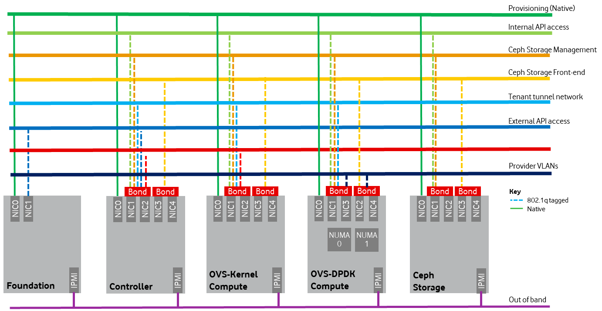
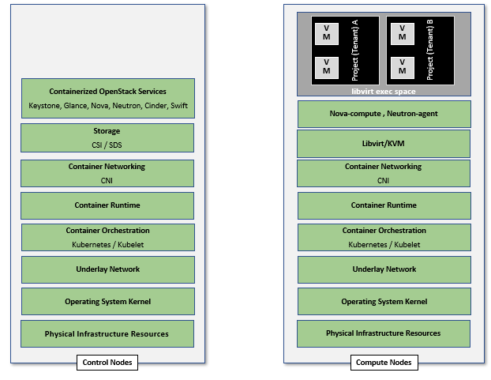

[<< Back](../../openstack)

# 4. NFVI + VIM Component Level Architecture

## Table of Contents
* [4.1 Introduction](#4.1)
* [4.2 Underlying Resources](#4.2)
  * [4.2.1 Virtualisation](#4.2.1)
  * [4.2.2 Compute](#4.2.2)
  * [4.2.3 Network Fabric](#4.2.3)
  * [4.2.4 Storage Backend](#4.2.3)
* [4.3 Virtualised Infrastructure Manager (VIM)](#4.3)
  * [4.3.1 VIM Core Services](#4.3.1)
  * [4.3.2 Containerised OpenStack Services](#4.3.2)
  * [4.3.3 Build Parameters](#4.3.3)
* [4.4 Consumable Infrastructure Resources and Services](#4.4)
  * [4.4.1 Support for Profiles and T-shirt instance types](#4.4.1)
  * [4.4.2 Logical segregation and high availability](#4.4.2)
  * [4.4.3 Transaction Volume Considerations](#4.4.3)
* [4.5 Cloud Topology.](#4.5)
  * [4.5.1 Cloud Topology Considerations](#4.5.1)
* [4.6 Logging / Monitoring / Alerting of Control Plane](#4.6)
* [4.7 Architectural Drivers – Requirements Traceability](#4.7)

## 4.1 Introduction.
**Will update this section with a summary from the sub-chapters**

<!--
Chapter 3 presented the high level architecture and core OpenStack services for creating an IaaS cloud. This chapter discusses the second level of details (as defined by L3) including deployment topology, distribution of the core OpenStack services among Controller and Compute nodes.

Additionally, This Chapter will delve deeper into certain topics that need to be considered in creating and operating an OpenStack based IaaS cloud, such as:

- The physical (underlay) and the overlay networks needed for intra tenant and external (to the tenant) communications.
- Cloud topology related to host aggregates and availability zones, and minimal software versions for shared services (kernel, host operating system, common drivers, etc.).
- Listing of some of the requirements for Security and Life Cycle Management.
-->

## 4.2 Underlying Resources
**content to be developed**

### 4.2.1 Virtualisation
In OpenStack, KVM is configured as the default hypervisor for compute nodes. 
- Configuration: [OpenStack](https://docs.openstack.org/nova/pike/admin/configuration/hypervisor-kvm.html) specifies the following KVM configuration steps/instructions to configure KVM:
  - Enable KVM based hardware virtualisation in BIOS. OpenStack provides instructions on how to enable hardware virtualisation for different hardware platforms (x86, Power)
    - QEMIU is similar to KVM in that both are libvirt controlled, have the same feature set and utilize compatible virtual machine images 
  -	Configure Compute backing storage
  -	Specify the CPU Model for KVM guests (VMs)
  -	KVM Performance Tweaks
-	[Hardening](https://docs.openstack.org/security-guide/compute/hardening-the-virtualization-layers.html) 
    - OpenStack recommends minimizing the code base by removing unused components 
    -	sVirt (Secure Virtualisation) provides isolation between VM processes, devices, data files and system processes

### 4.2.2. Compute

#### 4.2.2.1. Cloud Deployment (Foundation/management) Node
Minimal configuration: 1 node

#### 4.2.2.2. OpenStack Control Plane Servers (Control Nodes)
- BIOS Requirements
For OpenStack control nodes we use the BIOS parameters for the basic profile defined in [Chapter 5.4 of the Reference Model](https://github.com/cntt-n/CNTT/blob/master/doc/ref_model/chapters/chapter05.md#5.4). Additionally, for OpenStack we need to set the following boot parameters:

| BIOS/boot Parameter |Control server |
|--------------------|--------------------|
| Boot disks |RAID 1 |
| CPU reservation for host (kernel) |1 core per Numa |
| CPU allocation ratio |2:1 |
| <to be filled if needed>|  |
| …|     |

-	How many nodes to meet SLA
    -	Minimum 3 nodes for high availability
-	HW specifications
    -	the boot disks are SSD disks with a minimum capacity of 240GB 
-	Sizing rules
    -	It is easy to horizontally scale the number of control nodes
    -	The number of control nodes is determined by a minimum number needed for high availability (viz., 3 nodes) and the extra nodes needed to handle the transaction volumes, in particular, for Messaging service (e.g., RabbitMQ) and Database (e.g., MySQL) to track state. 
    -	The number of control nodes only needs to be increased in environments with a lot of changes, such as a testing lab, or a very large cloud footprint (rule of thumb: number of control nodes = 3 + quotient(number of compute nodes/1000)).
      -	The [Services Placement Summary table](https://fuel-ccp.readthedocs.io/en/latest/design/ref_arch_100_nodes.html) specifies the number of instances that are required based upon the cloud size (number of nodes).

#### 4.2.2.3. Network nodes
-	BIOS requirements 
-	How many nodes to meet SLA
-	HW specifications
-	Sizing rules

#### 4.2.2.4. Storage nodes
-	BIOS requirements 
-	HW specifications
-	How many nodes to meet SLA
-	Sizing rules

#### 4.2.2.5. Compute Nodes
-	The software components are as specified in the [Reference Model chapter 5.4](https://github.com/cntt-n/CNTT/blob/master/doc/ref_model/chapters/chapter05.md#5.4)
-	BIOS requirement
    -	The general bios requirements are described in the [Reference Model chapter 5.4](https://github.com/cntt-n/CNTT/blob/master/doc/ref_model/chapters/chapter05.md#5.4)
    -	Additionally, for OpenStack we need to set the following boot parameters:

| BIOS/boot Parameter | Basic  | Network Intensive | Compute Intensive |
|---------------|-----------|------------------|-------------------------|
| Boot disks | RAID 1 | RAID 1 | RAID 1 |
| CPU reservation for host (kernel) | 1 core per Numa | 1 core per Numa | 1 core per Numa |
| <to be filled if needed> |  |  |  |
| … |  |  |  |

-	How many nodes to meet SLA
    - minimum: two nodes per profile
-	HW specifications
    -	the boot disks are SSD disks with 240GB minimum
-	Sizing rules

| Number of CPU sockets| s | 
| ------------|--|
| Number of cores| c | 
| SMT| t | 
| RAM| rt | 
| Storage| d | 
| Overcommit| o | 
| Average vCPU per instance | v |
| Average RAM per instance | ri |

| | | Basic | Network Intensive | Compute Intensive | 
|---------------|------------|------------|------------|-----------------|
| # of VMs per node (vCPU) | (s*c*t*o)/v | 4*(s*c*t)/v | (s*c*t)/v| (s*c*t)/v | 
| # of VMs per node (RAM) | rt/ri | rt/ri | rt/ri | rt/ri| 
| | | | | |  
| Max # of VMs per node|  | min(4*(s*c*t)/v, rt/ri)| min((s*c*t)/v, rt/ri)| min((s*c*t)/v, rt/ri)| 

Caveats:
-	These are theoretical limits
-	Affinity and anti-affinity rules, among other factors, affect the sizing

#### 4.2.2.6. Compute Resource Pooling Considerations
-	Multiple pools of hardware resources where each resource pool caters for workloads of a specific profile (for example, network intensive). Leads to efficient use of the hardware as the server resources are specific to the flavour. If not properly sized or when demand changes can lead to oversupply/starvation scenarios; reconfiguration may not be possible because of the underlying hardware or inability to vacate servers for reconfiguration to support another flavour type. The specifications for this type of resource pooling is specified in 4.5.2.
-	Single pool of hardware resources including for controllers have the same CPU type. This is operationally efficient as any server can be utilized to support a flavour or controller. The single pool is valuable with unpredictable workloads or when the demand of certain flavours is insufficient to justify individual hardware selection. The specifications for this type of resource pooling is specified in 4.5.3.

### 4.2.3. Network Fabric
**Content to be developed**
-	Physical switches, routers…
-	Switch OS
-	Minimum number of switches etc.
-	Dimensioning for East/West and North/South
-	Spine / Leaf topology – east – west 
-	Global Network parameters
-	OpenStack control plane VLAN / VXLAN layout
-	Provider VLANs

#### 4.2.3.1 Physical Network Topology

#### 4.2.3.2 High Level Logical Network Layout

 Figure 4-1. Indicative OpenStack Network Layout.

A VNF application network topology is expressed in terms of VMs, vNIC interfaces with vNet access networks, and WAN Networks while the VNF Application VMs require multiple vNICs, VLANs, and host routes configured within the VM’s Kernel.

#### 4.2.3.3. Octavia v2 API compliant Load Balancing
Load balancing is needed for automatic scaling, managing availability and changes. [Octavia](https://docs.openstack.org/octavia/latest/reference/introduction.html) is an open-source load balancer for OpenStack, based on HAProxy, and replaces the deprecated (as of OpenStack Queens release) Neutron LBaaS. The Octavia v2 API is a superset of the deprecated Neutron LBaaS v2 API and has a similar CLI for seamless transition. 

As a default Octavia utilizes Amphorae Load Balancer. Amphorae consists of a fleet of VMs, containers or bare metal servers and delivers horizontal scaling by managing and spinning these resources on demand. The reference implementation of the Amphorae image is an Ubuntu virtual machine running HAProxy. 

Octavia depends upon a number of OpenStack services including Nova for spinning up compute resources on demand and their life cycle management; Neutron for connectivity between the compute resources, project environment and external networks; Keystone for authentication; and Glance for storing of the compute resource images.

Octavia supports provider drivers which allows third-party load balancing drivers (such as F5, AVI, etc.) to be utilized instead of the default Amphorae load balancer. When creating a third-party load balancer, the **provider** attribute is used to specify the backend to be used to create the load balancer. The **list providers** lists all enabled provider drivers.  Instead of using the provider parameter, an alternate is to specify the flavor_id in the create call where provider-specific Octavia flavors have been created. 

#### 4.2.3.4. Neutron ML2 integration
The OpenStack Modular Layer 2 (ML2) plugin simplifies adding networking technologies by utilizing drivers that implement these network types and methods for accessing them. Each network type is managed by an ML2 type driver and the mechanism driver exposes interfaces to support the actions that can be performed on the network type resources. The [OpenStack ML2 documentation](https://wiki.openstack.org/wiki/Neutron/ML2) lists example mechanism drivers.

#### 4.2.3.5. Network quality of service
With support of VNF workloads, the resources bottlenecks are not only the CPU and the memory but also the I/O bandwidth and the forwarding capacity of virtual and non-virtual switches and routers within the infrastructure. Several techniques (all complementary) can be used to improve QoS and try to avoid any issue due to a network bottleneck (mentioned per order of importance):
-	Nodes interfaces segmentation: Have separated NIC ports for Storage and Tenant networks. Actually, the storage traffic is bursty, and especially in case of service restoration after some failure or new service implementation, upgrades, etc. Control and management networks should rely on a separate interface from the interface used to handle tenant networks.
-	Capacity planning: FW, physical links, switches, routers, NIC interfaces and DCGW dimensioning (+ load monitoring: each link within a LAG or a bond shouldn’t be loaded over 50% of its maximum capacity to guaranty service continuity in case of individual failure).
-	Hardware choice: e.g. ToR/fabric switches, DCGW and NIC cards should have appropriate buffering and queuing capacity.
-	Network intensive compute node tuning (including OVS-DPDK)

#### 4.2.3.6. Integration Interfaces.
DHCP When the Neutron-DHCP agent is hosted in controller nodes, then VMs, on a Tenant network, that need to acquire an IPv4 and/or IPv6 address, the VLAN for the Tenant must be extended to the control plane servers so that the Neutron agent can receive the DHCP requests from the VM and send the response to the VM with the IPv4 and/or IPv6 addresses and the lease time. Please see OpenStack provider Network.
-	DNS
-	LDAP
-	IPAM

### 4.2.4. Storage Back-end
**Content to be developed**
-	Types of storage (incl NVMe)
-	Ceph
    -	Ceph Configuration
    -	Cinder Gateway, Swift Gateway
-	How many nodes to meet SLA
-	Sizing rules (IOPS, SSD vs. SATA, NICs, etc).

## 4.3 Virtualised Infrastructure Manager (VIM)
This section covers:
-	Detailed breakdown of OpenStack core services 
-	Specific build-time parameters

### 4.3.1 VIM Core Services
A high level overview of the core OpenStack Srevices was provided in Chapter 3. Here we describe the services in somemore detail including their sizing rules (**to be developed**).

#### 4.3.1.1 Keystone
Keystone is the authentication service, the foundation of identity management in OpenStack. Keystone needs to be the first deployed service. Keystone has services running on the control nodes and no services running on the compute nodes:
-	Keystone admin API
-	Keystone public API – in Keystone V3 this is the same as the admin API,

#### 4.3.1.2 Glance
Glance is the image management service. Glance has only a dependency on the Keystone service therefore it is the second one deployed. Glance has services running on the control nodes and no services running on the compute nodes:
-	Glance API
-	Glance Registry

_The Glance backends include Swift, Ceph RBD and NFS_

#### 4.3.1.3 Cinder
Cinder is the block device management service, Cinder depends on Keystone and possibly Glance to be able to create volumes from images. Cinder has services running on the control nodes and no services running on the compute nodes:
-	Cinder API
-	Cinder Scheduler
-	Cinder Volume – the Cinder volume process needs to talk to its backends

_The Cinder backends include SAN/NAS storage, iSCSI drives, Ceph RBD and NFS._ 

#### 4.3.1.4 Swift
Swift is the object storage management service, Swift depends on Keystone and possibly Glance to be able to create volumes from images. Swift has services running on the control nodes and the compute nodes:
-	Proxy Services
-	Object Services
-	Container Services
-	Account Services

_The Swift backends include iSCSI drives, Ceph RBD and NFS._ 

#### 4.3.1.5 Neutron
Neutron is the networking service, Neutron depends on Keystone and has services running on the control nodes and the compute nodes:
-	neutron-api
-	neutron-rpc
-	neutron-*-agent agents which runs on Compute and Network nodes

#### 4.3.1.6 Nova
Nova is the compute management service, Nova depends on all above components and is deployed after. Nova has services running on the control nodes and the compute nodes:
-	nova-metadata-api
-	nova-placement-api
-	nova-compute api
-	nova-consoleauth
-	nova-scheduler
-	nova-conductor
-	nova-novncproxy
-	nova-compute-agent which runs on Compute node

#### 4.3.1.7 Ironic
Ironic is the bare metal provisioning service. Ironic depends on all above components and is deployed after. Ironic has services running on the control nodes and the compute nodes:
-	Ironic API
-	ironic-conductor which executes operation on bare metal nodes

Note: This is an optional service. As Ironic is currently not invoked directly (only invoked through other services such as Nova) hence its APIs will not be specified.

#### 4.3.1.8 Heat
Heat is the orchestration service using template to provision cloud resources, Heat integrates with all OpenStack services. Heat has services running on the control nodes and no services running on the compute nodes:
-	heat-api
-	heat-cfn-api
-	heat-engine

#### 4.3.1.9 Horizon
Horizon is the Web User Interface to all OpenStack services. Horizon has services running on the control nodes and no services running on the compute nodes.

### 4.3.2. Containerised OpenStack Services 
Containers are lightweight compared to Virtual Machines and leads to efficient resource utilization. Kubernetes auto manages scaling, recovery from failures, etc. Thus, it is recommended that the OpenStack services be containerized for resiliency and resource efficiency.
In Chapter 3, Figure 3.2 shows a high level Virtualised OpenStack services topology. The containerized OpenStack services topology version is shown in Figure 4-2.

 Figure 4-2. Containerised OpenStack Services Topology.

### 4.3.3. Build Parameters
**Content to be developed preferably by OpenStack Distributors**

## 4.4 Consumable Infrastructure Resources and Services

### 4.4.1. Support for Profiles and T-shirt instance types
Reference Model Chapter 4 and  5 provide information about the instance types and size information. OpenStack flavors with their set of properties describe the VM capabilities and size required to determine the compute host which will run this VM. The set of properties must match compute profiles available in the infrastructure. To implement these profiles and sizes requires the setting up of information as specified in the Tables below. As OpenStack no longer provides default flavors, the CNTT pre-defined flavors will have to be created with their various configuration properies.

| Flavor Capabilities | Reference RM Chapter 4 and 5 | Basic | Network Intensive | Compute Intensive |
|----------|-------------|--------------|-------------|-------------|
| CPU allocation ratio | nfvi.com.cfg.001| In Nova.conf include  cpu_allocation_ratio= 4.0 | In Nova.conf include  cpu_allocation_ratio= 1.0 | In Nova.conf include  cpu_allocation_ratio= 1.0 |
| NUMA Awareness | nfvi.com.cfg.002 | | In flavor create or flavor set specify --property hw:numa_nodes=<#numa_nodes – 1> | In flavor create or flavor set specify --property hw:numa_nodes=<#numa_nodes – 1> |
| CPU Pinning | nfvi.com.cfg.003| In flavor create or flavor set specify   --property hw:cpu_policy=shared (default) | In flavor create or flavor set specify  --property hw:cpu_policy=dedicated  and --property hw:cpu__thread_policy= <prefer, require, isolate> | In flavor create or flavor set specify  --property hw:cpu_policy=dedicated  and  --property hw:cpu__thread_policy= <prefer, require, isolate>|
| Huge Pages | nfvi.com.cfg.004| | --property hw:mem_page_size=large | --property hw:mem_page_size=large | 
| OVS-DPDK | nfvi.net.acc.cfg.001| | ml2.conf.ini configured to support  [OVS]  datapath_type=netdev   Note: huge pages should be configured to large | ml2.conf.ini configured to support  [OVS]  datapath_type=netdev   Note: huge pages should be configured to large |
| Local Storage SSD | nfvi.hw.stg.ssd.cfg.002| trait:STORAGE_DISK_SSD=required | trait:STORAGE_DISK_SSD=required | trait:STORAGE_DISK_SSD=required |
| Port speed | nfvi.hw.nic.cfg.002 | --property quota vif_inbound_average=1310720  and vif_outbound_average=1310720  Note: 10 Gbps = 1250000 kilobytes per second | --property quota vif_inbound_average=3125000  and  vif_outbound_average=3125000  Note: 25 Gbps = 3125000 kilobytes per second | --property quota vif_inbound_average=3125000  and  vif_outbound_average=3276800  Note: 25 Gbps = 3276800 kilobytes per second | 

To configure the T-shirt sizes (specified in [Table 4-17](../../../ref_model/chapters/chapter04.md#4211-predefined-compute-flavours) Reference Model Chapter4), the parameters in the following table are specified as part of the flavor create; the parameters are preceded by "--".

| T-Shirt Size | vCPU ("c") | RAM ("r") | Local Disk ("d") |
|-----|------|---------|----------------|
| .tiny | 1 -- vcpus 1 | 512 MB -- ram 512 | 1 GB -- disk 1 |
| .small | 1 -- vcpus 1 | 2 GB -- ram 2048 | 20 GB -- disk 20 |
| .medium | 2 -- vcpus 2 | 4 GB -- ram 4096 | 40 GB -- disk 40 |
| .large | 4 -- vcpus 4 | 8 GB -- ram 8192 | 80 GB -- disk 80 |
| .2xlarge* | 8 -- vcpus 8 | 16 GB -- ram 16384 | 160 GB -- disk 160 |
| .4xlarge* | 16 -- vcpus 16 | 32 GB -- ram 32768 | 320 GB -- disk 320 |

In addition, to configure the storage IOPS the following two parameters need to be specified in the flavor create: --property quota:disk_write_iops_sec=<IOPS#> and --property quota:disk_read_iops_sec=<IOPS#>.

The flavor create command and the mandatory and optional configuration parameters is documented in https://docs.openstack.org/nova/latest/user/flavors.html.

### 4.4.2. Logical segregation and high availability
To Ensure Logical segregation and high availability, the architecture will rely on the following principles:
-	Availability zone: provide resiliency and fault tolerance for VNF deployments, by means of physical hosting distribution of Compute Nodes in separate racks with separate power supply, in the same or different DC room
-	Affinity-groups: allow tenants to make sure that VNFC instances are on the same compute node or are on different compute nodes.

Note: The NFVI doesn’t provide any resiliency mechanisms at the service level. Any VM restart shall be triggered by the VNF Manager instead of OpenStack:
-	It doesn’t implement Instance High Availability which could allow OpenStack Platform to automatically re-spawn instances on a different Compute node when their host Compute node breaks.
-	Physical host reboot does not trigger automatic VM recovery.
-	Physical host reboot does not trigger the automatic start of VM

**Limitations and constraints**
-	NUMA Overhead: isolated core will be used for overhead tasks from the hypervisor 

For Network intensive instances, VNF Component should fit into a single NUMA zone for performance reason.

### 4.4.3. Transaction Volume Considerations

Storage transaction volumes impose a requirement on North-South network traffic in and out of the storage backend. Data availability requires that the data be replicated on multiple storage nodes and each new write imposes East-West network traffic requirements.

## 4.5 Cloud Topology

### 4.5.1. Cloud Topology Considerations

A Telco cloud will be deployed in multiple locations (“sites”) of varying size and capabilities (HVAC, for example); or stated slightly differently, multiple telco clouds (i.e. OpenStack end points) will be deployed and they all contain isolated resources that do not rely on each other.   The application must span such end points in order to provide the required service SLA Irrespective of the nature of the deployment characteristics (number of racks, number of hosts, etc.), the intent of the architecture would be to allow VNFs to be deployed in these sites as needed without major changes; if not all as many as possible.
-	Large data center capable of hosting thousands of servers and the networking to support them
-	Mini data center (such as a central office) capable of hosting up to a hundred servers
-	Edge (not customer premise) capable of hosting between ten to fifty servers

Host profiles (SW Host profile + HW host profile) “partition” the cloud into pseudo sub-clouds, for example, hosts targeted for basic instance types, network intensive instance types and compute intensive instance types. This can happen, because of specific hardware adds and/or hardware and software configurations.  Depending upon the workload types and the capacity requirements, cloud providers and operators may choose to support the instance types with targeted hardware (different number of sockets, RAM, clock speeds, etc.) and host profiles or choose common hardware and minimize the number of host profiles (for example, network intensive and compute intensive types using a common host profile).

As we get away from the large data centers to the smaller sites it becomes progressively difficult to be able to create enough capacity for each of these instance types in support of their target VNFs or to have a mix of hardware targeted for each instance type.

## 4.6 Logging / Monitoring / Alerting of Control Plane

Enterprises and vendors may have custom monitoring and logging solutions. The intent of the logging and monitoring is to capture events and data of interest to the NFVI and workloads so that appropriate actions can be taken.  Some of the data is to support the metrics collection specified in the [Reference Model Chapter 4: Infrastructure Capabilities, Metrics and Catalogue](https://github.com/cntt-n/CNTT/blob/master/doc/ref_model/chapters/chapter04.md).

In this section, a possible framework utilizing Prometheus, Elasticsearch and Kibana is given as an example only.

 
Figure 4-3: Monitoring and Logging Framework 

The monitoring and logging framework (**Figure 4-6**) leverages Prometheus as the monitoring engine and Fluentd for logging. In addition, the framework uses Elasticsearch to store and organize logs for easy access. Prometheus agents pull information from individual components on every host.  Fluentd, an open source data collector, unifies data collection and consumption for better use and understanding of data. Fluentd captures the access, application and system logs.

## 4.7 Architectural Drivers – Requirements Traceability

