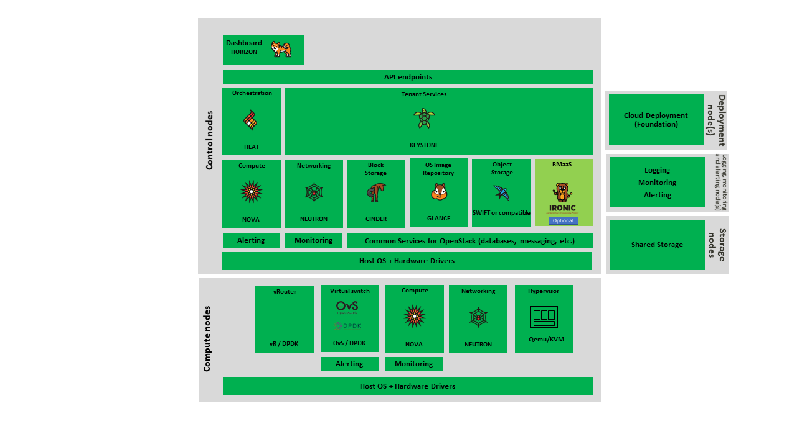
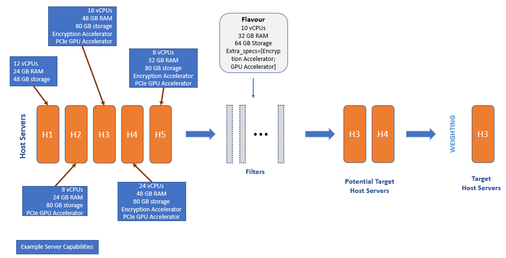
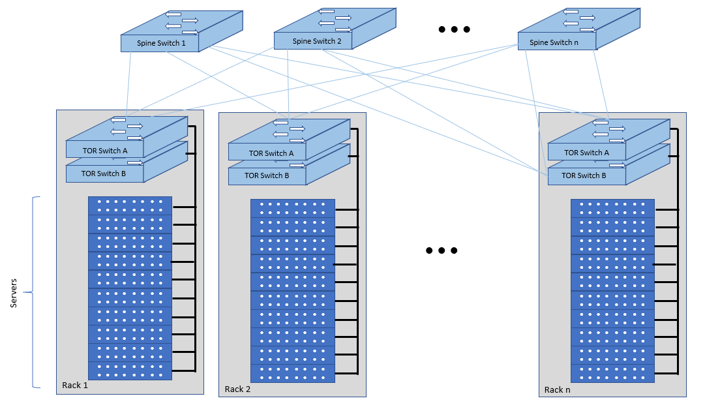
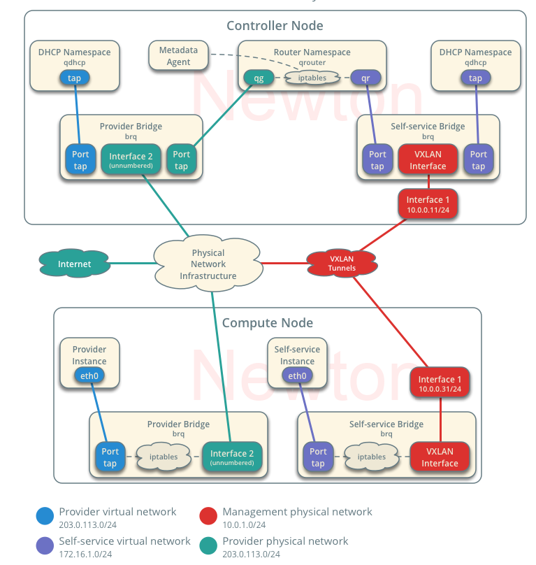
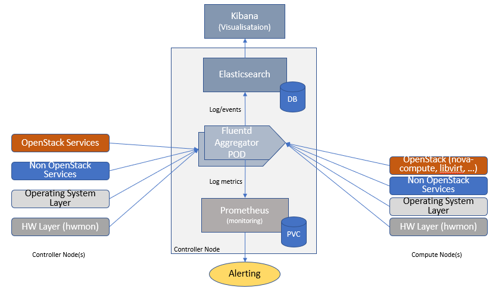

[<< Back](../../openstack)

# 4. OpenStack IaaS Cloud Architecture

## Table of Contents
* [4.1 Introduction.](#4.1)
  * [4.1.1 Architectural Drivers – Requirements Traceability.](#4.1.1)
  * [4.1.2 OpenStack Core Services.](#4.1.2)
  * [4.1.3 OpenStack Services Topology.](#4.1.3)
* [4.2 Foundation Services.](#4.2)
  * [4.2.1 Architectural Drivers – Requirements Traceability.](#4.2.1)
  * [4.2.2 Foundation Node.](#4.2.2)
* [4.3 Cloud Controller Services.](#4.3)
  * [4.3.1 Architectural Drivers – Requirements Traceability.](#4.3.1)
  * [4.3.2 Overview.](#4.3.2)
* [4.4 Cloud Workload Services.](#4.4)
  * [4.4.1 Compute Nodes Specifications.](#4.4.1)
* [4.5 Network Topology.](#4.5)
  * [4.5.1 Architectural Drivers – Requirements Traceability.](#4.5.1)
  * [4.5.2 Physical Network.](#4.5.2)
  * [4.5.3 High Level Logical Network Layout.](#4.5.3)
  * [4.5.4 LBaaS v2 compliant Load Balancing.](#4.5.4)
  * [4.5.5 Neutron ML2 integration.](#4.5.5)
* [4.6 Cloud Topology.](#4.6)
  * [4.6.1 Host Aggregates, Availability Zones.](#4.6.1)
  * [4.6.2 Cloud Topology Considerations.](#4.6.2)
  * [4.6.3 Containerised OpenStack Services.](#4.6.3)
* [4.7 Integration Interfaces.](#4.7)
* [4.8 Logging / Monitoring / Alerting of Control Plane.](#4.8)
* [4.9 Telemetry.](#4.9)
* [4.10 General Hardware requirements (for control, compute, storage) .](#4.10)
* [4.11 LCM Considerations.](#4.11)
* [4.12 Security Considerations.](#4.12)

## 4.1 Introduction.

Chapter 3 presented the high level architecture and core OpenStack services for creating an IaaS cloud. This chapter discusses the second level of details (as defined by L3) including deployment topology, distribution of the core OpenStack services among Controller and Compute nodes.

Additionally, This Chapter will delve deeper into certain topics that need to be considered in creating and operating an OpenStack based IaaS cloud, such as:

- The physical (underlay) and the overlay networks needed for intra tenant and external (to the tenant) communications.
- Cloud topology related to host aggregates and availability zones, and minimal software versions for shared services (kernel, host operating system, common drivers, etc.).
- Listing of some of the requirements for Security and Life Cycle Management.

### 4.1.1 Architectural Drivers – Requirements Traceability

| Ref #| sub-category| Description|
|--------|--------------------|--------------------------------------------|
| req.gen.cnt.01| Cloud nativeness | The Architecture should consist of stateless service components. However, where state is required it must be kept external to the component. |
| req.gen.rsl.01| Resiliency| The Architecture must support resilient OpenStack components that are required for the continued availability of running workloads. |
| req.gen.rsl.02| Resiliency| The Architecture should support resilient OpenStack service components that are not subject to req.gen.rsl.01. |
| req.gen.avl.01| Availability| The Architecture must provide High Availability for OpenStack components. |

| Ref # |	sub-category	| Description |
|-----------------|----------------------|------------------------------|
| req.gen.rsl.01 | Resiliency | The Architecture must support resilient OpenStack components that are required for the continued availability of running workloads. |
| req.vim.02 | General | The Architecture should support deployment of OpenStack components in containers. |

### 4.1.2 OpenStack Core Services

The Common Telco NFVI OpenStack Reference Architecture aims to provide an industry standard reference architecture independent of the many distributions of OpenStack.  It does not seek to change any vendor implementation assuming Common Telco NFVI compliance out of the box without vendor specific enhancements that are not up-streamed.

This document assumes a good understanding of OpenStack core services and will not repeat details found at <a href="https://openstack.org">OpenStack website</a>.  Its primary aim is to highlight the important considerations needed by all operators to deploy NFVI in a consistent, cost effective and predictable way and allowing vendors to work on a level technical playing field.

Since OpenStack is a complex, multi-project framework, we initially will focus on the core services required to provide Infrastructure-as-a-Service (IaaS) as this is generally all that is required for NFVi/VIM use cases.   Other components are optional and provide functionality above and beyond NFVi/VIM requirements.

The architecture consists of the services shown in the **Figure 4-1**; Ironic and Swift are optional OpenStack srevices. The rest of this document will address the specific Common Telco NFVI implementation requirements and recommendations.

<b>Figure 4-1:</b> OpenStack Core Services

We will refer to the functions above as falling into the following categories to avoid any confusion with other terminology that may be used:
-	Foundation node
-	Control nodes
-	Compute nodes
-	Other supporting service nodes e.g. network, shared storage, logging, monitoring and alerting.

Each deployment of OpenStack should be a unique cloud with its own API endpoint.  Sharing underlying cloud resources across OpenStack clouds is not recommended.

### 4.1.3 OpenStack Services Topology

NFVI software services are distributed over 2 planes:
-	Control Plane that hosts all Control and Management services
-	Data Plane (a.k.a. User plane) that provides physical and virtual resources (compute, storage and networking) for the actual virtual workloads to run.

The architecture based on OpenStack technology relies on different types of nodes associated with specific roles:
- Controller node types with control and management services, which include VIM functionalities
- Compute node types running workloads
- Network node types offering L3 connectivity
- Storage node types offering external attached storage (block, object, flat files)

The data plane consists of the compute nodes. It is typical to consider the other node types to be part of the control plane.
**Figure 4-2** depicts the 4 types of nodes constitutive of the Infrastructure: control, compute, network and storage nodes.

<b>Figure 4-2:</b> OpenStack Services Topology

Deployments can be structured using the distribution of services amongst the 4 node types as depicted in Figure 3-2, but depending on workloads requirements, OpenStack services can also be hosted on the same nodes. For instance, services related to Controller, network and storage roles can be hosted on controller nodes.

## 4.2 Foundation Services

### 4.2.1 Architectural Drivers – Requirements Traceability

| Ref # | sub-category | Description |
|--------|-------------|---------------------------|
| req.lcm.adp.04 | Automated deployment | The Architecture should support declarative specifications of hardware and software assets for automated deployment, configuration, maintenance and management. |
| req.lcm.adp.05 | Automated deployment | The Architecture should support automated process for Deployment and life-cycle management of VIM Instances. |

### 4.2.2 Foundation Node
To build and lifecycle manage an OpenStack cloud it is typically necessary to deploy a server or virtual machine as a deployment node.  

This function must be able to manage the bare-metal provisioning of the hardware resources but since this does not affect cloud execution it can be detached from the OpenStack cloud and an operator can select their own tooling as they wish.   
Functional requirements of this node include:
-	Build the cloud (control, compute, storage, network hardware resources)
-	Patch management / upgrades / change management
-	Grow / Shrink resources

## 4.3 Cloud Controller Services

### 4.3.1 Architectural Drivers – Requirements Traceability

| Ref # | sub-category | Description  |
|--------|-------------|---------------------------|
| req.gen.ost.01 | Open source | The Architecture must use OpenStack APIs.  |
| req.gen.ost.02 | Open source | The Architecture must support dynamic request and configuration of virtual resources (compute, network, storage) through OpenStack APIs.  |
| req.gen.cnt.01 | Cloud nativeness | The Architecture should consist of stateless service components. However, where state is required it must be kept external to the component.  |
| req.gen.cnt.02 | Cloud nativeness | The Architecture should consist of service components implemented as microservices that are individually dynamically scalable.  |
| req.gen.rsl.01 | Resiliency | The Architecture must support resilient OpenStack components that are required for the continued availability of running workloads.  |
| req.gen.rsl.02 | Resiliency | The Architecture should support resilient OpenStack service components that are not subject to req.gen.rsl.01.  |
| req.gen.avl.01 | Availability | The Architecture must provide High Availability for OpenStack components.  |
| req.vim.02 | General | The Architecture should support deployment of OpenStack components in containers.  |
| req.vim.05 | General | The Architecture must include image repository management.  |
| req.vim.06 | General | The Architecture must allow orchestration solutions to be integrated with VIM.  |
| req.sec.gen.03 | General | The Architecture must support a centralised authentication and authorisation mechanism.  |
| req.sec.zon.01 | Zoning | The Architecture must support identity management (specific roles and permissions assigned to a domain or tenant).  |
| req.inf.stg.06 | Storage | The Architecture should make the immutable images available via location independent means.  |
| req.inf.ntw.01 | Network | The Architecture must provide virtual network interfaces to VM instances.  |
| req.inf.ntw.02 | Network | The Architecture must include capabilities for integrating SDN controllers to support provisioning of network services, from the OpenStack Neutron service, such as networking of VTEPs to the Border Edge based VRFs.  |
| req.inf.ntw.05 | Network | The Architecture must allow for East/West tenant traffic within the cloud (via tunnelled encapsulation overlay such as VXLAN or Geneve).  |
| req.inf.com.01 | Compute | The Architecture must provide compute resources for VM instances.  |
| req.inf.stg.01 | Storage | The Architecture must provide shared Block storage for VM Instances.  |
| req.inf.stg.02 | Storage | The Architecture must provide shared Object storage for VM Instances.  |
| req.inf.stg.03 | Storage | The Architecture may provide local file system storage solution for VM Instances.  |
| req.int.api.02 | API | The Architecture must provide GUI access to tenant facing cloud platform core services.  |
| req.tnt.gen.02 | General | The Architecture must support self-service dashboard (GUI) and APIs for users to deploy, configure and manage their workloads.  |

### 4.3.2 Overview
The following OpenStack components are deployed on the Infrastructure. Some of them will be only deployed on control hosts and some of them will be deployed within both control and compute hosts. The Table also maps the OpenStack core services to the Reference Model (RM) Management Software components (<a ref="https://github.com/cntt-n/CNTT/blob/master/doc/ref_model/chapters/chapter03.md#3.3">Reference Model Chapter 3.3 Management Software</a>).

| RM Management Software| Service| Description| Required / Optional| Deployed on Controller Nodes| Deployed on Compute Nodes |
|-----------------------|-------------|----------------------|----------------|-----------|---------|
| Identity Management (Additional Management Functions) + Catalogue| Keystone| the authentication service| Required| X|  |
| Storage Resources Manager| Glance| the image management service| Required| X|  |
| Storage Resources Manager | Cinder| the block storage management service| Required| X|  |
| Storage Resources Manager| Swift| the Object storage management service| Optional| X|   |
| Network Resources Manager| Neutron| the network management service| Required| X| X |
| Compute Resources Manager + Inventory + Scheduler | Nova| the compute resources management service| Required| X| X |
| Compute Resources Manager| Ironic| the Bare Metal Provisioning service| Optional| X| X |
| (Tool that utilizes APIs)| Heat| the orchestration service| Required| X|  |
| UI| Horizon| the WEB UI service| Required| X|  |

All components must be deployed within a high available architecture that can withstand at least a single node failure and respects the anti-affinity rules for the location of the services (i.e. instances of a same service must run on different nodes).

The services can be containerized or VM hosted as long as they provide the high availability principles described above.

The APIs for these OpenStack services are listed in <a href="chapter05.md">Chapter 5: Inetrafces and APIs</a>.

#### 4.3.2.1 Keystone
Keystone is the authentication service, the foundation of identity management in OpenStack. Keystone needs to be the first deployed service. Keystone has services running on the control nodes and no services running on the compute nodes:
-	Keystone admin API
-	Keystone public API – in Keystone V3 this is the same as the admin API,

#### 4.3.2.2 Glance
Glance is the image management service. Glance has only a dependency on the Keystone service therefore it is the second one deployed. Glance has services running on the control nodes and no services running on the compute nodes:
-	Glance API,
-	Glance Registry.

#### 4.3.2.3 Cinder
Cinder is the block device management service, Cinder depends on Keystone and possibly Glance to be able to create volumes from images. Cinder has services running on the control nodes and no services running on the compute nodes:
-	Cinder API,
-	Cinder Scheduler,
-	Cinder Volume – the Cinder volume process needs to talk to its backends.

#### 4.3.2.4 Swift
Swift is the object storage management service, Swift depends on Keystone and possibly Glance to be able to create volumes from images. Swift has services running on the control nodes and the compute nodes:
-	Proxy Services
-	Object Services
-	Container Services
-	Account Services

When images are stored in block storage service, Cinder, the object storage service, Swift, may not be required.

#### 4.3.2.5 Neutron
Neutron is the networking service, Neutron depends on Keystone and has services running on the control nodes and the compute nodes:
-	neutron-api
-	neutron-rpc
-	neutron-*-agent agents which runs on Compute and Network nodes

#### 4.3.2.6 Nova
Nova is the compute management service, Nova depends on all above components and is deployed after. Nova has services running on the control nodes and the compute nodes:
-	nova-metadata-api
-	nova-placement-api
-	nova-compute api
-	nova-consoleauth
-	nova-scheduler
-	nova-conductor
-	nova-novncproxy
-	nova-compute-agent which runs on Compute node

#### 4.3.2.7 Ironic
Ironic is the bare metal provisioning service. Ironic depends on all above components and is deployed after. Ironic has services running on the control nodes and the compute nodes:
-	Ironic API
-	ironic-conductor which executes operation on bare metal nodes

Note: This is an optional service.

#### 4.3.2.8 Heat
Heat is the orchestration service using template to provision cloud resources, Heat integrates with all OpenStack services. Heat has services running on the control nodes and no services running on the compute nodes:
-	heat-api
-	heat-cfn-api
-	heat-engine

#### 4.3.2.9 Horizon
Horizon is the Web User Interface to all OpenStack services. Horizon has services running on the control nodes and no services running on the compute nodes.

## 4.4 Cloud Workload Services

This section describes the high-level set of infrastructure components needed to run VMs and provide their compute, network and storage resources. The core set of services and service components needed to run workloads including instances (such as VMs), their networks and storage are referred to as the “Compute Node Services” (a.k.a. user or data plane services).  Contrast this with the Controller nodes which host OpenStack services used for cloud administration and management. The Compute Node Services include virtualisation, hypervisor instance creation/deletion, networking and storage services; some of these activities include RabbitMQ queues in the control plane including the scheduling, networking and cinder volume creation / attachment.
-	Compute, Storage, Network services:
    -	Nova Compute service: nova-compute (creating/deleting instances)
    -	Neutron Networking service: neutron-l2-agent (manage local Open vSwitch (OVS) configuration), VXLAN
    -	Local Storage (Ephemeral, Root, etc.)
    -	Attached Storage (using Local drives)
-	Virtualisation Services: The OpenStack nova-compute service supports multiple hypervisors natively or through libvirt. The preferred supported hypervisor in this Reference Architecture is KVM.
    > **_Note_**: Other hypervisors (such as ESXI) can also be supported as long as it can interoperate with other OpenStack components in this Reference Architecture using standard interfaces and APIs as specified in Chapter 5.

<!--The supported hypervisors include ESXi (primarily through VMware vSphere) and QEMU/KVM through libvirt. Since the hypervisor plays a critical role for virtualized workloads including their isolation from each other, the selection of the hypervisor should be guided by security considerations in addition to other factors such as efficiency and resiliency. -->

The number of Compute nodes (for workloads) determines the load on the controller nodes and networking traffic and, hence, the number of controller nodes needed in the OpenStack cloud; the number of controller nodes required is determined on the load placed on these controller nodes and the need for High availability and quorum requires at least 3 instances of many of the services on these controller nodes.

### 4.4.1 Compute Nodes Specifications

This section is primarily about scheduling the VM to be created onto a particular physical server. This section delves into the compute host selection for these VMs, the resource pools, hardware and software considerations.

 Figure 4-3. Selection of a compute host to launch an instance.

When a request for an instance creation is made, the requested features and capabilities of the instance is used to determine the host on which the instance should be launched (Figure 4-3).  The nova scheduler service matches requested features and capabilities of the instance and the capabilities/configuration of the hosts (hardware and software).  The nova-scheduler can be configured to use the host aggregates (and availability zones) in selecting the hosts when an instance create request with these capabilities/configurations is requested. The Common Telco NFVI has only a handful of standard profiles and hence the number of potential target host servers (Figure 4-3) may be large if only the host-aggregates filter is utilized and, thus, other filters should also be selected; affinity/non-affinity, custom key-value pairs, etc.

A flavour may, in addition to the base flavour properties, include additional properties specified as key-value pairs in the extra specifications section of the flavour definition.  These additional properties can specify advanced configurations information or desired hardware characteristics. Examples include SSD drives, hardware accelerators, or a key-value pair used as meta data to associate the host with a tenant or host aggregate; both the host aggregate and the hosts that are to be assigned to the host aggregate would be assigned the same key-value pair, for example, <OVS-DPDK, True>.

#### 4.4.1.1 Software Specifications
This section specifies specific software components needed to support the three primary flavour types, Basic, Network Intensive and Compute Intensive, and Controllers. The number of controller nodes and compute nodes is determined by the cloud size and workload needs. For Resiliency and availability, we need at least 3 deployments of each of the Controller node services. The minimum hardware requirements are specified in the Reference Model Chapter 4: Feature set and Requirements from Infrastructure.

**Compute Hosts:**
-	Basic Profile
    - Virtio 1.1.
    - Open vSwitch (OVS).
    - VXLAN.
    - GENEVE.
    - MPLSoUDP.

-	Network Intensive Profile
    -	Virtio 1.1.
    - OVS-DPDK (medium throughput).
    - VXLAN.
    - GENEVE.
    - MPLSoUDP.

- Compute Intensive Profile
    - Virtio 1.1.
    - OVS-DPDK (medium throughput)
    - VXLAN.
    - GENEVE.
    - MPLSoUDP.

#### 4.4.1.2 Hardware Specifications

-	Multiple pools of hardware resources where each resource pool caters for workloads of a specific profile (for example, network intensive). Leads to efficient use of the hardware as the server resources are specific to the flavour.  If not properly sized or when demand changes can lead to oversupply/starvation scenarios; reconfiguration may not be possible because of the underlying hardware or inability to vacate servers for reconfiguration to support another flavour type. The specifications for this type of resource pooling is specified in 4.5.2.
-	Single pool of hardware resources including for controllers have the same CPU type. This is operationally efficient as any server can be utilized to support a flavour or controller. The single pool is valuable with unpredictable workloads or when the demand of certain flavours is insufficient to justify individual hardware selection. The specifications for this type of resource pooling is specified in 4.5.3.

**Compute Hosts:**
-	Basic Profile
    - Level of HW details needs to be discussed and analysed further.
      > some of level of sizing is needed to set the accepted bar.

-	Network Intensive Profile
    - Level of HW details needs to be discussed and analysed further.
      > some of level of sizing is needed to set the accepted bar.

- Compute Intensive Profile
    - Level of HW details needs to be discussed and analysed further.
      > some of level of sizing is needed to set the accepted bar.

## 4.5 Network Topology

### 4.5.1 Architectural Drivers – Requirements Traceability

| Ref # | sub-category | Description |
|--------|---------------|--------------------------------|
| req.inf.ntw.01 | Network | The Architecture must provide virtual network interfaces to VM instances. |
| req.inf.ntw.02 | Network | The Architecture must include capabilities for integrating SDN controllers to support provisioning of network services, from the OpenStack Neutron service, such as networking of VTEPs to the Border Edge based VRFs. |
| req.inf.ntw.03 | Network | The Architecture must support low latency and high throughput traffic needs. |
| req.inf.ntw.04 | Network | The Architecture should support service function chaining. |
| req.inf.ntw.05 | Network | The Architecture must allow for East/West tenant traffic within the cloud (via tunnelled encapsulation overlay such as VXLAN or Geneve). |
| req.inf.ntw.06 | Network | The Architecture should support Distributed Virtual Routing (DVR) to allow compute nodes to route traffic efficiently. |
| req.inf.ntw.07 | Network | The Architecture must support network resiliency. |
| req.inf.ntw.08 | Network | The NFVI Network Fabric should embrace the concepts of open networking and disaggregation using commodity networking hardware and disaggregated Network Operating Systems. |
| req.inf.ntw.09 | Network | The NFVI Network Fabric should embrace open-based standards and technologies. |
| req.inf.ntw.10 | Network | The NFVI Network Fabric must be capable of supporting highly available (Five 9’s or better) VNF workloads. |
| req.inf.ntw.11 | Network | The NFVI Network Fabric should be architected to provide a standardised, scalable, and repeatable deployment model across all applicable NFVI sites. |
| req.inf.ntw.12 | Network | The SDN solution should be configurable via orchestration or VIM systems in an automated manner using openly published API definitions. |
| req.inf.ntw.13 | Network | The SDN solution should be able to support federated networks. |
| req.inf.ntw.14 | Network | The SDN solution should be able to be centrally administrated and configured. |
| req.inf.ntw.15 | Network | The Architecture must support multiple networking options for NFVI to support various infrastructure profiles (Base, Network Intensive, and Compute Intensive). |
| req.inf.ntw.16 | Network | The Architecture must support dual stack IPv4 and IPv6 for tenant networks and workloads. |
| req.inf.ntw.17 | Network | The Architecture should use dual stack IPv4 and IPv6 for NFVI internal networks. |
| req.inf.acc.01 | Acceleration | The Architecture should support Application Specific Acceleration (exposed to VNFs). |
| req.inf.acc.02 | Acceleration | The Architecture should support NFVI Acceleration (such as SmartNICs). |
| req.sec.ntw.03 | Networking | The Architecture must have the underlay network incorporate encrypted and/or private communications channels to ensure its security. |
| req.sec.ntw.04 | Networking | The Architecture must configure all of the underlay network components to ensure the complete separation from the overlay customer deployments. |

### 4.5.2 Physical Network

 Figure 4-4: Network Fabric – Physical

**Figure 4-4** shows a physical network layout where each physical server is dual homed to TOR (C/Agg-Leaf) switches with redundant (2x) connections.  The Leaf switches are dual homed with redundant connections to spines.

### 4.5.3 High Level Logical Network Layout

A tenant network represents the Layer 2 and Layer 3 network resources that are configured to enable layer-3 routing between networks connecting VMs and the external WAN VPN. Figure 4-2 (<a href="https://docs.openstack.org/newton/install-guide-ubuntu/launch-instance-networks-selfservice.html">OpenStack Self-Srevice (tenant) Networks</a>) shows the connectivity from Tenant VMs through provider networks (and by extension to other Tenant VMs on a different Compute node (server)) and to external networks. The OpenStack Provider networks are shared by all Tenants. Each VNF/VM network interface will be associated with the Tenant network. A tenant network can be local or external; local tenant networks do not have WAN access. External Tenant networks have their VLANs and IP subnets associated with a WAN VPN (**Figure 4-5**).

 Figure 4-5. OpenStack Self-Srevice (tenant) Networks

A VNF application network topology is expressed in terms of VMs, vNIC interfaces with vNet access networks, and WAN Networks while the VNF Application VMs require multiple vNICs, VLANs, and host routes configured within the VM’s Kernel.

### 4.5.4 LBaaS v2 compliant Load Balancing

### 4.5.5 Neutron ML2 integration

The OpenStack Modular Layer 2 (ML2) plugin simplifies adding networking technologies by utilizing drivers that implement these network types and methods for accessing them.  Each network type is managed by an ML2 type driver and the mechanism driver exposes interfaces to support the actions that can be performed on the network type resources. The <a href="https://wiki.openstack.org/wiki/Neutron/ML2">OpenStack ML2 documentation</a> lists example mechanism drivers.

## 4.6 Cloud Topology

### 4.6.1 Host Aggregates, Availability Zones

A host aggregate is a set of hosts with specific properties (multiple software and/or hardware properties); the properties are specified as key-value pairs.  Example would be a host aggregate created for a particular flavour or specific hardware. A host can belong to multiple host aggregates. Host aggregates are not visible to users.

Availability Zones are user visible host aggregates where a host can only be in one availability zone.  Availability zones partition the cloud independent of the infrastructure layout.
Availability zones (AZ) serve a couple of important purposes. Firstly, users can deploy their workloads to create local redundancy for resiliency and high availability.  This permits rolling upgrades – an AZ at a time upgrade with enough time between AZ upgrades to allow recovery of tenant workloads on the upgraded AZ. Secondly, AZs can accommodate hosts with special hardware and software characteristics, for example, hosts with hardware accelerators.

An over use of host aggregates and availability zones can result in a granular partition the cloud and, hence, operational c
omplexities and inefficiencies.

### 4.6.2 Cloud Topology Considerations

A Telco cloud will be deployed in multiple locations (“sites”) of varying size and capabilities (HVAC, for example); or stated slightly differently, multiple telco clouds (i.e. OpenStack end points) will be deployed and they all contain isolated resources that do not rely on each other.   The application must span such end points in order to provide the required service SLA Irrespective of the nature of the deployment characteristics (number of racks, number of hosts, etc.), the intent of the architecture would be to allow VNFs to be deployed in these sites as needed without major changes; if not all as many as possible.
-	Large data center capable of hosting thousands of servers and the networking to support them
-	Mini data center (such as a central office) capable of hosting up to a hundred servers
-	Edge (not customer premise) capable of hosting between ten to fifty servers

Host profiles (SW Host profile + HW host profile) “partition” the cloud into pseudo sub-clouds, for example, hosts targeted for basic instance types, network intensive instance types and compute intensive instance types. This can happen, because of specific hardware adds and/or hardware and software configurations.  Depending upon the workload types and the capacity requirements, cloud providers and operators may choose to support the instance types with targeted hardware (different number of sockets, RAM, clock speeds, etc.) and host profiles or choose common hardware and minimize the number of host profiles (for example, network intensive and compute intensive types using a common host profile).

As we get away from the large data centers to the smaller sites it becomes progressively difficult to be able to create enough capacity for each of these instance types in support of their target VNFs or to have a mix of hardware targeted for each instance type.

### 4.6.3 Containerised OpenStack Services

#### 4.6.3.1 Architectural Drivers – Requirements Traceability

| Ref # | sub-category | Description |
|----|----|-----|
| req.gen.cnt.02 | Cloud nativeness | The Architecture should consist of service components implemented as microservices that are individually dynamically scalable. |
| req.vim.02 | General | The Architecture should support deployment of OpenStack components in containers. |
| req.gen.rsl.01 | Resiliency | The Architecture must support resilient OpenStack components that are required for the continued availability of running workloads. |

#### 4.6.3.2 Justification

Containers are lightweight compared to Virtual Machines and leads to efficient resource utilization. Kubernetes auto manages scaling, recovery from failures, etc.  Thus, it is recommended that the OpenStack services be containerized for resiliency and resource efficiency.

## 4.7 Integration Interfaces.

**DHCP**
When the Neutron-DHCP agent is hosted in controller nodes, then VMs, on a Tenant network, that need to acquire an IPv4 and/or IPv6 address, the VLAN for the Tenant must be extended to the control plane servers so that the Neutron agent can receive the DHCP requests from the VM and send the response to the VM with the IPv4 and/or IPv6 addresses and the lease time. Please see <a href="https://docs.openstack.org/ocata/networking-guide/deploy-ovs-provider.html">OpenStack provider Network</a>.

- **DNS**
- **LDAP**
- **IPAM**

## 4.8 Logging / Monitoring / Alerting of Control Plane

Enterprises and vendors may have custom monitoring and logging solutions. The intent of the logging and monitoring is to capture events and data of interest to the NFVI and workloads so that appropriate actions can be taken.  Some of the data is to support the metrics collection specified in the <a href="https://github.com/cntt-n/CNTT/blob/master/doc/ref_model/chapters/chapter04.md">Reference Model Chapter 4: Infrastructure Capabilities, Metrics and Catalogue</a>.

In this section, a possible framework utilizing Prometheus, Elasticsearch and Kibana is given as an example only.

 
Figure 4-6: Monitoring and Logging Framework 

The monitoring and logging framework (**Figure 4-6**) leverages Prometheus as the monitoring engine and Fluentd for logging. In addition, the framework uses Elasticsearch to store and organize logs for easy access. Prometheus agents pull information from individual components on every host.  Fluentd, an open source data collector, unifies data collection and consumption for better use and understanding of data. Fluentd captures the access, application and system logs.

## 4.9 Telemetry

## 4.10 General Hardware requirements (for control, compute, storage)
- Scaling options for extra compute, storage, throughput
- Shared Storage (Optional)

## 4.9. LCM Considerations
**NOT MVP**

## 4.10. Security Considerations
**NOT MVP**
