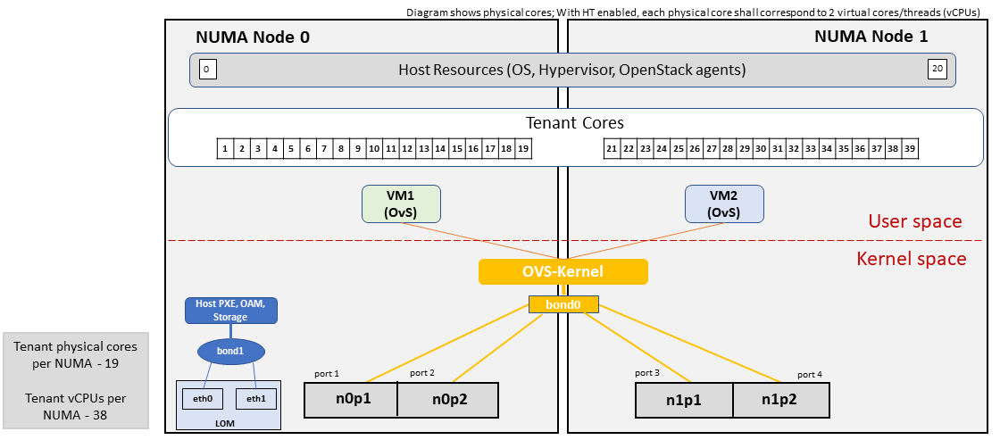
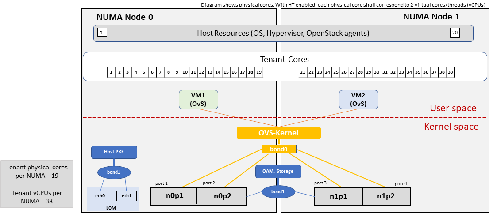
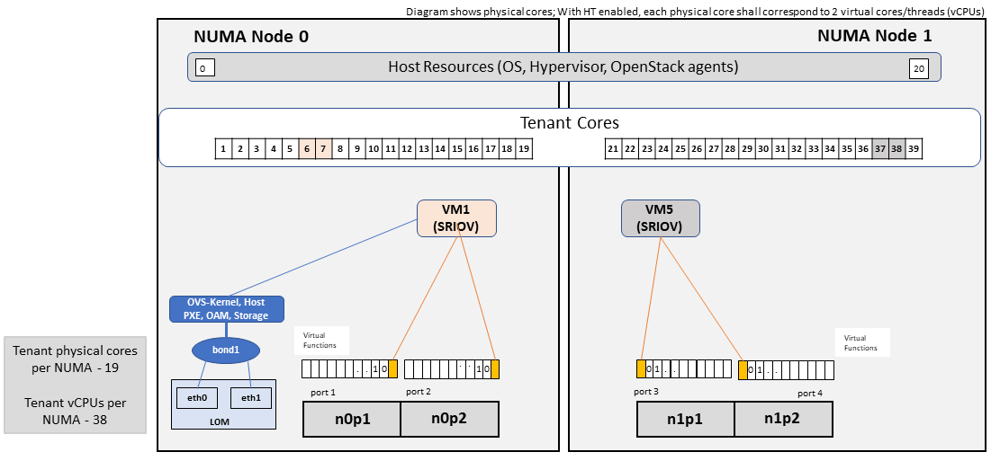
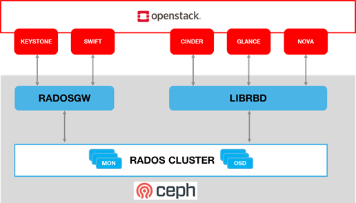

[<< Back](../../openstack)

# 4. Cloud Infrastructure + VIM Component Level Architecture

## Table of Contents
* [4.1 Introduction](#4.1)
* [4.2 Underlying Resources](#4.2)
  * [4.2.1 Virtualisation](#4.2.1)
  * [4.2.2 Compute](#4.2.2)
  * [4.2.3 Network Fabric](#4.2.3)
  * [4.2.4 Storage Backend](#4.2.4)
* [4.3 Virtualised Infrastructure Manager (VIM)](#4.3)
  * [4.3.1 VIM Services](#4.3.1)
  * [4.3.2 Containerised OpenStack Services](#4.3.2)
* [4.4 Consumable Infrastructure Resources and Services](#4.4)
  * [4.4.1 Support for Cloud Infrastructure Profiles and flavors](#4.4.1)
  * [4.4.2 Logical segregation and high availability](#4.4.2)
  * [4.4.3 Transaction Volume Considerations](#4.4.3)
* [4.5 Cloud Topology and Control Plane Scenarios](#4.5)
  * [4.5.1 Edge Cloud Topology](#4.5.1)

## 4.1 Introduction.

Chapter 3 introduced the components of an OpenStack-based IaaS
-	Consumable Infrastructure Resources and Services
-	Cloud Infrastructure Management Software (VIM: OpenStack) core services and architectural constructs needed to consume and manage the consumable resources
-	Underlying physical compute, storage and networking resources

This chapter delves deeper into the capabilities of these different resources and their needed configurations to create and operate an OpenStack-based IaaS cloud. This chapter specifies details on the structure of control and user planes, operating systems, hypervisors and BIOS configurations, and architectural details of underlay and overlay networking, and storage, and the distribution of OpenStack service components among nodes. The chapter gets into details into items such as the implementation support for flavors.

## 4.2 Underlying Resources

### 4.2.1 Virtualisation
In OpenStack, KVM is configured as the default hypervisor for compute nodes.
- Configuration: [OpenStack](https://docs.openstack.org/nova/train/admin/configuration/hypervisor-kvm.html) specifies the following KVM configuration steps/instructions to configure KVM:
  - Enable KVM based hardware virtualisation in BIOS. OpenStack provides instructions on how to enable hardware virtualisation for different hardware platforms (x86, Power)
    - QEMU is similar to KVM in that both are libvirt controlled, have the same feature set and utilize compatible virtual machine images
  -	Configure Compute backing storage
  -	Specify the CPU Model for KVM guests (VMs)
  -	KVM Performance Tweaks
-	[Hardening](https://docs.openstack.org/security-guide/compute/hardening-the-virtualization-layers.html)
    - OpenStack recommends minimizing the code base by removing unused components
    -	sVirt (Secure Virtualisation) provides isolation between VM processes, devices, data files and system processes

### 4.2.2. Compute

#### 4.2.2.1. Cloud Deployment (Foundation/management) Node
Minimal configuration: 1 node

#### 4.2.2.2. OpenStack Control Plane Servers (Control Nodes)
- BIOS Requirements
For OpenStack control nodes we use the BIOS parameters for the basic profile defined in [Chapter 5.4 of the Reference Model](../../../ref_model/chapters/chapter05.md#5.4). Additionally, for OpenStack we need to set the following boot parameters:

| BIOS/boot Parameter | Value |
|--------------------|--------------------|
| Boot disks |RAID 1 |
| CPU reservation for host (kernel) |1 core per NUMA |
| CPU allocation ratio |2:1 |

-	How many nodes to meet SLA
    -	Minimum 3 nodes for high availability
-	HW specifications
    -	Boot disks are dedicated with Flash technology disks
-	Sizing rules
    -	It is easy to horizontally scale the number of control nodes
    -	The number of control nodes is determined by a minimum number needed for high availability (viz., 3 nodes) and the extra nodes needed to handle the transaction volumes, in particular, for Messaging service (e.g., RabbitMQ) and Database (e.g., MySQL) to track state.
    -	The number of control nodes only needs to be increased in environments with a lot of changes, such as a testing lab, or a very large cloud footprint (rule of thumb: number of control nodes = 3 + quotient(number of compute nodes/1000)).
      -	The [Services Placement Summary table](https://fuel-ccp.readthedocs.io/en/latest/design/ref_arch_100_nodes.html) specifies the number of instances that are required based upon the cloud size (number of nodes).

#### 4.2.2.3. Network nodes

Networks nodes are mainly used for L3 traffic management for overlay tenant network (see more detail in section 4.3.1.5 Neutron)

-	BIOS requirements

| BIOS/boot Parameter | Value |
|--------------------|--------------------|
| Boot disks |RAID 1 |

-	How many nodes to meet SLA
    - Minimum 2 nodes for high availibility using VRRP.
-	HW specifications
    - 3 NICs card are needed if we want to isolate the different flows:
         - 1 NIC for Tenant Network
         - 1 NIC for External Network
         - 1 NIC for Other Networks (PXE, Mngt ...)
-	Sizing rules
    - Scale out of network node is not easy
    - DVR can be an option for large deployment (see more detail in chapter 4.3.1.5 - Neutron)

#### 4.2.2.4. Storage nodes
-	BIOS requirements

| BIOS/boot Parameter | Value |
|--------------------|--------------------|
| Boot disks |RAID 1 |

-	HW specifications
-	How many nodes to meet SLA
-	Sizing rules

#### 4.2.2.5. Compute Nodes

This section specifies the compute node configurations to support the flavors. Because a flavor has the same capabilities but different geometry sizes, the term “flavor series” is used.

-	The software and hardware configurations are as specified in the [Reference Model chapter 5.4](../../../ref_model/chapters/chapter05.md#5.4)
-	BIOS requirement
    -	The general BIOS requirements are described in the [Reference Model chapter 5.4](../../../ref_model/chapters/chapter05.md#5.4)

Reference Model Chapter 4 [Table 4-13](../../../ref_model/chapters/chapter04.md#predefined-compute-flavours) specifies flavor geometry and capabilities.  For convenience, the flavor geometry is reproduced in Table 4-1.

**Flavor Geometry**

| .conf | vCPU (c) | RAM (r) | Local Disk (d) | Management interface |
|----|----|----|----|----|
| .tiny | 1 | 512 MB | 1 GB | 1 Gbps |
| .small | 1 | 2 GB | 20 GB  | 1 Gbps |
| .medium | 2 | 4 GB | 40 GB | 1 Gbps |
| .large | 4 | 8 GB | 80 GB | 1 Gbps |
| .2xlarge* | 8 | 16 GB | 160 GB | 1 Gbps |
| .4xlarge* | 16 | 32 GB | 320 GB | 1 Gbps |
| .8xlarge* | 32 | 64 GB | 640 GB | 1 Gbps |

<b>Table 4-1: Flavor Geometries</b>

**Flavor Series**

The Reference Model specifies the Basic (B) and Network Intensive (N) instance types (or flavor series). The Reference Model also specifies support for two different CPU allocation ratio values for the Basic flavor types, and choice of network acceleration capabilities utilising DPDK and SR-IOV technologies; please note SR-IOV is supported under an exception policy. Table 4-2 lists the capabilities for each flavor series.

| Flavor Series | CPU Allocation Ratio | SMT | CPU Pinning | NUMA | Huge Pages | Data Traffic |
|----|----|----|----|----|----|----|
| B1 | 1:1 | Y | N | N | N | OVS-kernel |
| B4 | 4:1 | Y | N | N | N | OVS-kernel |
| NV | 1:1 | Y | Y | Y | Y | OVS-kernel |
| ND | 1:1 | Y | Y | Y | Y | OVS-DPDK |
| NS | 1:1 | Y | Y | Y | Y | SR-IOV |

<b>Table 4-2: Flavor Capabilities</b>

**BIOS Settings**

SMT, CPU Pinning, NUMA and Huge Pages are configured in the BIOS.

Additionally, for OpenStack, we need to set the following boot parameters:

| BIOS/boot Parameter | Basic  | Network Intensive |
|---------------|-----------|------------------|
| Boot disks | RAID 1 | RAID 1 |

<!---
Had to delete the Column for Compute intensive as commenting in table  didn't work
Entries were:
Boot Disks: RAID 1
CPU reservation for host: 1 core per NUMA
--->
-	How many nodes to meet SLA
    - minimum: two nodes per profile
-	HW specifications
    -	Boot disks are dedicated with Flash technology disks

- In case of DPDK usage:

| Layer | Description |
|-------------|--|
| Cloud infrastructure | Important is placement of NICs to get NUMA-balanced system (balancing the I/O, memory, and storage across both sockets), and configuration of NIC features. Server BIOS and Host OS kernel command line settings are described in [DPDK release notes](http://doc.dpdk.org/guides/rel_notes/) and [DPDK performance reports](http://core.dpdk.org/perf-reports/). Disabling power settings (like Intel Turbo Boost Technology) brings stable performance results, although understanding if and when they benefit workloads and enabling them can achieve better performance results. |
| Workload | DPDK uses core affinity along with 1G or 2M Huge Pages, NUMA settings (to avoid crossing inteconnect between CPUs), and DPDK Poll Mode Drivers (PMD, on reserved cores) to get the best performance. DPDK versions xx.11 are Long-Term Support maintained stable release with back-ported bug fixes for a two-year period. |

-	Sizing rules

| Number of CPU sockets| s |
| ------------|--|
| Number of cores| c |
| SMT| t |
| RAM| rt |
| Storage| d |
| Overcommit| o |
| Average vCPU per instance | v |
| Average RAM per instance | ri |

| | | Basic | Network Intensive |
|---------------|------------|------------|------------|
| # of VMs per node (vCPU) | (s*c*t*o)/v | 4*(s*c*t)/v | (s*c*t)/v|  
| # of VMs per node (RAM) | rt/ri | rt/ri | rt/ri |  
| | | | |  
| Max # of VMs per node|  | min(4*(s*c*t)/v, rt/ri)| min((s*c*t)/v, rt/ri)|  

<!---
Had to delete the Column for Compute intensive as commenting in table  didn't work
Entries were:
# of VMs per node (vCPU): s*c*t)/v| (s*c*t)/v
# of VMs per node (RAM): rt/ri
Max # of VMs per node: min((s*c*t)/v, rt/ri)
--->
Caveats:
-	These are theoretical limits
-	Affinity and anti-affinity rules, among other factors, affect the sizing

#### 4.2.2.6. Compute Resource Pooling Considerations

-	Multiple pools of hardware resources where each resource pool caters for workloads of a specific profile (for example, network intensive) leads to inefficient use of the hardware as the server resources are specific to the flavour. If not properly sized or when demand changes can lead to oversupply/starvation scenarios; reconfiguration may not be possible because of the underlying hardware or inability to vacate servers for reconfiguration to support another flavour type.
-	Single pool of hardware resources including for controllers have the same CPU type. This is operationally efficient as any server can be utilized to support a flavour or controller. The single pool is valuable with unpredictable workloads or when the demand of certain flavours is insufficient to justify individual hardware selection.

#### 4.2.2.7. Reservation of Compute Node Cores
The [RA-1 2.3.2 Infrastructure Requirements](./chapter02.md#232-infrastructure-requirements) req.inf.com.08 requires the allocation of "certain number of host cores/threads to non-tenant workloads such as for OpenStack services." A number ("n") of random cores can be reserved for host services (including OpenStack services) by specifying the following in nova.conf:

&nbsp;&nbsp;&nbsp;&nbsp;&nbsp;&nbsp;&nbsp;&nbsp; reserved_host_cpus = n

where n is any positive integer.

If we wish to dedicate specific cores for host processing we need to consider two different use cases:

    1. Require dedicated cores for Guest resources
    2. No dedicated cores are required for Guest resources

Scenario #1, results in compute nodes that host both pinned and unpinned workloads. In the OpenStack Train release, scenario #1 is not supported; it may also be something that operators may not allow. Scenario #2 is supported through the specification of the cpu_shared_set configuration. The cores and their sibling threads dedicated to the host services are those that do not exist in the cpu_shared_set configuration.

Let us consider a compute host with 20 cores and SMT enabled (let us disregard NUMA) and the following parameters have been specified. The physical cores are numbered '0' to '19' while the sibling threads are numbered '20' to '39' where the vCPUs numbered '0' and '20', '1' and '21', etc. are siblings:

&nbsp;&nbsp;&nbsp;&nbsp;&nbsp;&nbsp;&nbsp;&nbsp; cpu_shared_set = 1-7,9-19,21-27,29-39 &nbsp;&nbsp;&nbsp;&nbsp;&nbsp;&nbsp;&nbsp;&nbsp; (can also be specified as cpu_shared_set = 1-19,^8,21-39,^28)

This implies that the two physical cores '0' and '8' and their sibling threads '20' and '28' are dedicated to the host services, and 19 cores and their sibling threads are available for Guest instances (and can be over allocated as per the specified cpu_allocation_ratio in nova.conf.

#### 4.2.2.8. Pinned and Unpinned CPUs

When a VM instance is created the vCPUs are, by default, not assigned to a particular host CPU. Certain workloads require real-time or near real-time behavior viz., uninterrupted access to their cores. For such workloads, CPU pinning allows us to bind an instance’s vCPUs to particular host cores or SMT threads. To configure a flavor to use pinned vCPUs, we use a dedicated CPU policy.

&nbsp;&nbsp;&nbsp;&nbsp;&nbsp;&nbsp;&nbsp;&nbsp; openstack flavor set .xlarge --property hw:cpu_policy=dedicated

While an instance with pinned CPUs cannot use CPUs of another pinned instance, this does not apply to unpinned instances; an unpinned instance can utilize the pinned CPUs of another instance. To prevent unpinned instances from disrupting pinned instances, the hosts with CPU pinning enabled are pooled in their own host aggregate and hosts with CPU pinning disabled are pooled in another non-overlapping host aggregate.

#### 4.2.2.9 Compute node configurations for Profiles and Flavors

This section specifies the compute node configurations to support the flavors.

**Cloud Infrastructure Hardware Profile**

The Cloud Infrastructure Hardware (or simply “host”) profile and configuration parameters are utilised in the reference architecture to define different hardware profiles; these are used to configure the BIOS settings on a physical server.

A flavor (see RM Chapters 4 and 5) defines the characteristics (“capabilities”) of Virtual Machines (VMs or vServers) that will be deployed on hosts assigned a host-profile. A many to many relationship exists between flavors and host profiles. A given host can only be assigned a single host profile; a host profile can be assigned to multiple hosts. Host profiles are immutable and hence when a configuration needs to be changed, a new host profile is created.

**CPU Allocation Ratio and CPU Pinning**

Host profiles need to be created. for example, for each of the CPU Allocation Ratios specified for a flavor; this gives rise in the different flavor series. A given host (compute node) can only support a single CPU Allocation Ratio. Thus, to support the 2 Basic flavor types with CPU Allocation Ratios of 1.0 and 4.0 we will need to create 2 different host profiles and separate host aggregates for each of the host profiles. The CPU Allocation Ratio is set in the hypervisor on the host.

When a CPU Allocation Ratio exceeds 1.0 then CPU Pinning also needs to be disabled.

**Server Configurations**

The different networking choices – OVS-Kernel, OVS-DPDK, SR-IOV – result in different NIC port, LAG (Link Aggregation Group), and other configurations. Some of these are shown diagrammatically in the next section.

**_Leaf and Compute Ports for Server Flavors must align_**

Compute hosts have varying numbers of Ports/Bonds/LAGs/Trunks/VLANs connected with Leaf ports. Each Leaf port (in A/B pair) must be configured to align with the interfaces required for the compute flavor.

Physical Connections/Cables are generally the same within a zone, regardless of these specific L2/L3/SR-IOV configurations for the compute

**Compute Bond Port:**  TOR port maps VLANs directly with IRBs on the TOR pair for tunnel packets and Control Plane Control and Storage packets.  These packets are then routed on the underlay network GRT.

Server Flavors:  B1, B4, NV, ND

**Compute SR-IOV Port:**  TOR port maps VLANs with bridge domains that extend to IRBs, using VXLAN VNI.  The TOR port associates each packet’s outer VLAN tag with a bridge domain to support VNF interface adjacencies over the local EVPN/MAC bridge domain.  This model also applies to direct physical connections with transport elements.

Server Flavors:  NS

**Notes on SR-IOV**

SR-IOV at the Compute Server routes Guest traffic directly with a partitioned NIC card, bypassing the hypervisor and vSwitch software, which provides higher bps/pps throughput for the Guest VM.  OpenStack and MANO manage SR-IOV configurations for Tenant VM interfaces.

- Server, Linux, and NIC card hardware standards include SR-IOV and VF requirements
- Network Intensive Flavors for SR-IOV (ns series) with specific NIC/Leaf port configurations
- OpenStack supports SR-IOV provisioning
- Implement Security Policy, Tap/Mirror, QoS, etc. functions in the NIC, Leaf, and other places

Because SR-IOV involves Guest VLANs between the Compute Server and the ToR/Leafs, Guest automation and VM placement necessarily involves the Leaf switches (e.g., access VLAN outer tag mapping with VXLAN EVPN).   

- Local VXLAN tunneling over IP-switched fabric implemented between VTEPs on Leaf switches.  
- Leaf configuration controlled by SDN-Fabric/Global Controller.
- Underlay uses VXLAN-enabled switches for EVPN support

SR-IOV-based networking for Tenant Use Cases is required where vSwitch-based networking throughput is inadequate.

**Example Host Configurations**

_Host configurations for B1, B4 Flavor Series_

<b> Figure 4-1: Basic Profile Host Configuration (example and simplified).</b>

Let us refer to the data traffic networking configuration of Figure 4-1 to be part of the hp-B1-a and hp-B4-a host profiles and this requires the configurations as Table 4-3.

| | Configured in | Host profile: hp-B1-a | Host profile: hp-B4-a |
|----|----|----|----|
| CPU Allocation Ratio | Hypervisor | 1:1 | 4:1 |
| CPU Pinning | BIOS | Disable | Disable |
| SMT  | BIOS | Enable | Enable |
| NUMA | BIOS | Disable | Disable |
| Huge Pages  | BIOS | No | No |
| Flavor Series | | B1 | B4 |

<b>Table 4-3: Configuration of Basic Flavor Capabilities</b>

Figure 4-2 shows the networking configuration where the storage and OAM share networking but are independent of the PXE network.

<b>Figure 4-2: Basic Profile Host Configuration with shared Storage and OAM networking (example and simplified).</b>

Let us refer to the above networking set up to be part of the hp-B1-b and hp-B4-b host profiles but the basic configurations as specified in Table 4-3.

In our example, the flavor series B1 and B4, are each mapped to two different host profiles hp-B1-a and hp-B1-b, and hp-B4-a and hp-B4-b respectively. Different network configurations, reservation of CPU cores, Lag values, etc. result in different host profiles.

To ensure Tenant CPU isolation from the host services (Operating System (OS), hypervisor and OSTK agents), the following needs to be configured

| GRUB bootloader Parameter |Description |Values |
|----|----|----|
| isolcpus (Applicable only on Compute Servers) | A set of cores isolated from the host processes. Contains vCPUs reserved for Tenants | isolcpus=1-19, 21-39, 41-59, 61-79 |

_Host configuration for NV Flavor Series_

The above examples of host networking configurations for the B1 and B4 flavor series are also suitable for the NV flavor series; however, the hypervisor and BIOS settings will be different (see table below) and hence there will be a need for different host profiles. Table 4-4 gives examples of three different host profiles; one each for NV, ND and NS flavor series.

|  | Configured in | Host profile: hp-nv-a | Host profile: hp-nd-a | Host profile: hp-ns-a |
|----|----|----|----|----|
| CPU Allocation Ratio | Hypervisor | 1:1 | 1:1 | 1:1 |
| CPU Pinning | BIOS | Enable | Enable | Enable |
| SMT  | BIOS | Enable | Enable | Enable |
| NUMA | BIOS | Enable | Enable | Enable |
| Huge Pages  | BIOS | Yes | Yes | Yes |
| Flavor Series | NV | ND | NS |

<b>Table 4-4: Configuration of Network Intensive Flavor Capabilities</b>

_Host Networking configuration for ND Flavor Series_

An example of the data traffic configuration for the ND (OVS-DPDK) flavor series is shown in Figure 4-3.

<b> Figure 4-3: Network Intensive Profile Host Configuration with DPDK acceleration (example and simplified).</b>

To ensure Tenant and DPDK CPU isolation from the host services (Operating System (OS), hypervisor and OSTK agents), the following needs to be configured

| GRUB bootloader Parameter |Description |Values |
|----|----|----|
| isolcpus (Applicable only on Compute Servers) | A set of cores isolated from the host processes. Contains vCPUs reserved for Tenants and DPDK | isolcpus=3-19, 23-39, 43-59, 63-79 |

_Host Networking configuration for NS Flavor Series_

An example of the data traffic configuration for the NS (SR-IOV) flavor series is shown in Figure 4-4.

<b> Figure 4-4: Network Intensive Profile Host Configuration with SR-IOV (example and simplified).</b>

To ensure Tenant CPU isolation from the host services (Operating System (OS), hypervisor and OSTK agents), the following needs to be configured

| GRUB bootloader Parameter |Description |Values |
|----|----|----|
| isolcpus (Applicable only on Compute Servers) | A set of cores isolated from the host processes. Contains vCPUs reserved for Tenants | isolcpus=1-19, 21-39, 41-59, 61-79 |

**Using Hosts of a Host Profile type**

As we have seen a flavor series is supported by configuring hosts in accordance with the flavor series specifications. For example, an instance of flavor type B1 can be hosted on a compute node that is configured as an hp-B1-a or hp-B1-b host profile. All compute nodes configured with hp-B1-a or hp-B1-b host profile are made part of a host aggregate, say, ha-B1 and thus during VM instantiation of B1 flavor hosts from the ha-B1 host aggregate will be selected.

### 4.2.3. Network Fabric

Networking Fabric consists of:
-	Physical switches, routers…
-	Switch OS
-	Minimum number of switches
-	Dimensioning for East/West and North/South
-	Spine / Leaf topology – east – west
-	Global Network parameters
-	OpenStack control plane VLAN / VXLAN layout
-	Provider VLANs

#### 4.2.3.1 Physical Network Topology

#### 4.2.3.2 High Level Logical Network Layout

<b>Figure 4-5: Indicative OpenStack Network Layout.</b>

| Network | Description | Characteristics |
|----------|---------|--------------|
| Provisioning & Management | Initial OS bootstrapping of the servers via PXE, deployment of software and thereafter for access from within the control plane. | Security Domain: Management Externally Routable: No Connected to: All nodes |
| Internal API | Intra-OpenStack service API communications, messaging and database replication | Security Domain: Management Externally Routable: No  Connected to: All nodes except foundation |
| Storage Management | Backend connectivity between storage nodes for heartbeats, data object replication and synchronisation | Security Domain: Storage  Externally Routable: No  Connected to: All nodes except foundation |
| Storage Front-end | Block/Object storage access via cinder/swift | Security Domain: Storage Externally Routable: No Connected to: All nodes except foundation |
| Tenant | VXLAN / Geneve project overlay networks (OVS kernel mode) – i.e. RFC1918 re-usable private networks as controlled by cloud administrator | Security Domain: Underlay Externally Routable: No   Connected to: controllers and computes |
| External API | Hosts the public OpenStack API endpoints including the dashboard (Horizon) | Security Domain: Public Externally routable: Yes Connected to: controllers |
| External Provider (FIP) | Network with a pool of externally routable IP addresses used by neutron routers to NAT to/from the tenant RFC1918 private networks | Security Domain: Data Centre Externally routable: Yes Connected to: controllers, OVS computes |
| External Provider (VLAN) | External Data Centre L2 networks (VLANs) that are directly accessible to the project. Note: External IP address management is required | Security Domain: Data Centre Externally routable: Yes Connected to: OVS DPDK computes |
| IPMI / Out of Band | The remote “lights-out” management port of the servers e.g. iLO, IDRAC / IPMI / Redfish | Security Domain: Management Externally routable: No Connected to: IPMI port on all servers |

A VNF application network topology is expressed in terms of VMs, vNIC interfaces with vNet access networks, and WAN Networks while the VNF Application VMs require multiple vNICs, VLANs, and host routes configured within the VM’s Kernel.

#### 4.2.3.3. Octavia v2 API conformant Load Balancing
Load balancing is needed for automatic scaling, managing availability and changes. [Octavia](https://docs.openstack.org/octavia/latest/reference/introduction.html) is an open-source load balancer for OpenStack, based on HAProxy, and replaces the deprecated (as of OpenStack Queens release) Neutron LBaaS. The Octavia v2 API is a superset of the deprecated Neutron LBaaS v2 API and has a similar CLI for seamless transition.

As a default Octavia utilizes Amphorae Load Balancer. Amphorae consists of a fleet of VMs, containers or bare metal servers and delivers horizontal scaling by managing and spinning these resources on demand. The reference implementation of the Amphorae image is an Ubuntu virtual machine running HAProxy.

Octavia depends upon a number of OpenStack services including Nova for spinning up compute resources on demand and their life cycle management; Neutron for connectivity between the compute resources, project environment and external networks; Keystone for authentication; and Glance for storing of the compute resource images.

Octavia supports provider drivers which allows third-party load balancing drivers (such as F5, AVI, etc.) to be utilized instead of the default Amphorae load balancer. When creating a third-party load balancer, the **provider** attribute is used to specify the backend to be used to create the load balancer. The **list providers** lists all enabled provider drivers.  Instead of using the provider parameter, an alternate is to specify the flavor_id in the create call where provider-specific Octavia flavors have been created.

#### 4.2.3.4. Neutron Extensions
OpenStack Neutron is an extensible framework that allows incorporation through plugins and API Extensions. API Extensions provides a method for introducing new functionality and vendor specific capabilities. Neutron plugins support new or vendor-specific functionality. Extensions also allow specifying new resources or extensions to existing resources and the actions on these resources.  Plugins implement these resources and actions.

CNTT Reference Architecture support the ML2 plugin (see below) as well as the service plugins including for [FWaaS (Firewall as a Service)](https://docs.openstack.org/neutron/train/admin/fwaas.html), [LBaaS (Load Balancer as a Service)](https://governance.openstack.org/tc/reference/projects/octavia.html), and [VPNaaS (VPN as a Service)](https://opendev.org/openstack/neutron-vpnaas/). The OpenStack wiki provides a list of [Neutron plugins](https://wiki.openstack.org/wiki/Neutron#Plugins).

Every Neutron plugin needs to implement a minimum set of common [methods (actions for Train release)](https://docs.openstack.org/neutron/train/contributor/internals/api_extensions.html).  Resources can inherit Standard Attributes and thereby have the extensions for these standard attributes automatically incorporated. Additions to resources, such as additional attributes, must be accompanied by an extension.

[Chapter 5](chapter05.md), Interfaces and APIs, of this Reference Architecture provides a list of [Neutron Extensions](chapter05.md#525-neutron).  The current available extensions can  be obtained using [List Extensions API](https://docs.openstack.org/api-ref/network/v2/#list-extensions) and details about an extension using [Show extension details API](https://docs.openstack.org/api-ref/network/v2/#show-extension-details).

**Neutron ML2 integration**
The OpenStack Modular Layer 2 (ML2) plugin simplifies adding networking technologies by utilizing drivers that implement these network types and methods for accessing them. Each network type is managed by an ML2 type driver and the mechanism driver exposes interfaces to support the actions that can be performed on the network type resources. The [OpenStack ML2 documentation](https://wiki.openstack.org/wiki/Neutron/ML2) lists example mechanism drivers.

#### 4.2.3.5. Network quality of service
With support of VNF workloads, the resources bottlenecks are not only the CPU and the memory but also the I/O bandwidth and the forwarding capacity of virtual and non-virtual switches and routers within the infrastructure. Several techniques (all complementary) can be used to improve QoS and try to avoid any issue due to a network bottleneck (mentioned per order of importance):
-	Nodes interfaces segmentation: Have separated NIC ports for Storage and Tenant networks. Actually, the storage traffic is bursty, and especially in case of service restoration after some failure or new service implementation, upgrades, etc. Control and management networks should rely on a separate interface from the interface used to handle tenant networks.
-	Capacity planning: FW, physical links, switches, routers, NIC interfaces and DCGW dimensioning (+ load monitoring: each link within a LAG or a bond shouldn’t be loaded over 50% of its maximum capacity to guaranty service continuity in case of individual failure).
-	Hardware choice: e.g. ToR/fabric switches, DCGW and NIC cards should have appropriate buffering and queuing capacity.
-	Network intensive compute node tuning (including OVS-DPDK).

#### 4.2.3.6. Integration Interfaces
- DHCP
When the Neutron-DHCP agent is hosted in controller nodes, then for VMs, on a Tenant network, that need to acquire an IPv4 and/or IPv6 address, the VLAN for the Tenant must be extended to the control plane servers so that the Neutron agent can receive the DHCP requests from the VM and send the response to the VM with the IPv4 and/or IPv6 addresses and the lease time. Please see OpenStack provider Network.
-	DNS
-	LDAP
-	IPAM

### 4.2.4. Storage Backend
Storage systems are available from multiple vendors and can also utilize commodity hardware from any number of Open Source based storage packages (such as LVM, Ceph, NFS, etc.). The proprietary and open-source storage systems are supported in Cinder through specific plugin drivers. The OpenStack [Cinder documentation]( https://docs.openstack.org/cinder/latest/reference/support-matrix.html) specifies the minimum functionality that all storage drivers must support. The functions include:
-	Volume: create, delete, attach, detach, extend, clone (volume from volume), migrate
-	Snapshot: create, delete and create volume from snapshot
-	Image: create from volume

The document also includes a matrix for a number of proprietary drivers and some of the optional functions that these drivers support. This matrix is a handy tool to select storage backends that have the optional storage functions needed by the cloud operator. The cloud workload storage requirements helps determine the backends that should be deployed by the cloud operator.   The common storage backend attachment methods include iSCSI, NFS, local disk, etc. and the matrix list the supported methods for each of the vendor drivers. The OpenStack Cinder [Available Drivers]( https://docs.openstack.org/cinder/latest/drivers.html) documentation provides a list of all OpenStack compatible drivers and their configuration options.

The [Cinder Configuration]( https://docs.openstack.org/cinder/latest/configuration/index.html) document provides information on how to configure cinder including CNTT required capabilities for volume encryption, Policy configuration, quotas, etc. The [Cinder Administration]( https://docs.openstack.org/cinder/latest/admin/index.html) document provides information on the capabilities required by CNTT including managing volumes, snapshots, multi-storage backends, migrate volumes, etc.

[Ceph](https://ceph.io/) is the default CNTT Reference Architecture storage backend and is discussed below.

#### 4.2.4.1. Ceph Storage Cluster

The Ceph storage cluster is deployed on bare metal hardware. The minimal configuration is a cluster of three bare metal servers to ensure High availability. The Ceph Storage cluster consists of the following components:
-	CEPH-MON (Ceph Monitor)
-	OSD (object storage daemon)
-	RadosGW (Rados Gateway)
- Journal
- Manager

Ceph monitors maintain a master copy of the maps of the cluster state required by Ceph daemons to coordinate with each other. Ceph OSD handle the data storage (read/write data on the physical disks), data replication, recovery, rebalancing, and provides some monitoring information to Ceph Monitors. The RadosGW provides Object Storage RESTful gateway with a Swift-compatible API for Object Storage.

 <b>Figure 4-6: Ceph Storage System.</b>

**BIOS Requirement for Ceph servers**

| BIOS/boot Parameter | Value |
|-------------|----------------|
| Boot disks | RAID 1 |

How many nodes to meet SLA :
-	minimum: three bare metal servers where Monitors are collocated with OSD. Note: at least 3 Monitors and 3 OSDs are required for High AVailability.

HW specifications :
- Boot disks are dedicated with Flash technology disks
- For an IOPS oriented cluster (Flash technology ), the journal can be hosted on OSD disks
- For a capacity oriented cluster (HDD), the journal must be hosted on dedicated Flash technology disks

Sizing rules :
-	Minimum of 6 disks per server
-	Replication factor : 3
-	1 Core-GHz per OSD
-	16GB RAM baseline + 2-3 GB per OSD

## 4.3 Virtualised Infrastructure Manager (VIM)
This section covers:
-	Detailed breakdown of OpenStack core services
-	Specific build-time parameters

### 4.3.1 VIM Services
A high level overview of the core OpenStack Services was provided in [Chapter 3](./chapter03.md). In this section we describe the core and other needed services in more detail.

#### 4.3.1.1 Keystone
Keystone is the authentication service, the foundation of identity management in OpenStack. Keystone needs to be the first deployed service. Keystone has services running on the control nodes and no services running on the compute nodes:
-	Keystone admin API
-	Keystone public API – in Keystone V3 this is the same as the admin API,

#### 4.3.1.2 Glance
Glance is the image management service. Glance has only a dependency on the Keystone service therefore it is the second one deployed. Glance has services running on the control nodes and no services running on the compute nodes:
-	Glance API
-	Glance Registry

_The Glance backends include Swift, Ceph RBD and NFS_

#### 4.3.1.3 Cinder
Cinder is the block device management service, Cinder depends on Keystone and possibly Glance to be able to create volumes from images. Cinder has services running on the control nodes and no services running on the compute nodes:
-	Cinder API
-	Cinder Scheduler
-	Cinder Volume – the Cinder volume process needs to talk to its backends

_The Cinder backends include SAN/NAS storage, iSCSI drives, Ceph RBD and NFS._

#### 4.3.1.4 Swift
Swift is the object storage management service, Swift depends on Keystone and possibly Glance to be able to create volumes from images. Swift has services running on the control nodes and the compute nodes:
-	Proxy Services
-	Object Services
-	Container Services
-	Account Services

_The Swift backends include iSCSI drives, Ceph RBD and NFS._

#### 4.3.1.5 Neutron
Neutron is the networking service, Neutron depends on Keystone and has services running on the control nodes and the compute nodes. Depending upon the workloads to be hosted by the Infrastructure and the expected load on the controller node, some of the Neutron services can run on separate network node(s). Factors affecting controller node load include number of compute nodes and the number of API calls being served for the various OpenStack services (nova, neutron, cinder, glance etc.). To reduce controller node load, network nodes are widely added to manage L3 traffic for overlay tenant networks and interconnection with external networks. Table 4-2 below lists the networking service components and their placement. Please note that while network nodes are listed in the table below, network nodes only deal with tenant networks and not provider networks. Also, network nodes are not required when SDN is utilized for networking.

| Networking Service component | Description | Required or Optional Service | Placement |
|-----|-----|----|----|
| neutron server (neutron-server and neutron-\*-plugin) | Manages user requests and exposes the Neutron APIs | Required | Controller node |
| DHCP agent (neutron-dhcp-agent) | Provides DHCP services to tenant networks and is responsible for maintaining DHCP configuration. For High availability, multiple DHCP agents can be assigned. | Optional depending upon plug-in | Network node   (Controller node if no network node present) |
| L3 agent (neutron-l3-agent) | Provides L3/NAT forwarding for external network access of VMs on tenant networks and supports services such as Firewall-as-a-service (FWaaS) and Load Balancer-as-a-service (LBaaS) | Optional depending upon plug-in | Network node  (Controller node if no network node present)  NB in DVR based OpenStack Networking, also in all Compute nodes. |
| neutron metadata agent (neutron-metadata-agent) | The metadata service provides a way for instances to retrieve instance-specific data. The networking service, neutron, is responsible for intercepting these requests and adding HTTP headers which uniquely identify the source of the request before forwarding it to the metadata API server. These functions are performed by the neutron metadata agent. | Optional | Network node   (Controller node if no network node present) |
| neutron plugin agent (neutron-\*-agent) | Runs on each compute node to control and manage the local virtual network driver (such as the Open vSwitch or Linux Bridge) configuration and local networking configuration for VMs hosted on that node. | Required | Every Compute Node |

<b>Table 4-2: Neutron Services Placement</b>

**Issues with the standard networking (centralized routing) approach**

The network node performs both routing and NAT functions and represents both a scaling bottleneck and a single point of failure.

Two VMs on different compute nodes and using different project networks (a.k.a. tenant networks) where the both of the project networks are connected by a project router. For communication between the two VMs (instances with a fixed or floating IP address), the network node routes East-West network traffic among project networks using the same project router. Even though the instances are connected by a router, all routed traffic must flow through the network node, and this becomes a bottleneck for the whole network.

While the separation of the routing function from the controller node to the network node provides a degree of scaling it is not a truly scalable solution.  We can either add additional cores/compute-power or network node to the network node cluster, but, eventually, it runs out of processing power especially with high throughput requirement. Therefore, for scaled deployments, there are multiple options including use of Dynamic Virtual Routing (DVR) and Software Defined Networking (SDN).  

**Distributed Virtual Routing (DVR)**

With DVR, each compute node also hosts the L3-agent (providing the distributed router capability) and this then allows direct instance to instance (East-West) communications.

The OpenStack “[High Availability Using Distributed Virtual Routing (DVR)]( https://docs.openstack.org/liberty/networking-guide/scenario-dvr-ovs.html)” provides an in depth view into how DVR works and the traffic flow between the various nodes and interfaces for three different use cases. Please note that DVR was introduced in the OpenStack Juno release and, thus, its detailed analysis in the Liberty release documentation is not out of character for OpenStack documentation.

DVR addresses both scalability and high availability for some L3 functions but is not fully fault tolerant. For example, North/South SNAT traffic is vulnerable to single node (network node) failures. [DVR with VRRP]( https://docs.openstack.org/neutron/train/admin/config-dvr-ha-snat.html) addresses this vulnerability.

**Software Defined Networking (SDN)**

For the most reliable solution that addresses all the above issues and Telco workload requirements requires SDN to offload Neutron calls.

SDN provides a truly scalable and preferred solution to suport dynamic, very large-scale, high-density, telco cloud environments. OpenStack Neutron, with its plugin architecture, provides the ability to integrate SDN controllers (
[3.2.5. Virtual Networking – 3rd party SDN solution](./chapter03.md#325-virtual-networking--3rd-party-sdn-solution)). With SDN incorporated in OpenStack, changes to the network is triggered by workloads (and users), translated into Neutron APIs and then handled through neutron plugins by the corresponding SDN agents.

#### 4.3.1.6 Nova
Nova is the compute management service, Nova depends on all above components and is deployed after. Nova has services running on the control nodes and the compute nodes:
-	nova-metadata-api
-	nova-compute api
-	nova-consoleauth
-	nova-scheduler
-	nova-conductor
-	nova-novncproxy
-	nova-compute-agent which runs on Compute node

Please note that the Placement-API must have been installed and configured prior to nova compute starts.

#### 4.3.1.7 Ironic
Ironic is the bare metal provisioning service. Ironic depends on all above components and is deployed after. Ironic has services running on the control nodes and the compute nodes:
-	Ironic API
-	ironic-conductor which executes operation on bare metal nodes

Note: This is an optional service. As Ironic is currently not invoked directly (only invoked through other services such as Nova) hence its APIs will not be specified.

#### 4.3.1.8 Heat
Heat is the orchestration service using template to provision cloud resources, Heat integrates with all OpenStack services. Heat has services running on the control nodes and no services running on the compute nodes:
-	heat-api
-	heat-cfn-api
-	heat-engine

#### 4.3.1.9 Horizon
Horizon is the Web User Interface to all OpenStack services. Horizon has services running on the control nodes and no services running on the compute nodes.

<!--
#### 4.3.1.10 Cyborg
Cyborg is the acceleration resources management service. Cyborg depends on Nova and has services running on the control node and compute node. Cyborg-api, cyborg-conductor and cyborg-db are hosted on control nodes.
-	cyborg-api
-	cyborg-conductor
-	cyborg-db
- cyborg-agent  which runs on compute nodes
- *-driver drivers which run on compute nodes and depend on the acceleration hardware
-->

#### 4.3.1.10 Placement
The OpenStack [Placement service](https://docs.openstack.org/placement/train/index.html) enables tracking (or accounting) and scheduling of resources. It provides a RESTful API and a data model for the managing of resource provider inventories and usage for different classes of resources. In addition to standard resource classes, such as vCPU, MEMORY_MB and DISK_GB, the Placement service supports custom resource classes (prefixed with “CUSTOM_”) provided by some external resource pools such as a shared storage pool provided by, say, Ceph.  The placement service is primarily utilized by nova-compute and nova-scheduler. Other OpenStack services such as Neutron or Cyborg can also utilize placement and do so by creating [Provider Trees]( https://docs.openstack.org/placement/latest/user/provider-tree.html). The following data objects are utilized in the [placement service]( https://docs.openstack.org/placement/latest/user/index.html):

Resource Providers provide consumable inventory of one or more classes of resources (CPU, memory or disk). A resource provider can be a compute host, for example.

Resource Classes specifies the type of resources (vCPU, MEMORY_MB and DISK_GB or CUSTOM_\*)

Inventory: Each resource provider maintains the total and reserved quantity of one or more classes of resources.  For example, RP_1 has available inventory of 16 vCPU, 16384 MEMORY_MB and 1024 DISK_GB.

Traits are qualitative characteristics of the resources from a resource provider. For example, the trait for RPA_1 “is_SSD” to indicate that the DISK_GB provided by RP_1 are solid state drives.

Allocations represent resources that have been assigned/used by some consumer of that resource.

Allocation candidates is the collection of resource providers that can satisfy an allocation request.

The Placement API is stateless and, thus, resiliency, availability and scaling, it is possible to deploy as many servers as needed. On start, the nova-compute service will attempt to make a connection to the Placement API and keep attempting to connect to the Placement API, logging and warning periodically until successful. Thus, the Placement API must be installed and enabled prior to Nova compute.

Placement has services running on the control node:
-	nova-placement-api

#### 4.3.1.11 Barbican
[Barbican](https://docs.openstack.org/barbican/train/) is the OpenStack Key Manager service. It is an optional service hosted on controller nodes. It provides secure storage, provisioning and management of secrets as passwords, encryption keys and X.509 Certificates. Barbican API is used to centrally manage secrets used by OpenStack services, e.g. symmetric encryption keys used for Block storage encryption or Object Storage encryption or asymmetric keys and certificates used for Glance image signing and verification.

Barbican usage provides a means to fulfill security requirements such as sec.sys.012 “The Platform **must** protect all secrets by using strong encryption techniques and storing the protected secrets externally from the component” and sec.ci.001 “The Platform **must** support Confidentiality and Integrity of data at rest and in transit.”.

### 4.3.2. Containerised OpenStack Services
Containers are lightweight compared to Virtual Machines and leads to efficient resource utilization. Kubernetes auto manages scaling, recovery from failures, etc. Thus, it is recommended that the OpenStack services be containerized for resiliency and resource efficiency.

In Chapter 3, [Figure 3.2](../figures/RA1-Ch03-OpenStack-Services-Topology.png) shows a high level Virtualised OpenStack services topology. The containerized OpenStack services topology version is shown in Figure 4-7.

 <b>Figure 4-7: Containerised OpenStack Services Topology.</b>

## 4.4 Consumable Infrastructure Resources and Services

### 4.4.1. Support for Cloud Infrastructure Profiles and flavors

Reference Model Chapter 4 and  5 provide information about the Cloud Infrastructure Profiles and their size information. OpenStack flavors with their set of properties describe the VM capabilities and size required to determine the compute host which will run this VM. The set of properties must match compute profiles available in the infrastructure. To implement these profiles and sizes, it is required to set up the flavors as specified in the Tables below. As OpenStack no longer provides default flavors, the CNTT pre-defined flavors will have to be created with their various configuration properties.

<!---
Original Table w Compute Intensive
| Flavor Capabilities | Reference RM Chapter 4 and 5 | Basic | Network Intensive | Compute Intensive |
|----------|-------------|--------------|-------------|-------------|
| CPU allocation ratio | nfvi.com.cfg.001| In Nova.conf include  cpu_allocation_ratio= 4.0 | In Nova.conf include  cpu_allocation_ratio= 1.0 | In Nova.conf include  cpu_allocation_ratio= 1.0 |
| NUMA Awareness | nfvi.com.cfg.002 | | In flavor create or flavor set specify --property hw:numa_nodes=<#numa_nodes – 1> | In flavor create or flavor set specify --property hw:numa_nodes=<#numa_nodes – 1> |
| CPU Pinning | nfvi.com.cfg.003| In flavor create or flavor set specify   --property hw:cpu_policy=shared (default) | In flavor create or flavor set specify  --property hw:cpu_policy=dedicated  and --property hw:cpu__thread_policy= <prefer, require, isolate> | In flavor create or flavor set specify  --property hw:cpu_policy=dedicated  and  --property hw:cpu__thread_policy= <prefer, require, isolate>|
| Huge Pages | nfvi.com.cfg.004| | --property hw:mem_page_size=large | --property hw:mem_page_size=large |
| OVS-DPDK | nfvi.net.acc.cfg.001| | ml2.conf.ini configured to support  [OVS]  datapath_type=netdev   Note: huge pages should be configured to large | ml2.conf.ini configured to support  [OVS]  datapath_type=netdev   Note: huge pages should be configured to large |
| Local Storage SSD | nfvi.hw.stg.ssd.cfg.002| trait:STORAGE_DISK_SSD=required | trait:STORAGE_DISK_SSD=required | trait:STORAGE_DISK_SSD=required |
| Port speed | nfvi.hw.nic.cfg.002 | --property quota vif_inbound_average=1310720  and vif_outbound_average=1310720  Note: 10 Gbps = 1250000 kilobytes per second | --property quota vif_inbound_average=3125000  and  vif_outbound_average=3125000  Note: 25 Gbps = 3125000 kilobytes per second | --property quota vif_inbound_average=3125000  and  vif_outbound_average=3276800  Note: 25 Gbps = 3276800 kilobytes per second |
New Table w/o Compute Intensive column below
--->

| Flavor Capabilities | Reference RM Chapter 4 and 5 | Basic | Network Intensive |
|----------|-------------|--------------|-------------|
| CPU allocation ratio (custom extra_specs) | nfvi.com.cfg.001| In flavor create or flavor set  --property cpu_allocation_ratio=4.0 | In flavor create or flavor set  --property cpu_allocation_ratio=1.0 |
| NUMA Awareness | nfvi.com.cfg.002 | | In flavor create or flavor set specify --property hw:numa_nodes=<#numa_nodes – 1> |
| CPU Pinning | nfvi.com.cfg.003| In flavor create or flavor set specify   --property hw:cpu_policy=shared (default) | In flavor create or flavor set specify  --property hw:cpu_policy=dedicated  and --property hw:cpu__thread_policy= <prefer, require, isolate> |
| Huge Pages | nfvi.com.cfg.004| | --property hw:mem_page_size=large |
| OVS-DPDK | nfvi.net.acc.cfg.001| | ml2.conf.ini configured to support  [OVS]  datapath_type=netdev   Note: huge pages should be configured to large |
| Local Storage SSD | nfvi.hw.stg.ssd.cfg.002| trait:STORAGE_DISK_SSD=required | trait:STORAGE_DISK_SSD=required |
| Port speed | nfvi.hw.nic.cfg.002 | --property quota vif_inbound_average=1310720  and vif_outbound_average=1310720  Note: 10 Gbps = 1250000 kilobytes per second | --property quota vif_inbound_average=3125000  and  vif_outbound_average=3125000  Note: 25 Gbps = 3125000 kilobytes per second |

To configure the flavors (specified in [Table 4-13](../../../ref_model/chapters/chapter04.md#predefined-compute-flavours) Reference Model Chapter4), the parameters in the following table are specified as part of the flavor create command; the parameters are preceded by "--".

| Flavor name | vCPU ("c") | RAM ("r") | Local Disk ("d") |
|-----|------|---------|----------------|
| .tiny | 1 -- vcpus 1 | 512 MB -- ram 512 | 1 GB -- disk 1 |
| .small | 1 -- vcpus 1 | 2 GB -- ram 2048 | 20 GB -- disk 20 |
| .medium | 2 -- vcpus 2 | 4 GB -- ram 4096 | 40 GB -- disk 40 |
| .large | 4 -- vcpus 4 | 8 GB -- ram 8192 | 80 GB -- disk 80 |
| .2xlarge* | 8 -- vcpus 8 | 16 GB -- ram 16384 | 160 GB -- disk 160 |
| .4xlarge* | 16 -- vcpus 16 | 32 GB -- ram 32768 | 320 GB -- disk 320 |

In addition, to configure the storage IOPS the following two parameters need to be specified in the flavor create: --property quota:disk_write_iops_sec=<IOPS#> and --property quota:disk_read_iops_sec=<IOPS#>.  

The flavor create command and the mandatory and optional configuration parameters is documented in https://docs.openstack.org/nova/latest/user/flavors.html.

### 4.4.2. Logical segregation and high availability
To Ensure Logical segregation and high availability, the architecture will rely on the following principles:
-	Availability zone: provide resiliency and fault tolerance for VNF deployments, by means of physical hosting distribution of Compute Nodes in separate racks with separate power supply, in the same or different DC room
-	Affinity-groups: allow tenants to make sure that VNFC instances are on the same compute node or are on different compute nodes.

Note: The Cloud Infrastructure doesn’t provide any resiliency mechanisms at the service level. Any VM restart shall be triggered by the VNF Manager instead of OpenStack:
-	It doesn’t implement Instance High Availability which could allow OpenStack Platform to automatically re-spawn instances on a different Compute node when their host Compute node breaks.
-	Physical host reboot does not trigger automatic VM recovery.
-	Physical host reboot does not trigger the automatic start of VM

**Limitations and constraints**
-	NUMA Overhead: isolated core will be used for overhead tasks from the hypervisor

For Network intensive instances, VNF Component should fit into a single NUMA zone for performance reason.

### 4.4.3. Transaction Volume Considerations

Storage transaction volumes impose a requirement on North-South network traffic in and out of the storage backend. Data availability requires that the data be replicated on multiple storage nodes and each new write imposes East-West network traffic requirements.

## 4.5 Cloud Topology and Control Plane Scenarios

Typically, Clouds have been implemented in large (central) data centers with 100' to tens of thousands of servers. Telco Operators have also been creating intermediate data centers in central office locations, colocation centers, and now edge centers at the physical edge of their networks because of the demand for low latency and high throughput for 5G, IoT and connected devices (including autonomous driverless vehicles and connected vehicles). Chapter 3 of this document, discusses [Cloud Topology](./chapter03.md#3.5) and lists 3 types of data centers: Large, Intermediate and Edge.

For ease of convenience, unless specifically required, in this section we will use Central Cloud Center, Edge Cloud Center and Intermediate Cloud Center as representative terms for cloud services hosted at centralised large data centers, Telco edge locations and for locations with capacity somewhere in between the large data centers and edge locations, respectively. The mapping of various terms, including the Reference Model terminology specified in Table [8-5](../../..//ref_model/chapters/chapter08.md#8.3.5) and [Open Glossary of Edge Computing](https://github.com/State-of-the-Edge/glossary/blob/master/edge-glossary.md) is as follows:

- Central Cloud Center: Large Centralised Data Center, Regional Data Center
- Intermediate Cloud Center: Metro Data Center, Regional Edge, Aggregation Edge
- Edge Cloud Center: Edge, Mini-/Micro-Edge, Micro Modular Data Center, Service Provider Edge, Access Edge, Aggregation Edge

In the Intermediate and Edge cloud centers, there may be limitations on the resource capacity, as in the number of servers, and the capacity of these servers in terms of # of cores, RAM, etc. restricting the set of services that can be deployed and, thus, creating a dependency between other data centers. In [Reference Model Chapter 8.3](../../../ref_model/chapters/chapter08.md#8.3), Table 8-5 specifies the physical and environmental characteristics, infrastructure capabilities and deployment scenarios of different locations.

Chapter [3.3.1.1. OpenStack Services Topology](./chapter03.md#3311-openstack-services-topology) of this document, specifies the differences between the Control Plane and Data Plane, and specifies which of the control nodes, compute nodes, storage nodes (optional) and network nodes (optional) are components of these planes.  The previous sections of Chapter 4 include a description of the OpenStack services and their deployment in control nodes, compute nodes, and optionally storage nodes and network nodes (rarely). The Control Plane deployment scenarios determine the distribution of OpenStack and other needed services among the different node types. This section considers the Centralised Control Plane (CCP) and Distributed Control Plane (DCP) scenarios. The choice of control plane and the cloud center resource capacity and capabilities determine the deployment of OpenStack services in the different node types.

The Central Cloud Centers are organized around a Centralised Control Plane. With the introduction of Intermediate and Edge Cloud Centers, the Distributed Control Plane deployment becomes a possibility. A number of independent control planes (sometimes referred to as Local Control Planes (LCP)) exist in the Distributed Control Plane scenario, compared with a single control plane in the Centralised Control Plane scenario. Thus, in addition to the control plane and controller services deployed at the Central Cloud Center, Local Control Planes hosting a full-set or subset of the controller services are also deployed on the Intermediate and Edge Cloud Centers. Table 4-5 presents examples of such deployment choices.

|   |   | Orchestration | Identity Management | Image Management | Compute | Network Management | Storage Management |
|---|---|---|---|---|---|---|---|
| CCP | Centralised DC – control nodes | heat-api, heat-engine, nova-placement-api | Identity Provider (IdP), Keystone API | Glance API, Glance Registry | nova-compute api, nova-scheduler, nova-conductor | neutron-server, neutron-dhcp-agent, neutron-L2-agent, neutron-L3-agent (optional), neutron-metadata-agent | Cinder API, Cinder Scheduler, Cinder Volume |
| DCP: combination of services depending upon Center size | Any DC - Control nodes Option 1 | heat-api, heat-engine, nova-placement-api | Identity Provider (IdP), Keystone API | Glance API, Glance Registry | nova-compute api, nova-scheduler, nova-conductor | neutron-server, neutron-dhcp-agent, neutron-L2-agent, neutron-L3-agent (optional), neutron-metadata-agent | Cinder API, Cinder Scheduler, Cinder Volume |
|   | Any DC - Control nodes Option 2: split services between DCs | ** in other DC | * in Large DC | * in Large DC | ** in another DC | ** in another DC | ** in another DC
| CCP or DCP | Compute nodes |  |  |  | nova-compute-agent | neutron-L2-agent, neutron-L3-agent (optional) |  |
| CCP | Compute nodes | nova-placement-api |  |  | nova-compute-agent, nova-conductor | neutron-server, neutron-dhcp-agent, neutron-L2-agent, neutron-L3-agent (optional) |  |

<b>Table 4-5:</b> Distribution of OpenStack services on different nodes depending upon Control Plane Scenario

### 4.5.1 Edge Cloud Topology

The Reference Model Chapter 8.3 "[Telco Edge Cloud](../../../ref_model/chapters/chapter08.md#8.3)", presents the deployment environment characteristics, infrastructure characteristics and new values for the Infrastructure Profiles at the Edge.

The [Edge computing whitepaper](https://www.openstack.org/use-cases/edge-computing/edge-computing-next-steps-in-architecture-design-and-testing/) includes information such as the services that run on various nodes. The information from the whitepaper coupled with that from the [OpenStack Reference Architecture](https://fuel-ccp.readthedocs.io/en/latest/design/ref_arch_100_nodes.html#services-placement-summary) for 100, 300 and 500 nodes will help in deciding which OpenStack and other services (such as database, messaging) run on which nodes in what Cloud Center and the number of copies that should be deployed. These references also present the pros and cons of DCP and CCP and designs to address some of the challenges of each of the models.

Table 8-4 in the Reference Model Chapter 8.3.4 "[Telco Edge Cloud: Platform Services Deployment](../../../ref_model/chapters/chapter08.md#8.3.4)" lists the Platform Services that may be placed in the different node types (control, compute and storage). Depending upon the capacity and resources available only the compute nodes may exist at the Edge thereby impacting operations.

Table 8-3 in the Reference Model Chapter 8.3.3 "[Telco Edge Cloud Infrastructure Profiles](https://github.com/cntt-n/CNTT/blob/master/doc/ref_model/chapters/chapter08.md#8.3.3)", lists a number of Infrastructure Profile characteristics and the changes that may need to be made for certain Edge clouds depending upon their resource capabilities. It should be noted that none of these changes affect the definition of OpenStack flavours.

#### 4.5.1.1 Edge Cloud Deployment

Deployment at the Edge requires support for large scale deployment. A number of open-source tools are available for the purpose including:
- [Airship 2](https://docs.airshipit.org/): declaratively configure, deploy and maintain an integrated virtualization and containerization platform
- [Starling-X](https://www.starlingx.io/): cloud infrastructure software stack for the edge
- [Triple-O](https://wiki.openstack.org/wiki/TripleO): for installing, upgrading and operating OpenStack clouds 

The Reference Implementation (RI1) is responsible to choose the tools for the implementation and shall specify implementation and usage details of the chosen tools.
