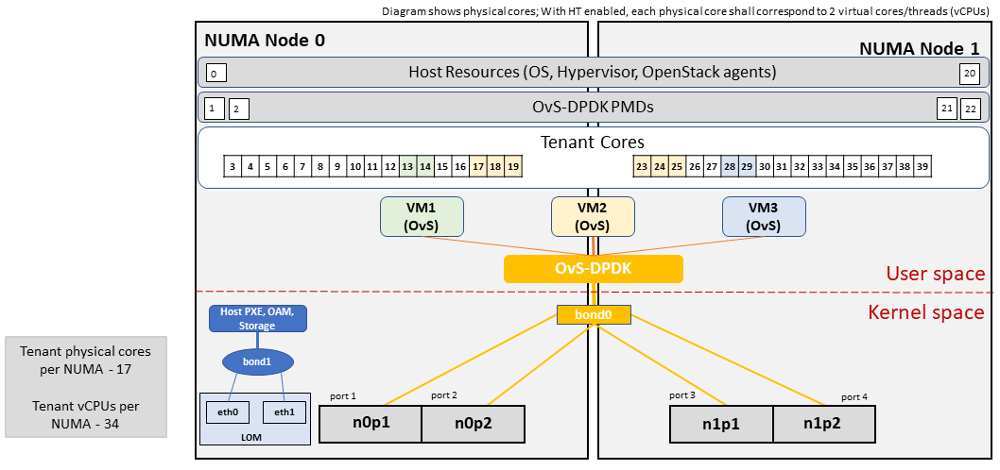
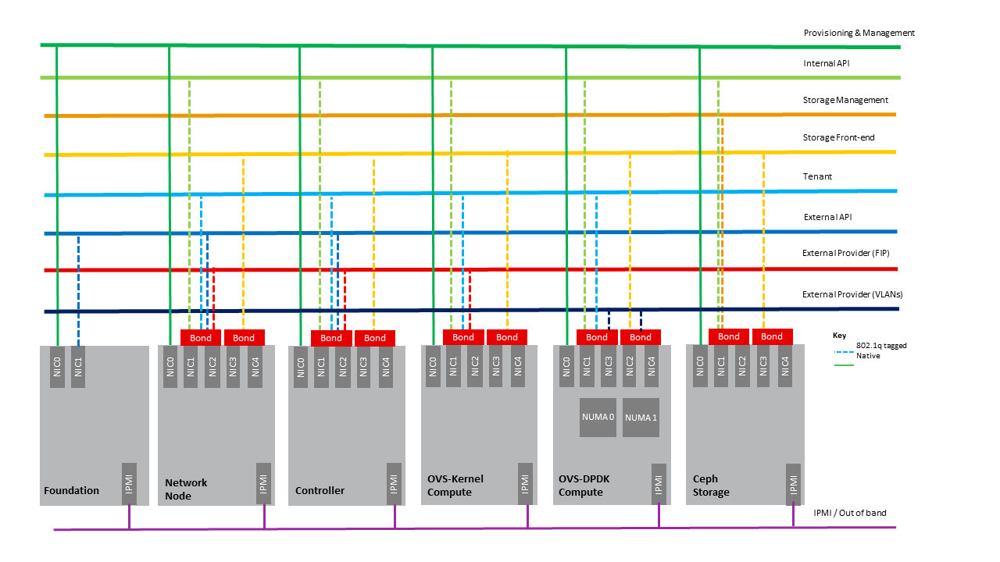
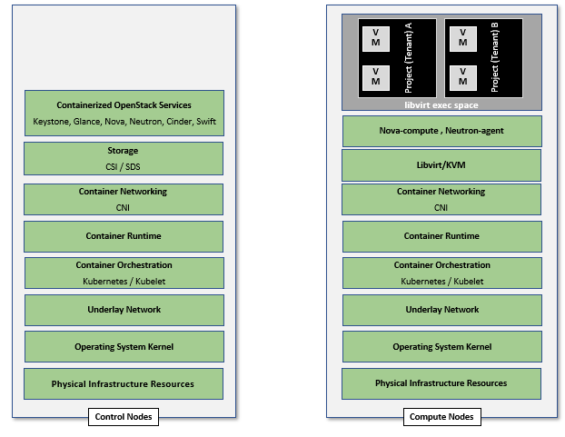

Cloud Infrastructure & VIM Component Level Architecture
=======================================================

Chapter 3 introduced the components of an OpenStack-based IaaS:

-  Consumable Infrastructure Resources and Services
-  Cloud Infrastructure Management Software (VIM: OpenStack) core
   services and architectural constructs needed to consume and manage
   the consumable resources
-  Underlying physical compute, storage, and networking resources

This chapter delves deeper into the capabilities of these different
resources and their needed configurations to create and operate an
OpenStack-based IaaS cloud. This chapter specifies details on the
structure of control and user planes, operating systems, hypervisors, and
BIOS configurations, and architectural details of underlay and overlay
networking, and storage, and the distribution of OpenStack service
components among nodes. The chapter also covers implementation support
for the "Profiles, Profile Extensions & Flavours" :cite:p:`refmodel`;
the OpenStack flavor types capture both the sizing and the profile
configuration (of the host).

Underlying Resources Configuration and Dimensioning
---------------------------------------------------

Virtualisation layer
~~~~~~~~~~~~~~~~~~~~

In OpenStack, KVM is configured as the default hypervisor for compute
nodes.

-  Configuration:
   OpenStack :cite:p:`ostk_wallaby_hypervisor_config`
   specifies the steps/instructions to configure KVM:

   -  Enable KVM based hardware virtualisation in BIOS. OpenStack
      provides instructions on how to enable hardware virtualisation for
      different hardware platforms (x86, Power)

      -  QEMU is similar to KVM in that both are libvirt controlled,
         have the same feature set and utilise compatible virtual
         machine images

   -  Configure Compute backing storage

   -  Specify the CPU Model for KVM guests (VMs)

   -  KVM Performance Tweaks

-  Hardening the virtualisation
   layers :cite:p:`ostk_sec_guide_hardening_virt_lyrs`

   -  OpenStack recommends minimizing the code base by removing unused
      components
   -  sVirt (Secure Virtualisation) provides isolation between VM
      processes, devices, data files and system processes

Compute
~~~~~~~

Cloud Deployment (Foundation/management) Node
^^^^^^^^^^^^^^^^^^^^^^^^^^^^^^^^^^^^^^^^^^^^^

Minimal configuration: 1 node

OpenStack Control Plane Servers (Control Nodes)
^^^^^^^^^^^^^^^^^^^^^^^^^^^^^^^^^^^^^^^^^^^^^^^

-  BIOS Requirements

For OpenStack control nodes we use the BIOS parameters for the basic
profile defined in "Cloud Infrastructure Hardware Profiles Features and
Requirements" :cite:p:`refmodel`.
Additionally, for OpenStack we need to set the following boot parameters:

.. table:: Boot parameters
   :widths: auto

   ================================= ===============
   BIOS/boot Parameter               Value
   ================================= ===============
   Boot disks                        RAID 1
   CPU reservation for host (kernel) 1 core per NUMA
   CPU allocation ratio              2:1
   ================================= ===============

-  How many nodes to meet SLA

   -  Minimum 3 nodes for high availability

-  HW specifications

   -  Boot disks are dedicated with Flash technology disks

-  Sizing rules

   -  It is easy to horizontally scale the number of control nodes
   -  The number of control nodes is determined by a minimum number
      needed for high availability (viz., 3 nodes) and the extra nodes
      needed to handle the transaction volumes, in particular, for
      Messaging service (e.g., RabbitMQ) and Database (e.g., MySQL) to
      track state.
   -  The number of control nodes only needs to be increased in
      environments with a lot of changes, such as a testing lab, or a
      very large cloud footprint (rule of thumb: number of control nodes
      = 3 + quotient (number of compute nodes/1000)).
   -  The Services Placement Summary
      table :cite:p:`fuel_ref_arch_100`
      specifies the number of instances that are required based upon the
      cloud size (number of nodes).

Network nodes
^^^^^^^^^^^^^

Networks nodes are mainly used for L3 traffic management for overlay
tenant network (see more detail in Neutron section).

-  BIOS requirements

.. table:: BIOS requirements
   :widths: auto

   =================== ======
   BIOS/boot Parameter Value
   =================== ======
   Boot disks          RAID 1
   =================== ======

-  How many nodes to meet SLA

   -  Minimum 2 nodes for high availability using VRRP.

-  HW specifications

   -  3 NICs card are needed if we want to isolate the different flows:

      -  1 NIC for Tenant Network
      -  1 NIC for External Network
      -  1 NIC for Other Networks (PXE, Mngt …)

-  Sizing rules

   -  Scale out of network node is not easy
   -  DVR can be an option for large deployment (see more detail in
      section Neutron)

Storage nodes
^^^^^^^^^^^^^

-  BIOS requirements

.. table:: BIOS requirements
   :widths: auto

   =================== ======
   BIOS/boot Parameter Value
   =================== ======
   Boot disks          RAID 1
   =================== ======

-  HW specifications: please see "Storage" in :cite:p:`refmodel`
-  How many nodes to meet SLA: Active-Passive is the default and
   recently OpenStack started to support Active-Active
-  Sizing rules: minimum 2 x 1 TB; recommended 2 x 10 TB

Compute Nodes
^^^^^^^^^^^^^

This section specifies the compute node configurations to support the
Basic and High-Performance profiles; in OpenStack this would be
accomplished by specifying the configurations when creating "flavors".
The cloud operator may choose to implement certain profile-extensions
(Profile Extensions (Specialisations) :cite:p:`refmodel`)
as a set of standard configurations, of a given profile, capturing some
of the variability through different values or extra specifications.

-  The software and hardware configurations are as specified in the
   Cloud Infrastructure Hardware Profiles Features and Requirements
   in :cite:p:`refmodel`.

-  BIOS requirement

   -  The general BIOS requirements are described in the
      Cloud Infrastructure Hardware Profiles Features and Requirements
      :cite:p:`refmodel`.

**Example Profiles and their Extensions**

The Reference Model specifies the Basic (B) and High-Performance (H)
profile types. The Reference Model also provides a choice of network
acceleration capabilities utilising, for example, DPDK and SR-IOV
technologies. The table
below lists a few simple examples of profile
extensions and some of their capabilities.

.. list-table:: Profile Extensions and Capabilities
   :widths: 8 30 10 10 10 10 10 12
   :header-rows: 1

   * - Profile Extensions
     - Description
     - CPU Allocation Ratio
     - SMT
     - CPU Pinning
     - NUMA
     - Huge pages
     - Data Traffic
   * - B1
     - Basic Profile NoCPU over- subscription profile extension
     - 1:1
     - Y
     - N
     - N
     - N
     - OVS- kernel
   * - HV
     - High Performance Profile
     - 1:1
     - Y
     - Y
     - Y
     - Y
     - OVS- kernel
   * - HD
     - High Performance Profile with DPDK profile extension
     - 1:1
     - Y
     - Y
     - Y
     - Y
     - OVS-DPDK
   * - HS
     - High Performance Profile with SR-IOV profile extension
     - 1:1
     - Y
     - Y
     - Y
     - Y
     - SR-IOV

**BIOS Settings**

A number of capabilities need to be enabled in the BIOS (such as NUMA
and SMT); the "Cloud Infrastructure Software Profile Description"
section in the Reference Model specifies the capabilities
required to be configured. Please note that capabilities may need to
be configured in multiple systems. For OpenStack, we also need to set
the following boot parameters:

.. table:: BIOS requirements
   :widths: auto

   =================== ====== ================
   BIOS/boot Parameter Basic  High Performance
   =================== ====== ================
   Boot disks          RAID 1 RAID 1
   =================== ====== ================

-  How many nodes to meet SLA

   -  minimum: two nodes per profile

-  HW specifications

   -  Boot disks are dedicated with Flash technology disks

-  In case of DPDK usage:

.. list-table:: DPDK usage
   :widths: 30 70
   :header-rows: 1

   * - Layer
     - Description
   * - Cloud infrastructure
     - Important is placement of NICs to get NUMA-balanced system (balancing
       the I/O, memory, and storage across both sockets), and configuration of
       NIC features. Server BIOS and Host OS kernel command line settings are
       described in
       DPDK release notes :cite:p:`dpdk_rel_notes` and
       DPDK performance reports :cite:p:`dpdk_perf`.
       Disabling power settings (like Intel Turbo Boost Technology) brings
       stable performance results, although understanding if and when they
       benefit workloads and enabling them can achieve better performance
       results.
   * - Workload
     - DPDK uses core affinity along with 1G or 2M huge pages, NUMA settings
       (to avoid crossing interconnect between CPUs), and DPDK Poll Mode
       Drivers (PMD, on reserved cores) to get the best performance. DPDK
       versions xx.11 are Long-Term Support maintained stable release with
       back-ported bug fixes for a two-year period.

-  Sizing rules

.. table:: Mnemonic
   :widths: auto

   ========================= ========
   Description               Mnemonic
   ========================= ========
   Number of CPU sockets     s
   Number of cores           c
   SMT                       t
   RAM                       rt
   Storage                   d
   Overcommit                o
   Average vCPU per instance v
   Average RAM per instance  ri
   ========================= ========

.. table:: Sizing rules
   :widths: auto

   +--------------+-------------+------------------------+---------------------+
   | Item         | Formula     | Basic                  | High-Performance    |
   +==============+=============+========================+=====================+
   | # of VMs per | (s*c*t*o)/v | 4*(s*c*t)/v            | (s*c*t)/v           |
   | node (vCPU)  |             |                        |                     |
   +--------------+-------------+------------------------+---------------------+
   | # of VMs per | rt/ri       | rt/ri                  | rt/ri               |
   | node (RAM)   |             |                        |                     |
   +--------------+-------------+------------------------+---------------------+
   | Max # of VMs |             | min(4*(s*c*t)/v,rt/ri) | min((sc*t)/v,rt/ri) |
   | per node     |             |                        |                     |
   +--------------+-------------+------------------------+---------------------+

Caveats:

-  These are theoretical limits
-  Affinity and anti-affinity rules, among other factors, affect the
   sizing

Compute Resource Pooling Considerations
^^^^^^^^^^^^^^^^^^^^^^^^^^^^^^^^^^^^^^^

-  Multiple pools of hardware resources where each resource pool caters
   for workloads of a specific profile (for example, High-Performance)
   leads to inefficient use of the hardware as the server resources are
   configured specifically for a profile. If not properly sized or when
   demand changes, this can lead to oversupply/starvation scenarios;
   reconfiguration may not be possible because of the underlying
   hardware or inability to vacate servers for reconfiguration to
   support another profile type.
-  Single pool of hardware resources including for controllers have the
   same CPU configuration. This is operationally efficient as any server
   can be utilised to support any profile or controller. The single pool
   is valuable with unpredictable workloads or when the demand of
   certain profiles is insufficient to justify individual hardware
   selection.

Reservation of Compute Node Cores
^^^^^^^^^^^^^^^^^^^^^^^^^^^^^^^^^

The :ref:`chapters/chapter02:infrastructure requirements`
``inf.com.08`` requires the allocation of "certain number of host
cores/threads to non-tenant workloads such as for OpenStack services." A
number ("n") of random cores can be reserved for host services
(including OpenStack services) by specifying the following in nova.conf:

        reserved_host_cpus = n

where n is any positive integer.

If we wish to dedicate specific cores for host processing we need to
consider two different usage scenarios:

1. Require dedicated cores for Guest resources
2. No dedicated cores are required for Guest resources

Scenario #1, results in compute nodes that host both pinned and unpinned
workloads. In the OpenStack Wallaby release, scenario #1 is not
supported; it may also be something that operators may not allow.
Scenario #2 is supported through the specification of the cpu_shared_set
configuration. The cores and their sibling threads dedicated to the host
services are those that do not exist in the cpu_shared_set
configuration.

Let us consider a compute host with 20 cores with SMT enabled (let us
disregard NUMA) and the following parameters specified. The physical
cores are numbered '0' to '19' while the sibling threads are numbered
'20' to '39' where the vCPUs numbered '0' and '20', '1' and '21', etc.
are siblings:

        cpu_shared_set = 1-7,9-19,21-27,29-39
        (can also be specified as cpu_shared_set = 1-19,\&8,21-39,\&28)

This implies that the two physical cores '0' and '8' and their sibling
threads '20' and '28' are dedicated to the host services, and 19 cores
and their sibling threads are available for Guest instances and can be
over allocated as per the specified cpu_allocation_ratio in nova.conf.

Pinned and Unpinned CPUs
^^^^^^^^^^^^^^^^^^^^^^^^

When a server (viz., an instance) is created the vCPUs are, by default,
not assigned to a particular host CPU. Certain workloads require
real-time or near real-time behavior viz., uninterrupted access to their
cores. For such workloads, CPU pinning allows us to bind an instance's
vCPUs to particular host cores or SMT threads. To configure a flavor to
use pinned vCPUs, we use a dedicated CPU policy.

        openstack flavor set .xlarge -property hw:cpu_policy=dedicated

While an instance with pinned CPUs cannot use CPUs of another pinned
instance, this does not apply to unpinned instances; an unpinned
instance can utilise the pinned CPUs of another instance. To prevent
unpinned instances from disrupting pinned instances, the hosts with CPU
pinning enabled are pooled in their own host aggregate and hosts with
CPU pinning disabled are pooled in another non-overlapping host
aggregate.

Compute node configurations for Profiles and OpenStack Flavors
^^^^^^^^^^^^^^^^^^^^^^^^^^^^^^^^^^^^^^^^^^^^^^^^^^^^^^^^^^^^^^

This section specifies the compute node configurations to support
profiles and flavors.

Cloud Infrastructure Hardware Profile
'''''''''''''''''''''''''''''''''''''

The Cloud Infrastructure Hardware (or simply "host") profile and
configuration parameters are utilised in the reference architecture to
define different hardware profiles; these are used to configure the BIOS
settings on a physical server and configure utility software (such as
Operating System and Hypervisor).

An OpenStack flavor defines the characteristics ("capabilities") of a
server (viz., VMs or instances) that will be deployed on hosts assigned
a host-profile. A many-to-many relationship exists between flavors and
host profiles. Multiple flavors can be defined with overlapping
capability specifications with only slight variations that servers of
these flavor types can be hosted on similarly configured (host profile)
compute hosts. Similarly, a server can be specified with a flavor that
allows it to be hosted on, say, a host configured as per the Basic
profile, or a host configured as per the High-Performance profile. Please
note that workloads that specify a server flavor so as to be hosted on a
host configured as per the High-Performance profile, may not be able to
run (adequately with expected performance) on a host configured as per
the Basic profile.

A given host can only be assigned a single host profile; a host profile
can be assigned to multiple hosts. Host profiles are immutable and hence
when a configuration needs to be changed, a new host profile is created.

CPU Allocation Ratio and CPU Pinning
''''''''''''''''''''''''''''''''''''

A given host (compute node) can only support a single CPU Allocation
Ratio. Thus, to support the B1 and B4 Basic profile extensions (Section
:ref:`chapters/chapter04:compute nodes`)
with CPU Allocation Ratios of 1.0 and 4.0 we will need to
create 2 different host profiles and separate host aggregates for each
of the host profiles. The CPU Allocation Ratio is set in the hypervisor
on the host.

   When the CPU Allocation Ratio exceeds 1.0 then CPU Pinning also needs
   to be disabled.

Server Configurations
'''''''''''''''''''''

The different networking choices - OVS-Kernel, OVS-DPDK, SR-IOV - result
in different NIC port, LAG (Link Aggregation Group), and other
configurations. Some of these are shown diagrammatically in section
:ref:`chapters/chapter04:compute nodes`.

Leaf and Compute Ports for Server Flavors must align
''''''''''''''''''''''''''''''''''''''''''''''''''''

Compute hosts have varying numbers of Ports/Bonds/LAGs/Trunks/VLANs
connected with Leaf ports. Each Leaf port (in A/B pair) must be
configured to align with the interfaces required for the compute flavor.

Physical Connections/Cables are generally the same within a zone,
regardless of these specific L2/L3/SR-IOV configurations for the
compute.

**Compute Bond Port:** TOR port maps VLANs directly with IRBs on the TOR
pair for tunnel packets and Control Plane Control and Storage packets.
These packets are then routed on the underlay network GRT.

Server Flavors: B1, B4, HV, HD

**Compute SR-IOV Port:** TOR port maps VLANs with bridge domains that
extend to IRBs, using VXLAN VNI. The TOR port associates each packet's
outer VLAN tag with a bridge domain to support VNF interface adjacencies
over the local EVPN/MAC bridge domain. This model also applies to direct
physical connections with transport elements.

Server Flavors: HS

**Notes on SR-IOV**

SR-IOV, at the compute server, routes Guest traffic directly with a
partitioned NIC card, bypassing the hypervisor and vSwitch software,
which provides higher bps/pps throughput for the Guest server. OpenStack
and MANO manage SR-IOV configurations for Tenant server interfaces.

-  Server, Linux, and NIC card hardware standards include SR-IOV and VF
   requirements
-  High Performance profile for SR-IOV (hs series) with specific
   NIC/Leaf port configurations
-  OpenStack supports SR-IOV provisioning
-  Implement Security Policy, Tap/Mirror, QoS, etc. functions in the
   NIC, Leaf, and other places

Because SR-IOV involves Guest VLANs between the compute server and the
ToR/Leafs, Guest automation and server placement necessarily involves
the Leaf switches (e.g., access VLAN outer tag mapping with VXLAN EVPN).

-  Local VXLAN tunneling over IP-switched fabric implemented between
   VTEPs on Leaf switches
-  Leaf configuration controlled by SDN-Fabric/Global Controller
-  Underlay uses VXLAN-enabled switches for EVPN support

SR-IOV-based networking for Tenant Use Cases is required where
vSwitch-based networking throughput is inadequate.

Example Host Configurations
'''''''''''''''''''''''''''

*Host configurations for B1, B4 Profile Extensions*

.. figure:: ../figures/RA1-Ch04-Basic-host-config.png
   :alt: Basic Profile Host Configuration
   :align: center
   :name: Basic Profile Host Configuration

   Basic Profile Host Configuration (example and simplified)

Let us refer to the data traffic networking configuration
depicted in the figure above to be part of the hp-B1-a and
hp-B4-a host profiles and this requires the configurations
as Table `Configuration of Basic Flavor Capabilities`_.

.. _`Configuration of Basic Flavor Capabilities`:

.. list-table:: Configuration of Basic Flavor Capabilities
   :widths: 20 10 10 10
   :header-rows: 1

   * - Capability
     - Configured in
     - Host profile: hp-B1-a
     - Host profile: hp-B4-a
   * - CPU Allocation Ratio
     - Hypervisor
     - 1:1
     - 4:1
   * - CPU Pinning
     - BIOS
     - Enable
     - Disable
   * - SMT
     - BIOS
     - Enable
     - Enable
   * - NUMA
     - BIOS
     - Disable
     - Disable
   * - Huge pages
     - BIOS
     - No
     - No
   * - Profile Extensions
     -
     - B1
     - B4

The figure below
shows the networking configuration where the storage and OAM share networking
but are independent of the PXE network.

.. figure:: ../figures/RA1-Ch04-Basic-host-config-w-Storage-Network.png
   :alt: Basic Profile Host Config with shared Storage and OAM networking
   :align: center
   :name: Basic Profile Host Config with shared Storage and OAM networking

   Basic Profile Host Configuration with shared Storage and OAM
   networking (example and simplified)

Let us refer to the above networking set up to be part of the hp-B1-b
and hp-B4-b host profiles but the basic configurations as specified in
Table `Configuration of Basic Flavor Capabilities`_.

In our example, the Profile Extensions B1 and B4, are each mapped to two
different host profiles hp-B1-a and hp-B1-b, and hp-B4-a and hp-B4-b
respectively. Different network configurations, reservation of CPU
cores, Lag values, etc. result in different host profiles.

To ensure Tenant CPU isolation from the host services (Operating System
(OS), hypervisor and OpenStack agents), the following needs to be
configured:

.. list-table:: GRUB Configuration of Basic Profile with shared Storage
   :widths: 20 30 20
   :header-rows: 1

   * - GRUB Bootloader Parameter
     - Description
     - Values
   * - isolcpus (Applicable only on Compute Servers)
     - A set of cores isolated from the host processes. Contains vCPUs reserved for Tenants and DPDK
     - isolcpus=1-19, 21-39, 41-59, 61-79

*Host configuration for HV Profile Extensions*

The above examples of host networking configurations for the B1 and B4
Profile Extensions are also suitable for the HV Profile Extensions;
however, the hypervisor and BIOS settings will be different (see table
below) and hence there will be a need for different host profiles. Table
`Configuration of High Performance Flavor Capabilities`_
gives examples of
three different host profiles; one each for HV, HD and HS Profile Extensions.

.. _`Configuration of High Performance Flavor Capabilities`:

.. list-table:: Configuration of High Performance Flavor Capabilities
   :widths: 15 29 12 12 12
   :header-rows: 2

   * - Capability
     - Configured in
     - Host profile: hp-hv-a
     - Host profile: hp-hd-a
     - Host profile: hp-hs-a
   * - Profile Extensions
     -
     - HV
     - HD
     - HS
   * - CPU Allocation Ratio
     - Hypervisor
     - 1:1
     - 1:1
     - 1:1
   * - NUMA
     - BIOS, Operating System, Hypervisor and OpenStack Nova Scheduler
     - Enable
     - Enable
     - Enable
   * - CPU Pinning (requires NUMA)
     - OpenStack Nova Scheduler
     - Enable
     - Enable
     - Enable
   * - SMT
     - BIOS
     - Enable
     - Enable
     - Enable
   * - Huge pages
     - BIOS
     - Yes
     - Yes
     - Yes

*Host Networking configuration for HD Profile Extensions*

An example of the data traffic configuration for the HD (OVS-DPDK)
Profile Extensions is shown in the figure below.

   High Performance Profile Host Configuration with DPDK acceleration
   (example and simplified)

To ensure Tenant and DPDK CPU isolation from the host services
(Operating System (OS), hypervisor and OpenStack agents), the following
needs to be configured:

.. list-table:: GRUB Configuration of High Performance Flavor with DPDK
   :widths: 20 30 20
   :header-rows: 1

   * - GRUB Bootloader Parameter
     - Description
     - Values
   * - isolcpus (Applicable only on Compute Servers)
     - A set of cores isolated from the host processes. Contains vCPUs
       reserved for Tenants and DPDK
     - isolcpus=3-19, 23-39, 43-59, 63-79

*Host Networking configuration for HS Profile Extensions*

An example of the data traffic configuration for the HS (SR-IOV) Profile
Extensions is shown in the figure below.

.. figure:: ../figures/RA1-Ch04-Network-Intensive-SRIOV.png
   :alt: High Performance Profile Host Configuration with SR-IOV
   :align: center
   :name: High Performance Profile Host Configuration with SR-IOV

   High Performance Profile Host Configuration with SR-IOV
   (example and simplified)

To ensure Tenant CPU isolation from the host services (Operating System
(OS), hypervisor and OpenStack agents), the following needs to be
configured:

.. list-table:: GRUB Configuration of High Performance Flavor with SR-IOV
   :widths: 20 30 20
   :header-rows: 1

   * - GRUB Bootloader Parameter
     - Description
     - Values
   * - isolcpus (Applicable only on Compute Servers)
     - A set of cores isolated from the host processes. Contains vCPUs reserved for Tenants
     - isolcpus=1-19, 21-39, 41-59, 61-79

Using Hosts of a Host Profile type
''''''''''''''''''''''''''''''''''

As we have seen, Profile Extensions are supported by configuring hosts in
accordance with the Profile Extensions specifications. For example, an
instance of flavor type B1 can be hosted on a compute node that is
configured as an hp-B1-a or hp-B1-b host profile. All compute nodes
configured with hp-B1-a or hp-B1-b host profile are made part of a host
aggregate, say, ha-B1 and, thus, during server instantiation of B1
flavor hosts from the ha-B1 host aggregate will be selected.

Network Fabric
~~~~~~~~~~~~~~

Networking Fabric consists of:

-  Physical switches, routers…
-  Switch OS
-  Minimum number of switches
-  Dimensioning for East/West and North/South
-  Spine / Leaf topology - east - west
-  Global Network parameters
-  OpenStack control plane VLAN / VXLAN layout
-  Provider VLANs

Physical Network Topology
^^^^^^^^^^^^^^^^^^^^^^^^^

High Level Logical Network Layout
^^^^^^^^^^^^^^^^^^^^^^^^^^^^^^^^^

   Indicative OpenStack Network Layout

.. list-table:: OpenStack Network Characteristics
   :widths: 15 35 30
   :header-rows: 1

   * - Network
     - Description
     - Characteristics
   * - Provisioning & Management
     - Initial OS bootstrapping of the servers via PXE, deployment of software
       and thereafter for access from within the control plane
     -   - Security Domain: Management
         - Externally Routable: No
         - Connected to: All nodes
   * - Internal API
     - Intra-OpenStack service API communications, messaging, and database replication
     -   - Security Domain: Management
         - Externally Routable: No
         - Connected to: All nodes except foundation
   * - Storage Management
     - Backend connectivity between storage nodes for heartbeats, data object replication and synchronisation
     -   - Security Domain: Storage
         - Externally Routable: No
         - Connected to: All nodes except foundation
   * - Storage Front-end
     - Block/Object storage access via cinder/swift
     -   - Security Domain: Storage
         - Externally Routable: No
         - Connected to: All nodes except foundation
   * - Tenant
     - VXLAN / Geneve project overlay networks (OVS kernel mode) - i.e., RFC1918 :cite:p:`rfc1918`
       re-usable private networks as controlled by cloud administrator
     -   - Security Domain: Underlay
         - Externally Routable: No
         - Connected to: controllers and computes
   * - External API
     - Hosts the public OpenStack API endpoints including the dashboard (Horizon)
     -   - Security Domain: Public
         - Externally routable: Yes
         - Connected to: controllers
   * - External Provider (FIP)
     - Network with a pool of externally routable IP addresses used by neutron routers
       to NAT to/from the tenant RFC1918 :cite:p:`rfc1918` private networks
     -   - Security Domain: Data Centre
         - Externally routable: Yes
         - Connected to: controllers, OVS computes
   * - External Provider (VLAN)
     - External Data Centre L2 networks (VLANs) that are directly accessible
       to the project

       Note: External IP address management is required
     -   - Security Domain: Data Centre
         - Externally routable: Yes
         - Connected to: OVS DPDK computes
   * - IPMI / Out of Band
     - The remote "lights-out" management port of the servers e.g., iLO,
       IDRAC / IPMI / Redfish
     -   - Security Domain: Management
         - Externally routable: No
         - Connected to: IPMI port on all servers

A VNF application network topology is expressed in terms of servers,
vNIC interfaces with vNet access networks, and WAN Networks while the
VNF Application Servers require multiple vNICs, VLANs, and host routes
configured within the server's Kernel.

Octavia v2 API conformant Load Balancing
^^^^^^^^^^^^^^^^^^^^^^^^^^^^^^^^^^^^^^^^

Load balancing is needed for automatic scaling, managing availability
and changes.
Octavia :cite:p:`ostk_latest_octavia`
is an open-source load balancer for OpenStack, based on HAProxy, and
replaces the deprecated (as of OpenStack Queens release) Neutron LBaaS.
The Octavia v2 API is a superset of the deprecated Neutron LBaaS v2 API
and has a similar CLI for seamless transition.

As a default Octavia utilises Amphorae Load Balancer. Amphorae consists
of a fleet of servers (VMs, containers or bare metal servers) and
delivers horizontal scaling by managing and spinning these resources on
demand. The reference implementation of the Amphorae image is an Ubuntu
virtual machine running HAProxy.

Octavia depends upon a number of OpenStack services including Nova for
spinning up compute resources on demand and their life cycle management;
Neutron for connectivity between the compute resources, project
environment and external networks; Keystone for authentication; and
Glance for storing of the compute resource images.

Octavia supports provider drivers which allows third-party load
balancing drivers (such as F5, AVI, etc.) to be utilised instead of the
default Amphorae load balancer. When creating a third-party load
balancer, the **provider** attribute is used to specify the backend to
be used to create the load balancer. The **list providers** lists all
enabled provider drivers. Instead of using the provider parameter, an
alternate is to specify the flavor_id in the create call where
provider-specific Octavia flavors have been created.

Neutron Extensions
^^^^^^^^^^^^^^^^^^

OpenStack Neutron is an extensible framework that allows incorporation
through plugins and API Extensions. API Extensions provide a method for
introducing new functionality and vendor specific capabilities. Neutron
plugins support new or vendor-specific functionality. Extensions also
allow specifying new resources or extensions to existing resources and
the actions on these resources. Plugins implement these resources and
actions.

This Reference Architecture supports the ML2 plugin (see below) as well
as the service plugins including for LBaaS (Load Balancer as a
Service) :cite:p:`ostk_octavia_gov`,
and VPNaaS (VPN as a
Service) :cite:p:`ostk_neutron_vpnaas`. The
OpenStack wiki provides a list of Neutron
plugins :cite:p:`ostk_neutron_plugins`.

Every Neutron plugin needs to implement a minimum set of common methods
(actions for Wallaby
release) :cite:p:`ostk_neutron_api_ext`.
Resources can inherit Standard Attributes and thereby have the
extensions for these standard attributes automatically incorporated.
Additions to resources, such as additional attributes, must be
accompanied by an extension.

The section :ref:`chapters/chapter05:interfaces and apis` of this Reference
Architecture provides a list of :ref:`chapters/chapter04:neutron extensions`.
The current available
extensions can be obtained using the List Extensions
API :cite:p:`ostk_nw_ext`
and details about an extension using the Show extension details
API :cite:p:`ostk_nw_ext_details`.

**Neutron ML2 integration** The OpenStack Modular Layer 2 (ML2) plugin
simplifies adding networking technologies by utilising drivers that
implement these network types and methods for accessing them. Each
network type is managed by an ML2 type driver and the mechanism driver
exposes interfaces to support the actions that can be performed on the
network type resources. The OpenStack ML2
documentation :cite:p:`ostk_neutron_ml2` lists
example mechanism drivers.

Network quality of service
^^^^^^^^^^^^^^^^^^^^^^^^^^

For VNF workloads, the resource bottlenecks are not only the CPU and the
memory but also the I/O bandwidth and the forwarding capacity of virtual
and non-virtual switches and routers within the infrastructure. Several
techniques (all complementary) can be used to improve QoS and try to
avoid any issue due to a network bottleneck (mentioned per order of
importance):

-  Nodes interfaces segmentation: Have separated NIC ports for Storage
   and Tenant networks. Actually, the storage traffic is bursty, and
   especially in case of service restoration after some failure or new
   service implementation, upgrades, etc. Control and management
   networks should rely on a separate interface from the interface used
   to handle tenant networks.
-  Capacity planning: FW, physical links, switches, routers, NIC
   interfaces and DCGW dimensioning (+ load monitoring: each link within
   a LAG or a bond shouldn't be loaded over 50% of its maximum capacity
   to guaranty service continuity in case of individual failure).
-  Hardware choice: e.g., ToR/fabric switches, DCGW and NIC cards should
   have appropriate buffering and queuing capacity.
-  High Performance compute node tuning (including OVS-DPDK).

Integration Interfaces
^^^^^^^^^^^^^^^^^^^^^^

-  DHCP:

   When the Neutron-DHCP agent is hosted in controller nodes, then
   for the servers, on a Tenant network, that need to acquire an IPv4 and/or
   IPv6 address, the VLAN for the Tenant must be extended to the control plane
   servers so that the Neutron agent can receive the DHCP requests from the
   server and send the response to the server with the IPv4 and/or IPv6
   addresses and the lease time. Please see OpenStack provider Network.
-  DNS
-  LDAP
-  IPAM

Storage Backend
~~~~~~~~~~~~~~~

Storage systems are available from multiple vendors and can also utilise
commodity hardware from any number of open-source based storage packages
(such as LVM, Ceph, NFS, etc.). The proprietary and open-source storage
systems are supported in Cinder through specific plugin drivers. The
OpenStack Cinder
documentation :cite:p:`ostk_latest_cinder_support`
specifies the minimum functionality that all storage drivers must
support. The functions include:

-  Volume: create, delete, attach, detach, extend, clone (volume from
   volume), migrate
-  Snapshot: create, delete and create volume from snapshot
-  Image: create from volume

The document also includes a matrix for a number of proprietary drivers
and some of the optional functions that these drivers support. This
matrix is a handy tool to select storage backends that have the optional
storage functions needed by the cloud operator. The cloud workload
storage requirements help determine the backends that should be
deployed by the cloud operator. The common storage backend attachment
methods include iSCSI, NFS, local disk, etc. and the matrix lists the
supported methods for each of the vendor drivers. The OpenStack Cinder
Available
Drivers :cite:p:`ostk_latest_cinder_drivers`
documentation provides a list of all OpenStack compatible drivers and
their configuration options.

The Cinder
Configuration :cite:p:`ostk_latest_cinder_config`
document provides information on how to configure Cinder including
Anuket required capabilities for volume encryption, Policy
configuration, quotas, etc. The Cinder
Administration :cite:p:`ostk_latest_cinder`
document provides information on the capabilities required by Anuket
including managing volumes, snapshots, multi-storage backends, migrate
volumes, etc.

Ceph :cite:p:`ceph` is the default Anuket Reference Architecture
storage backend and is discussed below.

Ceph Storage Cluster
^^^^^^^^^^^^^^^^^^^^

The Ceph storage cluster is deployed on bare metal hardware. The minimal
configuration is a cluster of three bare metal servers to ensure High
availability. The Ceph Storage cluster consists of the following
components:

-  CEPH-MON (Ceph Monitor)
-  OSD (object storage daemon)
-  RadosGW (Rados Gateway)
-  Journal
-  Manager

Ceph monitors maintain a master copy of the maps of the cluster state
required by Ceph daemons to coordinate with each other. Ceph OSD handles
the data storage (read/write data on the physical disks), data
replication, recovery, rebalancing, and provides some monitoring
information to Ceph Monitors. The RadosGW provides Object Storage
RESTful gateway with a Swift-compatible API for Object Storage.

.. figure:: ../figures/RA1-Ch04-Ceph.png
   :alt: Ceph Storage System
   :align: center

   Ceph Storage System

**BIOS Requirement for Ceph servers**

.. table:: BIOS Requirement for Ceph servers
   :widths: auto

   =================== ======
   BIOS/boot Parameter Value
   =================== ======
   Boot disks          RAID 1
   =================== ======

How many nodes to meet SLA:

-  minimum: three bare metal servers where Monitors are collocated with
   OSD. Note: at least 3 Monitors and 3 OSDs are required for High
   Availability.

HW specifications:

-  Boot disks are dedicated with Flash technology disks
-  For an IOPS oriented cluster (Flash technology), the journal can be
   hosted on OSD disks
-  For a capacity-oriented cluster (HDD), the journal must be hosted on
   dedicated Flash technology disks

Sizing rules:

-  Minimum of 6 disks per server
-  Replication factor : 3
-  1 Core-GHz per OSD
-  16GB RAM baseline + 2-3 GB per OSD

VIM OpenStack Services
----------------------

This section covers:

-  Detailed breakdown of OpenStack core services
-  Specific build-time parameters

VIM Services
~~~~~~~~~~~~

A high-level overview of the core OpenStack Services was provided in
:ref:`chapters/chapter03:virtualised infrastructure manager (vim)`.
In this section we describe the core and other needed services in
more detail.

Keystone
^^^^^^^^

Keystone :cite:p:`ostk_wallaby_keystone` is the
authentication service, the foundation of identity management in
OpenStack. Keystone needs to be the first deployed service. Keystone has
services running on the control nodes and no services running on the
compute nodes:

-  Keystone admin API
-  Keystone public API - in Keystone V3 this is the same as the admin
   API

Glance
^^^^^^

Glance :cite:p:`ostk_wallaby_glance` is the image
management service. Glance has only a dependency on the Keystone service
therefore it is the second one deployed. Glance has services running on
the control nodes and no services running on the compute nodes:

-  Glance API
-  Glance Registry

*The Glance backends include Swift, Ceph RBD, and NFS.*

Cinder
^^^^^^

Cinder :cite:p:`ostk_wallaby_cinder` is the block
device management service, depends on Keystone and possibly Glance to be
able to create volumes from images. Cinder has services running on the
control nodes and no services running on the compute nodes: - Cinder API
- Cinder Scheduler - Cinder Volume - the Cinder volume process needs to
talk to its backends

*The Cinder backends include SAN/NAS storage, iSCSI drives, Ceph RBD,
and NFS.*

Swift
^^^^^

Swift :cite:p:`ostk_wallaby_swift` is the object
storage management service, Swift depends on Keystone and possibly
Glance to be able to create volumes from images. Swift has services
running on the control nodes and the compute nodes:

-  Proxy Services
-  Object Services
-  Container Services
-  Account Services

*The Swift backends include iSCSI drives, Ceph RBD, and NFS.*

Neutron
^^^^^^^

Neutron :cite:p:`ostk_wallaby_neutron` is the
networking service, depends on Keystone and has services running on the
control nodes and the compute nodes. Depending upon the workloads to be
hosted by the infrastructure, and the expected load on the controller
node, some of the Neutron services can run on separate network node(s).
Factors affecting controller node load include the number of compute nodes
and the number of API calls being served for the various OpenStack
services (nova, neutron, cinder, glance etc.). To reduce controller node
load, network nodes are widely added to manage L3 traffic for overlay
tenant networks and interconnection with external networks. The Table
below lists the networking service components and their placement.
Please note that while network nodes are listed in the table below,
network nodes only deal with tenant networks and not provider networks.
Also, network nodes are not required when SDN is utilised for
networking.

.. list-table:: Neutron Services Placement
   :widths: 15 30 15 20
   :header-rows: 1

   * - Networking Service component
     - Description
     - Required or Optional Service
     - Placement
   * - neutron server (neutron-server and neutron-\*-plugin)
     - Manages user requests and exposes the Neutron APIs
     - Required
     - Controller node
   * - DHCP agent (neutron-dhcp-agent)
     - Provides DHCP services to tenant networks and is responsible for
       maintaining DHCP configuration. For High availability, multiple DHCP
       agents can be assigned.
     - Optional depending upon plug-in
     - Network node (Controller node if no network node present)
   * - L3 agent (neutron-l3-agent)
     - Provides L3/NAT forwarding for external network access of servers on
       tenant networks and supports services such as Firewall-as-a-service
       (FWaaS) and Load Balancer-as-a-service (LBaaS)
     - Optional depending upon plug-in
     - Network node (Controller node if no network node present) NB in DVR
       based OpenStack Networking, also in all Compute nodes.
   * - neutron metadata agent (neutron-metadata-agent)
     - The metadata service provides a way for instances to retrieve
       instance-specific data. The networking service, neutron, is responsible
       for intercepting these requests and adding HTTP headers which uniquely
       identify the source of the request before forwarding it to the metadata
       API server. These functions are performed by the neutron metadata
       agent.
     - Optional
     - Network node (Controller node if no network node present)
   * - neutron plugin agent (neutron-\*-agent)
     - Runs on each compute node to control and manage the local virtual
       network driver (such as the Open vSwitch or Linux Bridge)
       configuration and local networking configuration for servers hosted on that node.
     - Required
     - Every Compute Node

Issues with the standard networking (centralised routing) approach
''''''''''''''''''''''''''''''''''''''''''''''''''''''''''''''''''

The network node performs both routing and NAT functions and represents
both a scaling bottleneck and a single point of failure.

Consider two servers on different compute nodes and using different
project networks (a.k.a. tenant networks) where both of the project
networks are connected by a project router. For communication between
the two servers (instances with a fixed or floating IP address), the
network node routes East-West network traffic among project networks
using the same project router. Even though the instances are connected
by a router, all routed traffic must flow through the network node, and
this becomes a bottleneck for the whole network.

While the separation of the routing function from the controller node to
the network node provides a degree of scaling it is not a truly scalable
solution. We can either add additional cores/compute-power or network
node to the network node cluster, but, eventually, it runs out of
processing power especially with high throughput requirement. Therefore,
for scaled deployments, there are multiple options including the use of
Dynamic Virtual Routing (DVR) and Software Defined Networking (SDN).

Distributed Virtual Routing (DVR)
'''''''''''''''''''''''''''''''''

With DVR, each compute node also hosts the L3-agent (provides the
distributed router capability), and this then allows direct instance to
instance (East-West) communications.

The OpenStack "High Availability Using Distributed Virtual Routing
(DVR) :cite:p:`ostk_nw_liberty_dvr_ovs`"
provides an in-depth view into how DVR works and the traffic flow
between the various nodes and interfaces for three different use cases.
Please note that DVR was introduced in the OpenStack Juno release and,
thus, its detailed analysis in the Liberty release documentation is not
out of character for OpenStack documentation.

DVR addresses both scalability and high availability for some L3
functions but is not fully fault tolerant. For example, North/South SNAT
traffic is vulnerable to single node (network node) failures. DVR with
VRRP :cite:p:`ostk_wallaby_nw_svr_snat_config`
addresses this vulnerability.

Software Defined Networking (SDN)
'''''''''''''''''''''''''''''''''

For the most reliable solution that addresses all the above issues and
Telco workload requirements requires SDN to offload Neutron calls.

SDN provides a truly scalable and preferred solution to support dynamic,
very large-scale, high-density, telco cloud environments. OpenStack
Neutron, with its plugin architecture, provides the ability to integrate
SDN controllers (:ref:`chapters/chapter03:virtual networking - 3rd party sdn solution`).
With SDN incorporated in OpenStack, changes to the network are triggered
by workloads (and users), translated into Neutron APIs and then handled
through neutron plugins by the corresponding SDN agents.

Nova
^^^^

Nova :cite:p:`ostk_wallaby_nova` is the compute
management service, depends on all above components and is deployed
after their deployment. Nova has services running on the control nodes
and the compute nodes:

-  nova-metadata-api
-  nova-compute api
-  nova-consoleauth
-  nova-scheduler
-  nova-conductor
-  nova-novncproxy
-  nova-compute-agent which runs on Compute node

Please note that the Placement-API must have been installed and
configured prior to nova compute starts.

Ironic
^^^^^^

Ironic :cite:p:`ostk_wallaby_ironic` is the bare
metal provisioning service. Ironic depends on all above components and
is deployed after them. Ironic has services running on the control nodes
and the compute nodes:

-  Ironic API
-  ironic-conductor which executes operation on bare metal nodes

Note: This is an optional service. The Ironic
APIs :cite:p:`ostk_bm` are still under
development.

Heat
^^^^

Heat :cite:p:`ostk_wallaby_heat` is the orchestration
service using templates to provision cloud resources, Heat integrates
with all OpenStack services. Heat has services running on the control
nodes and no services running on the compute nodes:

-  heat-api
-  heat-cfn-api
-  heat-engine

Horizon
^^^^^^^

Horizon :cite:p:`ostk_wallaby_horizon` is the Web
User Interface to all OpenStack services. Horizon has services running
on the control nodes and no services running on the compute nodes.

Placement
^^^^^^^^^

The OpenStack Placement
service :cite:p:`ostk_wallaby_placement`
enables tracking (or accounting) and scheduling of resources. It
provides a RESTful API and a data model for the managing of resource
provider inventories and usage for different classes of resources. In
addition to standard resource classes, such as vCPU, MEMORY_MB and
DISK_GB, the Placement service supports custom resource classes
(prefixed with "CUSTOM\_") provided by some external resource pools such
as a shared storage pool provided by, say, Ceph. The placement service
is primarily utilised by nova-compute and nova-scheduler. Other
OpenStack services such as Neutron or Cyborg can also utilise placement
and do so by creating Provider
Trees :cite:p:`ostk_latest_placement_provider_tree`.
The following data objects are utilised in the placement
service :cite:p:`ostk_latest_placement`:

-  Resource Providers provide consumable inventory of one or more
   classes of resources (CPU, memory or disk). A resource provider can
   be a compute host, for example.
-  Resource Classes specify the type of resources (vCPU, MEMORY_MB and
   DISK_GB or CUSTOM_*)
-  Inventory: Each resource provider maintains the total and reserved
   quantity of one or more classes of resources. For example, RP_1 has
   an available inventory of 16 vCPU, 16384 MEMORY_MB and 1024 DISK_GB.
-  Traits are qualitative characteristics of the resources from a
   resource provider. For example, the trait for RPA_1 "is_SSD" to
   indicate that the DISK_GB provided by RP_1 are solid state drives.
-  Allocations represent resources that have been assigned/used by some
   consumer of that resource.
-  Allocation candidates is the collection of resource providers that
   can satisfy an allocation request.

The Placement API is stateless and, thus, resiliency, availability, and
scaling, it is possible to deploy as many servers as needed. On start,
the nova-compute service will attempt to make a connection to the
Placement API and keep attempting to connect to the Placement API,
logging and warning periodically until successful. Thus, the Placement
API must be installed and enabled prior to Nova compute.

Placement has services running on the control node: - nova-placement-api

Barbican
^^^^^^^^

Barbican :cite:p:`ostk_wallaby-barbican` is the
OpenStack Key Manager service. It is an optional service hosted on
controller nodes. It provides secure storage, provisioning, and
management of secrets as passwords, encryption keys and X.509
Certificates. Barbican API is used to centrally manage secrets used by
OpenStack services, e.g., symmetric encryption keys used for Block
Storage encryption or Object Storage encryption, and asymmetric keys and
certificates used for Glance image signing and verification.

Barbican usage provides a means to fulfill security requirements such as
sec.sys.012 "The Platform **must** protect all secrets by using strong
encryption techniques and storing the protected secrets externally from
the component" and sec.ci.001 "The Platform **must** support
Confidentiality and Integrity of data at rest and in transit.".

Cyborg
^^^^^^

Cyborg :cite:p:`ostk_wallaby_cyborg` is the OpenStack
project for the general purpose management framework for accelerators
(including GPUs, FPGAs, ASIC-based devices, etc.), and their lifecycle
management.

Cyborg will support only a subset of the Nova
operations :cite:p:`ostk_svr`;
the set of Nova operations supported in Cyborg depends upon the merge of
a set of Nova patches in Cyborg. In Wallaby, not all the required Nova
patches have been merged. The list of Cyborg operations with Nova
dependencies supported in Wallaby are listed in :cite:p:`ostk_wallaby_cyborg_support`;
the Nova operations supported in Cyborg at any given time are also
available in :cite:p:`ostk_latest_cyborg_support`.

Cyborg supports:

-  Acceleration Resource Discovery
-  Accelerator Life Cycle Management

Accelerators can be of type:

-  Software: dpdk/spdk, pmem, …
-  Hardware (device types): FPGA, GPU, ARM SoC, NVMe SSD, CCIX based
   Caches, …

The Cyborg
architecture :cite:p:`ostk_latest_cyborg_arch`
consists of the cyborg-api, cyborg-conductor, cyborg-db, cyborg-agent,
and generic device type drivers. cyborg-api, cyborg-conductor and
cyborg-db are hosted on control nodes. cyborg-agent, which runs on
compute nodes, interacts with generic device type drivers on those
nodes. These generic device type drivers are an abstraction of the
vendor specific drivers; there is a generic device type driver for each
device type (see above for list of some of the device types). The
current list of the supported vendor drivers is listed under "Driver
Support :cite:p:`ostk_latest_cyborg_support`".

Containerised OpenStack Services
~~~~~~~~~~~~~~~~~~~~~~~~~~~~~~~~

Containers are lightweight compared to Virtual Machines, and lead to
efficient resource utilisation. Kubernetes auto manages scaling,
recovery from failures, etc. Thus, it is recommended that the OpenStack
services be containerised for resiliency and resource efficiency.

The Chapter 3 shows a
high level Virtualised OpenStack services topology. The containerised
OpenStack services topology version is shown in
the figure below.

   Containerised OpenStack Services Topology

Consumable Infrastructure Resources and Services
------------------------------------------------

Support for Cloud Infrastructure Profiles and flavors
~~~~~~~~~~~~~~~~~~~~~~~~~~~~~~~~~~~~~~~~~~~~~~~~~~~~~

Chapters 4 and 5 in :cite:p:`refmodel` provide information about the Cloud
Infrastructure Profiles and their size information. OpenStack flavors
with their set of properties describe the server capabilities and size
required to determine the compute host which will run this server. The
set of properties must match compute profiles available in the
infrastructure. To implement these profiles and sizes, it is required to
set up the flavors as specified in the tables below.

.. list-table:: Neutron Services Placement
   :widths: 14 14 36 36
   :header-rows: 1

   * - Flavor Capabilities
     - Reference RM Chapter 4 and 5
     - Basic
     - High-Performance
   * - CPU allocation ratio (custom extra_specs)
     - infra.com.cfg.\

       001
     - In flavor create or flavor
       set -property cpu_all ocation_ratio=4.0
     - In flavor create or flavor set -property cpu_allocation_ratio=1.0
   * - NUMA Awareness
     - infra.com.cfg.\

       002
     -
     - In flavor create or flavor set specify -property hw:numa_nodes=<integer
       range of 0 to #numa_nodes - 1>.
       To restrict an instance's vCPUs to a
       single host NUMA node, specify: -property hw:numa_nodes=1.
       Some compute intensive* workloads with highly sensitive memory latency
       or bandwidth requirements, the instance may benefit from spreading
       across multiple NUMA nodes: -property hw:numa_nodes=2
   * - CPU Pinning
     - infra.com.cfg.\

       003
     - In flavor create or
       flavor set specify
       -property hw: cpu_policy=shared
       (default)
     - In flavor create
       or flavor set specify -property
       hw:cpu_policy=dedicated and -property
       hw:cpu_thread_policy=<prefer, require, isolate>.
       Use "isolate" thread policy for very high
       compute intensive workloads that require that each vCPU be placed on a
       different physical core
   * - Huge pages
     - infra.com.cfg.\

       004
     -
     - -property hw:mem_page_size=<small \|large \| size>
   * - SMT
     - infra.com.cfg.\

       005
     -
     - In flavor create or flavor set specify -property
       hw:cpu_threads=<integer#threads (usually 1 or 2)>
   * - OVS-DPDK
     - infra.net.acc.\

       cfg.001
     -
     - ml2.conf.ini configured to support [OVS] datapath_type=netdev

       Note: huge pages should be configured to large
   * - Local Storage SSD
     - infra.hw.stg.\

       ssd.cfg.002
     - trait:STORAGEDISK_SSD=required
     - trait:STORAGE_DISK_SSD=required
   * - Port speed
     - infra.hw.nic.\

       cfg.002
     - -property quota vif_inbound_average=1310720 and
       vif_outbound_average=1310720.

       Note:10 Gbps = 1250000 kilobytes per second
     - -property quota vif_inboundaverage=3125000 and
       vif_outbound_average=3125000

       Note: 25 Gbps = 3125000 kilobytes per second

..

   -  To configure profile-extensions, for example, the "Storage
      Intensive High Performance" profile, as defined in
      Profile Extensions (Specialisations) :cite:p:`refmodel`,
      in addition to the above, need to configure the storage IOPS: the
      following two parameters need to be specified in the flavor
      create: -property quota:disk_write_iops_sec=<IOPS#> and -property
      quota:disk_read_iops_sec=<IOPS#>.

The flavor create command and the mandatory and optional configuration
parameters is documented in
OpenStack Flavors :cite:p:`ostk_latest_nova_flavors`.

Logical segregation and high availability
~~~~~~~~~~~~~~~~~~~~~~~~~~~~~~~~~~~~~~~~~

To ensure logical segregation and high availability, the architecture
will rely on the following principles:

-  Availability zone: provide resiliency and fault tolerance for VNF
   deployments, by means of physical hosting distribution of compute
   nodes in separate racks with separate power supply, in the same or
   different DC room
-  Affinity-groups: allow tenants to make sure that VNFC instances are
   on the same compute node or are on different compute nodes.

Note: The Cloud Infrastructure doesn't provide any resiliency mechanisms
at the service level. Any server restart shall be triggered by the VNF
Manager instead of OpenStack:

-  It doesn't implement Instance High Availability which could allow
   OpenStack Platform to automatically re-spawn instances on a different
   compute node when their host compute node breaks.
-  Physical host reboot does not trigger automatic server recovery.
-  Physical host reboot does not trigger the automatic start of a
   server.

**Limitations and constraints**

-  NUMA Overhead: isolated core will be used for overhead tasks from the
   hypervisor.

Transaction Volume Considerations
~~~~~~~~~~~~~~~~~~~~~~~~~~~~~~~~~

Storage transaction volumes impose a requirement on North-South network
traffic in and out of the storage backend. Data availability requires
that the data be replicated on multiple storage nodes and each new write
imposes East-West network traffic requirements.

Cloud Topology and Control Plane Scenarios
------------------------------------------

Typically, Clouds have been implemented in large (central) data centres
with hundreds to tens of thousands of servers. Telco Operators have also
been creating intermediate data centres in central office locations,
colocation centres, and now edge centres at the physical edge of their
networks because of the demand for low latency and high throughput for
5G, IoT and connected devices (including autonomous driverless vehicles
and connected vehicles).
:ref:`chapters/chapter03:cloud topology` discusses
and lists 3 types of data centres: Large, Intermediate and Edge.

For ease of convenience, unless specifically required, in this section
we will use Central Cloud Centre, Edge Cloud Centre and Intermediate
Cloud Centre as representative terms for cloud services hosted at
centralised large data centres, Telco edge locations and for locations
with capacity somewhere in between the large data centres and edge
locations, respectively. The mapping of various terms, including the
Reference Model terminology specified in the chapter
"Comparison of Deployment Topologies and Edge Terms"
and Open Glossary of Edge Computing :cite:p:`edge_glossary`,
is as follows:

-  Central Cloud Centre: Large Centralised Data Centre, Regional Data
   Centre
-  Intermediate Cloud Centre: Metro Data Centre, Regional Edge,
   Aggregation Edge
-  Edge Cloud Centre: Edge, Mini-/Micro-Edge, Micro Modular Data Centre,
   Service Provider Edge, Access Edge, Aggregation Edge

In the Intermediate and Edge cloud centres, there may be limitations on
the resource capacity, as in the number of servers, and the capacity of
these servers in terms of # of cores, RAM, etc. restricting the set of
services that can be deployed and, thus, creating a dependency between
other data centres.
"Telco Edge Cloud" chapter in :cite:p:`refmodel`
specifies the physical and environmental characteristics, infrastructure
capabilities and deployment scenarios of different locations.

:ref:`chapters/chapter03:openstack services topology`
of this document, specifies the differences between the Control Plane and Data
Plane, and specifies which of the control nodes, compute nodes, storage
nodes (optional) and network nodes (optional) are components of these
planes. The previous sections of this Chapter 4 include a description of
the OpenStack services and their deployment in control nodes, compute
nodes, and optionally storage nodes and network nodes (rarely). The
Control Plane deployment scenarios determine the distribution of
OpenStack and other needed services among the different node types. This
section considers the Centralised Control Plane (CCP) and Distributed
Control Plane (DCP) scenarios. The choice of control plane and the cloud
centre resource capacity and capabilities determine the deployment of
OpenStack services in the different node types.

The Central Cloud Centres are organised around a Centralised Control
Plane. With the introduction of Intermediate and Edge Cloud Centres, the
Distributed Control Plane deployment becomes a possibility. A number of
independent control planes (sometimes referred to as Local Control
Planes (LCP)) exist in the Distributed Control Plane scenario, compared
with a single control plane in the Centralised Control Plane scenario.
Thus, in addition to the control plane and controller services deployed
at the Central Cloud Centre, Local Control Planes hosting a full-set or
subset of the controller services are also deployed on the Intermediate
and Edge Cloud Centres. The following table presents examples of
such deployment choices.

.. list-table:: Distribution of OpenStack services on different nodes
                depending upon Control Plane Scenario
   :widths: 10 10 10 10 10 10 10 10
   :header-rows: 1

   * - Control Plane
     - Deployed in
     - Orchestration
     - Identity Management
     - Image Management
     - Compute
     - Network Management
     - Storage Management
   * - CCP
     - Centralised DC - control nodes
     - heat-api, heat-engine, nova-placement-api
     - Identity Provider (IdP), Keystone API
     - Glance API, Glance Registry
     - nova-compute api, nova-scheduler, nova-conductor
     - neutron-server, neutron-dhcp-agent, neutron-L2-agent,
       neutron-L3-agent (optional), neutron-metadata -agent
     - Cinder API, Cinder Scheduler, Cinder Volume
   * - DCP: combination of services depending upon Center size
     - Any DC - Control nodes Option 1
     - heat-api, heat-engine, nova-placement-api
     - Identity Provider (IdP), Keystone API
     - Glance API, Glance Registry
     - nova-compute api, nova-scheduler, nova-conductor
     - neutron-server, neutron-dhcp-agent, neutron-L2-agent, neutron-L3-agent
       (optional), neutron-metadata -agent
     - Cinder API, Cinder Scheduler, Cinder Volume
   * -
     - Any DC - Control nodes Option 2: split services between two or more DCs
     - in one of the DC
     - in the Large DC
     - in the Large DC
     - in one of the DC
     - in one of ther DC
     - in one of the DC
   * - CCP or DCP
     - Compute nodes
     -
     -
     -
     - nova-compute -agent
     - neutron-L2- agent, neutron-L3-agent (optional)
     -
   * - CCP
     - Compute nodes
     - nova-placement-api
     -
     -
     - nova-compute-agent, nova-conductor
     - neutron -server, neutron-dhcp-agent, neutron-L2-agent, neutron-L3-agent (optional)
     -

Edge Cloud Topology
~~~~~~~~~~~~~~~~~~~

The Reference Model "Telco Edge Cloud" chapter :cite:p:`refmodel`
presents the deployment environment characteristics, infrastructure
characteristics and new values for the Infrastructure Profiles at the Edge.

The Edge computing whitepaper
:cite:p:`ostk_uses_edge_arch_design`
includes information such as the services that run on various nodes. The
information from the whitepaper coupled with that from the OpenStack
Reference Architecture
:cite:p:`fuel_ref_arch_100_svcs_placement`
for 100, 300 and 500 nodes will help in deciding which OpenStack and
other services (such as database, messaging) run on which nodes in what
Cloud Centre and the number of copies that should be deployed. These
references also present the pros and cons of DCP and CCP and designs to
address some of the challenges of each of the models.

"Telco Edge Cloud: Platform Services Deployment" :cite:p:`refmodel`
lists the Platform Services that may be placed in the different node types
(control, compute, and storage). Depending upon the capacity and
resources available only the compute nodes may exist at the Edge thereby
impacting operations.

"Telco Edge Cloud: Infrastructure Profiles" :cite:p:`refmodel`
lists a number of Infrastructure Profile characteristics and the changes that
may need to be made for certain Edge clouds depending upon their
resource capabilities. It should be noted that none of these changes
affect the definition of OpenStack flavors.

The previous section listed the OpenStack services deployed on the controller
nodes depending upon the control plane distribution. As specified earlier in
this chapter, at least 3 controller nodes should be deployed for HA.  Compute
nodes may also exist at the sites where controller nodes are deployed.

Control plane services are not hosted at edge sites. Each edge site can be
treated as its own OpenStack AZ. The compute nodes will host `nova-compute`,
a component of the Compute Service (Nova), and `neutron-L2-agent`,
a component of the Network Service (Neutron).

The Edge sites may or may not contain local storage. If the edge sites contain
storage, then the Block Storage  service (Cinder) is usually deployed to run
in an active/active mode with the centrally deployed Block Storage service.
Instance images are downloaded and stored locally; they can be downloaded even
prior to use.

If the edge site doesn't contain storage, then the images would need to be
cached from the central site. Two options exist:

- The instance images would be downloaded and
  cached in the Nova cache on first use; they will then be available for
  subsequent use.
- Pre-caching the instance images for low time-to-boot latency. This has been supported
  in Nova since the OpenStack Ussuri release.

Image caching and considerations for its use are discussed in the OpenStack document
Image Caching :cite:p:`ostk_latest_nova_pre_caching`.

Edge Cloud Deployment Tools
^^^^^^^^^^^^^^^^^^^^^^^^^^^

Deployment at the Edge requires support for large scale deployment. A
number of open-source tools are available for this purpose including:

-  Airship :cite:p:`airsh`: declaratively configure,
   deploy and maintain an integrated virtualisation and containerisation
   platform
-  Starling-X :cite:p:`starl`: cloud infrastructure
   software stack for the edge
-  Triple-O :cite:p:`tripl`: for
   installing, upgrading and operating OpenStack clouds

These installers are described in more details in
:ref:`chapters/chapter07:Operations and Life Cycle Management`.
