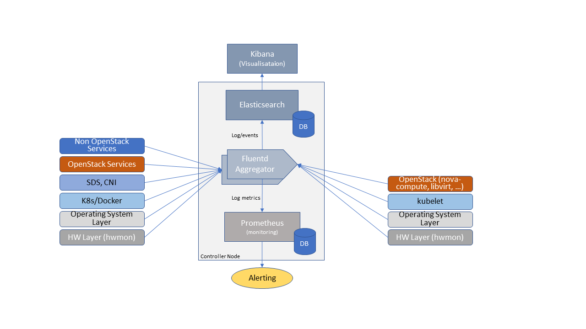

[<< Back](../../openstack)

# 7. Operations and Life Cycle Management

## Table of Contents
* [7.1 Introduction ](#7.1)
* [7.2 NFVI and VIM configuration management ](#7.2)
* [7.3 NFVI and VIM Maintenance ](#7.3)
* [7.4 Logging, Monitoring and Analytics ](#7.4)
  * [7.4.1 Logging](#7.4.1)
  * [7.4.2 Monitoring](#7.4.2)
  * [7.4.3 Alerting](#7.4.3)
  * [7.4.4 Logging, Monitoring, and Analytics (LMA) Framework](#7.4.4)

## 7.1 Introduction

## 7.2 NFVI and VIM configuration management
- Provisioning of bare metal nodes
- Provisioning of networks
- Provisioning of OpenStack and related common services
- Configuration of compute nodes (activation of services per profiles types)
- Post configuration of compute nodes
- Provisioning of host aggregates

## 7.3 NFVI and VIM Maintenance
- Backup, upgrade and rollback
-	Capacity management, horizontal scaling by adding bare metal servers(control/compute/storage)
-	Solution evolution by adding new OpenStack services or additional components

## 7.4 Logging, Monitoring and Analytics
- Logging
- Monitoring 
- Alerting
- Logging, Monitoring, and Analytics (LMA) Framework

### 7.4.1. Logging
A log, in the context of computing, is the automatically produced and time-stamped documentation 
of events relevant to a particular system. All software, including operating systems, middleware and 
applications produce log files. 
Enterprises and vendors may have custom monitoring and logging solutions. 
The intent of the logging and monitoring is to capture events and 
data of interest to the NFVI and workloads so that appropriate actions can be taken. For example, 

- Operating systems and web servers maintain an access log of all access requests, session details and file access.
- Databases maintain a transaction log of all transaction executed including an added, changed and deleted data.
- Audit logs record chronological documentation of any activities that could have affected a 
particular operation or event. Data typically includes resources accessed, destination and source 
addresses, and a timestamp and login information for the person who accessed the resources.

Some of the data is to support the metrics collection specified in the [Reference Model Chapter 4: Infrastructure Capabilities, Metrics and Catalogue](../../ref_model/chapters/chapter04.md).

Logs have multiple operational uses including for:

1. Regulatory Compliance and Security Information and Event Management (SIEM) featuring the automated gathering, analysis and correlation of log data across all systems and devices across an operator to provide real-time analysis, event prioritization, reporting, notification and alerting.
1. Monitoring across systems in real-time to detect particular log events, patterns, anomalies or inactivity to gauge system and application health
1. Identify system and application performance and configuration issues
1. Root cause analysis for system and application failures and errors
1. Ensuring that operational objectives and SLAs are met

### 7.4.2. Monitoring
Monitoring is the process of collecting, aggregating, and analyzing values that improve awareness of 
the components' characteristics and behavior. The data from various parts of the environment are collected 
into a monitoring system that is responsible for storage, aggregation, visualization, and initiating automated 
responses when the values meet specific threshold.

Monitoring systems fulfill many related functions. Their first responsibility is to accept and store incoming 
and historical data. While values representing the current point in time are useful, it is almost always more 
helpful to view those numbers in relation to past values to provide context around changes and trends. 

### 7.4.3. Alerting
Alerting is the responsive component of a monitoring system that performs actions based on changes in metric 
values. Alert definitions are composed of two components: a metrics-based condition or threshold, and an 
action to perform when the values fall outside of the acceptable conditions.

While monitoring systems are incredibly useful for active interpretation and investigation, one of the primary
benefits of a complete monitoring system is letting administrators disengage from the system. Alerts allow the
specification of situations that make sense to actively manage, while relying on the passive monitoring of the 
software to watch for changing conditions.

### 7.4.4. Logging, Monitoring, and Analytics (LMA) Framework
In this section, a possible framework utilizing Prometheus, Fluentd, Elasticsearch and Kibana is given as an example only.

<b>
  Figure 7-1: Monitoring and Logging Framework</b> 

The monitoring and logging framework (**Figure 7-1**) leverages Prometheus as the monitoring engine and 
Fluentd for logging. In addition, the framework uses Elasticsearch to store and organize logs for easy access. 
Prometheus agents pull information from individual components on every host.  Fluentd, an open source data 
collector, unifies data collection and consumption for better use and understanding of data. Fluentd captures 
the access, application and system logs.

