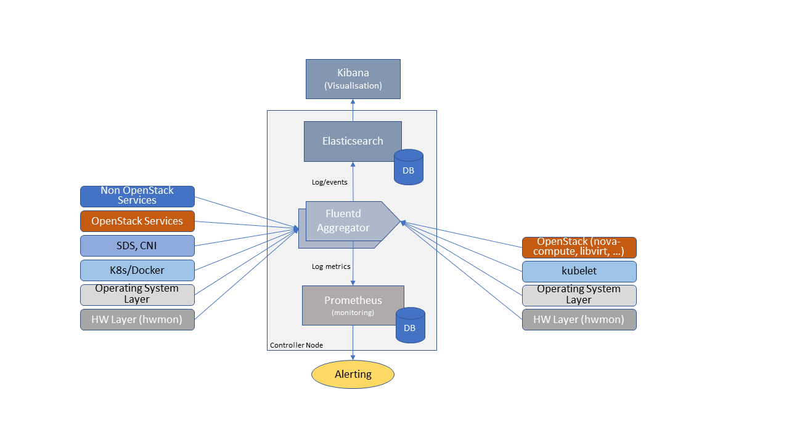

Operations and Life Cycle Management
====================================

To create an Infrastructure as a Service (IaaS) cloud requires the
provisioning and deployment of the underlying infrastructure (compute,
networking and storage) and deployment, configuration and management of
the necessary software on the infrastructure; in the process of
deploying the software, configuration of the infrastructure may also
need to be performed.

Instead of deploying the infrastructure components and services
manually, the current best practice is to write *code* (Infrastructure
as Code, IaC) to define, provision, deploy, configure and manage the
IaaS cloud infrastructure and services. IaC tools allow the entire
provisioning, configuration and management processes to be automated.
The desired state of the infrastructure and services is represented in a
set of human readable, machine executable, and version-controlled files.
With version control, it is easy to roll back to an older version and
have access to the history of all committed changes.

The provisioning of the infrastructure is typically performed by
provisioning tools while the deployment of the software and the
configuration of the software, and where needed the infrastructure,
falls in the domain of configuration management tools. A single tool may
support both provisioning and configuration management.

Operators may choose certain paradigms with respect to how they
provision and configure their IaaS cloud. These paradigms will drive the
selection of the provisioning and configuration tools. In this chapter
we will discuss the capabilities of provisioning and configuration
management systems; some open-source tools may be mentioned but their
capabilities are beyond the scope of this chapter.

Procedural versus Declarative code
----------------------------------

The procedural style IaC tools require code that specifies how to
achieve the desired state. Whilst the declarative style IaC tools
require code that specifies the desired state (what not how). The major
difference between the two styles emerges when changes to the desired
state are required. In the procedural style, the change is coded in
terms of the difference between the desired and current states while in
the declarative style the new desired state is specified. In the
procedural style since the state difference has to be coded, a new code
file has to be created for each change; in the declarative style the
existing code file is updated with the new state information. In the
declarative style knowledge of the current state is not required. In the
procedural style, knowledge of the current state has to be manually
figured by tracing the created code files and the order in which they
were applied.

Mutable versus Immutable infrastructure
---------------------------------------

In the mutable infrastructure paradigm, software updates are made in
place. Over time this can lead to configuration drift where each server
becomes slightly different from all other servers. In the immutable
infrastructure paradigm, new servers are deployed with the new software
version and then the old servers are undeployed.

Cloud Infrastructure provisioning and configuration management
--------------------------------------------------------------

In the Reference Model :cite:p:`refmodel`, the "Configuration and
Lifecycle Management" chapter defines the functions of Configuration
and Life Cycle Management (LCM).
To operate and manage a scalable cloud, that minimises operational
costs, requires tools that incorporates systems for automated
provisioning and deployment, and managing configurations that ensures
the correctness and integrity of the deployed and configured systems.

Underlying resources provisioning
~~~~~~~~~~~~~~~~~~~~~~~~~~~~~~~~~

This section deals with automated provisioning of the Cloud
Infrastructure; for example, provisioning the servers, switches,
routers, networking (e.g., subnets, routing tables, load balancers,
etc.), databases and all required operating systems (Servers, switches,
etc.).

The following are the minimum tasks that need to be performed by
automation:

-  **Pre-boot configuration** such as BIOS/RAID/IPMI settings: Hardware
   manufacturers typically have their proprietary interface for these
   tasks but standards such as Redfish are being increasingly utilised.
   Consider using tooling to ensure consistency across all
   infrastructure components.
-  **Bootloader installation** of base Network Operating System (NOS) on
   networking equipment or the Operating System (OS) should be performed
   using PXE; again consider tooling to ensure consistency across all
   infrastructure components.

To ensure operational efficiency and save cost and time, the lifecycle
management for physical and virtual servers must be automated using
tools which will handle the repetitive tasks like provisioning,
configuration, and monitoring.
Foreman :cite:p:`forem` is commonly used
to automate the provisioning and management of bare metal infrastructure.
Foreman is an open-source project, base of several commercial products.
Foreman provides the full management of PXE configuration and the
installation for many Operating Systems (CentOS, Fedora, Ubuntu, Debian,
Red Hat Enterprise Linux, OpenSUSE, etc.).
Foreman service can be installed by Ansible playbooks
:cite:p:`ansib`.
Ansible playbooks are basic tools for the automation of the
infrastructure virtualisation layer deployments.

VIM deployment
~~~~~~~~~~~~~~

When the underlying resources are installed and configured, the VIM
software is deployed. Automated deployment is highly recommended
for the same reasons of efficiency. Open-source installers are
available to perform the deployments of the OpenStack services.
A subset of these tools is described below.

- OpenStack TripleO :cite:p:`tripl`, "OpenStack on OpenStack"

  TripleO is an official OpenStack project which allows to deploy and
  manage a production cloud onto bare metal hardware using a subset
  of existing OpenStack components. The first step of deployment is
  the creation of an "undercloud" or deployment cloud. The
  undercloud contains the necessary OpenStack components to deploy
  and manage an "overcloud", representing the deployed cloud.
  The architecture document :cite:p:`trarch`
  describes the solution. Nova and Ironic are used in the undercloud to manage
  the servers in bare metal environment. TripleO leverages
  on Heat tempates.

- Airship v2 :cite:p:`airsh`

  Airship is supported by the OpenStack Foundation.
  It is a collection of interopable open-source components
  for declarative automation of cloud provisioning. The
  configurations are defined by YAML documents. All services
  run on containers. Airship v2 is aligned with maturing CNCF
  projects such as Kubernetes, Kubectl, Kubeadmin, Argo, Cluster API,
  Kustomize, and Metal3. Airship v2.1, released in November 2021,
  leverages on Kubernetes 1.21. It includes cloud provisioning at edge
  and for 3rd party cloud. The use of the OpenStack-Helm project allows
  the deployment of OpenStack on top of Kubernetes. Airship is not only
  a provisioning tool, but also a also a configuration management
  system.

- StarlingX :cite:p:`starl`

  StarlingX is dedicated to cloud infrastructure deployment at
  the edge, taking into account the specific edge use cases requirements
  for low latency and precision clock synchronisation. It aims to install
  a containerised version of OpenStack services, leveraging on Kubernetes,
  Docker registry, Airship Armada, and Helm.

  OpenStack-Helm is used as a starting point. OpenStack is installed and
  managed as an Armada application. Armada Applications are a set of one or
  more interdependent Application Helm charts.   In the case of StarlingX,
  there is generally a Helm chart for every OpenStack service.

Configuration Management
~~~~~~~~~~~~~~~~~~~~~~~~

The configuration management system ensures the correctness and
integrity of the deployed and configured systems. The tools provide the
assurance that the expected software is running with the expected
configurations on correctly configured nodes that continue to be
configured correctly.

Configuration Management is composed of the following activities:

-  Desired (Target) State: a version of the software and hardware and
   their configurations. Depending upon the configuration management
   system these configurations are specified in cookbooks, playbooks,
   manifests, etc. The configuration specifications in these artefacts
   are used to configure the different types of nodes, BIOS, operating
   systems, hypervisor and OpenStack services (through settings within
   their config files such as nova.conf, etc.).
-  Current State: the current configuration of software and hardware as
   provided by monitoring systems
-  State variance mitigation: The CM system, on discovering a variance
   between the desired and current states, acts to drive the state to
   the desired state. Each CM system accomplishes the task in different
   ways.

Cloud Infrastructure and VIM Maintenance
----------------------------------------

Cloud Infrastructure and VIM Maintenance activities can be classified as

1. Deployment of additional infrastructure components (or removal of
   infrastructure components)
2. Cloud Infrastructure Configuration changes
3. VIM Configuration changes
4. Version changes (upgrade) of Cloud Infrastructure software (for
   example, Host Operating System, Hypervisor, etc.)
5. Version changes of VIM Software (or component services)

**Deployment (or removal) of infrastructure components**

In declarative tools, the code with the specified desired state (for
example, number of compute servers) is modified to the new desired
state. The IaC tool then ensures that the desired state is achieved. In
procedural tools, the step-by-step code to deploy (remove)
infrastructure components needs to be specified. Existing code can be
cloned, and appropriate changes made to get to the desired state.

**Configuration and Version Changes**

Configuration and Version Changes are made in a similar fashion to the
"Deployment of infrastructure components" except that the IaC tools used
may be different.

Logging, Monitoring and Analytics
---------------------------------

-  Logging
-  Monitoring
-  Alerting
-  Logging, Monitoring, and Analytics (LMA) Framework

Logging
~~~~~~~

A log, in the context of computing, is the automatically produced and
time-stamped documentation of events relevant to a particular system.
All software, including operating systems, middleware and applications
produce log files. Enterprises and vendors may have custom monitoring
and logging solutions. The intent of logging and monitoring is to
capture events and data of interest to the Cloud Infrastructure and
workloads so that appropriate actions can be taken. For example,

-  Operating systems and web servers maintain an access log of all
   access requests, session details and file access.
-  Databases maintain a transaction log of all transaction executed
   including added, changed and deleted data.
-  Audit logs record chronological documentation of any activities that
   could have affected a particular operation or event. Data typically
   includes resources accessed, destination and source addresses, and a
   timestamp and login information for the person who accessed the
   resources.

Some of the data is to support the metrics collection specified in the
Reference Model :cite:p:`refmodel`.

Logs have multiple operational uses including for:

1. Regulatory Compliance and Security Information and Event Management
   (SIEM) featuring the automated gathering, analysis and correlation of
   log data across all systems and devices across an operator to provide
   real-time analysis, event prioritisation, reporting, notification and
   alerting.
2. Monitoring across systems in real-time to detect particular log
   events, patterns, anomalies or inactivity to gauge system and
   application health
3. Identify system and application performance and configuration issues
4. Root cause analysis for system and application failures and errors
5. Ensuring that operational objectives and SLAs are met

Monitoring
~~~~~~~~~~

Monitoring is the process of collecting, aggregating, and analysing
values that improve awareness of the components' characteristics and
behavior. The data from various parts of the environment are collected
into a monitoring system that is responsible for storage, aggregation,
visualisation, and initiating automated responses when the values meet
specific threshold.

Monitoring systems fulfill many related functions. Their first
responsibility is to accept and store incoming and historical data.
While values representing the current point in time are useful, it is
almost always more helpful to view those numbers in relation to past
values to provide context around changes and trends.

Alerting
~~~~~~~~

Alerting is the responsive component of a monitoring system that
performs actions based on changes in metric values. Alert definitions
are composed of two components: a metrics-based condition or threshold,
and an action to perform when the values fall outside of the acceptable
conditions.

While monitoring systems are incredibly useful for active interpretation
and investigation, one of the primary benefits of a complete monitoring
system is letting administrators disengage from the system. Alerts allow
the specification of situations that make sense to actively manage,
while relying on the passive monitoring of the software to watch for
changing conditions.

Logging, Monitoring, and Analytics (LMA) Framework
~~~~~~~~~~~~~~~~~~~~~~~~~~~~~~~~~~~~~~~~~~~~~~~~~~

In this section, a possible framework utilising Prometheus, Fluentd,
Elasticsearch and Kibana is given as an example only.

   Monitoring and Logging Framework

The monitoring and logging framework
(figure above) leverages
Prometheus as the monitoring engine and Fluentd for logging. In
addition, the framework uses Elasticsearch to store and organise logs
for easy access. Prometheus agents pull information from individual
components on every host. Fluentd, an Open Source data collector,
unifies data collection and consumption for better use and understanding
of data. Fluentd captures the access, application and system logs.
