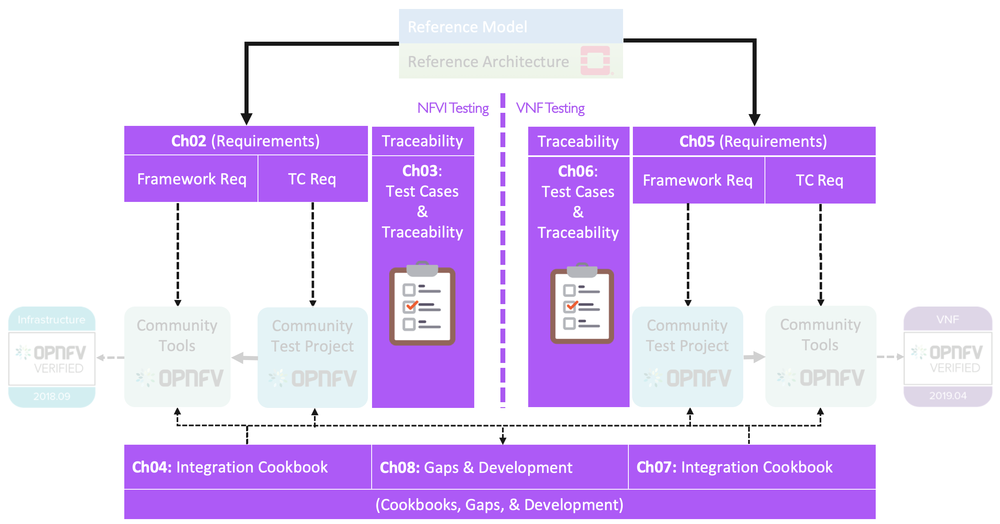
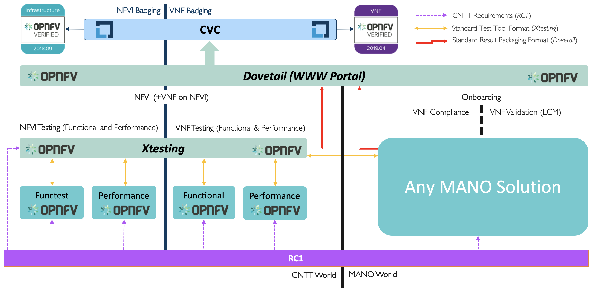
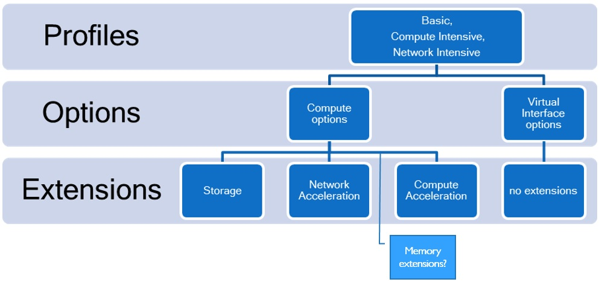

[<< Back](../)

# 1. Introduction

## Table of Contents
* [1.1 Introduction](#1.1)
  * [1.1.1 Terminology](#1.1)
  * [1.1.2 Relation to other communities](#1.1)
* [1.2 Scope](#1.2)
* [1.3 Relation to other communities](#1.3)
* [1.4 Principles and Guidelines](#1.4)
  * [1.4.1 Overarching Objectives and Goals](#1.4.1)
* [1.5 Best Practices](#1.5)
* [1.6 Verification methodologies](#1.6)
* [1.7 Assumptions & Dependencies](#1.7)
* [1.8 Results Collation & Presentation](#1.8)
* [1.9 Governance](#1.9)

## Synopsis

Ensure an implementation of the Anuket Reference Architecture (RA), such as the Reference Implementation (RI), meets industry driven quality assurance standards for conformance, verification and validation.  The OPNFV Verified Program (OVP), by Linux Foundation Networking (LFN), overseen by the Compliance Verification Committee (CVC), will provide tracking and governance for RC.

For the purpose of this chapter, NFVI+VNF testing will be performed to evaluate **Conformance** (i.e. adherence) to, and demonstrated proficiency with, all aspects of software delivery.  More specifically, Conformance includes:

 - Verified implementations of NFVI+VNF match expected design requirements
 - Clearly stated guidelines for test, badging, and lifecycle management
 - Inclusion of Operational run-books for 3rd party supplier instantiation and validations of NFVI+VNF
 - Evidence, through test results, confirming delivered code matches industrial requirements
 - Interoperability testing with Reference VNFs, ensuring integration stability and life-cycle management of the Reference VNF on the target implementation.

In summary, NFVI+VNF **Conformance** testing will be performed for **Verification** and **Validation** purposes, defined further as:

- **Verification** will be used to indicate conformance to design requirement specifications. Accomplished with Requirement Traceability and Manifest Reviews to ensure the NFVI is delivered per implementation specifications.
- **Validations** is used to indicate that testing performed confirms the NFVI+VNF meets the expected, or desired outcome, or behaviour.

**All Terms utilized throughout this chapter are intended to align with CVC definitions, and their use through CVC documentation, guidelines, and standards.**

## 1.1 Introduction

**Chapter Purpose**

This chapter includes process flow, logistics, and requirements which must be satisfied to ensure Network Function Virtualisation Infrastructure (NFVI) meets the design, feature, and capability expectations of RM and RA. Upstream projects will define features/capabilities, test scenarios, and test cases which will be used to augment OVP test harnesses for infrastructure verification purposes.  Existing processes, communication mediums, and related technologies will be utilized where feasible.  Ultimately, test results of certified NFVI+VNF will reduce the amount of time and cost it takes each operator to on-board and maintain vendor provided VNFs.

**Objective**

Perform NFVI+VNF Verification and Validations using Anuket reference architecture, leveraging the existing Anuket and CVC Intake and Validation Process to onboard and validate new test projects for NFVI compliance.  Upstream projects will define features/capabilities, test scenarios, and test cases to augment existing OVP test harnesses to be executed via the OVP Ecosystem.

**Test Methodology**
- Verification test to make sure if the OpenStack services have been deployed and configured correctly
- Manifest Verifications (Termed Compliance by CVC) will ensure the NFVI is compliant, and delivered for testing, with hardware and software profile specifications defined by the RM and RA.
- Empirical Validation with Reference Golden VNFs (Termed Validation by CVC) will ensure the NFVI runs with a set of VNF Families, or Classes, to mimic production-like VNF connectivity, for the purposes of interoperability checks.
- Candidate VNF Validation (Termed Validation & Performance by CVC) will ensure complete interoperablity of VNF behaviour on the NFVI leverage VVP/VNFSDK test suites.  Testing ensures VNF can be spun up, modified, or removed, on the target NFVI (aka Interoperability).

**Different Distributions**
The three step methodology described above of verifying Manifest compliance, executing Empirical Golden VNF transactions, and performing Interoperability Testing is the same validation process regardless of the Distribution used to establish a cloud topology, and the components and services used in the client software stack.  

### 1.1.1 Terminology

Terminology in this document will follow [Anuket Terminology](../../../common/glossary.md).

## 1.2 Scope

<b>Figure 1-1:</b> RC1 Scope.

This document covers the realisation aspects of conformance of both NFVI and VNFs. The document will cover the following topics:

- Identify in details the Requirements for conformance Framework.
- Identify in details the Requirement of Test Cases (and mapping them to requirements from The Reference Model and The OpenStack Based Reference Architecture ).
- Analysis of existing community projects.
- Propose an E2E Framework for conformance of NFVI and VNFs.
- Playbook of instructions, user manuals, steps of how to perform verification and conformance for both NFVI and VNFs using the proposed E2E Framework.
- Gap analysis to identify where the Gaps are in the industry (tooling, test cases, process, etc).
- Identify development efforts needed to address any gaps identified.

**Not in Scope**
- Functional testing / validation of the application provided by the VNF is outside the scope of this work.
- ONAP is not used in the process flow for NFVI verifications, or validations.
- Upgrades to VNFs, and the respective processes of verifying upgrade procedures and validating (testing) the success and compatibility of upgrades is not in scope.

## 1.3 Relation to other communities

<b>Figure 1-2:</b> RC-1 Relations other communities.

## 1.4 Principles and Guidelines

The objectives of the verification program are to deliver a validated implementation of reference architecture which satisfies infrastructure needs for VNF-developer teams, leveraging the OVP ecosystem as the vehicle for delivering validated NFVI.

These core principles will guide NFV verification deliverables:

### 1.4.1 Overarching Objectives and Goals

1. Deliver verified implementation of reference architecture which satisfies infrastructure needs for VNF-developer teams.
2. All accomplished with augmentation to the current OVP ecosystem.
3. Increase probability VNFs will on-board and function with minimal problems, or issues, during initial instantiation of VNF.
4. Test Harnesses will be portable, or compatible, across all RAs/Distributions which already conform to standard interfaces and services.

## 1.5 Best Practices

The following best practices have been adopted to ensure verification and validation procedures are repeatable with consistent quality in test results, and RI conformances:

* Standardized test methodology / flow, Test Plan, and Test Case Suites
* Integration with Anuket Upstream Projects and OVP flow (code, docs, cert criteria, etc.)
* Leverage Network and Service Models, with identified VNF-specific parameters
* Standardized conformance criteria
* Define Anuket RA as scenarios, and have all test cases for the RA be involved in OVP
* Add test cases from operators, which operators already tested in their environment

## 1.6 Verification methodologies

Perform VNF interoperability verifications against an implementation of Anuket reference architecture, leveraging existing Anuket Intake Process. Upstream projects will define features/capabilities, test scenarios, and test cases to augment existing OVP test harnesses to be executed via the OVP Ecosystem.

3rd Party test platforms may also be leveraged, if desired.

<b>Figure 1-3:</b> Conformance Methodology

## 1.7 Assumptions & Dependencies

**Assumptions** NFVI+VNF testing will be considered **Testable** if the follow
qualifiers are present in a test execution, and subsequent result:
* Ability to perform Conformance, or Verification of Artifacts to ensure
  designs (RM/RA/RI) are delivered per specification
* Ability to Control (or manipulate), manifestations of RM/RA/RI for the
  purposes to adjust the test environment, and respective cases, scenarios, and
  apparatus, to support actual test validations
* Ability to monitor, measure, and report, Validations performed against a
  target, controlled system under test

In addition, respective Entrance criteria is a prerequisite which needs to be
satisfied for NFVI+VNF to be considered **Testable**.

**Dependencies** NFVI+VNF verification will rely upon test harnesses, test
tools, and test suites provided by Anuket projects, including dovetaill,
yardstick, and Bottleneck. These upstream projects will be reviewed
semi-annually to verify they are still healthy and active projects. Over time,
the projects representing the conformance process may change, but test parity
is required if new test suites are added in place of older, stale projects.

* NFVI+VNF verifications will be performed against well defined instance types
  consisting of a HW and SW Profile, Configured Options, and Applied Extensions
  (See image.)

<b>Figure:</b> Instance Type

**NFVI+VNF Instance Type:**
* Standard compute flavours to be tested are defined in
  [chapter 4.2.1](../../../ref_model/chapters/chapter04.md#4.2.1)
* Performance profiles come in the form of Basic, Network Intensive, and
  Compute intensive. Refer to
  [chapter 2.3](../../../ref_model/chapters/chapter02.md#2.3)
  for details on these profiles.

## 1.8 Results Collation & Presentation

Test suites will be categorized as functional or performance based. Results reporting will be communicated as a boolean (pass/fail). The pass/fail determination for performance-based test cases will be made by comparing results against a baseline. Example performance-based metrics include, but are not limited to: resource utilization, response times, latency, and sustained throughput per second (TPS).

**Placeholder to document where results will be posted (e.g. Dovetail dashboards.)**

## 1.9 Governance

1. Conformance badges will be presented by the CVC
2. CVC will maintain requirements for conformance
