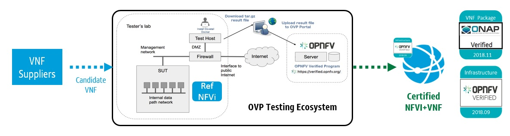
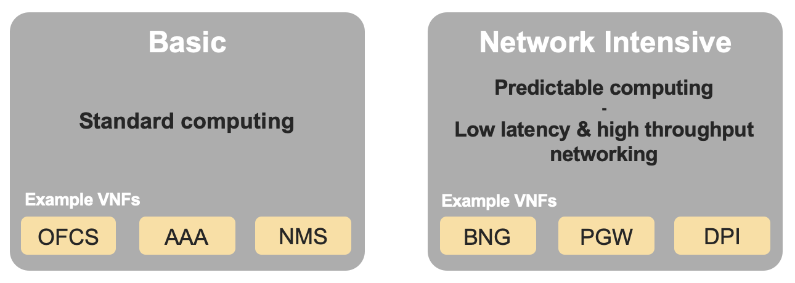
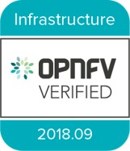
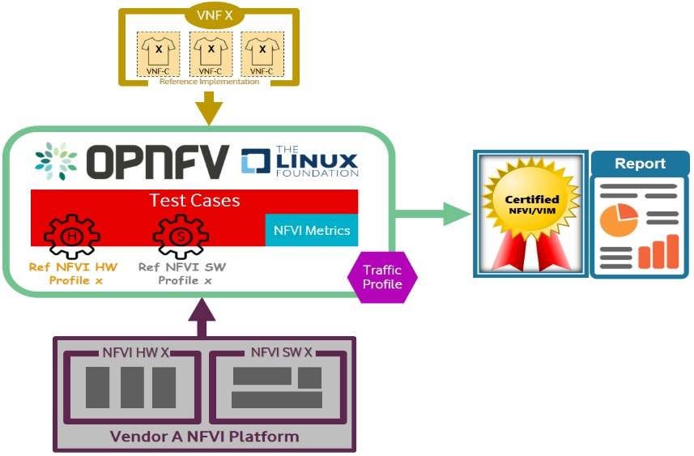

[<< Back](../)

# 2. NFVI Conformance Requirements

## Table of Contents
* [2.1 Introduction](#2.1)
* [2.2 Methodology](#2.2)
* [2.3 Conformance Strategy & Vehicle](#2.3)
* [2.4 Profiles Reference](#2.4)
* [2.5 Compliance, Verification, and Conformance](#2.5)
* [2.6 Entry & Exit Criteria](#2.6)
* [2.7 Framework Requirements](#2.7)
  * [2.7.1 Best Practices (General)](#2.7.1)
  * [2.7.2 Testing](#2.7.2)
    * [2.7.2.1 Test Categories](#2.7.2.1)
    * [2.7.2.2 Test Harnessess](#2.7.2.2)
    * [2.7.2.3 Test Results](#2.7.2.3)
  * [2.7.3 Badging](#2.7.3)
* [2.8 NFVI Test Cases Requirements](#2.7)
  * [2.8.1 Generic Requirements](#2.8.1)
  * [2.8.2 Requirement Types](#2.8.2)
  * [2.8.3 Profile Catalog](#2.8.3)
  * [2.8.4 Software & Hardware Reference](#2.8.4)
  * [2.8.5 Options & Extensions](#2.8.5)
  * [2.8.6 Measurement Criteria](#2.8.6)
    * [2.8.6.1 Storage and IOPS](#2.8.6.1)
  * [2.8.7 Measurement Types](#2.8.7)
    * [2.8.7.1 Performance Measurements](#2.8.7.1)
    * [2.8.7.2 Resiliency Measurements](#2.8.7.2)
  * [2.8.8 NFVI Test Cases](#2.8.8)

## Synopsis:
This chapter mainly covers the overall requirement for Reference Conformance test. The Conformance tests are conducted on NFVI and VNF level. Conformance on NFVI makes sure the SUT follows RM & RA requirement, and conformance on VNF makes sure VNF can be deployed and sufficiently working on the NFVI that has passed the conformance test.

<!---Verification will be used to indicate conformance to design requirement specifications. Activities involved Reviews and Walk-Throughs to ensure the NFVI is delivered per implementation specifications.--->

<!---Validations is used to indicate testing performed to confirm the actual output of a product meets the expected, or desired outcome, or behavior.--->

All Terms utilized throughout this chapter are intended to align with CVC definitions, and their use through CVC documentation, guidelines, and standards. This chapter will outline the Requirements, Process, and Automation, needed to deliver NFVI conformance.

## 2.1 Introduction
NFVI (Network Functions Virtualization Infrastructure) refers to the physical and virtual resources (compute, storage and network) on which virtual network functions (VNFs) are deployed. Due to differentiation of API and under layer configuration and capability matrix, cross vendor VNF deployment on NFVI becomes hard to predict, and requires huge amount of cross vendor interoperability tests. With combined effort from operators and vendors, CNTT define RA and RM, to make sure to consolidate the under layer configuration, capability and API, so as to provide the upper layer VNF with a 'common cloud infrastructure'. Based on this, CNTT also provides RC for conformance test of SUT against RA & RM requirements. SUT passes the conformance test will be identified as NFVI that can fit into the common requirements.

In the meantime, CNTT RC also provides conformance test for VNF. The intention is to make sure VNF that passes RC test cases can be deployed on any NFVI which also passes RC without any conformance and interoperability issue.

## 2.2 Methodology
The NFVI is consumed or used by VNFs via APIs exposed by Virtualised Infrastructure Manager (VIM). The resources created by VIM on the NFVI use the underlying physical hardware (compute, storage and network) either directly or indirectly. CNTT recommends RA1 to be used as a reference architecture for NFVI conformance. This  would provide a set of standard interfaces to create resources on NFVI. Below step by step process illustrates the NFVI conformance methodology:
* SUT (CNTT RI1 or commercial NFVI) is deployed on hardware for conformance test.
* A set of tests run on SUT to determine the SUT readiness for conformance process.
* Golden KPIs are taken as a reference.
* A set of tests are run on the SUT (target for conformance).
* KPIs obtained from the SUT are collected and submitted to conformance portal.
* The SUT KPIs are reviewed and compared with Golden KPIs to determine if the conformance badge is to be provided to SUT or not.

Based on a NFVI passing RC test and getting the conformance badge, VNF conformance test can be further conducted. Such test will leverage existing OPNFV Intake Process. Upstream projects will define features/capabilities, test scenarios, and test cases to augment existing OVP test harnesses to be executed via the OVP Ecosystem.

<b>Figure 2-1:</b> Conformance Methodology

Conformance methodologies to be implemented, from a process perspective include:
* Engineering package validations will be performed against targeted infrastructure/architecture.
* Configuration settings/features/capabilities will be baseline.
* Entrance Criteria Guidelines will be satisfied prior to RC test (i.e. Supplier needs to submit/agree/conform)
  * Conform to CNTT RM
  * Conform to CNTT RA
  * Submit standard documentation
  * Adhere to security compliance
* Exit Criteria Guidelines will be satisfied prior to issuance of OPNFV compliance badges.
* Verification decisions will be based on data. Test harness is compatible, or conforms to testing against standard interfaces and services.
* Leverage test harnesses from existing open source projects where practical, and applicable.

## 2.3 Conformance Strategy & Vehicle
In order to begin the Conformance process, NFVI needs to be validated and expected to be in a required state. This state would be determined by running tests as described in CNTT RI. Once the target NFVI passes these tests, it would become a candidate for NFVI Conformance. If NFVI fails the tests, it will not be move to next workflow for Conformance. NFVI+VNF conformance consist of a three part process for Compliance, Validation, and Performance. Adherence to Security standards are equally important and addressed in [Chapter 7 of CNTT RM](../../../ref_model/chapters/chapter07.md).

The three part conformance process includes NFVI Manifest conformance, Empirical Baseline measurements against targeted VNF families, and Candidate VNF validation. More specifically,
* NFVI conformance: NFVI is the SUT, ensuring NFVI is compliant with specs of RM and RA accomplished with Manifest test
* Empirical Validation with Reference VNF (Validation): NFVI is the SUT, ensuring NFVI runs with Golden VNFs and is instrumented to objectively validate resources through consumption and measurement
* Candidate VNF Conformance (Validation & Performance): VNF is the SUT, ensuring VNFs operate with RM and RA leveraging VVP/CVP/VFNSDK Test Suites
* Security: Ensures NFVI+VNF is free from known security vulnerabilities, utilizing industry standard cyber security frameworks (Refer to CNTT Chapter 7 Security for additional test/verification details)
Validations are performed against an Infrastructure Profile Catalog, VNF performance profile, and targeted VNF class or family for baseline measurements.

The Infrastructure Profile Catalog contains the following attributes:

* Profile is a collection of (limited) options offered by the infrastructure to the VNF
  * Capabilities
  * Metrics
  * Compute flavors
  * Interface options
  * Storage extensions
  * Acceleration capabilities
* Profiles are offered to VNFs as an instance types with predefined compute flavors.
  * A particular set of options is an instance type
  * Compute flavors: .tiny, .small etc as defined in [RM §4.2.1.1](../../../ref_model/chapters/chapter04.md#4211-predefined-compute-flavours)
* NFVI performance profiles, for which NFVI validations will support and be verified against, are defined as basic and network intensive. Details for each of these profiles can be found in [RM §2.3](../../../ref_model/chapters/chapter02.md#2.3).

<b>Figure 2-2:</b> NFVI Profiles

## 2.4 Profiles Reference
Different vendors have different types of VNFs to serve different use-cases. A VNF like Broadband Network Gateway (BNG) would require high networking throughout whereas a VNF like Mobility Management Entity (MME) would require high computing performance. As such, BNG would require high KPI values for network throughput and MME would require high CPU performance KPIs like Index Score, Instructions Per Second (IPS) etc. The target NFVI to cater these needs would have different characteristics. Depending on VNF's requirements, the NFVI can be categorized into below profiles:
* Basic (B) profile for standard computing and
* Network intensive (N) profile offering predictable computing performance along with low latency and high networking throughout
Similarly, different NFVI vendors may specialize in different hardware profiles and some may specialize in both VNFs and NFVI.

To cater to different needs from multiple NFVI vendors, CNTT allows different types of NFVI Conformance based on their types of [profile](../../../ref_model/chapters/chapter02.md#2.3)
 * Certify Vendor NFVI Hardware solution: This allows for Conformance of only NFVI.
 * Certify Vendor NFVI Hardware and Software Solution: This allows for Conformance for NFVI running a particular VNF.

## 2.5 Compliance, Verification, and Conformance
The below set of steps define the compliance, verification and Conformance process for NFVI
* Based on VNF's requirements, NFVI profile is selected - B, N
* NFVI readiness is checked for Conformance.
* The test VNFs are on-boarded using automation scripts on the NFVI.
* VNF on-boarding is validated by running functional tests to ensure that the on-boarding is successful.
* VNF performance tests are executed and NFVI KPIs are recorded during the tests.
* KPI comparison is run to compare NFVI KPIs with Golden KPIs, which serve as a reference for NFVI Conformance.
* If NFVI KPIs meet Golden KPIs, NFVI is certified and granted a Conformance badge.
* If NFVI KPIs do not meet Golden KPIs, no Conformance is provided.

<b>Figure 2-3:</b> Reference NFVI Profiles Implementation

## 2.6 Entry & Exit Criteria
**Entry criteria**: Before entering into NFVI Conformance, NFVI needs to
satisfy the following requirements as entry pass:
* Design & Requirements
  * Design, Configuration, Features, SLAs, and Capability documentation
    complete
  * Users stories / Adherence to CNTT Model principles and guidelines
  * Chosen Reference Architecture matches the Architecture from the
    product catalog
* Environment
  * Lab assets/resources and respective software revision levels are specified,
    with confirmation of compatibility across external systems
  * Tenant needs identified
  * All connectivity, network, image, VMs, delivered with successful pairwise
    tests
  * Lab instrumented for proper monitoring
  * Lab needs to be setup according to RA1/RA2 as defined by CNTT and should be
    in the NFVI required state.
* Planning & Delivery
  * Kickoff / Acceptance Criteria reviews performed
  * Delivery commitments, timelines, and cadence accepted
  * Confirm backward compatibility across software/flavor revision levels
* Data/VNFs/Security
  * Images, Heat Templates, Preload Sheets available
  * Images uploaded to tenant space
  * External system test data needs identified
  * Owners (NFVI, VNF, PTL, etc) documented
  * Security Compliance Satisfied (Refer to CNTT Chapter XXXX Security for
    additional tests, scans, and vulnerabilities validations)

**Exit criteria**: NFVI Conformance testing should complete with following
exit criteria:
* All mandatory test cases should pass.
* Test results collated, centralized, and normalized, with a final report
  generated showing status of the test scenario/case (e.g. Pass, Fail, Skip,
  Measurement Success/Fail, etc), along with trace-ability to a functional, or
  non-functional, requirement.

## 2.7 Framework Requirements

The NFVI Conformance framework deals with the process of testing NFVI in below three areas:
* Compliance: The NFVI needs to comply to CNTT RA1/RA2.
* Validation: Validation deals with the ability of NFVI to respond to Cloud APIs and interfaces.
* Performance: Performance deals with running tests on NFVI depending on the NFVI profile and collecting KPIs.

The NFVI KPIs are compared with Golden KPIs, which serve as a reference for NFVI Conformance. If NFVI KPIs meet Golden KPIs, NFVI is certified and granted a Conformance badge. If NFVI KPIs do not meet Golden KPIs, no Conformance badge is provided.

### 2.7.1 Best Practices (General)
The NFVI Conformance framework will be guided by the following core principles:
-   Implementing, and adhering to, Standardized Test Methodology / flow, Test Plan, and Test Case Suites, which promotes scalability using repeatable processes.
-   Integration with Automated Tool-Chains, such as XTesting or Dovetail, for continuous deployment, validation, and centralization of test harnesses and results visualization.
- Alliance and execution of OVP flows and methodologies, which supports common structures for code, artifact generation and repository, Conformance criteria, etc.)
-   Where possible, leveraging ONAP Network and Service Models, with identified VNF-specific parameters
-   Utilizing Standard Conformance criteria.
-   Defining CNTT reference architecture (RA) as scenarios, and having all test cases for the RA be involved in OVP (could also be addressed in OVP as CNTT test)
-   Add test cases from operators, which operators already tested in their environment

### 2.7.2 Testing
Testing for NFVI Conformance falls under three broad categories - Compliance, Validation and Performance. Target NFVI for Conformance needs to pass all these tests in order to obtain the Conformance badge.

#### 2.7.2.1 Test Categories
The following five test categories have been identified as **minimal testing required** to verify NFVI interoperability to satisfy the needs of VNF developer teams.
 1. Baremetal validation: To validate control and compute nodes hardware
 2. VNF Interoperability: After VNFs are on-boarded, Openstack resources like Tenant, Network (L2/L3), CPU Pining, security policies, Affinity anti-affinity roles and flavors etc. would be validated.
 3. Compute components: Validate VMs status and connectivity result after performing each of listed steps. Best candidate for this testing would be identify compute node that holds VMs which has L2 and L3 connectivity.
 4. Control plane components: Validations for RabbitMQ, Ceph, MariaDB etc. and OpenStack components like Nova/Glance/Heat etc. APIs.
 5. Security: Validation for use RBAC roles and user group policies. See [Chapter 7](./chapter07.md) for complete list.

The following **Optional Test Categories** which can be considered by the Operator, or Supplier, for targeted validations to complement required testing for Conformance:

 - On-Boarding (MANO agnostic)
 - VNF Functional Testing
 - Charging / Revenue Assurance Verification
 - MicroServices Support
 - Closed Loop Testing
 - VNF Coexistence (ETSI NFV-TST001 “Noisy Neighbor”)
 - VNF Interactions with Extended NFVi Topology
 - VNF Interactions with Complex NFVi (Akraino)
 - Scalability Testing
 - HA Testing
 - Fault Recovery Testing
 - PM/KPI/Service Assurance Testing

#### 2.7.2.2 Test Harnesses
In addition to General Best Practices for NFVI Conformance, the following Quality Engineering (QE) standards will be applied when defining and delivering test scenarios for Conformance:  
1.  Standardized test methodologies / flows capturing requirements from RA's, goals and scenarios for test execution, and normalizing test results.
2.  Establishing, and leveraging, working test-beds which can be referenced in subsequent test scenario designs.  
3.  Leveraging standardized cloud-based facilities such as storage, IAM, etc.
4.  Test Script libraries need to enable Data-Driven testing of On-Boarding, Instantiation, etc.
5.  Standards base Test Plan and Test Case suite needs to include sample VNFs, CSAR, and Automated Test Cases.
6.  Documentation needs to be dynamic, and consumable.
7.  Harnesses need to apply a “Just add Water” deployment strategy, enabling test teams to readily implement test harnesses which promotes Conformance scalability.

#### 2.7.2.3 Test Results

**Categorization**.  Test suites will be categorized as Functional or Performance based.  

**Results.** Test results reporting will be communicated as a boolean (pass/fail), or Measurements Only.  

 - **Functional Pass/Fail** signals the assertions set in a test script verify the Functional Requirements (FR) has met its stated objective as delivered by the developer. This will consist of both positive validation of expected behavior, as well as negative based testing when to confirm error handling is working as expected.
 - **Performance-based Pass/Fail** determination will be made by comparing Non-Functional (NFR) NFVI KPIs (obtained after testing) with the Golden KPIs. Some of the examples of performance KPIs include, but not limited to: TCP bandwidth, UDP throughput, Memory latency, Jitter, IOPS etc. See [Chapter 4 of RM](../../../ref_model/chapters/chapter04.md) for a complete list of metrics and requirements.
 - **Measurement Results**.  Baseline Measurements will be performed when there are no benchmark standards to compare results, or established FRs/NFRs for which to gauge application / platform behavior in an integrated environment, or under load conditions.  In these cases, test results will be executed to measure the application, platform, then prepare FRs/NFRs for subsequent enhancements and test runs.  

 **Collation | Portal**.  The following criteria will be applied to the collation and presentation of test-runs seeking NFVI Conformance:   

 - RA number and name (e.g. RA-1 OpenStack)
 - Version of software tested (e.g. OpenStack Ocata)
 - Normalized results will be collated across all test runs (i.e. centralized database)
 - Clear time stamps of test runs will be provided.
 - Identification of test engineer / executor.
 - Traceability to requirements.
 - Summarized conclusion if conditions warrant test Conformance (see Badging Section).
 - Portal contains links to Conformance badge(s) received.

### 2.7.3 Badging
**Defined**.  _Badging_ refers to the granting of a Conformance badge by the OVP to Suppliers/Testers of CNTT NFVI upon demonstration the testing performed confirms:

 - NFVI adheres to CNTT RA/RM requirements.
 - CNTT certified VNFs functionally perform as expected (i.e. test cases pass) on NFVI with acceptable levels of stability and performance.

The below figure shows the targeted badge for NFVI.

<b>Figure 2-4:</b> NFVI badge

**Specifics**.  More specifically, suppliers of NFVI testing seeking infrastructure Conformance are required to furnish the following:

|Category|OVP/CVC Expectation|Supporting Artifact(s)|
|--|--|--|
|Lab|Verification that the delivered test lab conforms to RI-x lab requirements for topology, # of nodes, network fabric, etc|Bare-metal H/W Validations|
|Compliance|Verification that the installed software conforms to RM/RA requirements for required components and configured options and extensions, etc|Manifest S/W Validations|
|Validation|FR Validation of Component and API functional behavior meets requirements specified in RM/RA-x requirements documents|API & Platform Test Results|
|Performance|NFR Validation of Component, Interface, and API, results are within tolerance, or achieve baseline measurements|Performance Test Results|
|Results Reporting|Published of Test Results into centralized and common repository and reporting portal|Normalized Results per Standards|
|Release Notes|Supplier provides concluding remarks, links to artifacts, and demonstration of having met exit criteria for testing|Release Notes

**Conformance Process**.  
Conformance and issuance of NFVI badges will be as follows:
 - NFVI supplier utilizes, or installs a target RM/RA-x in a RI lab.
 - Required artifacts are submitted/supplied to the OVP, demonstrating proper Lab Installation, Compliance, Validation, Performance, and Release of Results & Known Issues.
 - Artifact validations will be corroborated and confirmed by the OVP. with direct comparison between measured results and documented FRs/NFRs for applications, hardware and software configuration settings, and host systems.
 - All OVP inquiries, requests for re-tests, or reformatting / re-uploading of results data are closed.

<b>Figure 2-5:</b> NFVI Badges

## 2.8 NFVI Test Cases Requirements
The objective of this chapter is to describe the requirements for NFVI test cases as derived from the reference model and architecture for the LFN-based compliance program. This set of requirements eventually determines the scope of the compliance program and the corresponding list of test cases included in the compliance program.  In particular, this chapter extends the generic list of NFVI test case requirements which is provided in Section [Test Case Selection Requirements](../../../ref_model/chapters/chapter08.md#824-test-case-selection-requirements) of the reference model.

### 2.8.1 Generic Requirements on Test Cases

All test cases must fulfill the generic requirements listed in Section [Test Case Selection Requirements](../../../ref_model/chapters/chapter08.md#824-test-case-selection-requirements) of the reference model.

In addition, for test cases targeting the NFVI compliance program, the following requirements must be met:

| Reference         | Description                                                                                                              |
|-------------------|--------------------------------------------------------------------------------------------------------------------------|
| x                 | All NFVI test cases *must* be automated. Once the pre-conditions of a test case are met, i.e., the system under test is configured and in a state according to the pre-conditions of the particular test case, no manual steps must be required to run a test case to completion.   |
| x                 | All NFVI test cases *must* be implemented using publicly available open source tools. This enables access to test tools and test case implementations to all interested parties and organizations.  |
| x                 | All NFVI test cases *must* be integrated and run in the OPNFV CI/CD pipeline. This requirement ensures that test cases are functionally correct, reliable, mature and pass on the NFVI reference implementation.   |
| x                 | All NFVI test cases *must* treat the NFVI platform as a black box. In particular, test cases must not perform actions on or change the state of the system under test outside the scope of well-defined APIs as listed by RA1. This requirement ensures applicability of test cases across different implementations: reference implementations as well as commercial implementations.     |

### 2.8.2 Requirement Types

The compliance and Conformance program intends to validate four different types of requirements and system properties:

* API compliance: This is the most relevant type of test case, validating the functional correctness of the system under test. API compliance test cases exercise only the specific well-defined APIs described in the reference architecture (see [Interfaces and APIs](../../../ref_arch/openstack/chapters/chapter05.md)).

* Performance: Test cases covering this type of requirement measure specific performance characteristics of the system under test as defined in the reference model, the corresponding reference architectures and in sections further below in this chapter.

* Resilience: Test cases covering this type of requirement measure specific resilience characteristics of the system under test as defined in the reference model, the corresponding reference architectures and in sections further below in this chapter.

* Hardware configuration: Validation of the bare-metal hardware itself in terms of specs and configuration should be included in the scope of the compliance test suite eventually. This validation step ensures that the underlying hardware is correctly configured according to CNTT/OPNFV hardware specification (TODO: add reference to updated "Pharos specs"). The purpose of this validation is to act as a pre-flight check before performing the extensive compliance test suite. Moreover, by validating key hardware configuration aspects, it ensures comparability of performance-related test results.

The extend to which these different types of requirements are included in the compliance and Conformance test suite is subject to the availability of test cases. See Section [NFVI Test Cases Requirements](chapter02.md#28-nfvi-test-cases-requirements).

### 2.8.3 Profile Catalog

Section [Infrastructure Profiles Catalogue](../../../ref_model/chapters/chapter04.md#42-infrastructure-profiles-catalogue) of the reference model defines two software profiles, targeting two different use cases:

* Basic
* Network intensive

The test cases selected for validating compliance of the two profiles must cover the functional and non-functional requirements as listed in Section [Instance Capabilities Mapping](../../../ref_model/chapters/chapter04.md#425-instance-capabilities-mapping) and Section [Instance Performance Measurement Mapping](../../../ref_model/chapters/chapter04.md#426-instance-performance-measurement-mapping) of the reference model.

TODO: what actually needs to be done here is to reference the table from chapter 4.2.5 and mark for which of those requirements test cases are actually available in the set of test tools available to us.

### 2.8.4 Software & Hardware Reference

The LFN-based compliance and Conformance program comprises three distinct types of NFVI deployment and runtime environments:

 1. A CNTT reference implementation deployed in the OPNFV CI/CD environment,
 2. A commercial NFVI product deployed in a vendor's internal development and testing environment, and
 3. A CNTT reference implementation of a commercial NFVI product deployed in a 3rd party lab providing testing and Conformance services.

The test tooling, harnesses and corresponding test cases which are part of the compliance and Conformance test suite must be capable of running across all of those environments. This results in the following list of requirements:

| Reference         | Description                                                                                                              |
|-------------------|--------------------------------------------------------------------------------------------------------------------------|
| x                 | NFVI test cases *must not* interact with remote (Internet) services apart from downloading container or VM images. In particular, test tools and test cases must not automatically upload test data to any system or service run by LFN or GSMA. The purpose of this requirement is to protect the confidentially of (intermediate) test data. |
| x                 | NFVI test cases *must* support a means of running in an internal enterprise lab environment. This could be achieved by either i) natively supporting proxied Internet connectivity and non-public DNS servers or ii) by providing a high-level description of remote dependencies (e.g., container and VM images, network services (DNS), etc.) such that local mirrors can be set up.  |

### 2.8.5 Options & Extensions

### 2.8.6 Measurement Criteria

Test validations will be corroborated, and confirmed, with direct comparison between measured results and documented non-functional requirements (NFRs) for applications, hardware and software configuration settings, and host systems.  Throughput, latency, concurrent connections/threads, are all examples of non-functional requirements which specify criteria which can be used to judge the operation of a system, rather than specific behavior of the application which are defined by functional requirements.

This section attempts to summarize a categorical list of metrics used for test validations.  **For a complete list of metrics, and requirements, please refer to Reference Model**

#### 2.8.6.1 Storage and IOPS

_**IOPS**_ validations for Storage, and/or Storage Extensions, will be included as part of the final NFVI verification, and validation, process.  

From a definition perspective, IOPS is the standard unit of measurement for I/O (Input/Output) operations per second. This measurement is a performance-based measurement and is usually seen written as**(1)**:

- **Total IOPS**: Average number of I/O operations per second.
- **Read IOPS**: Average number of read I/O operations per second.
- **Write IOPS**: Average number of write I/O operations per second.

For example, if you have a disk that is capable of doing a 100 IOPS, it means that it is theoretically capable of issuing a 100 read and or write operations per second.  This is in theory.  In reality, additional time is needed to actually process the 100 reads/writes.  This additional time is referred to as "latency", which reduces the total IOPS that is calculated, and measured.  Latency needs needs to be measured, and included in the IOPS calculation.  Latency will tell us how long it takes to process a single I/O request, and is generally in the 2 millisecond (ms) range per IO operation for a physical disk, through 20+ ms, at which time users will notice an impact in their experience**(2)**.  

Additional factors to consider when measuring IOPS:

- Take into consideration the percentage of Input (write) vs. Output (reads) operations, as Writes can be more resource intensive.
- Determine if Reads were performed from Cache, as this may (will) result in faster performance, and faster IOPS.
- Confirm the storage types (Physical, RAID), as storage arrays with linear, or sequential reading/writing may (will) be slower.
- Identify the block size used, as using large block sizes vs. small block sizes can (will) impact IOPS performance.
- Determine Hard Disk Speeds (HDD in RPMs) used, as the higher the RPMS, the potential for faster IOPS performance.
- Quantify the number of disk controllers used to process the number of requested IO requests.
- Determine the specific work-load requirements, as this will dictate speed, controllers, disk RPM, and latency tolerances.  

For additional insight, or deeper understanding and reading of IOPS, refer to the references below.

### 2.8.7 Measurement Types

#### 2.8.7.1 Performance Measurements

**Objectives**

The NFVI performance measurements aim at assessing the performance of a given NFVI implementation on the execution plan (i.e., excluding VIM) by providing it with a set of significant metrics to be measured.

They should allow validating the performance of any software and/or hardware NFVI implementation as described in Reference Model.

Of course, they can also be used for other purposes, such as:
- fine tuning of software and/or hardware NFVI configuration (e.g., the number of cores dedicated to the DPDK vSwitch)
- comparing the performances of different software or hardware technologies (e.g., DPDK vSwitch vs hardware-offloaded vSwitch)
- assessing the performance impact of specific features (e.g., with or without encapsulation)

**Metrics Baseline**

For the purpose of validation, a baseline of the performance metrics is required for comparison with the results of their measurements on the NFVI implementation to be validated.

That baseline is a set of threshold values which could be determined by **measuring the performance metrics on Reference Implementations**.

The validation can then be based on simple pass/fail test results or on a grade (e.g., "class" A, B or C) provided by the combination of pass/fail results for 2 different threshold values of some (or all) metrics.

**Metrics Description**

Two categories of metrics are considered depending on whether they are related to either the VNF domain or the NFVI domain itself:

- Metrics related to the VNF domain are defined from VNF perspective (i.e., per VNFC, per vNIC, per vCPU...) and should concern VNF as well as NFVI actors.
- Metrics related to the NFVI domain are defined per NFVI node ; their measurement is based on virtual workloads (i.e., VM or container) in order to reflect the performance of a NFVI node with a given profile ; they should only concern NFVI actors.

The following table contains the list of performance metrics related to the VNF domain.

| Reference         | Name                           | Unit          | Definition/Notes                                             |
| ----------------- | ------------------------------ | ------------- | ------------------------------------------------------------ |
| vnf.nfvi.perf.001 | vNIC throughput                | bits/s        | Throughput per vNIC                                          |
| vnf.nfvi.perf.002 | vNIC latency                   | second        | Frame transfer time to vNIC at the throughput (vnf.nfvi.perf.001) |
| vnf.nfvi.perf.003 | vNIC delay variation           | second        | Frame Delay Variation (FDV) to vNIC at the throughput (vnf.nfvi.perf.001) |
| vnf.nfvi.perf.004 | vNIC simultaneous active flows | number        | Simultaneous active L3/L4 flows per vNIC before a new flow is dropped |
| vnf.nfvi.perf.005 | vNIC new flows rate            | flows/s       | New L3/L4 flows rate per vNIC                                |
| vnf.nfvi.perf.006 | Storage throughput             | bytes/s       | Throughput per virtual storage unit                          |
| vnf.nfvi.perf.007 | vCPU capacity                  | test-specific score | Compute capacity per vCPU                                    |

The following table contains the list of performance metrics related to the NFVI domain.

| Reference           | Name                           | Unit          | Definition/Notes                                           |
| ------------------- | ------------------------------ | ------------- | ---------------------------------------------------------- |
| infra.nfvi.perf.001 | Node network throughput        | bits/s        | Network throughput per node                                |
| infra.nfvi.perf.002 | Node simultaneous active flows | number        | Simultaneous active L3/L4 flows per node before a new flow is dropped |
| infra.nfvi.perf.003 | Node new flows rate            | flows/s       | New L3/L4 flows rate per node                              |
| infra.nfvi.perf.004 | Node storage throughput        | bytes/s       | Storage throughput per node                                |
| infra.nfvi.perf.005 | Physical core capacity         | test-specific score | Compute capacity per physical core usable by VNFs          |
| infra.nfvi.perf.006 | Energy consumption             | W             | Energy consumption of the node without hosting any VNFC    |
| infra.nfvi.perf.007 | Network energy efficiency      | W/bits/s      | Energy consumption of the node at the network throughput (infra.nfvi.perf.001), normalized to the measured bit rate |
| infra.nfvi.perf.008 | Storage energy efficiency      | W/bits/s      | Energy consumption of the node at the storage throughput (infra.nfvi.perf.004), normalized to the measured byte rate |
| infra.nfvi.perf.009 | Compute energy efficiency      | W/core        | Energy consumption of the node during compute capacity test (vnf.nfvi.perf.007 or infra.nfvi.perf.005), normalized to the number of physical cores usable by VNFs |

**MVP Metrics**

The following metrics should be considered as MVP:

- vnf.nfvi.perf.001,002,006,007
- infra.nfvi.perf.001,005,006,007,009

**Network Metrics Measurement Test Cases**

The network performance metrics are vnf.nfvi.perf.001-005 and infra.nfvi.perf.001-003,006.

The different possible test cases are defined by each of the 3 following test traffic conditions.

- **Test traffic path across NFVI**

  3 traffic path topologies should be considered:

  - ***North/South traffic***, between VNFCs within a node and outside NFVI  
    This can be provided by PVP test setup of ETSI GS NFV-TST009.

  - ***East/West intra-node traffic***, between VNFCs within a node  
    This can be provided by a V2V (Virtual-to-Virtual) test setup and, in some cases, by PVVP test setup of ETSI GS NFV-TST009.  

  - ***East/West inter-node traffic***, between VNFCs in different nodes      
    This can be provided by VPV (Virtual-Physical-Virtual) test setup and, in some cases, by PVVP test setup between 2 nodes.

- **Test traffic processing by NFVI**

  Different processing complexity applicable to the traffic crossing the NFVI should be considered, including especially (but not exhaustively):
  - ***L2 processing*** (Ethernet switching), possibly including VLAN tagging/mapping and encapsulation (e.g., VXLAN)
  - ***L3 processing*** (IP routing), possibly including L2 processing
  - ***L4 stateful processing*** (e.g., FW, NAT, SFC), also including L3 processing
  - ***Encryption*** (e.g., IPSec ESP tunneling)

- **Test traffic profile**

  Two different test traffic profiles should be considered according to the two VNF types that must be provided with network connectivity by the NFVI.

  - ***Forwarded traffic*** for L3/L4 forwarding VNF (e.g., PGW, FW)

    It is based on ETSI GS NFV-TST009 and it should be:

    -  **bidirectional UDP traffic** with **0.001%** frame loss ratio, **300B** average frame size, **10k** L3/L4 flows,
    - between a **traffic generator** and a **traffic receiver** through a **L3 forwarding** pseudo-VNF with sufficient capacity not to be the test bottleneck.

    Latency and delay variation measurement should be the 99th percentile of measured values for one-way frame transfer (i.e. from generator to receiver).

    The main OPNFV test tools candidates for that purpose are NFVbench and VSPerf.

    > _**Note:** to be studied whether additional frame sizes and flows number should be considered_

  - ***Client-server traffic*** for L4/L7 endpoint VNF (e.g., MME, CDN)

    It should be:

    - **bidirectional TCP traffic** with **1400B** maximum frame size, **5k** TCP sessions,
    - between **2 TCP client&server endpoints**, one or both as pseudo-VNF, with sufficient capacity not to be the test bottleneck.

    *Note*: the maximum TCP frame size can be forced by configuring TCP endpoint link MTU.

    The main OPNFV test tools candidates for that purpose are Functest (VMTP and Shaker) and Yardstick (TC011 and TC083).

    > _**Note:** to be studied whether metrics related to latency and flows for that traffic profile should be considered (how? with UDP and/or ICMP test traffic in addition?)_

The combination of each of those 3 test conditions types and the different NFVI profiles results in a wide matrix of test cases (potentially more than 50 cases).
Furthermore, these test cases should be combined with the different metrics resulting in a huge number of measurements (potentially more than 400 measurements).
For the efficiency of the validation, only the most relevant combinations should be kept.

This optimization should be based on the following principles:

1. NFVI domain metrics measurement: on PVP topology only
2. Metrics measurement with forwarded traffic: with no L4 stateful processing
3. Basic profile metrics measurement: client-server traffic profile only
4. Flows & latency related metrics measurement: for PVP only

The following table proposed a possible optimized matrix model of the test cases against the metrics to be measured.

|                     | **NFVI Profiles**   | **B**      |                |                |                | **N**         |                |
| ------------------- | ------------------- | -------------- | -------------- | -------------- | -------------- | ------------- | -------------- |
|                     | **Test Cases**      | V2V - L2 - SRV | VPV - L3 - SRV | PVP - L2 - SRV | PVP - L4 - SRV | PVP - L2- SRV | PVP - L2 - FWD |
|                     |                     |                |                |                |                |               |                |
| **MVP Metrics**     | vnf.nfvi.perf.001   | 50Gbps         | 20Gbps         | 20Gbps         | 10Gbps         | 40Gbps        | 40Gbps         |
|                     | vnf.nfvi.perf.002   | n/a (4)        | n/a (4)        | ?              | ?              | ?             | 0.5ms          |
|                     | infra.nfvi.perf.001 | n/a (1)        | n/a (1)        | 40Gbps         | 20Gbps         | 60Gbps        | 80Gbps         |
|                     | infra.nfvi.perf.007 | n/a (1)        | n/a (1)        | ? W/Gbps       | ? W/Gbps       | ? W/Gbps      | ? W/Gbps       |
|                     |                     |                |                |                |                |               |                |
| **Non-MVP Metrics** | vnf.nfvi.perf.003   | n/a (4)        | n/a (4)        | ?              | ?              | ?             | 1ms            |
|                     | vnf.nfvi.perf.004   | n/a (4)        | n/a (4)        | ?              | ?              | ?             | 500k           |
|                     | vnf.nfvi.perf.005   | n/a (4)        | n/a (4)        | ?              | ?              | ?             | 100kfps        |
|                     | infra.nfvi.perf.002 | n/a (1)        | n/a (1)        | ?              | ?              | ?             | 1G             |
|                     | infra.nfvi.perf.003 | n/a (1)        | n/a (1)        | ?              | ?              | ?             | 200kfps        |

*Table notes*:
- Values are only indicative (see "Metrics Baseline" below)
- L2/L3/L4 refers to network processing layer
  - L2 for Ethernet switching
  - L3 for IP routing
  - L4 for IP routing with L4 stateful processing (e.g. NAT)
- SRV/FWD refers to the traffic profile (and pseudo-VNF type implied)
  - SRV for client-server traffic (and L4/L7 endpoint pseudo-VNF)
  - FWD for forwarded traffic (and L3/L4 forwarding pseudo-VNF)

**Energy Metrics Measurement Test Cases**

Energy metrics (infra.nfvi.perf.006-009) should be considered carefully for NFVI validation since energy consumption may vary a lot across processor architectures, models and power management features.

They mainly enable to have metrics available regarding NFVI environment footprint. They also allow energy-based comparison of different NFVI software implementations running on a same physical NFVI hardware implementation.

OPNFV tool as possible basis: https://docs.opnfv.org/en/latest/testing/ecosystem/energy-monitoring.html

**Storage Metrics Measurement Test Cases**

Metric (MVP): vnf.nfvi.perf.006 and infra.nfvi.perf.004,008

Main OPNFV test tool candidates: Yardstick (TC 005), StorPerf

> _**Note:** to be completed _

**Compute Metrics Measurement Test Cases**

The compute performance metrics are vnf.nfvi.perf.007 and infra.nfvi.perf.004,009.

For normalized results, the compute performance test requires all of the possible vCPUs available for running workloads to execute workloads. You need to start as many VMs as needed to force all of the possible CPUs on the node to run a workload. In this case, the result is normalized:
- to the number of vCPU, for the vCPU capacity measurements (vnf.nfvi.perf.007)
- to the number of physical core usable by VNFs, for the physical core capacity and compute energy efficiency measurements infra.nfvi.perf.004,009)

Main OPNFV test tool candidate: Yardstick (TC014)

> _**Note:** to be studied: how to define the different possible test cases, especially the different workload profiles (i.e., pseudo-VNF) to consider_

#### 2.8.7.2 Resiliency Measurements
