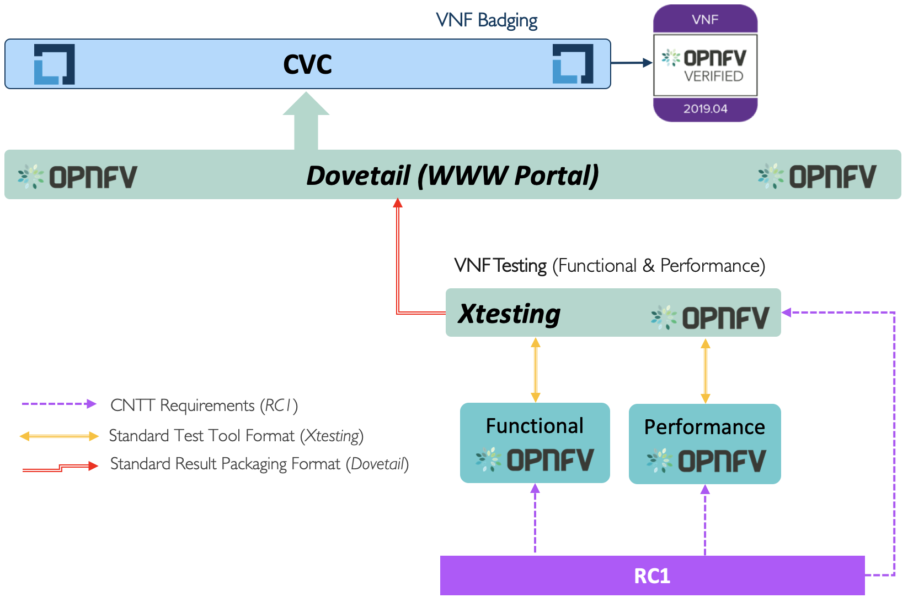
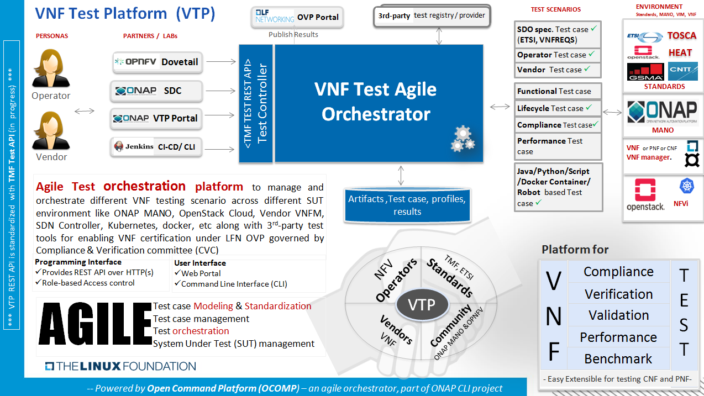

# 7. VNF Testing Cookbook

## Table of Contents
* [7.1 Introduction](#7.1)
* [7.2 Relevant Community Projects](#7.2)
* [7.3 Relevant Community Projects and Initiatives](#7.3)

## 7.1 Introduction

Define the purpose of the chapter which is to:
-	Identify Framework Needs, Goals, and Dependencies
- Define Opensource Integration (OVP, Functest, CVC, others)
- Provide Automation Toolchain (list, topology, flow)

## 7.2 Relevant Community Projects.

## 7.3 VNF Testing Cookbook.

<b>Figure 1-3:</b> VNF Testing Integrated Framework.

As detailed in the RC chapter 05 on E2E VNF test platform requirements,
ONAP VNF Test Platform (VTP) helps to perform the VNF Conformance process by
addressing those requirements. And following sections provides required
guidelines and details for platform and test cases.

### 7.3.1 Platform Architecture

Provides details on the architecture, components and it's responsibilities.

-   **Test Controller**: For every feature supported in VTP, Test controller
    provides required REST API along with user authentication and authorization
    based on given tenant?.

-   **Agile Test Orchestrator**: Dynamically allows to on-board and execute the
    test cases and test flows across different run-time environment on given
    System under test (SUT) along with required supported system in place.

-   **Portal & CLI**: To operate and manage the VTP features, Portal? provides
    web 2.0 based graphical user interface along with Command line interface.

-   **Test case plug-ins**: Test cases are on-boarded into the system as
    independent plug-ins (developed using different programming/scripting
    language) and/or plain text yaml file for those supported as profile in VTP
    (such as HTTP, SNMP, etc)

-   **Repository**: Provides version controlled repository for persisting
    various aspects of the VTP such as artifacts, results, reports, etc.

*? - Feature in-progress*

### 7.3.2 Platform administrator guide

Provides detail on installation, configuration, un-installation operations.

VTP is provided a script for performing installation and mange the installed VTP
services as below:

[vpt_install.sh](https://github.com/onap/vnfsdk-refrepo/blob/master/vnfmarket-be/deployment/install/vtp_install.sh)

**--download** : It will download all required artifacts into /opt/vtp_stage

**--install** : It will install VTP (/opt/controller) and CLI (/opt/oclip)

**--start** : It will start VTP controller as tomcat service and CLI as oclip
service

**--verify** : It will verify the setup is done properly by running some test
cases

**--uninstall** : It will stop and uninstall the VTP

**--clean** : It will remove the downloaded artifacts

Customize the download URL as below from latest snapshot or release onap
repository

export OCLIP_DOWNLOAD_URL="https://nexus.onap.org/content/repositories/snapshots/org/onap/cli/cli-zip/4.0.0-SNAPSHOT/cli-zip-4.0.0-20190904.095516-170.zip"

export VTP_DOWNLOAD_URL="https://nexus.onap.org/content/repositories/snapshots/org/onap/vnfsdk/refrepo/vnf-sdk-marketplace/1.3.3-SNAPSHOT/vnf-sdk-marketplace-1.3.3-20190903.092849-18.war"

export CSAR_VALIDATE_DOWNLOAD_URL="https://nexus.onap.org/content/repositories/snapshots/org/onap/vnfsdk/validation/csarvalidation-deployment/1.2.2-SNAPSHOT/csarvalidation-deployment-1.2.2-20190904.082836-6.zip"

export CSAR_VALIDATE_JAR_DOWNLOAD_URL="https://nexus.onap.org/content/repositories/snapshots/org/onap/vnfsdk/validation/validation-csar/1.2.2-SNAPSHOT/validation-csar-1.2.2-20190904.082829-6.jar"

### 7.3.3 Test case development guide

Provides details on how to develop new test cases and packages them for
deploying.

[More details](https://wiki.onap.org/pages/viewpage.action?pageId=43386304)

### 7.3.4 Test case model guide

Model the required test cases for various scenario, which could help in
standardizing the test cases for various NF, different compliance and multiple
MANO/NFVi based LCM operations.

[More details](https://wiki.onap.org/pages/viewpage.action?pageId=43386304)

### 7.3.5 Test case administrator guide

Provides detail on installation, configuration, un-installation operations

[More details](https://wiki.onap.org/pages/viewpage.action?pageId=43386304)
