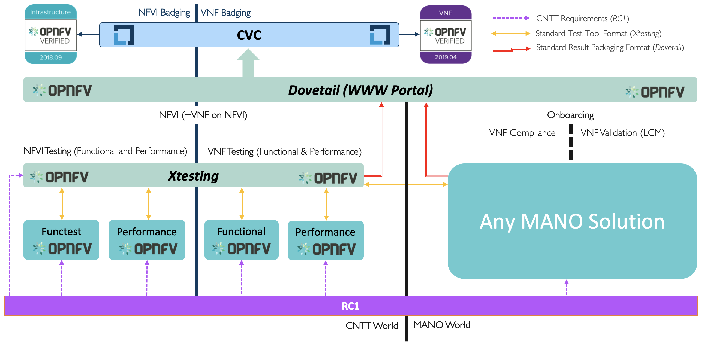

[<< Back](../)

# 1. Introduction

## Table of Contents
* [1.1 Introduction](#1.1)
  * [1.1.1 Terminology](#1.1)
  * [1.1.2 Relation to other communities](#1.1)
* [1.2 Scope](#1.2)
* [1.3 Principles and Guidelines](#1.3)
  * [1.3.1 Overarching Objectives and Goals](#1.3.1)
* [1.4	Best Practices](#1.4)
* [1.5 Verification methodologies](#1.5)
*	[1.6 Assumptions & Dependencies](#1.6)
*	[1.7 Results Collation & Presentation](#1.7)
*	[1.8 Governance](#1.8)
* [x.x Resources & References](#x.x)

## Synopsis

The goal of Reference Conformance (RC) is to ensure the Reference Implementation (RI) of CNTT Reference Architecture (RA) meets industry driven validation to ensure sufficient quality as an Industry Reference. Furthermore RC supports the conformance goals of the OPNFV Verified Program (OVP), by Linux Foundation Networking (LFN) and overseen by the Compliance Verification Committee (CVC).

For the purposes of **conformance**, NFVI testing indicates a measured performance of the adherence to, and demonstrated proficiency of  all Industry agreed aspects of hardware and software implemented Cloud Infrastructure. Similarily, VNFs will be checked for **conformance** against the RM and RA requirements ensuring VNF onboarding, instantiation, stability, and successful removal of the VNF from the implementation of the RI.

In summary, NFVI + VNF testing will be performed for **Validation** and **Conformance** purposes.

- **Validation** is used to indicate testing performed to confirm the actual output of a product meets the expected, or desired outcome, or behaviour per implementation specifications.

- **Conformance** is used to indicate testing performed to confirm the actual output of the product meets the expected, or desired outcome, or behaviour with pass/fail criteria agreed for an Industry badging program.

**All Terms utilized throughout this chapter are intended to align with OVP definitions, and their use through OVP documentation, guidelines, and standards.**

## 1.1 Introduction

**Chapter Purpose** 
This chapter includes process flow, logistics, and requirements which must be satisfied to ensure Network Function Virtualisation Infrastructure (NFVI) meets the design, feature, and capability expectations of VNF developers promoting both the use and scalability of Software Defined Networking (SDN) capabilities.  Upstream projects will define features/capabilities, test scenarios, and test cases which will be used to augment OVP test harnesses for infrastructure verification purposes.  Existing processes, communication mediums, and related technologies will be utilized where feasible.  Ultimately, test results of certified NFVI+VNF will reduce the amount of time and cost it takes each operator to on-board and maintain vendor provided VNFs.

**Objective** 
Perform NFVI+VNF Verification and Validations using CNTT reference architecture, leveraging the existing OPNFV and CVC Intake and Validation Process to onboard and validate new test projects for NFVI compliance.  Upstream projects will define features/capabilities, test scenarios, and test cases to augment existing OVP test harnesses to be executed via the OVP Ecosystem.

**Test Methodology**
- Manifest Verifications (Termed Compliance by CVC) will ensure the NFVI is compliant, and delivered for testing, with hardware and software profile specifications defined by the RM and RA.
- Empirical Validation with Reference Golden VNFs (Termed Validation by CVC) will ensure the NFVI runs with a set of VNF Families, or Classes, to mimic production-like VNF connectivity, for the purposes of interopability checks.
- Candidate VNF Validation (Termed Validation & Performance by CVC) will ensure complete interoperablity of VNF behaviour on the NFVI leverage VVP/VNFSDK test suites.  Testing ensures VNF can be spun up, modified, or removed, on the target NFVI (aka Interoperability).

**Different Distributions**
The three step methodology described above of verifying Manifest compliance, executing Empirical Golden VNF transactions, and performing Interopability Testing is the same validation process regardless of the Distribution used to establish a cloud topology, and the components and services used in the client software stack.  

### 1.1.1 Terminology

Terminology in this document will follow [CNTT Terminology](../../../ref_model/chapters/glossary.md).

## 1.2 Scope

<b>Figure 1-1:</b> RC1 Scope.

This document covers the realisation aspects of conformance of both NFVI and VNFs. The document will cover the following topics:

- Identify in details the Requirements for conformance Framework.
- Identify in details the Requirement of Test Cases (and mapping them to requirements from The Reference Model and The OpenStack Based Reference Architecture ).
- Analysis of existing community projects.
- Propose an E2E Framework for conformance of NFVI and VNFs.
- Playbook of instructions, user manuals, steps of how to perform verification and conformance for both NFVI and VNFs using the proposed E2E Framework.
- Gap analysis to identify where the Gaps are in the industry (tooling, test cases, process, etc).
- Identify development efforts needed to address any gaps identified.

**Not in Scope**
- Functional testing / validation of the application provided by the VNF is outside the scope of this work.
- ONAP is not used in the process flow for NFVI verifications, or validations.
- Upgrades to VNFs, and the respective processes of verifying upgrade procedures and validating (testing) the success and compatibility of upgrades is not in scope.

## 1.3 Relation to other communities

<b>Figure 1-2:</b> RC-1 Relations other communities.

## 1.4 Principles and Guidelines

The objectives of the verification program are to deliver a validated implementation of reference architecture which satisfies infrastructure needs for VNF-developer teams, leveraging the OVP ecosystem as the vehicle for delivering validated NFVI.

These core principles will guide NFV verification deliverables:

### 1.4.1 Overarching Objectives

1. Deliver tools and methods for verifying NFVI capabilities satisfy infrastructure needs of VNFs/CNFs identified in RM and RA.
2. Increase probability that VNFs will on-board and function with minimal problems, or issues, during deployment of the VNF.
4. Increase confidence that VNF performance and capacity can be forecast for given NFVI, prior to deployment of the VNF.
5. Verification tools portable across all RAs.

## 1.5 Testing Best Practices

The following best practices have been adopted to ensure validation procedures are repeatable with consistent quality in RI test results, and RI conformance test suites:

* Test methodologies with exsiting specifications and detailed well documented Test Plan / Test Cases
* Integration with OPNFV Upstream Projects and OVP flow (code, docs, cert criteria, etc.)
* Leverage Network and Service Models, with identified VNF-specific parameters
* Clear pass/fail **conformance** criteria
* Test cases for validating the RI used for **conformance**
* Add addioinal test cases from operators, using in their environment

## 1.6 Performance Test Approach

Prior to onboarding a VNF the infrastructure must be tested in the Network, Compute and Storage domains to ensure that it provides sufficient resources and capabilities for the VNF to behave as expected (i.e. deliver capacity and performance as forecast). Infrastructure vendors are expected to go through extensive testing and optimization at component and stack level prior to testing for **conformance**.

Performance measurements may be extremely sensitive to hardware and software configurations and test methods. Testing should therefore be as realistic as possible i.e. to ensure a test environment that represents a realistic Cloud Infrastructure setup using open-source tools and test VNFs (i.e. workloads) that mimic as much as possible a real VNF consuming available infrastrcuture resources. Test methods that directly measure performance from the perspective of the VNF are more realistic than infering VNF performance by testing "under-the-hood" attributes of the infrastructure. Testing the infrastructre from the viewpoint of the VNF ultimately helps to ensure that behaviour of commercial VNFs will be more predictable and if a commercial VNF does not perform well, the tools, methods and reference results from RC may be very useful for investigating the discrepancy. Furterhmore, test tools that are "stand-alone" and packaged as VNFs can be deployed using the same onboarding methods as a commercial VNFs and hence will be portable across differnt commerical infrastructures.

<b>Figure:</b> Conformance Methodology

## 1.7 Assumptions & Dependencies

**Assumptions** NFVI+VNF testing will be considered **Testable** if the follow qualifiers are present in a test execution, and subsequent result:

* Ability to perform Conformance, or Verification of Artifacts to ensure designs (RM/RA/RI) are delivered per specification

* Ability to Control (or manipulate), manifestations of RM/RA/RI for the purposes to adjust the test environment, and respective cases, scenarios, and apparatus, to support actual test validations

* Ability to monitor, measure, and report, Validations performed against a target, controlled system under test

In addition, respective Entrance criteria is a prerequisite which needs to be satisfied for NFVI+VNF to be considered **Testable**.

**Dependencies** NFVI+VNF verification will rely upon test harnesses, test tools, and test suites provided by upstream OPNFV projects, including dovetaill, yardstick, and Bottleneck. These upstream projects will be reviewed semi-annually to verify they are still healthy and active projects. Over time, the projects representing the conformance process may change, but test parity is required if new test suites are added in place of older, stale projects.

* NFVI+VNF verifications will be performed against well defined instance types consisting of a HW and SW Profile, Configured Options, and Applied Extensions (See image.)

<b>Figure:</b> Instance Type

**NFVI+VNF Instance Type:**
* Standard compute flavours to be tested are defined in [chapter 4.2.1](https://github.com/cntt-n/CNTT/blob/master/doc/ref_model/chapters/chapter04.md#4.2.1)
* Performance profiles come in the form of Basic, Network Intensive, and Compute intensive. Refer to [chapter 2.3](https://github.com/cntt-n/CNTT/blob/master/doc/ref_model/chapters/chapter02.md#2.3) for details on these profiles.

## 1.8 Results Collation & Presentation

Test suites will be categorized as functional or performance based. Results reporting will be communicated as a boolean (pass/fail). The pass/fail determination for performance-based test cases will be made by comparing results against a baseline. Example performance-based metrics include, but are not limited to: resource utilization, response times, latency, and sustained throughput per second (TPS).

**Placeholder to document where results will be posted (e.g. Dovetail dashboards.)**

## 1.9 Governance

1. Conformance badges will be presented by the CVC
2. CVC will maintain requirements for conformance

## x.x Resources & References

1. **OPNFV** https://www.opnfv.org/ - project and community that facilitates a common NFVI, continuous integration (CI) with upstream projects, stand-alone testing toolsets, and a compliance and verification program for industry-wide testing and integration to accelerate the transformation of enterprise and service provider networks. 
2. **CVC** https://wiki.lfnetworking.org/display/LN/Compliance+and+Verification+Committee - members-driven committee within LF Networking that recommends policies and oversight for compliance and conformance program to the Governing Board of LF Networking (“Governing Board”).
3. **Conducting OVP Testing with Dovetail** https://docs.opnfv.org/en/stable-danube/submodules/dovetail/docs/testing/user/userguide/testing_guide.html
4. **Dovetail**
   1. Framework https://wiki.opnfv.org/display/dovetail/Dovetail+Test+Case+Requirements
   2. Test Plan: https://wiki.opnfv.org/display/dovetail/Dovetail+%28Danube%29+Documentation+for+Review?preview=/11698759/11698757/User%20Guide.pdf
   3. TCs:
      1. https://wiki.opnfv.org/display/dovetail/Dovetail+%28Danube%29+Documentation+for+Review
      2. Called by functest (repo): https://github.com/opnfv/dovetail/tree/master/etc/testcase
      3. Per OVP release in the release notes:
        1. https://docs.opnfv.org/en/stable-fraser/submodules/dovetail/docs/release/release-notes/index.html
       2. https://docs.opnfv.org/en/stable-danube/submodules/dovetail/docs/release/release-notes/index.html
5. **Overall documentation** is on docs.opnfv.org for the corresponding Fraser and Danube releases
   1. https://docs.opnfv.org/en/stable-fraser/testing/testing-user.html (Fraser)
   2. https://docs.opnfv.org/en/stable-fraser/testing/testing-dev.html (Fraser)
6. **OPNFV Verification Program** is an open source, community-led compliance and verification program to demonstrate the readiness and availability of commercial NFV products and services, including NFVI and VNFs, using OPNFV and ONAP components (https://www.lfnetworking.org/OVP/).
1. **OVP Whitepaper**: https://www.lfnetworking.org/resources/2019/04/03/ovp:-opnfv-verification-program/
1. **What is Verification And Validation In Software Testing**: [https://www.softwaretestingmaterial.com/verification-and-validation/](https://www.softwaretestingmaterial.com/verification-and-validation/)
1. **Verification vs Validation**: [http://softwaretestingfundamentals.com/verification-vs-validation/ ](http://softwaretestingfundamentals.com/verification-vs-validation/  )
1. **Verification/Validation/Conformance**: [https://users.ece.cmu.edu/~koopman/des_s99/verification/](https://users.ece.cmu.edu/~koopman/des_s99/verification/ )
1. _IOPS - I/O (Input/Output) operations per second_, by Vangie Beal.  Retrieved from https://www.webopedia.com/TERM/I/IOPS.html on 9/18/2019.
2. _The ultimate IOPS cheat sheet!_, by Bas van Kaam.  Retrieved from https://www.basvankaam.com/2014/07/29/the-ultimate-iops-cheat-sheet/ on 9/18/2019.
3. _An explanation of IOPS and latency_, by Dimitris Krekoukias.  Retrieved from http://recoverymonkey.org/2012/07/26/an-explanation-of-iops-and-latency/ on 9/18/2019.
