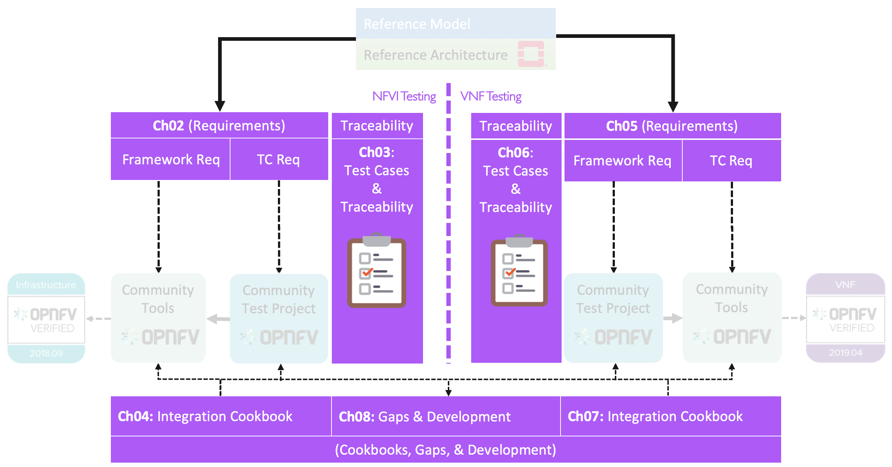

[<< Back](../)

# 1. Introduction

## Table of Contents
* [1.1 Summary](#1.1)
* [1.2 Scope](#1.2)
* [1.3 Principles and Guidelines](#1.3)
  [1.4	Performance Testing](#1.4)
*	[1.5 Assumptions & Dependencies](#1.5)
*	[1.6 Governance of Conformance Programs](#1.6)
* [x.x Resources & References](#x.x)

## 1.1 Summary

This chapter describes the objectives, methods and scope of RC as well as requirements process to ensure teh goals for Reference Conformance (RC) are met. The goal of RC is to ensure that the capabilties of an implmentation of the CNTT Reference Architecture (RA),  inluding CNTT Reference Implementations, achieve minimum acceptable criteria as deemed necessary by CNTT and are testable as part of a conformance program. RC supports the goals of the LOPNFV Verified Program (OVP), by Linux Foundation Networking (LFN) and overseen by the Compliance and Verification Committee (CVC). Where ever possible existing mehods,frameworks and tests will be utilized.

Exhaustive validation of CNTT reference implementations that ensure predicatble behavior and high quality of CNTT references are out of scope of RC and is the responsibility of RI. Validation of the RI may include smoke tests, soak tests, security tests and many other aspects of proficiency relevant to Cloud Infrastructure including criteria and tests dveloped in upstream projects. 

CNTT specifications focus on Cloud Infrastructure and therefore RC is predominantly concerned with the behaviour of infrastructure elements and how infrastructure resources are consumed by VNF/CNFs. 

**Terminology**

Terminology in this document will follow [CNTT Terminology](../../../ref_model/chapters/glossary.md).

## 1.2 Scope

<b>Figure 1-1:</b> RC1 Scope.

This document covers conformance of Cloud Infrastructure and VNFs with respec to their consumption of infrastructure resources. The document will cover the following topics:

- Identify requirements for conformance framework.
- Identify requirements of conformance tests mapped to the Reference Model and The OpenStack Based Reference Architecture.
- Approach to conformance testing using the proposed test framework.
- Identify gaps in availble tooling, test cases, process, etc.

**Not in Scope**
- Functional testing / validation of the application provided by the VNF is outside the scope of this work.
- Tesetin of orchestration elements (e.g. ONAP).
- VNFs capabilites other than consumption of Cloud infrastructure resources.

## 1.3 Principles and Guidelines

The conformance program served by RC aims to deliver a framework and tests for OVP. OVP aims to 
1. Deliver tools and methods for verifying NFVI capabilities satisfy infrastructure needs of VNFs/CNFs identified in RM and RA.
2. Increase probability that VNFs will on-board and function with minimal problems, or issues, during deployment of the VNF.
4. Increase confidence that VNF performance and capacity can be forecast for given NFVI, prior to deployment of the VNF.

Best practices should ensure procedures are repeatable with consistent quality:
* Use exsiting specifications and detailed well documented Test Plan / Test Cases
* Add addioinal test cases where needed
* Integrate with Upstream Projects and OVP process (code, docs, cert criteria, etc.)
* Have clear pass/fail criteria

## 1.4 Performance Testing

Prior to onboarding a VNF the infrastructure must be tested in the Network, Compute and Storage domains to ensure that it provides sufficient resources and capabilities for the VNF to behave as expected (i.e. deliver capacity and performance as forecast). Infrastructure vendors are expected to go through extensive testing and optimization at component and stack level prior to testing for **conformance**.

Performance measurements may be extremely sensitive to hardware and software configurations and test methods. Testing should therefore be as realistic as possible i.e. to ensure a test environment that represents a realistic Cloud Infrastructure setup using open-source tools and test VNFs (i.e. workloads) that mimic as much as possible a real VNF consuming available infrastrcuture resources. Test methods that directly measure performance from the perspective of the VNF are more realistic than infering VNF performance by testing "under-the-hood" attributes of the infrastructure. Testing the infrastructre from the viewpoint of the VNF ultimately helps to ensure that behaviour of commercial VNFs will be more predictable and if a commercial VNF does not perform well, the tools, methods and reference results from RC may be very useful for investigating the discrepancy. Furterhmore, test tools that are "stand-alone" and packaged as VNFs can be deployed using the same onboarding methods as a commercial VNFs and hence will be portable across differnt commerical infrastructures.

<b>Figure:</b> Conformance Methodology

## 1.5 Assumptions & Dependencies

**Assumptions** NFVI+VNF testing will be considered **Testable** if the follow qualifiers are present in a test execution, and subsequent result:

* Ability to perform Conformance, or Verification of Artifacts to ensure designs (RM/RA/RI) are delivered per specification

* Ability to Control (or manipulate), manifestations of RM/RA/RI for the purposes to adjust the test environment, and respective cases, scenarios, and apparatus, to support actual test validations

* Ability to monitor, measure, and report, Validations performed against a target, controlled system under test

In addition, respective Entrance criteria is a prerequisite which needs to be satisfied for NFVI+VNF to be considered **Testable**.

**Dependencies** NFVI+VNF verification will rely upon test harnesses, test tools, and test suites provided by upstream OPNFV projects, including dovetaill, yardstick, and Bottleneck. These upstream projects will be reviewed semi-annually to verify they are still healthy and active projects. Over time, the projects representing the conformance process may change, but test parity is required if new test suites are added in place of older, stale projects.

* NFVI+VNF verifications will be performed against well defined instance types consisting of a HW and SW Profile, Configured Options, and Applied Extensions (See image.)

<b>Figure:</b> Instance Type

**NFVI+VNF Instance Type:**
* Standard compute flavours to be tested are defined in [chapter 4.2.1](https://github.com/cntt-n/CNTT/blob/master/doc/ref_model/chapters/chapter04.md#4.2.1)
* Performance profiles come in the form of Basic, Network Intensive, and Compute intensive. Refer to [chapter 2.3](https://github.com/cntt-n/CNTT/blob/master/doc/ref_model/chapters/chapter02.md#2.3) for details on these profiles.

## 1.6 Governance of Conformance Program
CVC is responsible for governance and process of LFN conformance programs

## x.x Resources & References

1. **OPNFV** https://www.opnfv.org/ - project and community that facilitates a common NFVI, continuous integration (CI) with upstream projects, stand-alone testing toolsets, and a compliance and verification program for industry-wide testing and integration to accelerate the transformation of enterprise and service provider networks. 
2. **CVC** https://wiki.lfnetworking.org/display/LN/Compliance+and+Verification+Committee - members-driven committee within LF Networking that recommends policies and oversight for compliance and conformance program to the Governing Board of LF Networking (“Governing Board”).
3. **Conducting OVP Testing with Dovetail** https://docs.opnfv.org/en/stable-danube/submodules/dovetail/docs/testing/user/userguide/testing_guide.html
4. **Dovetail**
   1. Framework https://wiki.opnfv.org/display/dovetail/Dovetail+Test+Case+Requirements
   2. Test Plan: https://wiki.opnfv.org/display/dovetail/Dovetail+%28Danube%29+Documentation+for+Review?preview=/11698759/11698757/User%20Guide.pdf
   3. TCs:
      1. https://wiki.opnfv.org/display/dovetail/Dovetail+%28Danube%29+Documentation+for+Review
      2. Called by functest (repo): https://github.com/opnfv/dovetail/tree/master/etc/testcase
      3. Per OVP release in the release notes:
        1. https://docs.opnfv.org/en/stable-fraser/submodules/dovetail/docs/release/release-notes/index.html
       2. https://docs.opnfv.org/en/stable-danube/submodules/dovetail/docs/release/release-notes/index.html
5. **Overall documentation** is on docs.opnfv.org for the corresponding Fraser and Danube releases
   1. https://docs.opnfv.org/en/stable-fraser/testing/testing-user.html (Fraser)
   2. https://docs.opnfv.org/en/stable-fraser/testing/testing-dev.html (Fraser)
6. **OPNFV Verification Program** is an open source, community-led compliance and verification program to demonstrate the readiness and availability of commercial NFV products and services, including NFVI and VNFs, using OPNFV and ONAP components (https://www.lfnetworking.org/OVP/).
1. **OVP Whitepaper**: https://www.lfnetworking.org/resources/2019/04/03/ovp:-opnfv-verification-program/
1. **What is Verification And Validation In Software Testing**: [https://www.softwaretestingmaterial.com/verification-and-validation/](https://www.softwaretestingmaterial.com/verification-and-validation/)
1. **Verification vs Validation**: [http://softwaretestingfundamentals.com/verification-vs-validation/ ](http://softwaretestingfundamentals.com/verification-vs-validation/  )
1. **Verification/Validation/Conformance**: [https://users.ece.cmu.edu/~koopman/des_s99/verification/](https://users.ece.cmu.edu/~koopman/des_s99/verification/ )
1. _IOPS - I/O (Input/Output) operations per second_, by Vangie Beal.  Retrieved from https://www.webopedia.com/TERM/I/IOPS.html on 9/18/2019.
2. _The ultimate IOPS cheat sheet!_, by Bas van Kaam.  Retrieved from https://www.basvankaam.com/2014/07/29/the-ultimate-iops-cheat-sheet/ on 9/18/2019.
3. _An explanation of IOPS and latency_, by Dimitris Krekoukias.  Retrieved from http://recoverymonkey.org/2012/07/26/an-explanation-of-iops-and-latency/ on 9/18/2019.
