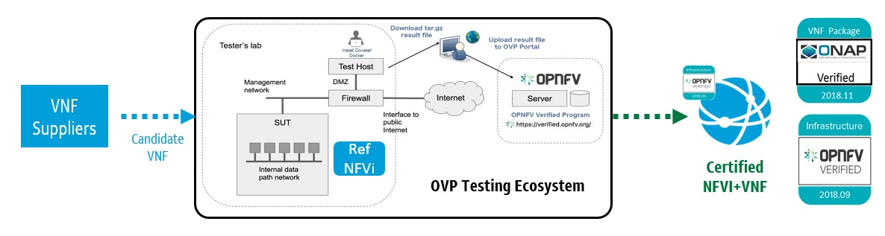
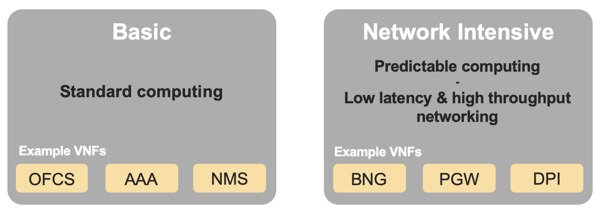
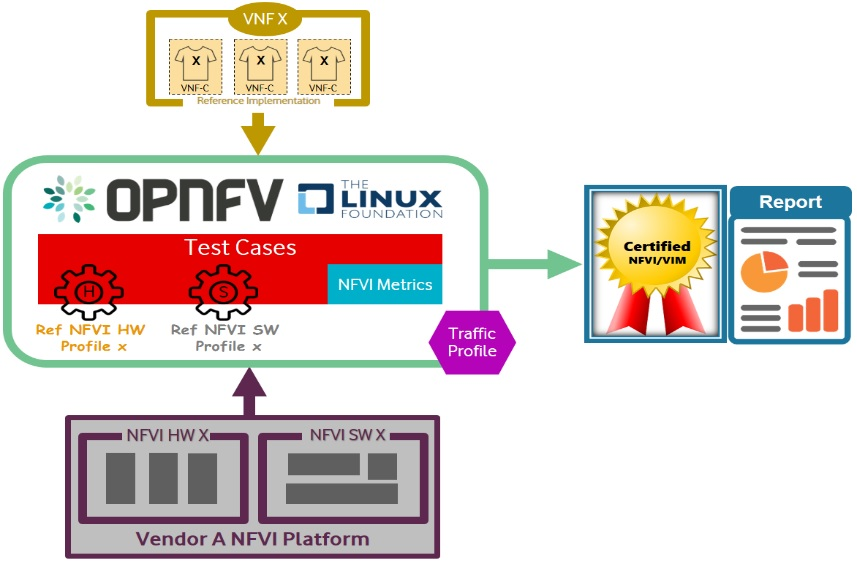

[<< Back](../)

# 2. NFVI E2E C&V Framework Requirements

## Table of Contents
* [2.1 Introduction](#2.1)
* [2.1.1 RI and RC CI/CD toolchains](#2.1.1)
* [2.2 Methodology](#2.2)
* [2.3 Certification Strategy & Vehicle](#2.3)
* [2.4 Profiles Reference](#2.4)
* [2.5 Compliance, Verification, and Certification](#2.5)
* [2.6 Entry & Exit Criteria](#2.6)
* [2.7 Frameworks](#2.7)
  * [2.7.1 Best Practices (General)](#2.7.1)
  * [2.7.2 Testing](#2.7.2)
    * [2.7.2.1 Test Categories](#2.7.2.1)
    * [2.7.2.2 Test Harnessess](#2.7.2.2)
    * [2.7.2.3 Test Results](#2.7.2.3)
  * [2.7.3 Badging](#2.7.3)

## Synopsis:
Ensure Reference Implementation (RI) of CNTT Reference Model (RM) and CNTT Reference Architecture (RA) meets industry driven quality assurance standards for compliance, verification and validation. The OPNFV Verified Program (OVP), by Linux Foundation Networking (LFN), overseen by the Compliance Verification Committee (CVC), will provide tracking and governance for RM/RA verification whereas CNTT will provide the badging for NFVI certification in accordance with the certification process as explained in this chapter.

For the purposes of this chapter, NFVI+VNF testing will be performed for Verification, Validations, ultimately leading to Certifications indicating a measured performance of the adherence to, and demonstrated proficiency with, all aspects of software delivery including but no limited to planning, logistics for communication, and testing of installed, or implemented, NFVI. Similarily, VNFs will be checked for Compliance and Validations against the RM and RA requirements ensuring VNF instantiation, stability, and successful removal of the VNF from the implementation of the stated architecture. The additional VNF testing will verify that the developed VNF meets prescribed RM/RA infrastructure standards.

In summary, NFVI+VNF testing will be performed for Verification and Validation purposes.

Verification will be used to indicate conformance to design requirement specifications. Activities involved Reviews and Walk-Throughs to ensure the NFVI is delivered per implementation specifications.

Validations is used to indicate testing performed to confirm the actual output of a product meets the expected, or desired outcome, or behavior.

All Terms utilized throughout this chapter are intended to align with CVC definitions, and their use through CVC documentation, guidelines, and standards. This chapter will outline the Requirements, Process, and Automation, needed to deliver NFVI Certification.

## 2.1 Introduction
NFVI (Network Functions Virtualization Infrastructure) refers to the physical resources (compute, storage and network) on which virtual network functions (VNFs) are deployed. As such, the performance of a VNF depends on the underlying NFVI over which it is hosted. A certain VNF may perform good in one hardware and may perform worst in another. Thus, a need arises to certify NFVI that can help in onboarding VNFs onto a hardware with an acceptable level of VNF performance. Certain frameworks like [yardstick](https://github.com/opnfv/yardstick), [vsperf](https://github.com/opnfv/vswitchperf) etc. provide a set of tests that can be run on a hardware to obtain Key Performance Indicators (KPIs) which give a measurable output of the NFVI's performance. With these KPIs, a decision can be made on the VNFs that can offer an acceptable level of performance when on-boarded on the NFVI.

### 2.1.1 CNTT RI and RC toolchains

[OPNFV](https://www.opnfv.org/) has built a complete CI/CD toolchain
continuously deploying and testing NFVI. It's composed of centralized
components de facto used by the CNTT RI hosted by OPNFV
([CIRV](https://wiki.opnfv.org/pages/viewpage.action?pageId=47284396)).

As for all OPNFV installer projects,
[Jenkins](https://build.opnfv.org/ci/view/cntt/) triggers CIRV deployments,
runs the OPNFV test cases part of the NFVI verification and then publishes all
test results in the
[centralized test database](https://docs.opnfv.org/en/stable-hunter/_images/OPNFV_testing_working_group.png)
and all artifacts (reports, logs, etc.) to
[an S3 compatible storage service](http://artifacts.opnfv.org/).

The CNTT compliance and certification processes should benefit from the OPNFV
testing history and then must conform to this overall toolchain design
without reinventing the wheel. The RC toolchain only requires for the local
deployment of the components instead of leveraging on the common OPNFV
centralized services. But the interfaces remain unchanged mainly leveraging on
jenkins jobs, the common test case execution, the test result DB and the S3
protocol to publish the artifacts. It's worth mentioning that dumping all
results and logs required by certification is already in place in CIRV (see
[cntt-latest-zip](https://build.opnfv.org/ci/job/cntt-latest-zip/)) and
Functest daily jobs (see
[functest-hunter-zip](https://build.opnfv.org/ci/job/functest-hunter-zip/3/console))

It should be noted that
[Xtesting CI](https://galaxy.ansible.com/collivier/xtesting) supports both
centralized and distributed deployment models as described below. It has
deployed the full toolchain in one small virtual machine to verify ONAP Openlab
via Functest.

## 2.2 Methodology
The NFVI provided by hardware vendors is consumed or used by VNFs via APIs exposed by Virtualised Infrastructure Manager (VIM). The resources created by VIM on the NFVI use the underlying physical hardware (compute, storage and network) either directly or indirectly. CNTT recommends RA1/RA2 to be used as a reference architecture for NFVI certification. This  would provide a set of standard interaces to create resources on NFVI. Below step by step process illustrates the NFVI certification methodology:
* CNTT RA1/RA2 is deployed on NFVI that needs to be certified.
* A set of tests are run on NFVI to determine the NFVI readiness for certification process.
* Golden KPIs are taken as a reference.
* A set of tests are run on the target NFVI (target for certification).
* KPIs obtained from the target NFVI are collected and submitted to certification portal.
* The NFVI KPIs are reviewed and compared with Golden KPIs to determine if the certification badge is to be provided to NFVI or not.
* Perform VNF interoperability verifications against an implementation of CNTT reference architecture, leveraging existing OPNFV Intake Process. Upstream projects will define features/capabilities, test scenarios, and test cases to augment existing OVP test harnesses to be executed via the OVP Ecosystem. Third-party test platforms may also be leveraged, if desired.

<b>Figure:</b> Certification Methodology

Verification Methodologies to be implemented, from a process perspective include:
* Engineering package validations will be performed against targeted infrastructure/architecture.
* Configuration settings/features/capabilities will be baseline.
* Entrance Criteria Guidelines will be satisfied prior to OPNFV verification (i.e. Supplier needs to submit/agree/conform)
  * Conform to CNTT RM
  * Conform to CNTT RA
  * Submit standard documentation
  * Adhere to security compliance
* Exit Criteria Guidelines will be satisfied prior to issuance of OPNFV compliance badges.
  * Certification for Tenants (OVP Ecosystem)
  * Operational Considerations (Telco Perspective)
  * End User Considerations (Telco Perspective)
* Test runs using reference model VNFs will validate RA chosen by the VNF-supplier meets developer needs.
* Verification decisions will be based on data. Test harness is compatible, or conforms to testing against standard interfaces and services.
* VNF functionality easily tested with addition of Supplier Apparatus.
* Leverage test harnesses from existing open source projects where practical, and applicable.

## 2.3 Certification Strategy & Vehicle
In order to begin the certification process, NFVI needs to be validated and expected to be in a required state. This state would be determined by running tests as described in CNTT RI. Once the target NFVI passes these tests, it would become a candidate for NFVI certification. If NFVI fails the tests, it will not be move to next workflow for certification. NFVI+VNF validations consist of a three part process for Compliance, Validation, and Performance. Adherence to Security standards are equally important and addressed in [Chapter 7 of CNTT RM](../../../ref_model/chapters/chapter07.md).

The three part verificaiton process includes NFVI Manifest Validations, Emprical Baseline measurements against targeted VNF families, and Candidate VNF verifications. More specifically,
* NFVI Verification (Compliance): NFVI is the SUT, ensuring NFVI is compliant with specs of RM and RA accomplished with Manifest Validations (performed via Echo Tests)
* Empirical Validation with Reference VNF (Validation): NFVI is the SUT, ensuring NFVI runs with Golden VNFs and is instrumented to objectively validate resources through consumption and measurement
* Candidate VNF Certification (Validation & Performance): VNF is the SUT, ensuring VNFs operate with RM and RA leveraging VVP/CVP/VFNSDK Test Suites
* Security: Ensures NFVI+VNF is free from known security vulnerabilities, utilizing industry standard cyber security frameworks (Refer to CNTT Chapter 7 Security for additional test/verification details)
Validations are performed against an Infrastructure Profile Catalog, VNF performance profile, and targeted VNF class or family for baseline measurements.

The Infrastructure Profile Catalog contains the following attributes:

* Profile is a collection of (limited) options offered by the infrastructure to the VNF
  * Capabilities
  * Metrics
  * Compute flavors
  * Interface options
  * Storage extensions
  * Acceleration capabilities
* Profiles are offered to VNFs as an instance types with predefined compute flavors.
  * A particular set of options is an instance type
  * Compute flavors: S, M, L
* VNF performance profiles, for which NFVI validations will support and be verified against, are defined as basic, network intensive, and compute intensive. Details for each of these profiles can be found in chapter 2.3.

<b>Figure:</b> NFVI Profiles

Targeted VNF Classes/Families for baseline measurements are described in chapter XXXX.

## 2.4 Profiles Reference
Different vendors have different types of VNFs to serve different use-cases. A VNF like Broadband Network Gateway (BNG) would require high networking throughout whereas a VNF like Mobility Management Entity (MME) woud require high computing performance. As such, BNG would require high KPI values for network throughput and MME would require high CPU performance KPIs like Index Score, Instructions Per Second (IPS) etc. The target NFVI to cater these needs woud have different characteristics. Depending on VNF's requirements, the NFVI can be categorised into below profiles:
* Basic (B) profile for standard computing
* Compute intensive (C) profile where predictable computing performance is expected and
* Network intensive (N) profile offerring low latency and high networking throughout
Similarly, different NFVI vendors may specialise in different hardware profiles and some may specialise in both VNFs and NFVI.

To cater to different needs from multiple NFVI vendors, CNTT allows different types of NFVI certification based on their types of [profile](../../../ref_model/chapters/chapter02.md#2.3)
 * Certify Vendor NFVI Hardware solution: This allows for certification of only NFVI.
 * Certify Vendor NFVI Hardware and Software Solution: This allows for certification for NFVI running a particular VNF.

## 2.5 Compliance, Verification, and Certification
The below set of steps define the compliance, verification and certification process for NFVI
* Based on VNF's requirements, NFVI profile is selected - B, C, N
* NFVI readiness is checked for certification.
* The test VNFs are on-boarded using automation scripts on the NFVI.
* VNF on-boarding is validated by running functional tests to ensure that the on-boarding is successful.
* VNF performance tests are executed and NFVI KPIs are recorded during the tests.
* KPI comparison is run to compare NFVI KPIs with Golden KPIs, which serve as a reference for NFVI certification.
* If NFVI KPIs meet Golden KPIs, NFVI is certified and granted a certification badge.
* If NFVI KPIs do not meet Golden KPIs, no certification is provided.

<b>Figure:</b> Reference NFVI Profiles Implementation

## 2.6 Entry & Exit Criteria
**Entry criteria**: Before entering into NFVI certification, NFVI needs to satisfy the following requirements as entry pass:
* Design & Requirements
  * Design, Configuration, Features, SLAs, and Capability documentation complete
  * Users stories / Adherence to CNTT Model principles and guidelines
  * Chosen Reference Architecture Matches a Reference Architecture from the product catalog
* Environment
  * Lab assets/resources and respective software revision levels are specified, with confirmation of compatibility across external systems
  * Tenant needs identified
  * All connectivity, network, image, VMs, delivered with successful pairwise tests
  * Lab instrumented for proper monitoring
  * Lab needs to be setup according to RA1/RA2 as defined by CNTT and should be in the NFVI required state.
* Planning & Delivery
  * Kickoff / Acceptance Criteria reviews performed
  * Delivery commitments, timelines, and cadence accepted
  * Confirm backward compatability across software/flavor revision levels
* Data/VNFs/Security
  * Images, Heat Templates, Preload Sheets available
  * Images uploaded to tenant space
  * External system test data needs identified
  * Owners (NFVI, VNF, PTL, etc) documented
  * Security Compliance Satisfied (Refer to CNTT Chapter XXXX Security for additional tests, scans, and vulnerabilities validations)
* Test Case Contributions
  * VNF Developer/Supplier validations to be performed documented and supplied
  * NFVI validations to be performed supplied (e.g. echo, manifest)
  * Test to ensure users are added and have correct privileges for the tenant
  * Test to ensure quota against submitted request for the respective tenant
  * Test to ensure custom flavours against submitted request for respective tenants

**Exit criteria**: NFVI certification testing should completed with following exit criteria:
* All mandatory test cases should pass.
* Test results collated, centralized, and normalized, with a final report generated showing status of the test scenario/case (e.g. Pass, Fail, Skip, Measurement Success/Fail, etc), along with traceability to a functional, or non-functional, requirement.

## 2.7 Frameworks
The NFVI certification framework deals with the process of testing NFVI in below three areas:
* Compliance: The NFVI needs to comply to CNTT RA1/RA2.
* Validation: Validation deals with the ability of NFVI to respond to Cloud APIs and interfaces.
* Performance: Performance deals with running tests on NFVI depending on the NFVI profile and collecting KPIs.

The NFVI KPIs are compared with Golden KPIs, which serve as a reference for NFVI certification. If NFVI KPIs meet Golden KPIs, NFVI is certified and granted a certification badge. If NFVI KPIs do not meet Golden KPIs, no certification badge is provided.

### 2.7.1 Best Practices (General)
The NFVI certification framework will be guided by the following core principles:
-   Implementing, and adhering to, Standardized Test Methodology / flow, Test Plan, and Test Case Suites, which promotes scalability using repeatable processes.
-   Integration with Automated Tool-Chains, such as XTesting or Dovetail, for continuous deployment, validation, and centralization of test harnesses and results visualization.
- Alliance and execution of OVP flows and methodologies, which supports common structures for code, artifact generation and repository, certification criteria, etc.)
-   Where possible, leveraging ONAP Network and Service Models, with identified VNF-specific parameters
-   Utilizing Standard certification criteria.
-   Defining CNTT reference architecture (RA) as scenarios, and having all test cases for the RA be involved in OVP (could also be addressed in OVP as CNTT test)
-   Add test cases from operators, which operators already tested in their environment

### 2.7.2 Testing
Testing for NFVI certification falls under three broad categories - Compliance, Validation and Performance. Target NFVI for certification needs to pass all these tests in order to obtain the certification badge.

#### 2.7.2.1 Test Categories
The following five test categories have been identified as **minimal testing required** to verify NFVI interoperability to satisfy the needs of VNF developer teams.
 1. Baremetal validation: To validate control and compute nodes hardware
 2. VNF Interoperability: After VNFs are on-boarded, openstack resources like Tenant, Network (L2/L3), CPU Pining, security policies, Affinity anti-affinity roles and flavors etc. would be validated.
 3. Compute components: Validate VMs status and connectivity result after performing each of listed steps. Best candidate for this testing would be identify compute node that holds VMs which has L2 and L3 connectivity.
 4. Control plane components: Validations for RabbitMQ, Ceph, MariaDB etc. and OpenStack components like Nova/Glance/Heat etc. APIs.
 5. Security: Validation for use RBAC roles and user group policies. See [Chapter 7](./chapter07.md) for complete list.

The following **Optional Test Categories** which can be considered by the Operator, or Supplier, for targeted validations to complement required testing for certification:

 - On-Boarding (MANO agnostic)
 - VNF Functional Testing
 - Charging / Revenue Assurance Verification
 - MicroServices Support
 - Closed Loop Testing
 - VNF Coexistence (ETSI NFV-TST001 “Noisy Neighbor”)
 - VNF Interactions with Extended NFVi Topology
 - VNF Interactions with Complex NFVi (Akraino)
 - Scalability Testing
 - HA Testing
 - Fault Recovery Testing
 - PM/KPI/Service Assurance Testing

#### 2.7.2.2 Test Harnesses
In addition to General Best Practices for NFVI certification, the following Quality Engineering (QE) standards will be applied when defining and delivering test scenarios for certification:  
1.  Standardized test methodologies / flows capturing requirements from RA's, goals and scenarios for test execution, and normalizing test results.
2.  Establishing, and leveraging, working test-beds which can be referenced in subsequent test scenario designs.  
3.  Leveraging standardized cloud-based facilities such as storage, IAM, etc.
4.  Test Script libraries need to enable Data-Driven testing of On-Boarding, Instantiation, etc.
5.  Standards base Test Plan and Test Case suite needs to include sample VNFs, CSAR, and Automated Test Cases.
6.  Documentation needs to be dynamic, and consumable.
7.  Harnesses need to apply a “Just add Water” deployment strategy, enabling test teams to readily implement test harnesses which promotes certification scalability.

#### 2.7.2.3 Test Results

**Categorization**.  Test suites will be categorized as Functional/Platform or Performance based.  

**Results.** Test results reporting will be communicated as a boolean (pass/fail), or Measurements Only.  

 - **Functional Pass/Fail** signals the assertions set in a test script verify the Functional Requirements (FR) has met its stated objective as delivered by the developer. This will consist of both positive validation of expected behavior, as well as negative based testing when to confirm error handling is working as expected.
 - **Performance-based Pass/Fail** determination will be made by comparing Non-Functional (NFR) NFVI KPIs (obtained after testing) with the Golden KPIs. Some of the examples of performance KPIs include, but not limited to: TCP bandwidth, UDP throughput, Memory latency, Jitter, IOPS etc. See [Chapter 4 of RM](../../../ref_model/chapters/chapter04.md) for a complete list of metrics and requirements.
 - **Measurement Results**.  Baseline Measurements will be performed when there are no benchmark standards to compare results, or established FRs/NFRs for which to gauge application / platform behavior in an integrated environment, or under load conditions.  In these cases, test results will be executed to measure the application, platform, then prepare FRs/NFRs for subsequent enhancements and test runs.  

 **Collation | Portal**.  The following criteria will be applied to the collation and presentation of test-runs seeking NFVI certification:   

 - RA number and name (e.g. RA-1 OpenStack)
 - Version of software tested (e.g. OpenStack Ocata)
 - Normalized results will be collated across all test runs (i.e. centralized database)
 - Clear time stamps of test runs will be provided.
 - Identification of test engineer / executor.
 - Traceability to requirements.
 - Summarized conclusion if conditions warrant test certification (see Badging Section).
 - Portal contains links to certification badge(s) received.

### 2.7.3 Badging
**Defined**.  _Badging_ refers to the granting of a certification badge by the OVP to Suppliers/Testers of CNTT NFVI upon demonstration the testing performed confirms:

 - NFVI adheres to CNTT RA/RM requirements.
 - CNTT certified VNFs functionally perform as expected (i.e. test cases pass) on NFVI with acceptable levels of stability and performance.

The below figure shows the targetted badge for NFVI.

<b>Figure:</b> NFVI badge

**Specifics**.  More specifically, suppliers of NFVI testing seeking infrastructure certification are required to furnish the following:

|Category|OVP/CVC Expectation|Supporting Artifact(s)|
|--|--|--|
|Lab|Verification that the delivered test lab conforms to RI-x lab requirements for topology, # of nodes, network fabric, etc|Bare-metal H/W Validations|
|Compliance|Verification that the installed software conforms to RM/RA requirements for required components and configured options and extensions, etc|Manifest S/W Validations|
|Validation|FR Validation of Component and API functional behavior meets requirements specified in RM/RA-x requirements documents|API & Platform Test Results|
|Performance|NFR Validation of Component, Interface, and API, results are within tolerance, or achieve baseline measurements|Performance Test Results|
|Results Reporting|Published of Test Results into centralized and common repository and reporting portal|Normalized Results per Standards|
|Release Notes|Supplier provides concluding remarks, links to artifacts, and demonstration of having met exit criteria for testing|Release Notes

**Certification Process**.  
Certification and issuance of NFVI badges will be as follows:
 - NFVI supplier utilizes, or installs a target RM/RA-x certified RI lab.
 - Required artifacts are submitted/supplied to the OVP, demonstrating proper Lab Installation, Compliance, Validation, Performance, and Release of Results & Known Issues.
 - Artifact validations will be corroborated and confirmed by the OVP. with direct comparison between measured results and documented FRs/NFRs for applications, hardware and software configuration settings, and host systems.
 - All OVP inquiries, requests for re-tests, or reformatting / re-uploading of results data are closed.

<b>Figure:</b> NFVI Badges

