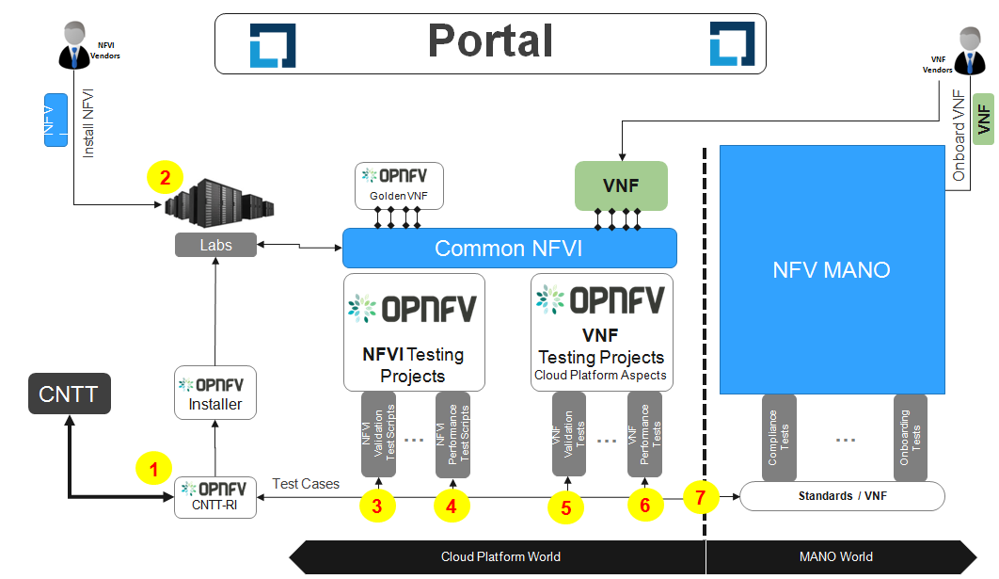
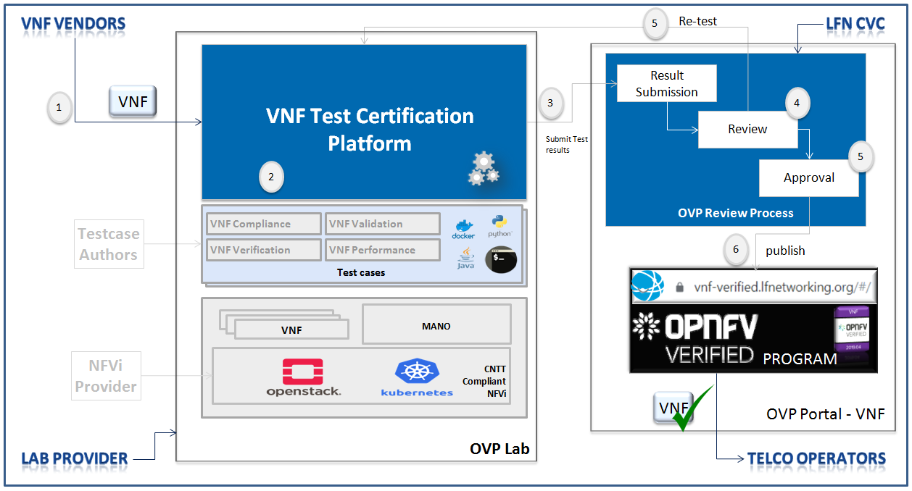

[<< Back](../)

# 5. VNF E2E C&V Framework Requirements

## Table of Contents

* [5.1 Introduction](#5.1)
* [5.2 Certification Methodology](#5.2)
 * [5.2.1 Profiles Reference](#5.2.1)
 * [5.2.2 Protoype VNFs](#5.2.2)
* [5.3 Badging Requirements](#5.3)
 * [5.3.1 Badging Scope](#5.3.1)
 * [5.3.2 Entry Criteria](#5.3.2)
 * [5.3.3 Exit Criteria](#5.3.3)
* [5.4 VNF Test Certification platform](#5.4)

### 5.1 Introduction
This chapter covers comprehensive VNF certification requirements for enabling
required process and steps to provide VNF badging based on define scope of
compliance and validation. This includes end to end test framework requirements,
badging entry and exit criteria, profiles to reference, different stake holders
and certification Methodologies by using certified NFVi under NFVi badging program.

### 5.2 Certification Methodology

It defines the end-end framework and process required for certifying  the given
VNF.

**End-End framework**:

Here, the steps 1-4 are NFVI related steps are covered in detail in the
[RC NFVi chapters](./chapter02.md).

Step-5.	Interoperability validations for VNF functional testing defined.

Step-6.	Interoperability validations for VNF performance testing defined (IOPS,
  connection, threading, resource consumption).

Step-7.	Sending requirements to the VNF requirements projects in terms of t-shirt
sizes, config settings, required for VNF/orchestration validation.

**Certification flow**:

The entry and exit criteria defined in below section are pre-requisities for
this flow.

1. *VNF Vendors* submit the VNF into OVP Lab for certification (Fulfilling
  the entry  criteria is pre-requisities for this step.)

2. As part of OVP lab, already required test cases, test tools, eco-system like
MANO and appropriate certified NFVi to be setup as defined part of entry criteria.
This lab could either either *OVP 3rd party lab* or *VNF vendors*.

3. Once testing is completed done, test results will be submitted to the
OVP portal for community review along with additional information such as product name,
 documentation links, primary company contact information, etc.

4. *LFN CVC* community team reviewers will review the results  submitted and will
approve or reject it based the details provided.

5.  If reviewer rejected it, then step 2 and 3 will be ran again to address the
review comments. Otherwise Once reviewer approved it, corresponding VNF will be
published into OVP VNF Portal with OVP badge.

6. LFN staff will provide the certificate badge graphics and graphical usage guidelines.  
The OVP portal will reflect LFN's disposition and assignment of the certified VNF badge.

Now VNF is ready and *Telco Operators* can start consume it.

### 5.2.1 Profiles Reference

The NFV Infrastructure (NFVI) is the totality of all hardware and software components
 which build up the environment in which VNFs are deployed, managed and executed.
 It is, therefore, inevitable that different VNFs would require different
 capabilities and have different expectations from it. so One of the main targets of
 the CNTT is to define an agnostic NFVI and removes any dependencies between
 VNFs and deployed Infrastructure (NFVI) and offer NFVI to VNFs in an abstracted way
 with defined capabilities and metrics. This would help operators to host their
 Telco Workload (VNF) with different traffic types, behaviour and from any vendor
 on a unified consistent Infrastructure. so as part of VNF Certification, its
 important to certify the VNF based on profiled defined in
 [reference model](../../../ref_model/chapters/chapter02.md).

In [reference model](../../../ref_model/chapters/chapter02.md), following following
NFVi profiles are proposed as reference:

 - **Basic**: for VNF that can tolerate resource over-subscription and variable latency.

 - **Network Intensive**: for VNF that require predictable computing performance, high network throughput and low network latency.

 - **Compute Intensive**: for VNF that require predictable computing performance and low network latency.

### 5.2.2 Protoype VNFs

A portion of the NFVI badging methodology includes Empirical Validation with Reference Golden VNFs (aka CVC Validation) which will ensure the NFVI runs with a set of VNF Families, or Classes, to mimic production-like VNF connectivity.  These tests are to 1) ensure interoperability checks pass, and 2) there is an established baseline of VNF behaviors and characters before vendor supplied VNFs are tested and certified.  In other words, empirical validations will confirm performance and stability between Platform and VNF, such as validating packet loss is within acceptable tolerances.  

### 5.3 Badging Requirements

**Defined**.  _Badging_  refers to the granting of a certification badge by the OVP to Suppliers/Testers of CNTT NFVI+VNF upon demonstration the testing performed confirms:

-   NFVI adheres to CNTT RA/RM requirements.
-   CNTT certified VNFs functionally perform as expected (i.e. test cases pass) on NFVI with acceptable levels of stability and performance.

Following table shows the bading requirements with scope of mandatory (must) or
optional.

|  Requirement id   |  scope | details
| ----------------- | ------ | --------|
|CVreq.VNF.001 | must | Receive NFVi badge in lab setup per RI-1 standards, performing h/w validations, performing s/w manifest validations, running nfvi compliance, validation, and performance checks |
| CVreq.VNF.002 | must | met all entry and exit criteria |
| CVreq.VNF.003 | must | run interoperability validations, including instantiation, communication / health, and removal |
| CVreq.VNF.004 | shall | utilize automation frameworks to run all required tests. certification process would improve, if test framework satisfy the required defined in this chapter under *VNF Test Certification platform requirements* section |
| CVreq.VNF.005 | must | pass all required tests |
| CVreq.VNF.006 | must | prepare release notes, with issues known, their severity and magnitude, mitigation plan |
| CVreq.VNF.007 | must | publish results in defined normalized output |
| CVreq.VNF.008 | must | respond /closed badging inquiries |
| CVReq.VNF.010 | optional |  for bading  VNF supplier can choose to run their own test harnesses/suites to validate VNF functional and performance behaviors and performance |

#### 5.3.1 Badging Scope

The VNF badging includes:

1.	NFVi Verifications (Compliance): Manifest Verifications will ensure the NFVI
is compliant, and delivered for testing, with hardware and software profile
specifications defined by the Ref Model and Ref Architecture.

2.	Empirical Validation with Reference VNF (Validation):  Empirical Validation
with Reference Golden VNFs will ensure the NFVI runs with a set of VNF Families,
or Classes, to mimic production-like VNFs to baseline infrastructure conformance.

3.	Candidate VNF Validation (Validation & Performance):  Candidate VNF Validation
 will ensure complete interoperability of VNF behavior on the NFVI leveraging
 VVP/VNFSDK test suites to ensure VNF can be spun up, modified, or removed,
 on the target NFVI (aka Interoperability).

#### 5.3.2 Entry criteria

Before entering into the VNF badging process, VNF needs to satisfy the following
requirements as entry criteria:

* *Environment Requirements* : Published details providing evidence that a RAx
compliant lab has been implemented, meeting requirements set forth in respective
RM and RAx documentation for features, options, and capabilities needed for VNF
test validations. Expected information includes:
  * Lab Flavor
  * Component software rev levels
  * Confirmation of compatibility with external systems
  * Tenant needs identified
  * All connectivity, network, image, VMs, delivered with successful pairwise tests
  * Lab instrumented for proper monitoring

* *VNF artifact* : VNF cloud (native) image, VNF configurations and guidelines,
automation scripts, etc
* *NFVi profiles*: List of supporting OVP Certified CNTT compliant NFVi
* Completed Security review report
* Vendor specific test cases and its deployment and usage guidelines

#### 5.3.3 Exit criteria

VNF certification testing should be completed with following exit criteria:

* All required test cases should be passed
* No outstanding high severity issues and other known issues to be documented
* Release notes
* Provided with required installation guide, configuration guide, etc.
* Test results collated, centralized, and normalized, with a final report generated
showing status of the test scenario/case (e.g. Pass, Fail, Skip, Measurement
  Success/Fail, etc), along with traceability to a functional, or non-functional,
  requirement

### 5.4 VNF Test Certification platform Requirements

Test platform requirements are provided to address test case design, distribution,
execution and result reporting along with required artifacts and environments in
place and are defined based on below scope.

#### Standards/Profiles

-   ETSI (TOSCA)

-   GSMA

-   ONAP VNFREQS (HOT)

#### Test cases

Refer *chapter RC-06* for more details on test case requirements defined for VNF
under CNTT. Platform should support to managed and execute these test cases.

NOTE: For certification, only compliance and verification test cases will be
considered, but in future, it could be extent to validation and Performance
related testing.

##### Compliance

Perform compliance check based on

-   TOSCA using ETSI SOL004 & SOL001

-   OpenStack HOT using ONAP VNFREQS

-   GSMA profile as defined in *chapter RM-04*.

##### Verification

Perform on-boarding/ verification life cycle operation (from instantiation,
configuration, update, termination) using MANO supporting CNTT compliant NFVI.

##### Validation

Perform various VNF type specific functionality operations on CNTT RA & RM
compliant NFVI

##### Performance

Perform various performance related testing and facilitate for benchmarking the
VNF performance on different profile and scenarios.

#### Eco-system MANO/NFVI

Platform would support to execute various test cases on CNTT RA & RM compliant
NFVi along with required MANO system supporting these NFVi.

#### VNF

Suppliers of VNFs/CNFs seeking to receive VNF certification badges must first
ensure their testing is performed against a compliant RM/RA architecture supporting
all capabilities, features, and services defined by the respective *RM/RA requirements*.
More specifically, the VNF Supplier must ensure their implementation of the RM/RA
receives the NFVI Certification badge prior to starting VNF testing.  Finally,
to receive VNF Certification, the test platform will need to support TOSCA and
HOT based VNF distros.

In addition, Platform should be able to perform the required test case
management and executions and produce the result the CVC OVP portal for
certification process along with required testing foot print details. So overall
scoped example architecture could be as below:

#### 5.4.1 Test Case Model
As there are more number of VNF at different levels of networking such as access,
transport and core level as well as OSI level L0-L7. Every network function
provides set of pre-defined features and functionalities. So its important to
model test cases for every functionality to identify it uniquely and use it as
part of test flow design.

As part of modeling its very important to capture the following details

* Test case Name
* Test case description
* Virtual Network function Name
* Network function Feature/functionality name
* Test case input parameters
* Test case result attributes
* Test case version

while implementing the test cases, this model would act as specification and as
it captures the input and output, it would help while designing the test flow
which will help to execute set of test cases in pre-defined flow.

#### 5.4.2 Test case management

* **Test case** : On-board/discover, update, disable/enable, delete
* **Test suite** : On-board/discover, update, disable/enable, delete
* **Test flow** : design/discover, update, disable/enable, delete

#### 5.4.3 Test Execution management

* **Run-time**: One of the common nature of the test environment is heterogeneous
and multiple vendors and open communities would provide various test tool and
environment to support execution of test cases developed under different run-times  
(JVM, Python, Shell, Container, Cloud VM, etc)

* **RPC**: In order to enable the scaling/remote execution, it should be enabled with
required RPC support.

When VNF test platform execute the test cases, it captures the footprints of
test case execution along with results, which are made available to user and
integrated system for consuming.

#### 5.4.4 Test Result management

**Categorization**. Test suites will be categorized as Functional/Platform or Performance based.

**Results.**  Test results reporting will be communicated as a boolean (pass/fail), or Measurements Only.

-   **Functional Pass/Fail**  signals the assertions set in a test script verify the Functional Requirements (FR) has met its stated objective as delivered by the developer. This will consist of both positive validation of expected behavior, as well as negative based testing when to confirm error handling is working as expected.
-   **Performance-based Pass/Fail**  determination will be made by comparing Non-Functional (NFR) KPIs (obtained after testing) with the Golden KPIs. Some of the examples of performance KPIs include, but not limited to: TCP bandwidth, UDP throughput, Memory latency, Jitter, IOPS etc. 
-   **Measurement Results**. Baseline Measurements will be performed when there are no benchmark standards to compare results, or established FRs/NFRs for which to gauge application / platform behavior in an integrated environment, or under load conditions. In these cases, test results will be executed to measure the application, platform, then prepare FRs/NFRs for subsequent enhancements and test runs.

**Formats**.  As part of execution management, system produces the result in JSON format which can be represented in various form like YAML, CSV, Table, etc.

**Search & Reporting**.  Search would help to query the test results based on various fact such as test case, VNF, date of execution, environment, etc. and produce the report in various format like pie-chart, success rates, etc

**Collation | Portal**. The following criteria will be applied to the collation and presentation of test-runs seeking certification:

-   RA number and name (e.g. RA-1 OpenStack)
-   Version of software tested (e.g. OpenStack Ocata)
-   Normalized results will be collated across all test runs (i.e. centralized database)
-   Clear time stamps of test runs will be provided.
-   Identification of test engineer / executor.
-   Traceability to requirements.
-   Summarized conclusion if conditions warrant test certification (see Badging Section).
-   Portal contains links to certification badge(s) received.

#### 5.4.5 Test Artifact management
As part of testing various binaries, configurations, images, scripts ,etc would
be used during test cases building or execution and
Version artifact supports such as VNF CSAR.

#### 5.4.6 Test Scenario management
Allow to create repeatable scenario includes test cases, artifacts and profiles.

It helps to create dynamic testing scenario development and testing from the
existing test cases and flows along with required artifacts and profiles.
It allows to run repeated testing with one or different profiles.

#### 5.4.7 Test Profile management
For every test case execution needs to be configured with required environments
and predefined test input parameter values. This is provided by means of profile

Profile should be having option to include other profiles to manage the
hierarchy of them.

As part of profile, testing environment URL, credentials and related security
keys are captured and while running the test cases, user would be able to inputs
the required profile in place of actual inputs and artifacts.

Also helps in Managing System under test configuration and multiple MANO / NFVI
and related eco system management elements.

#### 5.4.8 Tenant & User management

Testing involves design, distribution by different user roles and executed
across multiple tenant’s environments.

#### 5.4.9 3rd-party test tool integration

In any telco environment, heterogeneous is inevitable and need for executing the
test cases from different test tools is required. So system would support to
on-board the 3rd party test tools and corresponding test cases from them and
allows executing the test cases from those 3rd party test tools.

#### 5.4.10 Certification management & integration

Platform should have integration with OVP certification portal for submitting
results with OVP defined format.

It should enable repository of certified VNFs which can be used for testing
validation and performance.

#### 5.4.11 User & System interfaces

**User interface**:

*   CLI
*   Web portal

**Programming interface**:

* REST API
* gRPC

#### 5.4.12 Deliverables
Platform should be able to get deployed in both container and cloud environments.
so following model deliverables would enable it:

* Docker image based installation
* Standalone installation scripts and zip artifact
