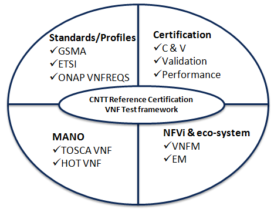

\<\< Back

# 5. VNF E2E C&V Framework Requirements

## Table of Contents

* [5.1 Introduction](#5.1)
* [5.2 Scope](#5.2)
* [5.3 Platform Requirements](#5.3)
* [5.4 Certification Process](#5.4)

### 5.1 Introduction

As Telcom industry is evolving along with virtualization and software based
cloud network function from hardware based network function, and CNTT is
defining the required architecture and model for NFVi along with VNF
specification. As deferent vendors and open-source produce network functions,
it’s important to define and certify these network functions based on the CNTT
defined VNF specification. In this chapter the scope and requirements is defined
as reference for VNF certification platform, which helps to perform the various
compliance and verification (C&V) testing and submit results to LFN OVP
certification portal.

### 5.2 Scope

The requirements defined in next section for the platform would be scoped with
guidelines defined as below to support VNF compliance & verification
certification testing.

#### Standards/Profiles

-   ETSI (TOSCA)

-   GSMA

-   ONAP VNFREQS (HOT)

#### Test cases

Refer *chapter RC-06* for more details on test case requirements defined for VNF
under CNTT. Platform should support to managed and execute these test cases.

NOTE: For certification, only compliance and verification test cases will be
considered, but in future, it could be extent to validation and Performance
related testing.

##### Compliance

Perform compliance check based on

-   TOSCA using ETSI SOL004 & SOL001

-   OpenStack HOT using ONAP VNFREQS

-   GSMA profile (Check with Rabi)

##### Verification

Perform on-boarding/ verification life cycle operation (from instantiation,
configuration, update, termination) using MANO supporting CNTT compliant NFVi.

##### Validation

Perform various VNF type specific functionality operations on CNTT RA & RM
compliant NFVi

##### Performance

Perform various performance related testing and facilitate for benchmarking the
VNF performance on different profile and scenarios.

#### Eco-system MANO/NFVI

Platform would support to execute various test cases on CNTT RA & RM compliant
NFVi

along with required MANO system supporting these NFVi.

#### VNF

Platform should support to test and certify those VNF which is compliant with
capabilities, requirements and interface defined by *CNTT RM chapters.* Also it
should support TOSCA and HOT based VNF distros.

In addition, Platform should be able to perform the required test case
management and executions and produce the result the CVC OVP portal for
certification process along with required testing foot print details. So overall
scoped example architecture could be as below:

### 5.3 Platform Requirements

Following requirements are defined based on the guidelines defined in above
scope section.

These requirements are provided to address test case design, distribution,
execution and result reporting along with required artifacts and environments in
place.

#### 5.3.1 Test Case Model

#### 5.3.2 Test case management

Test suite

Test flow

#### 5.3.3 Test Execution management

Different run-time support (JVM, Python, Shell, Container, Cloud VM, etc)

gRPC support

#### 5.3.4 Test Result management

Search & Reporting

Different format support

#### 5.3.5 Test Artifact management

Version artifact supports such as VNF CSAR.

#### 5.3.6 Test Scenario management

Allow to create repeatable scenario includes test cases, artifacts and profiles.

#### 5.3.7 Test Profile management

Managed Input Configuration

Managed System under test configuration

Multiple MANO / NFVi

#### 5.3.8 Tenant & User management

Testing involves design, distribution by different user roles and executed
across multiple tenant’s environments.

#### 5.3.9 3rd-party test tool integration

Allows executing the test cases from multiple 3rd party test tools and producing
the results

#### 5.3.10 Certification management & integration

Platform should have integration with OVP certification portal for submitting
results with OVP defined format

#### 5.3.11 OVP portal integration

#### 5.3.12 User & System interfaces

User interface:

>   CLI

>   Web portal

Programming interface: REST API

#### 5.3.13 Deliverables

Docker image based installation

Standalone installation scripts and zip artifact

### 5.4 Certification Process

This process details the end-end steps required for certifying the given VNF by
using ths platform (providing above requirements), producing the test results to
certification portal , review and granting the badge to this VNF.

#### 5.4.1 Entry & Exit criteria
