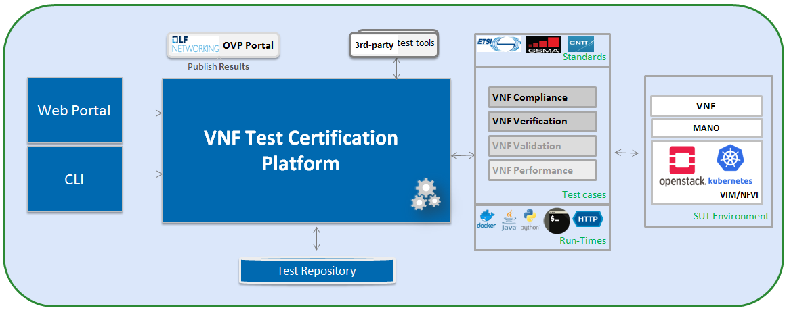

[<< Back](../)

# 5. VNF E2E C&V Framework Requirements

## Table of Contents

* [5.1 Introduction](#5.1)
* [5.2 Scope](#5.2)
* [5.3 Platform Requirements](#5.3)
* [5.4 Certification Methodology](#5.4)
* [5.5 Protoype VNFs](#5.5)
* [5.6 Profiles Reference](#5.6)

### 5.1 Introduction

As Telcom industry is evolving along with virtualization and software based
cloud network function from hardware based network function, and CNTT is
defining the required architecture and model for NFVi along with VNF
specification. As deferent vendors and open-source produce network functions,
it’s important to define and certify these network functions based on the CNTT
defined VNF specification. In this chapter the scope and requirements is defined
as reference for VNF certification platform, which helps to perform the various
compliance and verification (C&V) testing and submit results to LFN OVP
certification portal.

### 5.2 Scope

The requirements defined in next section for the platform would be scoped with
guidelines defined as below to support VNF compliance & verification
certification testing.

#### Standards/Profiles

-   ETSI (TOSCA)

-   GSMA

-   ONAP VNFREQS (HOT)

#### Test cases

Refer *chapter RC-06* for more details on test case requirements defined for VNF
under CNTT. Platform should support to managed and execute these test cases.

NOTE: For certification, only compliance and verification test cases will be
considered, but in future, it could be extent to validation and Performance
related testing.

##### Compliance

Perform compliance check based on

-   TOSCA using ETSI SOL004 & SOL001

-   OpenStack HOT using ONAP VNFREQS

-   GSMA profile as defined in *chapter RM-04*.

##### Verification

Perform on-boarding/ verification life cycle operation (from instantiation,
configuration, update, termination) using MANO supporting CNTT compliant NFVi.

##### Validation

Perform various VNF type specific functionality operations on CNTT RA & RM
compliant NFVi

##### Performance

Perform various performance related testing and facilitate for benchmarking the
VNF performance on different profile and scenarios.

#### Eco-system MANO/NFVI

Platform would support to execute various test cases on CNTT RA & RM compliant
NFVi

along with required MANO system supporting these NFVi.

#### VNF

Platform should support to test and certify those VNF which is compliant with
capabilities, requirements and interface defined by *CNTT RM chapters.* Also it
should support TOSCA and HOT based VNF distros.

In addition, Platform should be able to perform the required test case
management and executions and produce the result the CVC OVP portal for
certification process along with required testing foot print details. So overall
scoped example architecture could be as below:

### 5.3 Platform Requirements

Following requirements are defined based on the guidelines defined in above
scope section.

These requirements are provided to address test case design, distribution,
execution and result reporting along with required artifacts and environments in
place.

#### 5.3.1 Test Case Model
As there are more number of VNF at different levels of networking such as access,
transport and core level as well as OSI level L0-L7. Every network function
provides set of pre-defined features and functionalities. So its important to
model test cases for every functionality to identify it uniquely and use it as
part of test flow design.

As part of modeling its very important to capture the following details

* Test case Name
* Test case description
* Virtual Network function Name
* Network function Feature/functionality name
* Test case input parameters
* Test case result attributes
* Test case version

while implementing the test cases, this model would act as specification and as
it captures the input and output, it would help while designing the test flow
which will help to execute set of test cases in pre-defined flow.

#### 5.3.2 Test case management

* **Test case** : On-board/discover, update, disable/enable, delete
* **Test suite** : On-board/discover, update, disable/enable, delete
* **Test flow** : design/discover, update, disable/enable, delete

#### 5.3.3 Test Execution management

* **Run-time**: One of the common nature of the test environment is heterogeneous
and multiple vendors and open communities would provide various test tool and
environment to support execution of test cases developed under different run-times  
(JVM, Python, Shell, Container, Cloud VM, etc)

* **RPC**: In order to enable the scaling/remote execution, it should be enabled with
required RPC support.

When VNF test platform execute the test cases, it captures the footprints of
test case execution along with results, which are made available to user and
integrated system for consuming.

#### 5.3.4 Test Result management

* **Formats** : As part of execution management, system produces the result in JSON
format which can be represented in various form like YAML, CSV, Table, etc.

* **Search & Reporting**: Search would help to query the test results based on
 various fact such as test case, VNF, date of execution, environment, etc. and
 produce the report in various format like pie-chart, success rates, etc

#### 5.3.5 Test Artifact management
As part of testing various binaries, configurations, images, scripts ,etc would
be used during test cases building or execution and
Version artifact supports such as VNF CSAR.

#### 5.3.6 Test Scenario management
Allow to create repeatable scenario includes test cases, artifacts and profiles.

It helps to create dynamic testing scenario development and testing from the
existing test cases and flows along with required artifacts and profiles.
It allows to run repeated testing with one or different profiles.

#### 5.3.7 Test Profile management
For every test case execution needs to be configured with required environments
and predefined test input parameter values. This is provided by means of profile

Profile should be having option to include other profiles to manage the
hierarchy of them.

As part of profile, testing environment URL, credentials and related security
keys are captured and while running the test cases, user would be able to inputs
the required profile in place of actual inputs and artifacts.

Also helps in Managing System under test configuration and multiple MANO / NFVi
and related eco system management elements.

#### 5.3.8 Tenant & User management

Testing involves design, distribution by different user roles and executed
across multiple tenant’s environments.

#### 5.3.9 3rd-party test tool integration

In any telco environment, heterogeneous is inevitable and need for executing the
test cases from different test tools is required. So system would support to
on-board the 3rd party test tools and corresponding test cases from them and
allows executing the test cases from those 3rd party test tools.

#### 5.3.10 Certification management & integration

Platform should have integration with OVP certification portal for submitting
results with OVP defined format.

It should enable repository of certified VNFs which can be used for testing
validation and performance.

#### 5.3.11 User & System interfaces

**User interface**:

*   CLI
*   Web portal

**Programming interface**:

* REST API
* gRPC

#### 5.3.12 Deliverables
Platform should be able to get deployed in both container and cloud environments.
so following model deliverables would enable it:

* Docker image based installation
* Standalone installation scripts and zip artifact

### 5.4 Certification Methodology
Perform the required VNF certification based on scope defined in this chapter and by
leveraging the test cases and tools which provides the features defined under
platform requirements as above.

It defines the end-end Certification Process required for certifying the given VNF by
using this platform (providing above requirements), producing the test results to
certification portal , review and granting the badge to this VNF.

[More details](https://wiki.lfnetworking.org/display/LN/VNF+Certification+Lifecycle)

#### 5.4.1 Entry & Exit criteria

**Entry criteria**: Before entering into the VNF certification, VNF needs to
satisfy the following requirements as entry pass:

* *Environment Requirements* : Published details providing evidence that a RAx compliant lab has been implemented, meeting requirements set forth in respective RM and RAx documentation for features, options, and capabilities needed for VNF test validations. Expected information includes:
  * Lab Flavor
  * Component software rev levels
  * Confirmation of compatibility with external systems
  * Tenant needs identified
  * All connectivity, network, image, VMs, delivered with successful pairwise tests
  * Lab instrumented for proper monitoring

* *VNF artifact* : VNF cloud (native) image, VNF configurations and guidelines,
automation scripts, etc
* *NFVi profiles*: List of supporting OVP Certified CNTT compliant NFVi
* Completed Security review report
* Vendor specific test cases and its deployment and usage guidelines

**Exit criteria**: VNF certification testing should completed with following
exit criteria:

* All required test cases should be passed
* No outstanding high severity issues and other known issues to be documented
* Release notes
* Provided with required installation guide, configuration guide, etc.
* Test results collated, centralized, and normalized, with a final report generated
showing status of the test scenario/case (e.g. Pass, Fail, Skip, Measurement
  Success/Fail, etc), along with traceability to a functional, or non-functional,
  requirement

### 5.5 Protoype VNFs

- Introduce concept and purpose for Golden VNFs &/or Prototype VNFs

### 5.6 Profiles Reference
 VNF Certification is aligned with required profiled defined in
 [reference model](../../ref_model/chapters/chapter02.md)
